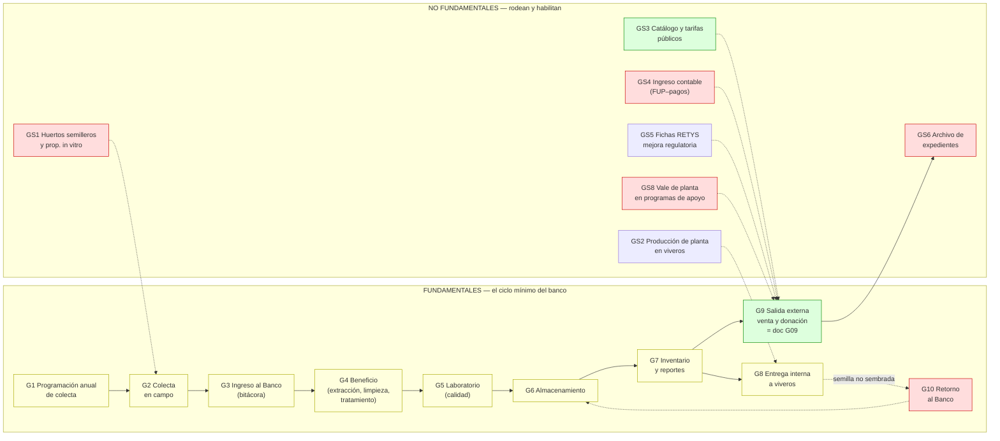

# Mapa de procesos y vacíos — Banco de germoplasma (PROBOSQUE)

> **Objetivo de este documento:** saber exactamente **qué nos falta** antes de salir a buscarlo. El profesor dio su consentimiento (2026-09) para consultar procedimientos de **bancos de germoplasma análogos** — pero solo tiene sentido hacerlo cuando la lista de preguntas esté afinada (sección C).
> **Definición usada:** *fundamental* = si este proceso no existe, el banco no puede funcionar (la semilla no entra, no se conserva o no sale de forma controlada). *No fundamental* = rodea, habilita o da servicio al banco, pero el ciclo mínimo sobrevive sin él.
> Creado: 2026-09-14. **Mantenimiento:** al recibir cada dato (entrevista, SAIMEX, banco análogo), marcar ✅ en la columna "qué falta" citando la fuente y la fecha.

## Claves de cita (además de las del `G09`: [MGO] [RIG] [TAR] [CAT-S] [CAT-P] [VEN] [DON] [AVISO-P] [GER] [CONT] [ARC] [MR] [ISO])

> **Nota de codificación (2026-09-16):** unificado con el catálogo del README — los fundamentales antes llamados `P1..P10` ahora se escriben **`G1..G10`**, los de soporte antes llamados `S1..S8` ahora **`GS1..GS8`**, y el documento de análisis `P09_DISTRIBUCION_GERMOPLASMA.md` pasó a **`G09_DISTRIBUCION_GERMOPLASMA.md`** (citas de pasos: `G9·A#`/`G9·B#`, antes `P9·#`). No cambia contenido ni orden; `[MP06]` y `[SEP091]` son claves de fuente, NO procesos.

| Clave | Documento |
|---|---|
| [MP06] | [86_manualProcDirRestYFtoFtal.pdf](<../../Comun/Germoplasma/86_manualProcDirRestYFtoFtal.pdf>) — MP de la DRFF, sep-2006 (procedimientos 4.1 y 4.2 con diagramas y formatos) |
| [RETYS-1162] [RETYS-1068] [RETYS-2092] | [CEDULAS_RETYS_PROBOSQUE_GERMOPLASMA.md](<../../Comun/Retys EdoMex/CEDULAS_RETYS_PROBOSQUE_GERMOPLASMA.md>) — metodología oficial de venta de semilla / venta de planta / donación (transcritas 2026-09-14) |
| [SOL-DON] | [RETYS_2092_SOLICITUD_DONACION_PLANTA_2026.pdf](<../../Comun/Germoplasma/RETYS_2092_SOLICITUD_DONACION_PLANTA_2026.pdf>) — formato "Solicitud de Planta" 2026 (elaboró SRyPP, validó DRFF) |
| [CONT25] | [jul301b.pdf](<../../Comun/Manual Jurídico/jul301b.pdf>) — MP del Depto. de Contabilidad, feb-2025 (3 procedimientos: presupuesto, transferencias, pagos diversos) |
| [DON1000] | [donacion-1000.html](<../../Comun/Sitio web/donacion-1000.html>) — donación ≥1,000 plantas |
| [RO-PS] [RO-RHF] | Reglas de Operación 2026 de Plantaciones Sustentables y Restauración Hidrológico-Forestal (entrega de planta por vale dentro de programas) |
| [LGDFS] | [Reg_LGDFS.pdf](<../../Comun/Masa forestal/Reg_LGDFS.pdf>) — Reglamento LGDFS (aviso de colecta de germoplasma, arts. 87–88) |
| [SEP091] | [MANUALES_PROC_PROBOSQUE_2020_sep091_(...).pdf](<../../Comun/Manual Jurídico/MANUALES_PROC_PROBOSQUE_2020_sep091_(UAZC-IndustriaComercialización-UIPPE).pdf>) — MP de la UIPPE 2020 (programa anual, págs. 46–90) |

## Mapa general

🟢 documentado con análisis completo (plantilla 1–11) · 🔵 fuentes verificadas, sin análisis completo · 🟡 conocido solo en diseño de 2006 o a medias · 🔴 sin información.

---

## Procesos FUNDAMENTALES

### G1 — Programación anual de colecta 🟡
| | |
|---|---|
| **Qué sabemos** | Diseño 2006 [MP06 p. 25-30]: oficio de DRF → Depto. Producción elabora programa anual → DRFF confirma por presupuesto → expedientes técnicos → acuerdo de contratación de personal eventual (brigadas). La colecta real 2024 fue 2.51 t [GER]. El programa anual institucional se integra con la UIPPE [SEP091 pp. 46-90]. |
| **Qué falta** | Cómo se programa HOY: quién decide zonas y especies (¿criterio técnico, demanda de viveros, presupuesto?), calendario real, vinculación con el Programa Anual de UIPPE vigente, ¿existe el "Programa de Colecta" 2025/2026 publicado? |
| **Dónde conseguir** | Entrevista SRyPP (probosque.dpp@edomex.gob.mx); solicitud SAIMEX/INFOEM del programa anual vigente; banco análogo (ejemplo de programa de colecta). |

### G2 — Colecta en campo 🟡
| | |
|---|---|
| **Qué sabemos** | [MP06 pp. 31-37]: brigadas colectan por zona bioclimática; etiqueta con procedencia, especie, fecha y ubicación. Base legal federal: aviso de colecta de germoplasma [LGDFS arts. 87-88]. |
| **Qué falta** | Registro de campo real (¿cuaderno, acta, formato?), quiénes son las "fuentes de semilla" hoy (¿huertos? ¿árboles madre identificados?), y si el aviso ante la federación se presenta (autoridad: SEMARNAT/RAN). |
| **Dónde conseguir** | Entrevista + visita a Banco; SAIMEX (formatos de brigada); banco análogo (protocolos de colecta con cadena de custodia). |

### G3 — Ingreso al Banco (recepción del fruto) 🟡
| | |
|---|---|
| **Qué sabemos** | [MP06]: **bitácora de ingreso** — cantidad de fruto, quién entrega, quién recibe, procedencia. Capacidad del Banco: 10 t; almacenadas 2.8 t (agregado, 2024) [GER]. |
| **Qué falta** | Estado actual de esa bitácora (¿papel? ¿Excel?), sistema de **código de lote** (cómo se numeran e identifican los lotes desde el ingreso), quién firma. |
| **Dónde conseguir** | Inspección en campo / SAIMEX; banco análogo (convenciones de codificación de lotes — es lo que más nos sirve de análogos). |

### G4 — Beneficio (extracción, limpieza, tratamiento) 🟡
| | |
|---|---|
| **Qué sabemos** | [MP06]: beneficio del fruto → bitácora de **cantidad final de semilla limpia** → aplicación de fungicida e insecticida. Existe un "Área de Beneficio de Semilla" física (entrega conos) [VEN]. |
| **Qué falta** | Protocolo técnico (equipo, secado, rendimientos cono→semilla por especie), quién lo ejecuta, ¿los conos tienen su propio registro de salida? (el vale 2006 es solo de semilla). |
| **Dónde conseguir** | Entrevista al Área de Beneficio; banco análogo (protocolos de extracción y secado por especie). |

### G5 — Laboratorio y calidad 🟡
| | |
|---|---|
| **Qué sabemos** | Pruebas definidas y consistentes entre fuentes: humedad, pureza, semillas/kg, viabilidad, germinación [GER][MP06]; sus resultados viajan en el vale de salida (semillas/kg, % llenas, % germinación) [MP06 p. 41-42]. |
| **Qué falta** | **Criterios de aceptación/rechazo** (¿qué % de germinación minima para almacenar o vender?), método de muestreo, registro independiente de resultados (¿ficha de análisis?), valores de referencia por especie. |
| **Dónde conseguir** | SAIMEX (formatos del laboratorio); normas oficiales de análisis de semilla (métodos aprobados — buscar en banco análogo y en ANSEMAC/ISTA como referencia metodológica); entrevista. |

### G6 — Almacenamiento 🔶 (parcial)
| | |
|---|---|
| **Qué sabemos** | "Almacenada a temperatura adecuada para conservarla viable hasta su siembra" [MP06]; capacidad 10 t [GER]; la semilla tiene **fecha límite de siembra** al salir del banco [MP06 p. 41]. |
| **Qué falta** | Condiciones FÍSICAS reales (¿cámara de frío? ¿ventilación?), empaque, **caducidad por especie** (ortodoxas vs recalcitrantes — crítico para especies de pino vs latifoliadas), registro de mermas/pérdidas por deterioro. |
| **Dónde conseguir** | **Visita a campo obligatoria** (no se sabe por documentos); banco análogo (tablas de almacenamiento por especie — alto valor para el SGD). |

### G7 — Inventario y reportes 🟡
| | |
|---|---|
| **Qué sabemos** | [MP06]: el Responsable de Colecta informa mediante **"Inventario de semillas"** firmado → Depto. Producción → Unidad de Conservación de Suelos → DRFF (Visto Bueno). El inventario es la base del paso 2 del 02 ("verificar existencia"). |
| **Qué falta** | Formato/medio/frecuencia ACTUAL; quién descuenta existencias en cada salida (¿bitácora manual?); ¿existe un inventario consolidado 2025/2026 por especie y lote? (hoy solo conocemos el agregado 2.8 t). |
| **Dónde conseguir** | Entrevista SRyPP; SAIMEX; banco análogo (estructura de datos de inventario — insumo directo para el modelo de datos del SGD). |

### G8 — Entrega interna a viveros 🟡
| | |
|---|---|
| **Qué sabemos** | Flujo formal completo [MP06 pp. 33-42]: vivero/DRF → "Solicitud de Semilla" → Depto. Producción autoriza → **Vale de Salida** (con campo "FOLIO No." = número consecutivo del propio vale, pp. 26–27) con datos técnicos del lote → bitácora → el vivero siembra. Nota de responsabilidad: si no se siembra, **regresar al banco antes de la fecha límite**. |
| **Qué falta** | Confirmar que los formatos 2006 siguen en uso (probable: RETYS 1162 los cita como resultado vigente); **a qué serie corresponde el folio de cada formato** (¿por vivero? ¿anual? ¿quién lo asigna?) — el manual no lo define (p. 42 lo define en círculo: "número de folio respectivo"). |
| **Dónde conseguir** | Inspección en campo; pedir formatos llenados (anonimizados) vía entrevista. |

### G9 — Salida externa: venta y donación 🟢 (este es [`G09_DISTRIBUCION_GERMOPLASMA.md`](./G09_DISTRIBUCION_GERMOPLASMA.md); cita de pasos: G9·A#, G9·B#)
| | |
|---|---|
| **Qué sabemos** | Metodología oficial de los 3 trámites [RETYS-1162, RETYS-1068, RETYS-2092]: FUP elaborado y sellado por Contabilidad → pago en banco/establecimiento → **entrega acudiendo con el FUP sellado "Pagado"** (cédulas m.3 — no mencionan folio alguno); resultado = "Formato de salida de Semilla del Banco de Germoplasma" / "Vale de salida de planta forestal"; donación con 9 pasos + modalidad especial 3.79 Bis; requisitos y plazos (15 min venta; 9 meses resolución donación; ficta negativa); formato de solicitud 2026 capturado [SOL-DON]. |
| **Qué falta** | Ver "Estado de G09" al final — los huecos están en los bordes (inventario, contabilidad, conos, plantillas). |
| **Dónde conseguir** | — |

### G10 — Retorno de semilla no sembrada 🔴
| | |
|---|---|
| **Qué sabemos** | Solo la OBLIGACIÓN: nota al pie del vale de salida [MP06 p. 41] — el jefe de vivero debe regresar la semilla antes de la fecha límite. |
| **Qué falta** | El proceso completo: ¿alguien lo ejecuta?, ¿cómo se registra un retorno, se re-folía el lote, se re-testea viabilidad?, ¿qué pasa con semilla caduca (baixa/merma)? **Sin esto el inventario (G7) miente.** |
| **Dónde conseguir** | Entrevista SRyPP; banco análogo (política de retornos y bajas — difícil de inferir sin análogos). |

---

## Procesos NO FUNDAMENTALES (soporte)

| ID | Proceso | Qué sabemos | Qué falta / dónde |
|---|---|---|---|
| GS1 | Huertos semilleros y propagación in vitro | **No son de la SRyPP: funciones de la SAPCAT [MGO pp. 26–27 f.11]** (verificado 2026-09-14); biotecnología forestal existe en el sitio (página no capturada) | Si alimentan lotes del banco → preguntar en entrevista |
| GS2 | Producción de planta en viveros | Flujo completo [MP06 4.1][produccion_planta.html]; inventario 10.47 M plantas 2024 | Es el proceso aguas abajo; solo nos une por G8 |
| GS3 | Publicación de catálogo y tarifas 🟢 | **Análisis completo: [`GS3_PUBLICACION_CATALOGO_Y_TARIFAS.md`](./GS3_PUBLICACION_CATALOGO_Y_TARIFAS.md)** (2026-09-17). Serie de catálogos 2021–2026 capturada del sitio (`ventaDeSemilla/<año>/`); catálogo = trascripción exacta de la Gaceta del ejercicio (verificado 2024 y 2026 al centavo); emite DAFGD, firma DG (2024) o encargada DAFGD (2026) | Acta/acuerdo interno de aprobación de montos → **A11**; Gaceta 2025 no localizada → **B6**; mecánica del alta con ADEM (entrevista UCSyTI); control de versiones (entrega del SGD) |
| GS4 | Ingreso contable (capitalización) | FUP lo **elabora y sella Contabilidad** [RETYS]; registro de ingresos con **póliza + SPEI/contra-recibo** [CONT25 p. 19] | 🔴 **[CONT25] NO tiene procedimiento de ingresos por venta** (solo presupuesto/transferencias/pagos). Quién emite el FUP, folio, asiento contable del ingreso por semilla → entrevista a Contabilidad (Arturo Valdés Bernal) |
| GS5 | Fichas RETYS / mejora regulatoria | 3 cédulas transcritas [RETYS]. ⚠️ "obligación vigente [MR]" NO se sostiene: [MR] es oficio CEMER 2019 del comité interno (verificado 2026-09-17) | Cédulas citan MGO 2023 (no 2025) — desactualización parcial; base normativa de la obligación de actualización → **B5** |
| GS6 | Archivo de expedientes | **No existe serie documental de semilla/germoplasma** [ARC verificado] | 🔴 Definirla es entrega propia del SGD (tiempos de retención fiscal: FUP/comprobantes) |
| GS7 | Visitas guiadas / divulgación | Función **SAPCAT** [MGO p. 27 f.20] (no SRyPP) | Irrelevante para el SGD |
| GS8 | Entrega de planta vía programas (vale de planta) | [RO-PS pp. 14][RO-RHF pp. 6,13]: vale canjeable en viveros, recoger en 15–30 días, vencimiento y reexpedición, carta compromiso, si no hay especie el beneficiario compra con recurso propio | Canal paralelo que consume el mismo inventario (G7); dom. Alan/Xareni — coordinar cruce de referencias |

---

## Lista de búsqueda (priorizada)

### A. De PROBOSQUE (entrevista / SAIMEX / INFOEM / Normateca) — máximas prioridades
1. **A1** MP actual de la SRyPP (¿existe 2025? reemplazaría/complementaría [MP06]) — Normateca/SAIMEX.
2. **A2** Bitácoras reales del Banco (ingreso, beneficio, salida) y **sistema de código de lote y folios** — visita/SAIMEX. *(G3, G8)*
3. **A3** Formatos de laboratorio y **criterios de aceptación/rechazo** — SAIMEX. *(G5)*
4. **A4** Condiciones de almacenamiento y **caducidad por especie**; política de retornos y bajas — visita + entrevista. *(G6, G10)*
5. **A5** Inventario actual por especie/lote (medio y frecuencia) — entrevista SRyPP. *(G7)*
6. **A6** Plantillas vigentes: vale de salida de planta (donación/venta), **Contrato de Donación**, Carta Compromiso — entrevista/SAIMEX. *(G9)*
7. **A7** Procedimiento de emisión del FUP y registro del ingreso por venta (no está en [CONT25]) — entrevista Contabilidad. *(GS4)*
8. **A8** Registro de salida de CONOS (no tiene formato en [MP06]) — entrevista Área de Beneficio. *(G4, G9)*
9. **A9** Estado de recertificación ISO 9001 (vencida 2025-10-10) — QUALI/DRFF. *(calidad)*
10. **A10** Aviso de privacidad integral que cubra la venta/donación de semilla, conos y planta — la página del sitio (`aviso_privacidad.html`, verificada 2026-09-17) lista avisos por unidad/programa pero **ninguno de distribución**, y el formato SOL-DON 2026 no lleva cláusula de privacidad pese a recabar INE/CURP/actas — entrevista/SAIMEX. *(G9 N-15)*
11. **A11** Acta/acuerdo interno que aprueba los montos anuales de precios y tarifas ANTES de la Gaceta (la Gaceta solo muestra la firma: DG 2024, encargada DAFGD 2026) y quién aprueba el catálogo operativo — entrevista DAFGD (Irán Terán Cordero) / Junta Directiva. *(GS3 B1–B2)*
12. **A12** **Directorio interno/estructural completo** (personal por debajo de Jefatura de Departamento/Unidad): los roles OPERATIVOS de G9 y GS3 no tienen titular identificable en el [DIR] público — jefe del Depto. de Producción de Planta (ventanilla R3), custodio del Banco/"Programa de Colecta" (R4), responsable del Área de Beneficio (R5), jefes de los 17 viveros (R6), jefe del Depto. de Contabilidad (R8 — el área es Subdir. Recursos Financieros, Arturo Valdés Bernal), enlace ante la ADEM (R14), enlace CEMER vigente (R12 — en 2019 era Lucía Margarita Burciaga Valdez). **Sin titular no hay entrevista de necesidades posible**: pedir en la primera entrevista/SAIMEX y actualizar §3 de G09/GS3. *(G9, GS3 §10.6)*

### B. Público, aún no capturado (lo podemos bajar nosotros)
1. **B1** MGO del 25-may-2023 (citado por las cédulas RETYS) — Gaceta; para comparar funciones DPP con 2025.
2. **B2** NTEA019-SeMAGEM-DS-2017 completa — el enlace del sitio aparece truncado; la Gaceta `feb072.pdf` (2018) enlazada en `donacion-planta.html` parece ser su publicación: verificar y capturar.
3. **B3** ~~Catálogos históricos de semilla 2021/2025~~ **RESUELTO 2026-09-17**: capturada la serie completa `ventaDeSemilla/<año>/` → 2021 (semilla+conos), 2022, 2023, 2024, 2025 (semilla y planta cada año; 11 PDF verificados `%PDF` en `Docs/Comun/Germoplasma/`).
4. **B4** `biotecnia_forestal.html` y página de delegaciones (`delegaciones_forestales`) — completar copia offline.
5. **B5** Base normativa de la obligación de **mantener vigentes las fichas/cédulas RETYS** (Ley de Simplificación Administrativa del EdoMéx y/o lineamientos de operación del RETYS) — capturar de Gaceta/legislacion. **Corrección 2026-09-17:** el PDF `LINEAMIENTOS_Comité_MejoraRegulatoria.pdf` NO es esa base (es oficio CEMER 01-oct-2019 sobre el comité interno y exención de AIR, verificado renderizando); `FORMATO_Ficha_Dato_Tramite_Servicio.pdf` es solo el formato en blanco (escaneado). *(G9 N-14, GS5)*
6. **B6** Gaceta de "Montos de los precios y tarifas para el Ejercicio Fiscal de **2025**" — necesaria para cerrar la cadena tope↔catálogo 2025 (el catálogo 2025 ya usa $11/$12/$13, la Gaceta 2024 decía $9; la 2026 confirma el nuevo tope). La URL `gct/2025/abril/abr301/abr301a.pdf` probada es de otra dependencia (falso positivo); buscar en el índice de la Gaceta 2025. *(GS3)*

### C. Bancos de germoplasma análogos (consentimiento del profesor) — **solo después de cerrar A/B**, con las preguntas ya concretas
Candidatos a contactar/estudiar (verificar vigencia de nombres y sedes antes de escribir):
- **Banco Nacional de Germoplasma Forestal / CNMGF (CONAFOR)** — Pachuca: infraestructura de extracción, secado, cámara fría y pruebas; el análogo más cercano en especie forestal.
- **Banco de germoplasma del INIFAP** (agrícola) — estándares de registro y codificación de accesiones.
- **Bancos universitarios/estatales** (p. ej. de la UACh o CIDEFIR) — protocolos de caducidad por especie.

Qué buscar allí (nuestro mapa lo dicta): **① codificación de lotes y folios (A2) · ② tablas de almacenamiento/caducidad por especie (A4) · ③ criterios de calidad del laboratorio (A3) · ④ política de retornos y bajas (G10) · ⑤ estructura de datos de inventario (A5) — insumo directo del modelo de datos del SGD.**

---

## Estado de [`G09_DISTRIBUCION_GERMOPLASMA.md`](./G09_DISTRIBUCION_GERMOPLASMA.md) (anotación solicitada — actualizado 2026-09-14, v2)

**Veredicto: el flujo de salida externa quedó documentado con fuente oficial (metodologías RETYS, formatos 2006, solicitud 2026). Lo que sigue abierto ya no es del documento, sino del mundo real: son los vacíos A#/B# que hay que conseguir.**

| # | Punto detectado | Estado en G09 v2 | Sigue pendiente |
|---|---|---|---|
| 1 | FUP lo elabora/sella Contabilidad (no ventanilla) | ✅ Corregido: BR-3, roles R3/R8, pasos A1–A3 y diagrama | — |
| 2 | "Verificar existencia" sin soporte real | ✅ Marcado como paso inferido (A0) dependiente de G7 | A5/A2 (inventario y bitácoras reales) |
| 3 | Salida de conos sin registro | ✅ BR-11 + paso A-C5 + **N-19** | A8 (entrevista Área de Beneficio) |
| 4 | Plantillas (vale, Contrato de Donación, Carta Compromiso) | ✅ §9 con campos verificados de lo que existe; **N-21** para lo ausente | A6 |
| 5 | Donación: 9 pasos oficiales + 3.79 Bis | ✅ Modalidad B reescrita con [RETYS-2092] paso a paso; BR-7/8/9 | Criterio interno de "disponibilidad" (entrevista SRyPP) |
| 6 | Retorno/baja de semilla | ✅ **N-20** creada y enlazada a G10 (fuera del alcance de G9, dentro del SGD) | A4 |
| 7 | Contradicciones (horario 9–15 vs 9–17; umbral 1,000 vs 2,000; nombre del formato) | ✅ Marcadas en BR-1/BR-7 y §10.5 con sus fuentes | Entrevista |
| 8 | Retención/archivación del expediente | ✅ §9 "a definir (GS6)" por registro | La define el SGD + criterio fiscal |
