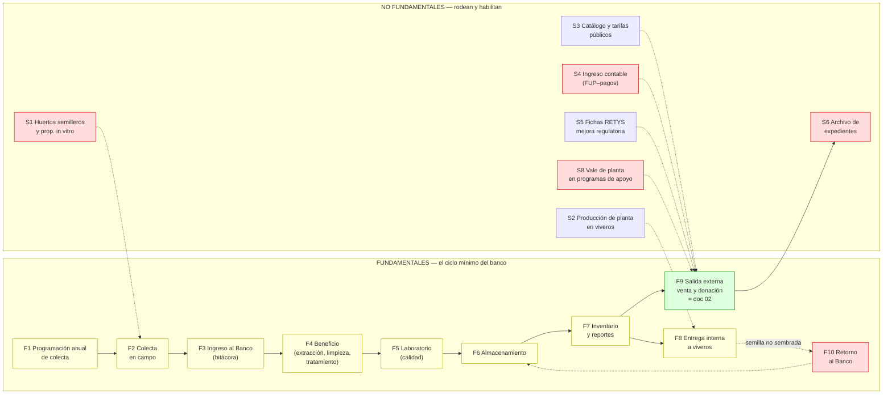

# Mapa de procesos y vacíos — Banco de germoplasma (PROBOSQUE)

> **Objetivo de este documento:** saber exactamente **qué nos falta** antes de salir a buscarlo. El profesor dio su consentimiento (2026-09) para consultar procedimientos de **bancos de germoplasma análogos** — pero solo tiene sentido hacerlo cuando la lista de preguntas esté afinada (sección C).
> **Definición usada:** *fundamental* = si este proceso no existe, el banco no puede funcionar (la semilla no entra, no se conserva o no sale de forma controlada). *No fundamental* = rodea, habilita o da servicio al banco, pero el ciclo mínimo sobrevive sin él.
> Creado: 2026-09-14. **Mantenimiento:** al recibir cada dato (entrevista, SAIMEX, banco análogo), marcar ✅ en la columna "qué falta" citando la fuente y la fecha.

## Claves de cita (además de las del `02`: [MGO] [RIG] [TAR] [CAT-S] [CAT-P] [VEN] [DON] [GER] [CONT] [ARC] [MR] [ISO])

| Clave | Documento |
|---|---|
| [MP06] | [86_manualProcDirRestYFtoFtal.pdf](<../../Comun/Germoplasma/86_manualProcDirRestYFtoFtal.pdf>) — MP de la DRFF, sep-2006 (procedimientos 4.1 y 4.2 con diagramas y formatos) |
| [RETYS-1162] [RETYS-1068] [RETYS-2092] | [CEDULAS_RETYS_PROBOSQUE_GERMOPLASMA.md](<../../Comun/Retys EdoMex/CEDULAS_RETYS_PROBOSQUE_GERMOPLASMA.md>) — metodología oficial de venta de semilla / venta de planta / donación (transcritas 2026-09-14) |
| [SOL-DON] | [RETYS_2092_SOLICITUD_DONACION_PLANTA_2026.pdf](<../../Comun/Germoplasma/RETYS_2092_SOLICITUD_DONACION_PLANTA_2026.pdf>) — formato "Solicitud de Planta" 2026 (elaboró SRyPP, validó DRFF) |
| [CONT25] | [jul301b.pdf](<../../Comun/Manual Jurídico/jul301b.pdf>) — MP del Depto. de Contabilidad, feb-2025 (3 procedimientos: presupuesto, transferencias, pagos diversos) |
| [DON1000] | [donacion-1000.html](<../../Comun/Sitio web/donacion-1000.html>) — donación ≥1,000 plantas |
| [RO-PS] [RO-RHF] | Reglas de Operación 2026 de Plantaciones Sustentables y Restauración Hidrológico-Forestal (entrega de planta por vale dentro de programas) |
| [LGDFS] | [Reg_LGDFS.pdf](<../../Comun/Masa forestal/Reg_LGDFS.pdf>) — Reglamento LGDFS (aviso de colecta de germoplasma, arts. 87–88) |
| [SEP091] | [MANUALES_PROC_PROBOSQUE_2020_sep091_(...).pdf](<../../Comun/Manual Jurídico/MANUALES_PROC_PROBOSQUE_2020_sep091_(UAZC-IndustriaComercialización-UIPPE).pdf>) — MP de la UIPPE 2020 (programa anual, págs. 46–90) |

## Mapa general

🟢 documentado con fuente oficial · 🟡 conocido solo en diseño de 2006 o a medias · 🔴 sin información.

---

## Procesos FUNDAMENTALES

### F1 — Programación anual de colecta 🟡
| | |
|---|---|
| **Qué sabemos** | Diseño 2006 [MP06 p. 25-30]: oficio de DRF → Depto. Producción elabora programa anual → DRFF confirma por presupuesto → expedientes técnicos → acuerdo de contratación de personal eventual (brigadas). La colecta real 2024 fue 2.51 t [GER]. El programa anual institucional se integra con la UIPPE [SEP091 pp. 46-90]. |
| **Qué falta** | Cómo se programa HOY: quién decide zonas y especies (¿criterio técnico, demanda de viveros, presupuesto?), calendario real, vinculación con el Programa Anual de UIPPE vigente, ¿existe el "Programa de Colecta" 2025/2026 publicado? |
| **Dónde conseguir** | Entrevista SRyPP (probosque.dpp@edomex.gob.mx); solicitud SAIMEX/INFOEM del programa anual vigente; banco análogo (ejemplo de programa de colecta). |

### F2 — Colecta en campo 🟡
| | |
|---|---|
| **Qué sabemos** | [MP06 pp. 31-37]: brigadas colectan por zona bioclimática; etiqueta con procedencia, especie, fecha y ubicación. Base legal federal: aviso de colecta de germoplasma [LGDFS arts. 87-88]. |
| **Qué falta** | Registro de campo real (¿cuaderno, acta, formato?), quiénes son las "fuentes de semilla" hoy (¿huertos? ¿árboles madre identificados?), y si el aviso ante la federación se presenta (autoridad: SEMARNAT/RAN). |
| **Dónde conseguir** | Entrevista + visita a Banco; SAIMEX (formatos de brigada); banco análogo (protocolos de colecta con cadena de custodia). |

### F3 — Ingreso al Banco (recepción del fruto) 🟡
| | |
|---|---|
| **Qué sabemos** | [MP06]: **bitácora de ingreso** — cantidad de fruto, quién entrega, quién recibe, procedencia. Capacidad del Banco: 10 t; almacenadas 2.8 t (agregado, 2024) [GER]. |
| **Qué falta** | Estado actual de esa bitácora (¿papel? ¿Excel?), sistema de **código de lote** (cómo se numeran e identifican los lotes desde el ingreso), quién firma. |
| **Dónde conseguir** | Inspección en campo / SAIMEX; banco análogo (convenciones de codificación de lotes — es lo que más nos sirve de análogos). |

### F4 — Beneficio (extracción, limpieza, tratamiento) 🟡
| | |
|---|---|
| **Qué sabemos** | [MP06]: beneficio del fruto → bitácora de **cantidad final de semilla limpia** → aplicación de fungicida e insecticida. Existe un "Área de Beneficio de Semilla" física (entrega conos) [VEN]. |
| **Qué falta** | Protocolo técnico (equipo, secado, rendimientos cono→semilla por especie), quién lo ejecuta, ¿los conos tienen su propio registro de salida? (el vale 2006 es solo de semilla). |
| **Dónde conseguir** | Entrevista al Área de Beneficio; banco análogo (protocolos de extracción y secado por especie). |

### F5 — Laboratorio y calidad 🟡
| | |
|---|---|
| **Qué sabemos** | Pruebas definidas y consistentes entre fuentes: humedad, pureza, semillas/kg, viabilidad, germinación [GER][MP06]; sus resultados viajan en el vale de salida (semillas/kg, % llenas, % germinación) [MP06 p. 41-42]. |
| **Qué falta** | **Criterios de aceptación/rechazo** (¿qué % de germinación minima para almacenar o vender?), método de muestreo, registro independiente de resultados (¿ficha de análisis?), valores de referencia por especie. |
| **Dónde conseguir** | SAIMEX (formatos del laboratorio); normas oficiales de análisis de semilla (métodos aprobados — buscar en banco análogo y en ANSEMAC/ISTA como referencia metodológica); entrevista. |

### F6 — Almacenamiento 🔶 (parcial)
| | |
|---|---|
| **Qué sabemos** | "Almacenada a temperatura adecuada para conservarla viable hasta su siembra" [MP06]; capacidad 10 t [GER]; la semilla tiene **fecha límite de siembra** al salir del banco [MP06 p. 41]. |
| **Qué falta** | Condiciones FÍSICAS reales (¿cámara de frío? ¿ventilación?), empaque, **caducidad por especie** (ortodoxas vs recalcitrantes — crítico para especies de pino vs latifoliadas), registro de mermas/pérdidas por deterioro. |
| **Dónde conseguir** | **Visita a campo obligatoria** (no se sabe por documentos); banco análogo (tablas de almacenamiento por especie — alto valor para el SGD). |

### F7 — Inventario y reportes 🟡
| | |
|---|---|
| **Qué sabemos** | [MP06]: el Responsable de Colecta informa mediante **"Inventario de semillas"** firmado → Depto. Producción → Unidad de Conservación de Suelos → DRFF (Visto Bueno). El inventario es la base del paso 2 del 02 ("verificar existencia"). |
| **Qué falta** | Formato/medio/frecuencia ACTUAL; quién descuenta existencias en cada salida (¿bitácora manual?); ¿existe un inventario consolidado 2025/2026 por especie y lote? (hoy solo conocemos el agregado 2.8 t). |
| **Dónde conseguir** | Entrevista SRyPP; SAIMEX; banco análogo (estructura de datos de inventario — insumo directo para el modelo de datos del SGD). |

### F8 — Entrega interna a viveros 🟡
| | |
|---|---|
| **Qué sabemos** | Flujo formal completo [MP06 pp. 33-42]: vivero/DRF → "Solicitud de Semilla" → Depto. Producción autoriza → **Vale de Salida foliado** con datos técnicos del lote → bitácora → el vivero siembra. Nota de responsabilidad: si no se siembra, **regresar al banco antes de la fecha límite**. |
| **Qué falta** | Confirmar que los formatos 2006 siguen en uso (probable: RETYS 1162 los cita como resultado vigente); sistema de folio real. |
| **Dónde conseguir** | Inspección en campo; pedir formatos llenados (anonimizados) vía entrevista. |

### F9 — Salida externa: venta y donación 🟢 (este es el 02)
| | |
|---|---|
| **Qué sabemos** | Metodología oficial de los 3 trámites [RETYS-1162, RETYS-1068, RETYS-2092]: FUP elaborado y sellado por Contabilidad → pago en banco/establecimiento → entrega contra folio; resultado = "Formato de salida de Semilla del Banco de Germoplasma" / "Vale de salida de planta forestal"; donación con 9 pasos + modalidad especial 3.79 Bis; requisitos y plazos (15 min venta; 9 meses resolución donación; ficta negativa); formato de solicitud 2026 capturado [SOL-DON]. |
| **Qué falta** | Ver "Estado del 02" al final — los huecos están en los bordes (inventario, contabilidad, conos, plantillas). |
| **Dónde conseguir** | — |

### F10 — Retorno de semilla no sembrada 🔴
| | |
|---|---|
| **Qué sabemos** | Solo la OBLIGACIÓN: nota al pie del vale de salida [MP06 p. 41] — el jefe de vivero debe regresar la semilla antes de la fecha límite. |
| **Qué falta** | El proceso completo: ¿alguien lo ejecuta?, ¿cómo se registra un retorno, se re-folía el lote, se re-testea viabilidad?, ¿qué pasa con semilla caduca (baixa/merma)? **Sin esto el inventario (F7) miente.** |
| **Dónde conseguir** | Entrevista SRyPP; banco análogo (política de retornos y bajas — difícil de inferir sin análogos). |

---

## Procesos NO FUNDAMENTALES (soporte)

| ID | Proceso | Qué sabemos | Qué falta / dónde |
|---|---|---|---|
| S1 | Huertos semilleros y propagación in vitro | Funciones SRyPP [MGO pp. 25-27]; biotecnología forestal existe en el sitio (página no capturada) | Si alimentan lotes del banco → preguntar en entrevista |
| S2 | Producción de planta en viveros | Flujo completo [MP06 4.1][produccion_planta.html]; inventario 10.47 M plantas 2024 | Es el proceso aguas abajo; solo nos une por F8 |
| S3 | Publicación de catálogo y tarifas | [CAT-S][CAT-P] 2026, [TAR] tope legal; obligación de publicar [MGO f.13] | Frecuencia real de actualización (¿quién sube el PDF al portal?) — UCSyTI |
| S4 | Ingreso contable (capitalización) | FUP lo **elabora y sella Contabilidad** [RETYS]; registro de ingresos con **póliza + SPEI/contra-recibo** [CONT25 p. 19] | 🔴 **[CONT25] NO tiene procedimiento de ingresos por venta** (solo presupuesto/transferencias/pagos). Quién emite el FUP, folio, asiento contable del ingreso por semilla → entrevista a Contabilidad (Arturo Valdés Bernal) |
| S5 | Fichas RETYS / mejora regulatoria | Obligación vigente [MR]; 3 cédulas transcritas [RETYS] | Cédulas citan MGO 2023 (no 2025) — desactualización parcial |
| S6 | Archivo de expedientes | **No existe serie documental de semilla/germoplasma** [ARC verificado] | 🔴 Definirla es entrega propia del SGD (tiempos de retención fiscal: FUP/comprobantes) |
| S7 | Visitas guiadas / divulgación | Función SRyPP [MGO] | Irrelevante para el SGD |
| S8 | Entrega de planta vía programas (vale de planta) | [RO-PS pp. 14][RO-RHF pp. 6,13]: vale canjeable en viveros, recoger en 15–30 días, vencimiento y reexpedición, carta compromiso, si no hay especie el beneficiario compra con recurso propio | Canal paralelo que consume el mismo inventario (F7); dom. Alan/Xareni — coordinar cruce de referencias |

---

## Lista de búsqueda (priorizada)

### A. De PROBOSQUE (entrevista / SAIMEX / INFOEM / Normateca) — máximas prioridades
1. **A1** MP actual de la SRyPP (¿existe 2025? reemplazaría/complementaría [MP06]) — Normateca/SAIMEX.
2. **A2** Bitácoras reales del Banco (ingreso, beneficio, salida) y **sistema de código de lote y folios** — visita/SAIMEX. *(F3, F8)*
3. **A3** Formatos de laboratorio y **criterios de aceptación/rechazo** — SAIMEX. *(F5)*
4. **A4** Condiciones de almacenamiento y **caducidad por especie**; política de retornos y bajas — visita + entrevista. *(F6, F10)*
5. **A5** Inventario actual por especie/lote (medio y frecuencia) — entrevista SRyPP. *(F7)*
6. **A6** Plantillas vigentes: vale de salida de planta (donación/venta), **Contrato de Donación**, Carta Compromiso — entrevista/SAIMEX. *(F9)*
7. **A7** Procedimiento de emisión del FUP y registro del ingreso por venta (no está en [CONT25]) — entrevista Contabilidad. *(S4)*
8. **A8** Registro de salida de CONOS (no tiene formato en [MP06]) — entrevista Área de Beneficio. *(F4, F9)*
9. **A9** Estado de recertificación ISO 9001 (vencida 2025-10-10) — QUALI/DRFF. *(calidad)*

### B. Público, aún no capturado (lo podemos bajar nosotros)
1. **B1** MGO del 25-may-2023 (citado por las cédulas RETYS) — Gaceta; para comparar funciones DPP con 2025.
2. **B2** NTEA019-SeMAGEM-DS-2017 completa — el enlace del sitio aparece truncado; la Gaceta `feb072.pdf` (2018) enlazada en `donacion-planta.html` parece ser su publicación: verificar y capturar.
3. **B3** Catálogos históricos de semilla 2021/2025 (URLs en `../Fuentes para el banco de semillas`) — para análisis de estabilidad del catálogo.
4. **B4** `biotecnia_forestal.html` y página de delegaciones (`delegaciones_forestales`) — completar copia offline.

### C. Bancos de germoplasma análogos (consentimiento del profesor) — **solo después de cerrar A/B**, con las preguntas ya concretas
Candidatos a contactar/estudiar (verificar vigencia de nombres y sedes antes de escribir):
- **Banco Nacional de Germoplasma Forestal / CNMGF (CONAFOR)** — Pachuca: infraestructura de extracción, secado, cámara fría y pruebas; el análogo más cercano en especie forestal.
- **Banco de germoplasma del INIFAP** (agrícola) — estándares de registro y codificación de accesiones.
- **Bancos universitarios/estatales** (p. ej. de la UACh o CIDEFIR) — protocolos de caducidad por especie.

Qué buscar allí (nuestro mapa lo dicta): **① codificación de lotes y folios (A2) · ② tablas de almacenamiento/caducidad por especie (A4) · ③ criterios de calidad del laboratorio (A3) · ④ política de retornos y bajas (F10) · ⑤ estructura de datos de inventario (A5) — insumo directo del modelo de datos del SGD.**

---

## Estado del `02_PROCEDIMIENTO_DISTRIBUCION_GERMOPLASMA` (anotación solicitada)

**Veredicto: NO está completo, pero el flujo de salida externa está ~85 % documentado con fuente oficial.** Lo que le falta ya no es "no sabemos qué preguntar" — son dependencias concretas:

| # | Qué le falta al 02 | Por qué importa | Depende de |
|---|---|---|---|
| 1 | **Corregir la secuencia del FUP**: el 02 dice "R3 emite el FUP"; [RETYS] dice que **Contabilidad elabora y sella** el FUP | Cambia roles R3/R8 y los pasos A1–A4 del diagrama | A7 |
| 2 | **Paso 2 ("verificar existencia") no tiene soporte**: depende del inventario F7, cuyo medio/frecuencia real ignoramos | El SGD no puede prometer "existencia en línea" sin saber cómo se descuenta hoy | A5, A2 |
| 3 | **Salida de conos sin registro documentado** (el vale 2006 es solo de semilla; el área de Beneficio entrega conos) | Agujero de trazabilidad para un producto que SÍ se vende | A8 |
| 4 | **Plantillas faltantes**: vale de salida de planta (venta/donación), Contrato de Donación, Carta Compromiso | Necesarias para el catálogo documental (§9) y para validar campos | A6 |
| 5 | **Modalidad B (donación)**: los 9 pasos oficiales [RETYS-2092] ya los tenemos (reemplazan nuestra versión inferida), pero el **criterio interno de "disponibilidad"** y quién emite el vale siguen sin documentarse | El paso de autorización es caja negra | A5, entrevista SRyPP |
| 6 | **Retorno/baja** de semilla no sembrada o vencida: ni siquiera aparece en el 02 (está fuera del alcance actual) | Sin F10, el inventario y los folios quedan cojos | F10 / A4 |
| 7 | **Contradicciones por resolver**: horario 9–15 (sitio) vs 9–17 (RETYS); umbral 2,000 (MP06) vs 1,000 (RETYS); nombre del formato ("Solicitud de Restauración Forestal Social" vs "Solicitud de Planta 2026") | Afectan BR-1, BR-4 y el glosario | Entrevista |
| 8 | **Retención/archivación** del expediente por folio: sin serie documental definida [ARC] | §9 del 02 tiene "retención: a definir" | Lo define el SGD + criterios fiscales (S6) |

**Conclusión operativa:** se puede mejorar el 02 AHORA con lo oficial ([RETYS], [SOL-DON], [MP06]) marcando los puntos 1–8 como "pendiente de confirmación" con su clave A#/B# — no hace falta esperar los datos nuevos para tener un 02 mucho más sólido. La lista A/B/C es el plan para cerrarlos.
