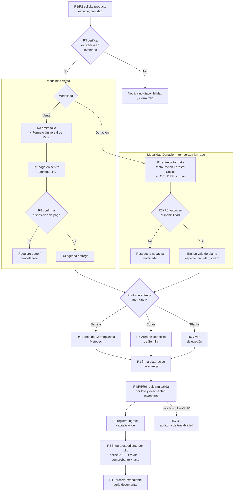

# Procedimiento P-01 — Distribución de productos de germoplasma (venta de semilla/conos/planta y donación de planta)

> Proyecto: Sistema de Gestión Documental PROBOSQUE (trazabilidad y automatización).
> Procedimiento elegido por ser el de menor dificultad/extensión dentro del dominio banco de semillas (ver `00_GUIA_LECTURA_BANCO_SEMILLAS.md`), y el único donde el Banco de Germoplasma interactúa con usuarios externos.
> Fecha de análisis: 2026-09-10. Actualizado: 2026-09-10 (doble check con fuentes primarias: sitio web, certificado ISO, manual de procedimientos). Rutas relativas desde `Docs/MANUALES/`.

---

## 1. Objeto y alcance

Regular la **salida de germoplasma (semilla, conos forestales y planta) desde las áreas de PROBOSQUE hacia usuarios externos**, en sus dos modalidades:

- **Venta**:
  - **Semilla y conos**: únicamente en las **Oficinas Centrales** (la restricción aplica a ambos productos, no solo a la semilla). Atención 9:00–15:00; la semilla se entrega en el **Banco de Germoplasma** y los conos en el **Área de Beneficio de Semilla** [VEN].
  - **Planta**: en Delegaciones Regionales Forestales u Oficinas Centrales (Departamento de Producción de Planta / Unidad de Vinculación Interinstitucional); se entrega en el vivero (8:00–15:00) [VEN].
  - Ambas contra pago con Formato Universal de Pago (FUP; texto exacto del sitio: *"para el pago de la venta de planta y/o semilla se realiza en el centro autorizado de pago (banco o establecimiento mercantil), una vez que se emite el Formato Universal de Pago por parte del Organismo"*).
- **Donación** — planta a ciudadanos para arborización comunitaria ("Restauración Forestal Social"), contra vale de planta, temporada junio–agosto.

**Dentro del alcance:** solicitud → verificación de existencia → cobro/autorización → entrega → registro de salida → archivo del expediente.
**Fuera del alcance:** colecta, beneficio, pruebas de laboratorio y almacenamiento (procedimientos internos del Banco, P4 de la guía — aún sin documentación pública).

## 2. Base documental (origen de los requisitos)

| Clave | Documento | Uso |
|---|---|---|
| [MGO] | `Manual Jurídico/dic161d.pdf` — Manual General de Organización 2025 (Gaceta 16-dic-2025, Tomo CCXX No. 112) | Funciones y atribuciones por unidad (códigos 225C…). Págs. 20–21 (UVI), 25–27 (SRyPP), 36 (Delegaciones) |
| [RIG] | `Manual Jurídico/rglvig245.pdf` — Reglamento Interno (Gaceta 12-ene-2017, últ. reforma 14-nov-2025) | Art. 15 fracc. II y XVIII: base legal de viveros, huertos semilleros y bancos de germoplasma |
| [TAR] | `manuales de procedimientos/PRECIOS_Y_TARIFAS_Servicios_PROBOSQUE_2024_abr301a.pdf` (Gaceta 30-abr-2024, Tomo CCXVII No. 76) | Precios máximos legales de semilla por kg |
| [CAT-S] | `manuales de procedimientos/COSTOS_Venta_Semilla_Conos_2026.pdf` | Catálogo operativo 2026 (nombre común/científico, semilla o cono, precio) |
| [CAT-P] | `manuales de procedimientos/COSTOS_Venta_Planta_2026.pdf` | Catálogo operativo 2026 de planta por tipo de envase |
| [VEN] | `manuales de procedimientos/sitio_web_probosque_html/venta_semilla_planta.html` | Flujo, lugares, horarios y forma de pago publicados |
| [DON] | `manuales de procedimientos/sitio_web_probosque_html/donacion-planta.html` | Flujo de donación, formato, temporada, vale de planta |
| [GER] | `manuales de procedimientos/sitio_web_probosque_html/colecta_germoplasma.html` | Contexto del Banco (10 t capacidad / 2.8 t almacenadas) y Laboratorio |
| [CONT] | `Manual Jurídico/jul301b.pdf` — Manual de Procedimientos de Contabilidad (**escaneado sin capa de texto**: verificado con búsqueda, 0 resultados) | Destino contable del ingreso ("capitalización"); único manual con diagramas de operación. Definición exacta pendiente (transcripción OCR o entrevista a R8) |
| [ARC] | `manuales de procedimientos/GUIA_Simple_Archivo_2026.pdf` + `CUADRO_Gral_Clasif_Archivística_2024.pdf` + `INVENTARIO_Gral_Archivo_2025.pdf` | Custodia y clasificación documental. **Hallazgo: no existe serie documental de semilla/germoplasma** |
| [MR] | `manuales de procedimientos/LINEAMIENTOS_Comité_MejoraRegulatoria.pdf` + `FORMATO_Ficha_Dato_Tramite_Servicio.pdf` | Obligación de mantener fichas de trámite/servicio (RETYS) actualizadas |
| [ISO] | `manuales de procedimientos/CERT_ISO9001_IQNET_2022.pdf` / `CERT_ISO9001_NYCE_2022.pdf` (escaneados como imagen) | **Alcance verificado visualmente (Cert. NYCE No. 2019CRE-811, ISO 9001:2015 / NMX-CC-9001-IMNC-2015)**: resolutivos para aprovechamientos, registro de plantaciones comerciales y saneamiento forestal; **producción de planta**; asesoría técnica para el establecimiento y mantenimiento de plantaciones forestales comerciales; estímulos para la protección, conservación y restauración forestal; prevención y combate de incendios; asistencia técnica forestal; desarrollo de la investigación. Sede certificada: Rancho Guadalupe S/N, Conjunto SEDAGRO, Metepec. Emitido 2022-11-28, **vigente al 2025-10-10 → hoy vencido, verificar renovación**. Nota: la venta de semilla/conos NO figura explícitamente en el alcance certificado |

## 2.1 Glosario — siglas y términos definidos

| Término / sigla | Significado | Fuente |
|---|---|---|
| FUP | Formato Universal de Pago: título que emite PROBOSQUE para pagar sin efectivo en oficina | [VEN] BR-3 |
| Centro autorizado de pago | **Banco o establecimiento mercantil** donde se paga el FUP. No aparece definido en la normatividad, solo en el sitio | [VEN] |
| Folio | Número consecutivo único que identifica la solicitud y encadena el expediente completo: solicitud → FUP → comprobante → acta de entrega → archivo. "Cerrar folio" = dar por terminado sin venta (no existencia o pago no acreditado) | Este documento (N-18) |
| Capitalización | Registro contable del ingreso por venta como entrada de recursos del Organismo (función de R8/R9). El manual contable [CONT] es escaneado sin texto; definición exacta pendiente | [MGO] SRyPP f.12 |
| Oficinas Centrales (OC) | Sede administrativa de PROBOSQUE: Rancho Guadalupe S/N, Col. Conjunto SEDAGRO, C.P. 52140, Metepec (a ~1 km del Vivero Invernaderos) | [ISO] sede certificada; [VEN] |
| DRF | Delegación Regional Forestal (9 en total, con 17 viveros) | [MGO] p.36 |
| UVI | Unidad de Vinculación Interinstitucional | [MGO] p.20–21 |
| DPP | Departamento de Producción de Planta (SRyPP) | [MGO] |
| SRyPP | Subdirección de Restauración y Producción de Planta | [MGO] f.12 |
| UCSyTI | Unidad de Comunicación Social y Tecnologías de la Información | [MGO] f.2/f.4 |
| ADEM | Agencia Digital del Estado de México | [MGO] |
| OIC | Órgano Interno de Control | [MGO] p.18–20 |
| CEMER / RETYS | Comité de Mejora Regulatoria / Registro Estatal de Trámites y Servicios | [MR] |
| NTEA | Norma Técnica Estatal Ambiental (NTEA019-SeMAGEM-DS-2017: espacios públicos → ecología municipal) | [DON] BR-6 |
| SGD | Sistema de Gestión Documental (el software del proyecto) | Proyecto |

**Localización de los documentos:** todos los archivos listados en §2 están en la carpeta del proyecto `Docs/MANUALES/` (subcarpetas `Manual Jurídico/`, `manuales de procedimientos/` y `manuales de procedimientos/sitio_web_probosque_html/`). Excepciones no disponibles aún: el formato "Solicitud de Restauración Forestal Social" (pendiente descargar del sitio, §10.3) y los documentos internos del Banco (bitácoras, SAIMEX/INFOEM).

## 3. Roles (stakeholders)

| ID-rol | Rol / Stakeholder | Unidad real (Directorio) | Tipo |
|---|---|---|---|
| R1 | Solicitante (ciudadano, ejido, municipio, empresa) | — | Externo |
| R2 | Entidad interesada (otras dependencias/entidades) | vía UVI | Externo |
| R3 | Ventanilla de atención (información, cotización, FUP, cita de entrega) | Depto. de Producción de Planta (SRyPP) y Unidad de Vinculación Interinstitucional — Iván Delfino Gómez Patiño (Subdir.), Juan Hernández Martínez (Jefe UVI) | Interno |
| R4 | Custodio del Banco de Germoplasma (**entrega semilla**): custodia y despacho de semilla almacenada del Banco | Vivero Invernaderos, Conjunto SEDAGRO, Rancho San Lorenzo, Metepec | Interno |
| R5 | Responsable del **Área de Beneficio de Semilla** (**entrega conos**): procesa conos (cuyo producto es la semilla); por eso su uso/salida incluye conos aunque el nombre diga "Semilla". Unidad física distinta de la de R4, aunque en la misma ubicación | misma ubicación que R4 | Interno |
| R6 | Responsable de vivero (entrega planta / ejecuta el vale) | 17 viveros de las 9 Delegaciones Regionales Forestales | Interno |
| R7 | Autorización y coordinación de venta y capitalización | Subdirección de Restauración y Producción de Planta (SRyPP) [MGO f.12, f.10] | Interno |
| R8 | Registro contable del ingreso | Subdirección de Recursos Financieros / Contabilidad [CONT] — Arturo Valdés Bernal | Interno |
| R9 | Centro autorizado de pago (banco/establecimiento mercantil, ver glosario §2.1) | — | Externo |
| R10 | Publicador del catálogo y tarifas en portal | Unidad de Comunicación Social y TI (UCSyTI) + Agencia Digital del Estado de México [MGO f.13 SRyPP; f.2/f.4 UCSyTI] — Ana Yaritzy Medina Eleno | Interno |
| R11 | Responsable del archivo: custodia documental del expediente (no es un cargo: es la función del titular del Depto. de Gestión Documental y Administración de Archivos) | Depto. de Gestión Documental y Administración de Archivos — Sergio Edgar Díaz Bernal | Interno |
| R12 | Validador regulatorio del trámite (ficha RETYS) | Comité de Mejora Regulatoria / CEMER [MR] | Interno/Externo |
| R13 | Supervisor de legalidad y trazabilidad | Órgano Interno de Control; transparencia: INFOEM/IPOMEX | Interno/Externo |

## 4. Funciones y actividades por rol

| Rol | Función | Actividades clave |
|---|---|---|
| R1/R2 | Adquirir o recibir en donación germoplasma | Presentar solicitud (formato "Solicitud de Restauración Forestal Social" en donación; solicitud simple/oficio en venta), pagar en centro autorizado, recoger en punto y horario señalados |
| R3 | Atención y facturación de la salida | Informar costos/existencia (L–V 9:00–15:00), verificar existencia contra inventario del Banco/vivero, emitir FUP, citar entrega, integrar expediente |
| R4 | Entrega física de semilla (Banco de Germoplasma) | Pesar, despachar contra folio, firmar acta de entrega, registrar salida en bitácora del Banco |
| R5 | Entrega física de conos (Área de Beneficio de Semilla) | Contar/pesar, despachar contra folio, firmar acta de entrega, registrar salida |
| R6 | Entrega de planta | Validar vale (especie, cantidad, vivero), despachar (L–V 8:00–15:00), actualizar inventario de vivero |
| R7 | Autorizar y coordinar | Autorizar donaciones (temporada jun–ago), coordinar capitalización [MGO f.12], responder solicitudes de restauración forestal social con las DRF [MGO f.10] |
| R8 | Capitalizar el ingreso | Registrar ingresos por venta, comprobación contable [CONT] |
| R10 | Publicar | Mantener catálogo/tarifas y página de trámite en el portal (vía ADEM) |
| R11 | Archivar | resguardo y clasificación del expediente por folio |
| R12 | Documentar el trámite | Ficha Dato_Tramite_Servicio vigente |

## 5. Reglas de negocio verificadas

- **BR-1** Venta de semilla y conos (ambos, no solo semilla): **únicamente en Oficinas Centrales** (9:00–15:00); la semilla se entrega en el **Banco de Germoplasma** y los conos en el **Área de Beneficio de Semilla** (ambos en Vivero Invernaderos, Conjunto SEDAGRO, Metepec, a ~1 km de las OC) [VEN].
- **BR-2** Venta de planta: se tramita en Delegaciones u Oficinas Centrales (DPP/UVI); se entrega en el vivero (8:00–15:00) [VEN].
- **BR-3** Pago: nunca en efectivo en oficina; el Organismo emite el **Formato Universal de Pago** y el interesado paga en centro autorizado (banco o establecimiento mercantil) [VEN].
- **BR-4** Donación: solicitudes atendidas **junio–agosto** (ventana de captación; no expira la vigencia del procedimiento, solo delimita cuándo se aceptan solicitudes), entrega en temporada de reforestación junio–septiembre, contra **vale de planta** (especie, cantidad, vivero, punto de recogida) sujeto a disponibilidad [DON].
- **BR-5** Precios: los publicados ([TAR] como máximo legal Gaceta; [CAT-S]/[CAT-P] como catálogo operativo 2026). Deben coincidir.
- **BR-6** Espacios públicos (parques, glorietas, camellones): derivar al área de ecología municipal por la NTEA019-SeMAGEM-DS-2017 [DON].

## 6. Procedimiento narrado

**Modalidad A — Venta (semilla, conos, planta)**
1. El solicitante (R1) o entidad (R2) contacta a R3 (DPP/UVI) y solicita especie, cantidad y precio.
2. R3 verifica existencia contra el inventario de R4/R5/R6. Sin existencia → notifica y cierra folio (glosario §2.1); con existencia → continúa.
3. R3 genera folio de solicitud y emite el **FUP** con el costo (BR-3, BR-5).
4. R1 paga en el centro autorizado (R9); R9/R8 confirman la disposición de pago.
5. R3 agenda la entrega y la notifica al solicitante.
6. Entrega física: semilla en Banco (R4), conos en Beneficio (R5), planta en vivero (R6); el solicitante firma **acta/recibo de entrega**.
7. R4/R5/R6 registran la salida (especie, lote, cantidad) y descuentan inventario.
8. R8 registra el ingreso (capitalización [CONT], glosario §2.1); R7 da seguimiento.
9. R3 integra el expediente (solicitud, FUP, comprobante, acta) y lo remite a R11.

**Modalidad B — Donación (planta)**
1. R1 descarga y llena la "Solicitud de Restauración Forestal Social" y la entrega en OC, delegación o correo (temporada jun–ago, BR-4).
2. R7/R6 evalúan disponibilidad en temporada de reforestación.
3. Si procede → emiten **vale de planta** (especie, cantidad, vivero, punto de recogida) y notifican a R1; si no → respuesta negativa.
4. R1 recoge en el vivero (R6) firmando el vale; R6 actualiza inventario.
5. Expediente a R11. (R2 puede canalizarse por oficio vía UVI [MGO p.20–21 f.3/f.6].)

## 7. Diagrama de flujo

## 8. Tabla de necesidades

Prioridad: **A** = obligatoria (la exige ley/norma o el proceso se detiene), **M** = media (eficiencia/control), **B** = deseable.

| ID | Rol / Stakeholder | Necesidad (Descripción) | Prioridad | Origen |
|---|---|---|---|---|
| N-01 | R1 Solicitante | Conocer especies, precios y disponibilidad sin desplazarse (catálogo público) | A | [TAR] Gaceta 2024; [CAT-S]/[CAT-P]; Ley de Transparencia y Acceso a la Información Pública del EdoMéx (obligación proactiva, citada en [MGO] f.15 SRyPP) |
| N-02 | R1 Solicitante | Pagar mediante FUP en centro autorizado y obtener comprobante válido | A | [VEN] BR-3; disciplina de cobro [CONT] |
| N-03 | R1 Solicitante | Recibir el producto en punto y horario definidos con constancia de entrega | A | [VEN] BR-1/BR-2 |
| N-04 | R1 Ciudadano | Solicitar donación en línea/correo con formato oficial y recibir respuesta | A | [DON]; [MGO] SRyPP f.10 |
| N-05 | R2 Entidad | Adquirir semilla/conos/planta mediante oficio/acuerdo canalizado por UVI | M | [MGO] UVI f.3 y f.6 (págs. 20–21) |
| N-06 | R3 Ventanilla | Consultar existencia real del Banco/viveros al momento de cotizar | A | [VEN] "verificación de la existencia… en inventario"; hoy no hay registro público → vacío que resuelve el SGD |
| N-07 | R3 Ventanilla | Emitir FUP ligado a un folio único de solicitud | A | [VEN]; trazabilidad exigible [RIG] |
| N-08 | R4/R5 Custodios | Registrar entradas/salidas por lote (especie, peso, destino, fecha) con firma de recibido | A | [MGO] SRyPP f.12; vacío detectado en `00_GUIA_LECTURA` P4 → oportunidad central del proyecto |
| N-09 | R7 SRyPP | Reportar avance de venta y capitalización a la Dirección General | M | [MGO] DRFF f.1 (págs. 25–26) |
| N-10 | R8 Contabilidad | Registrar ingresos y capitalizar conforme al manual contable | A | [MGO] SRyPP f.12; [CONT] jul301b |
| N-11 | R10 UCSyTI/ADEM | Publicar y actualizar catálogo, tarifas y ficha del trámite en el portal | A | [MGO] SRyPP f.13 y UCSyTI f.2/f.4; [MR] |
| N-12 | R6 Viveros | Generar y honrar el vale de planta con datos completos (especie, cantidad, vivero, punto) | A | [DON] |
| N-13 | R11 Archivo | Definir clasificación, tiempos de retención y serie del expediente de distribución | M | [ARC] — verificado: no existe serie de semilla/germoplasma en el inventario 2025 |
| N-14 | R12 Mejora Regulatoria | Mantener vigente la ficha de trámite/servicio (RETYS) de venta y donación | M | [MR]; listado en [tramites_servicios.html] |
| N-15 | R1 Solicitante | Tratamiento legítimo de sus datos personales en la solicitud | A | Ley de Protección de Datos Personales en Posesión de Sujetos Obligados del EdoMéx (citada en [MGO]); aviso de privacidad del sitio |
| N-16 | R13 OIC | Pista de auditoría: toda salida del Banco ligada a folio+FUP/vale | M | [RIG]; funciones OIC [MGO] págs. 18–20 |
| N-17 | R7 SRyPP (calidad) | Control de información documentada en el alcance ISO 9001 certificado (compra/venta de semilla y conos no declarada en el alcance; certificado venció 2025-10-10 → verificar renovación) | M | [ISO] alcance verificado en imagen (glosario §2.1; §2 fila ISO) |
| N-18 | Sistema (SGD) | Numeración única de folios que encadene solicitud→pago→entrega→archivo | A | Derivada de N-06..N-10; objetivo de trazabilidad del proyecto |

## 9. Registros que el SGD debe gestionar (borrador de catálogo documental)

| Registro | Genera | Contiene | Retención sugerida |
|---|---|---|---|
| Folio de solicitud | R3 | solicitante, especie, cantidad, fecha | [ARC] a definir |
| FUP + comprobante de pago | R3/R9 | monto, folio, fecha pago | fiscal (CFF/estatal) |
| Acta/recibo de entrega | R4/R5/R6 | folio, lote, peso/piezas, firmas | clave para trazabilidad |
| Bitácora de entradas/salidas del Banco | R4 | lote, especie, origen (colecta), destino | **hoy inexistente públicamente** |
| Vale de planta | R7/R6 | especie, cantidad, vivero, beneficiario | [DON] |
| Inventario por vivero/especie | R6/R4 | existencias | base para N-06 |

## 10. Vacíos y siguientes pasos

1. ~~Confirmar el alcance exacto del certificado ISO 9001~~ **HECHO (2026-09-10): alcance verificado abriendo el certificado como imagen** — ver §2 fila [ISO]. Hallazgo: certificado vence 2025-10-10 (vencido) → pedir renovación/recertificación.
2. Validar con [CONT] (escaneado **sin capa de texto**, verificado con búsqueda: 0 resultados) el flujo contable del ingreso por venta → transcribir (OCR) o entrevista a R8.
3. Obtener el formato "Solicitud de Restauración Forestal Social" (enlace del sitio, no está en esta carpeta).
4. SAIMEX/INFOEM: bitácoras internas del Banco y formatos de laboratorio (necesidades N-06/N-08 hoy inspeccionables solo en campo).
5. Convertir esta base en requisitos de software (N-xx → RF/RN) y validar en entrevista con SRyPP (probosque.dpp@edomex.gob.mx).

## 11. Nota de mantenimiento

Este archivo debe vivir en `Docs/MANUALES/manuales de procedimientos/02_PROCEDIMIENTO_DISTRIBUCION_GERMOPLASMA.md` (destino del acceso directo). Evitar copias paralelas; si se edita en otro lugar (p. ej. bóveda Obsidian), reconciliar y borrar el duplicado para no romper la referencia relativa desde `Docs/MANUALES/` usada en §2.
