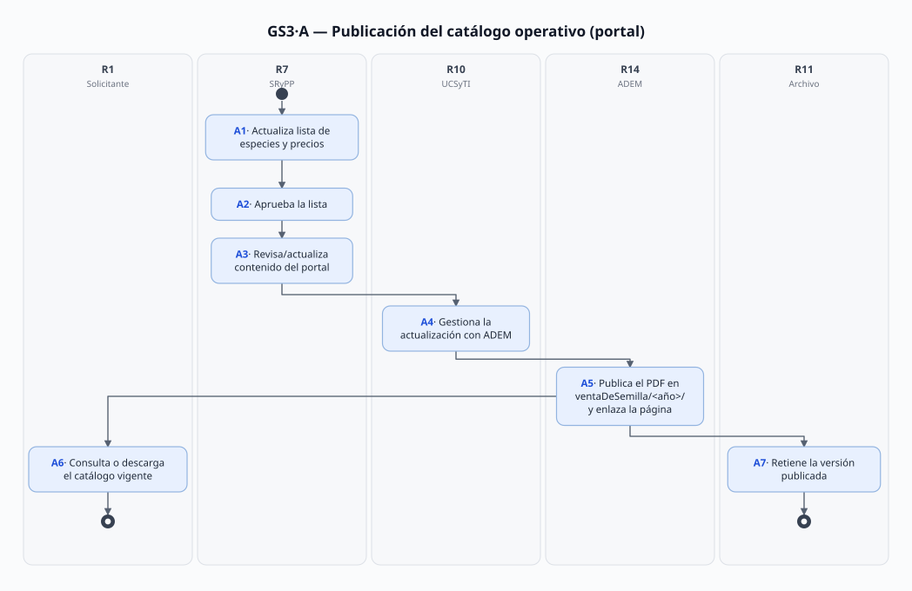
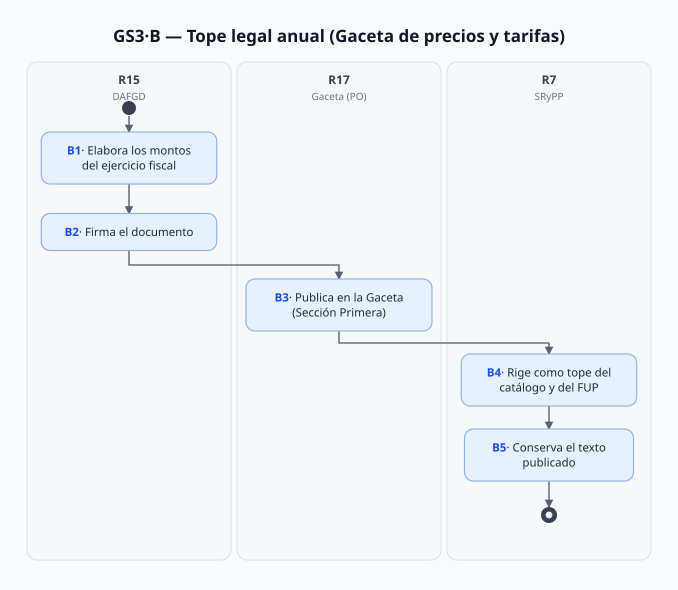

# GS3 — Publicación del catálogo y tarifas de venta (germoplasma: semilla, conos y planta)

> Proyecto: Sistema de Gestión Documental PROBOSQUE (trazabilidad y automatización).
> **Este documento es el análisis del proceso GS3 del mapa [`01_MAPA_PROCESOS_Y_VACIOS_GERMOPLASMA.md`](./01_MAPA_PROCESOS_Y_VACIOS_GERMOPLASMA.md)** (proceso de soporte que habilita a G9: sin catálogo publicado no hay solicitud de compra). Citación externa de pasos: **GS3·A1**, **GS3·B3**, etc. Los roles R# comparten numeración con [`G09_DISTRIBUCION_GERMOPLASMA.md`](./G09_DISTRIBUCION_GERMOPLASMA.md).
> Fecha de análisis: 2026-09-17. La serie histórica de catálogos 2021–2026 fue **capturada del sitio de PROBOSQUE hoy** (URLs `ventaDeSemilla/<año>/`, verificados magic bytes `%PDF`); la Gaceta de tarifas 2026 se capturó del enlace verificado en `marco_juridico.html`.

---

## 1. Objeto y alcance

Regular la **doble publicación anual de los precios de venta de germoplasma**:

- **Modalidad A — catálogo operativo (portal):** lista de especies en venta (nombre común/científico, producto, precio) que se publica como PDF en el sitio (`/files/ventaDeSemilla/<año>/…`) y se enlaza desde la página *Venta de semilla y planta*; es lo que consulta el ciudadano antes de comprar (insumo de G9·A0/A-P0).
- **Modalidad B — tope legal (Gaceta):** los "Montos de los precios y tarifas para el Ejercicio Fiscal de YYYY", documento anual que emite la **Dirección de Administración, Finanzas y de Gestión Documental (DAFGD)** y se publica en la Sección Primera de la Gaceta del Gobierno; fija el precio máximo legal por especie/tamaño.

**Dentro del alcance:** preparación y aprobación del catálogo → gestión de publicación (UCSyTI→ADEM) → publicación y enlace → consulta ciudadana → retención de versiones; y preparación/firma/publicación del tope anual en Gaceta y su encadenamiento con el catálogo.

**Fuera del alcance (procesos hermanos):** la venta como trámite (G9), el inventario que hace "sujeta a disponibilidad" cada catálogo (G7), el ingreso contable del cobro (GS4), las fichas RETYS (GS5), la definición de políticas de portal (T-02) y la **fijación interna del precio** — nadie documenta HOY quién decide el monto (¿estudio de costo? ¿acuerdo de Junta Directiva?); queda como vacío (§10).

## 2. Base documental (origen de los requisitos)

| Clave | Documento (ruta real en `Docs/Comun/`) | Uso — páginas verificadas (2026-09-17 salvo indicación) |
|---|---|---|
| [MGO] | `Manual Jurídico/dic161d.pdf` — MGO 2025 | pdf p. 21 **UCSyTI** (f.2 gestiona ante la ADEM desarrollo/actualización de sistemas y contenidos del portal; f.4 actualiza contenidos con las unidades); pdf p. 26 **SRyPP** (f.13 revisa/actualiza contenidos del portal de su competencia con UCSyTI; f.15 transparencia/datos); pdf p. 25 DRFF f.11/f.13 análogas |
| [TAR24] | `Germoplasma/PRECIOS_Y_TARIFAS_Servicios_PROBOSQUE_2024_abr301a.pdf` (Gaceta 30-abr-2024, Tomo CCXVII No. 76) | pdf p. 1 encabezado: **Poder Ejecutivo/Secretaría del Campo, DAFGD** — "Montos de los precios y tarifas para el Ejercicio Fiscal de **2024**"; pdf p. 2 precios germoplasma (semilla kg, cono kg, planta por tamaño) y **firma: Director General (rúbrica)** |
| [TAR26] | `Germoplasma/PRECIOS_Y_TARIFAS_Servicios_PROBOSQUE_2026_may191c.pdf` (Gaceta 19-may-2026, Tomo CCXXI No. 86) — **capturado 2026-09-17** de `gct/2026/mayo/may191/may191c.pdf`, enlace verificado en `Sitio web/marco_juridico.html` | pdf pp. 1–2 montos 2026 (planta 10x24 $11, 11x25 $12, 15x25 $13, pino azul 15x25 $75; conos $14–34; semillas $317–3,500); pdf p. 4 **firma: "Irán Terán Cordero, encargada del despacho de la DAFGD (rúbrica)"** |
| [CAT21] | `Germoplasma/COSTOS_Venta_Semilla_Conos_2021.pdf` (`ventaDeSemilla/ventaSemillasConos2021.pdf`, capturado 2026-09-17) | 1 p.: "Especies de semilla para venta" 19 semillas + 5 conos con precios; **NOTA final: "La disponibilidad de cada una de las especies en el listado está sujeta a cambios de acuerdo a la existencia de semilla"** |
| [CAT22] | `COSTOS_Venta_Semilla_2022.pdf` + `COSTOS_Venta_Planta_2022.pdf` (capturados 2026-09-17) | dos listas anuales (semilla/cono y planta); contenido íntegro aún no auditado página a página |
| [CAT23] | `COSTOS_Venta_Semilla_2023.pdf` + `COSTOS_Venta_Planta_2023.pdf` (capturados 2026-09-17) | idem |
| [CAT24] | `COSTOS_Venta_Semilla_2024.pdf` + `COSTOS_Venta_Planta_2024.pdf` (capturados 2026-09-17) | semilla: 12 semillas + 5 conos; planta: 27 especies en 10x24 ($9/$14), 15x25 ($19/$21), 30x40 ($34). **Igualdad exacta con [TAR24 pdf p. 2] (centavo a centavo)** → el catálogo es trascripción de la Gaceta. ⚠️ error de traspaso: "Parota — *Erythrina americana*" (correcto: *Enterolobium cyclocarpum*, como aparece en 2026) |
| [CAT25] | `COSTOS_Venta_Semilla_2025.pdf` + `COSTOS_Venta_Planta_2025.pdf` (capturados 2026-09-17) | semilla: 16 + 5 conos; planta: 30 especies $11/$12/$13 (bolsa 10x24/11x25/15x25 — **cambia el surtido de tamaños** vs 2024). Ya usa $11 → existió Gaceta 2025 que no hemos capturado (vacío B6) |
| [CAT-S] [CAT-P] | `COSTOS_Venta_Semilla_Conos_2026.pdf` (1 p.) + `COSTOS_Venta_Planta_2026.pdf` (3 pp.) | catálogo vigente 2026 (12 semillas + 5 conos; planta $11/$12/$13). **Igualdad exacta con [TAR26]** → misma relación trascripción-tope |
| [VEN] | `Sitio web/venta_semilla_planta.html` + **verificación en vivo 2026-09-17** (HTTP 200) | la página enlaza los dos PDF 2026 en `/files/files/ventaDeSemilla/2026/` (`costosVentaSemillaFtal2026.pdf`, `costosVentaPlantaFtal2026.pdf`); "lista de costo de semilla y conos"; horarios |
| [RETYS-1162] [RETYS-1068] | `Retys EdoMex/CEDULAS_RETYS_PROBOSQUE_GERMOPLASMA.md` | costo **fijo** pagado vía FUP; "No hay formato(s) descargables" en ambas cédulas → el catálogo del sitio es el referente público de facto |
| [DIR] | `Manual Jurídico/Directorio.txt` (leído íntegro 2026-09-17) | Titulares por puesto: DAFGD **Irán Terán Cordero** (encargada del despacho, l.111 — coincide con la firmante 2026; **acumula también la Subdirección de Personal**, l.117); UCSyTI **Ana Yaritzy Medina Eleno** (l.36, probosque.ui@); Depto. Gestión Documental y Archivos **Sergio Edgar Díaz Bernal** (l.140); Subdir. Recursos Financieros **Arturo Valdés Bernal** (l.134, probosque.dc@); DG **Alejandro Santiago Sánchez Vélez**; DRFF **Emmanuel Mondragón Romero** (encargado del despacho); SRyPP **Iván Delfino Gómez Patiño**. ⚠️ **No** hay jefaturas de Depto. de Producción de Planta, Banco, Beneficio, viveros ni enlace ADEM → vacío A12 del mapa |
| [ARC] | `Gestión documental y calidad/` (guía, cuadro, inventario) | verificado (G09 §2): no existe serie documental de semilla/germoplasma → las versiones publicadas no tienen custodia |
| [TRAM] | `Sitio web/tramites_servicios.html` | catálogo de trámites que enlaza las cédulas (no enlaza los catálogos — esos cuelgan de [VEN]) |

> **Convención de páginas:** como en G09 §2, `pdf p. X` = página del archivo PDF. Los PDF de catálogos **no llevan fecha, versión ni firma** (verificado en 2021/2024/2025/2026): su fechamiento se infiere de la URL (`ventaDeSemilla/<año>/`) y de la coincidencia con la Gaceta del ejercicio.

## 2.1 Glosario

| Término | Significado | Fuente |
|---|---|---|
| Tope legal / tarifa de ejercicio | monto máximo aprobado para el ejercicio fiscal, publicado en Gaceta | [TAR24 p. 1][TAR26 p. 1] |
| Catálogo operativo | lista pública de especies/productos en venta con precio, en el sitio de PROBOSQUE | [CAT21][CAT-S][CAT-P][VEN] |
| DAFGD | Dirección de Administración, Finanzas y de Gestión Documental — emite los montos anuales | [TAR24 p. 1][TAR26 p. 4][DIR] |
| ADEM | Agencia Digital del Estado de México — opera desarrollo y contenidos del portal a gestión de UCSyTI | [MGO pdf p. 21 f.2] |
| Serie `ventaDeSemilla/<año>/` | convención de hosting de los catálogos anuales en el portal | URLs capturadas 2026-09-17 |
| "Sujeta a disponibilidad" | cláusula del catálogo: las especies listadas dependen de la existencia real (G7) | [CAT21 nota final] |

## 3. Roles (stakeholders personificados)

> Regla: cada rol lleva el **puesto y titular reales** que constan en [DIR] (Directorio, verificado 2026-09-17). Donde el Directorio no llega (jefaturas de Departamento por debajo de Subdirección, operadores, personal de viveros), el titular se marca ⚠️ **desconocido** y queda registrado como vacío A12 del mapa: **una necesidad no puede validarse con una persona que no sabemos quién es**; la primera diligencia (entrevista o solicitud de directorio interno completo) debe cerrar esto antes de fijar requisitos con usuarios.

| ID | Rol (puesto) | Titular real [DIR] | Unidad/correo | Tipo |
|---|---|---|---|---|
| R1 | Solicitante/ciudadano que consulta el catálogo | — (varios) | — | Externo |
| R7 | Subdirector de Restauración y Producción de Planta — dueño del contenido del portal de su área (f.13) y del catálogo en los hechos | **Iván Delfino Gómez Patiño** (l.88) | SRyPP · probosque.dpp@ | Interno |
| R7a | ⚠️ **Operador del catálogo dentro de SRyPP**: quién elabora/actualiza físicamente la lista de especies y precios (A1) y a quién le reporta (¿jefe del Depto. de Producción de Planta? ¿un ingeniero forestal?) | **desconocido** — no figura en el Directorio (vacío A12) | Depto. Producción de Planta (bajo SRyPP) | Interno |
| R10 | Jefa de la Unidad de Comunicación Social y TI — gestiona la publicación ante la ADEM (f.2/f.4) | **Ana Yaritzy Medina Eleno** (l.36) | UCSyTI · probosque.ui@ | Interno |
| R11 | Jefe del Depto. de Gestión Documental y Administración de Archivos — custodia de versiones publicadas (A7/B5, hoy inexistente) | **Sergio Edgar Díaz Bernal** (l.140) | probosque.archivo@ | Interno |
| R14 | Enlace de la ADEM que ejecuta la subida de archivos al portal | **desconocido** (externo a PROBOSQUE; vacío A12) | Agencia Digital del EdoMéx [MGO pdf p. 21 f.2] | Externo |
| R15 | Encargada del despacho de la DAFGD — prepara y firma los montos anuales (B1–B2) | **Irán Terán Cordero** (l.111; acumula Subdir. de Personal l.117 — ⚠️ doble rol, confirmar quién elabora realmente los montos) | DAFGD · probosque.daf@ | Interno |
| R16 | Director General — firmante de la Gaceta de tarifas (caso 2024) | **Alejandro Santiago Sánchez Vélez** | DG · probosque.dg@ | Interno |
| R17 | Gaceta del Gobierno (Periódico Oficial) — canal de publicación | — (institución: Poder Ejecutivo/Secretaría del Campo) | [TAR24][TAR26] | Externo |

*(R2, R3, R8, R9, R12, R13 de G09 no intervienen en GS3; R8 usa el resultado B4 para el FUP.)*

## 4. Funciones y actividades por rol

| Rol | Función | Actividades clave (pasos §6) |
|---|---|---|
| R7a (⚠️ por identificar) | Elaboración del catálogo | A1 (actualiza lista de especies/precios) |
| R7 Iván Delfino | Aprobación y contenido | A2 (aprueba — por confirmar), A3 (revisa contenido portal f.13); consume B4 |
| R10 Ana Yaritzy Medina | Gestión de publicación | A4 (gestiona ante ADEM f.2/f.4) |
| R14 enlace ADEM (⚠️ por identificar) | Hosting | A5 (sube PDF a `ventaDeSemilla/<año>/` y enlaza) |
| R1 | Consulta | A6 (descarga/consulta catálogo → inicia G9) |
| R11 Sergio Edgar Díaz | Custodia | A7, B5 (retención de versiones — hoy no documentada) |
| R15 Irán Terán | Topes | B1 (elabora montos — o su área), B2 (firma — caso 2026) |
| R16 Alejandro Santiago | Firma | B2 (caso 2024) |
| R17 Gaceta | Publicación oficial | B3 (Sección Primera) |

## 5. Reglas de negocio

- **GS3·BR-1** Doble régimen con prioridad: el **tope legal** (Gaceta del ejercicio) es el techo; el **catálogo operativo** lo trascribe (verificado 2026-09-17: [CAT24]≡[TAR24 pdf p. 2] y [CAT-S]/[CAT-P 2026]≡[TAR26 pp. 1–2], coincidencia al centavo). El precio cobrado (FUP, G9·A1) no puede exceder el tope vigente.
- **GS3·BR-2** Anualidad: los montos son "para el Ejercicio Fiscal de YYYY" y los catálogos viven en carpetas por año (`ventaDeSemilla/2022…2026`); se publican entre abril y mayo (2024: 30-abr; 2026: 19-may).
- **GS3·BR-3** Emisión del tope: documento de la **DAFGD** (Secretaría del Campo); la firma varía: DG en 2024 [TAR24 p. 2], encargada de despacho DAFGD en 2026 [TAR26 p. 4] — ⚠️ el procedimiento interno de aprobación (¿Junta Directiva? ¿acuerdo?) no está documentado en ninguna fuente del repo (vacío §10.1).
- **GS3·BR-4** Canal de publicación: SRyPP (f.13) → UCSyTI gestiona ante ADEM (f.2/f.4) → ADEM aloja; el enlace visible cuelga de la página [VEN], no de [TRAM] ni de las cédulas RETYS.
- **GS3·BR-5** El catálogo **no es inventario**: "la disponibilidad… está sujeta a cambios de acuerdo a la existencia de semilla" ([CAT21] nota) — la existencia real es G7 (vacío A5 de G09: sin registro público).
- **GS3·BR-6** Los catálogos publicados **carecen de metadatos** (fecha, versión, aprobador, vigencia) — verificado en 2021/2024/2025/2026: solo título y tabla. Su control como documento formal es oportunidad/entrega del SGD.
- **GS3·BR-7** Las versiones históricas quedan vivas en el sitio (2021 y 2025 siguen en línea — verificado 2026-09-17 al capturarlas): no hay política de retiro/sustitución ni redirección a la vigente.

## 6. Procedimiento narrado (los IDs de paso son el ancla de trazabilidad)

**Modalidad A — Catálogo operativo anual (portal)**

- **A1** *(inferido)* R7 (con DPP) actualiza la lista de especies y precios según el inventario (G7) y el tope del ejercicio (B4). No hay documento que lo regule → vacío §10.1.
- **A2** *(inferido)* Aprobación interna de la lista (¿titular SRyPP? ¿DAFGD? ¿DG?) — sin fuente; por confirmar en entrevista.
- **A3** R7 revisa/actualiza los contenidos del portal de su competencia. *(f.13 [MGO pdf p. 26])*
- **A4** R10 gestiona ante la ADEM el desarrollo/actualización de contenidos y arquitectura del portal. *(f.2/f.4 [MGO pdf p. 21])*
- **A5** R14 publica el PDF en `/files/ventaDeSemilla/<año>/` y mantiene el enlace de la página "Venta de semilla y planta". *(URLs y enlaces verificados en vivo 2026-09-17 [VEN])*
- **A6** R1 descarga/consulta el catálogo: especies, precios, "sujeta a disponibilidad" → inicia la compra (G9·A0/A-P0). *([CAT21] nota; [CAT-S p. 1]; [CAT-P pp. 1–3])*
- **A7** *(inferido)* R11 retiene la versión publicada con su año y su Gaceta de referencia — hoy no documentado: las versiones antiguas quedan colgadas sin control (BR-7) → vacío §10.2.

**Modalidad B — Tope legal anual (Gaceta)**

- **B1** *(inferido)* R15 (DAFGD) elabora los montos para el ejercicio fiscal (base de cálculo no documentada: ¿inflación? ¿estudio de costo? ¿oficio SRyPP?) → vacío §10.1.
- **B2** R15/R16 firma el documento de montos (2024: DG; 2026: encargada de despacho DAFGD). *([TAR24 pdf p. 2]; [TAR26 pdf p. 4])*
- **B3** R17 publica en la Gaceta del Gobierno, Sección Primera (30-abr-2024 Tomo CCXVII No. 76; 19-may-2026 Tomo CCXXI No. 86). *([TAR24 pdf p. 1]; [TAR26 pdf p. 1])*
- **B4** Vigencia por ejercicio fiscal: rige como tope del catálogo (A1) y del importe del FUP (G9·A1/A-P1/A-P3). *([TAR26 pp. 1–2]≡[CAT-S][CAT-P]; [RETYS-1162/1068] costo fijo)*
- **B5** *(inferido)* R11 conserva el texto publicado y lo enlaza con el catálogo que lo trascribe → serie documental por definir (GS6).

## 7. Diagramas de actividad (SVG con carriles por rol)

> Mismo estándar que G09 §7: nodos con ID de paso + acción, flujo estrictamente descendente, flechas al centro del borde. Fuente: `../Diagramas/GS3/gen-diagramas.mjs` (`node gen-diagramas.mjs <dir>` regenera).

### GS3·A — Publicación del catálogo operativo

### GS3·B — Tope legal anual (Gaceta)

## 8. Tabla de necesidades (con ancla al paso)

Prioridad: **A** = obligatoria · **M** = media · **B** = deseable. Regla de origen como en G09 §8 (solo archivos del repo con ancla; ⚠️ = sin referencia documental).

| ID | Rol | Necesidad (lo que el rol requiere PARA ejecutar su paso) | Prior. | Paso | Origen (archivo + ancla) |
|---|---|---|---|---|---|
| N-01 | R1 | Acceder al catálogo vigente del ejercicio (especies y precios) desde la página de venta | A | A5, A6 | [VEN §enlaces `ventaDeSemilla/2026/…`] (verificado en vivo 2026-09-17, HTTP 200); [MGO pdf p. 26 f.13; p. 21 f.2/f.4] |
| N-02 | R7a | **Consultar** la existencia real (G7) y la Gaceta del ejercicio vigente para elaborar la lista anual | A | A1 | [CAT21 pdf p. 1 nota "sujeta a… existencia de semilla" — el elaborador necesita la existencia]; [TAR26] (el precio nace del tope); ⚠️ la existencia no tiene registro público (vacío A5 del mapa) |
| N-03 | R7 | **Comprobar**, antes de aprobar la lista, que cada precio no excede el tope del ejercicio (especie por especie) | A | A2 | hoy se hace a mano: [CAT24 pdf p. 1]≡[TAR24 pdf p. 2] y [CAT-S]/[CAT-P]≡[TAR26 pdf pp. 1–2] (verificado 2026-09-17); 2025 no comprobable sin [TAR25] (vacío B6) |
| N-04 | R10 | **Girar** a la ADEM una solicitud de publicación con contenido preciso (archivo, ruta de destino, página que enlaza) y **dar seguimiento** a su estado | A | A4 | [MGO pdf p. 21 f.2/f.4] (la competencia existe); ⚠️ no existe formato/ticket documentado (mecánica → vacío A12/entrevista) |
| N-05 | R14 | **Recibir** el archivo a publicar con el nombre y carpeta que manda la serie (`ventaDeSemilla/<año>/…`) y saber qué versión sustituye | A | A5 | serie verificada al capturarla 2026-09-17 (2021–2026); ⚠️ no hay instrucción de sucesión: 2021/2025 siguen publicadas sin marca de "superada" (BR-7) |
| N-06 | R11 | **Localizar** la versión vigente y las históricas del catálogo y de la Gaceta, con año, vigencia y vínculo entre ambos (consultas de transparencia, reclamaciones de precio) | A | A7, B5 | [ARC] verificado (G09 §2): no existe serie de semilla/germoplasma → GS6; ⚠️ sin custodia hoy |
| N-07 | R1 | **Saber** si las especies listadas tienen existencia real antes de desplazarse (el catálogo no lo dice) | A | A6 → G9·A0 | [CAT21 pdf p. 1 nota]; la existencia es G7 (vacío A5 — compartida con G09 N-06) |
| N-08 | R7a·R7 | **Revisar** la lista antes de publicar (nombres científicos, precios, unidades de envase) | M | A1, A3 | error real publicado: [CAT24 pdf p. 1] "Parota — *Erythrina americana*" (correcto *Enterolobium cyclocarpum*, [CAT-S p. 1]) — evidencia 2026-09-17 |
| N-09 | R15 | **Fundar** los montos anuales (estudio de costo o factor de actualización) para fijar el tope con evidencia | A | B1 | ⚠️ sin fuente: [TAR24][TAR26] solo muestran montos y firma; el acto previo (acta/acuerdo) no está en el repo (vacío A11) |
| N-10 | R16·R15 | **Confirmar** qué se autoriza antes de firmar la Gaceta (constancia del acuerdo que precede) | A | B2 | [TAR24 pdf p. 2 firma DG]; [TAR26 pdf p. 4 firma encargada DAFGD] — ninguna adjunta el acuerdo (vacío A11) |
| N-11 | R1·R7 | **Enterarse** de cambios de precio o de especies dentro del ejercicio (reedición de Gaceta o corrección de catálogo) | B | B3, A6 | ⚠️ sin fuente: no hay evidencia de reediciones intra-ejercicio ni canal de aviso; las cédulas [RETYS-1162/1068] no enlazan el catálogo |

## 9. Registros que el SGD debe gestionar (catálogo documental)

| Registro | Genera (paso) | Contiene (campos verificados en la fuente) | Retención |
|---|---|---|---|
| Catálogo de semilla y cono (anual) [CAT21][CAT24][CAT25][CAT-S] | R7 (A1) → R14 (A5) | nombre común, nombre científico, producto (semilla/cono), precio por kg; (2021: nota de disponibilidad) | anual — **proponer: permanente con marca de versión/sucesión** (hoy no se gestiona) |
| Catálogo de planta (anual) [CAT24][CAT25][CAT-P] | R7 (A1) → R14 (A5) | nombre común/científico, tipo de envase (bolsa 10x24/11x25/15x25/30x40), costo unitario | idem |
| Gaceta de montos de precios y tarifas (anual) [TAR24][TAR26] | R15 (B1–B2) → R17 (B3) | encabezado DAFGD/Secretaría del Campo, concepto por especie/servicio, monto, firma (DG o DAFGD), fecha y tomo Gaceta | fiscal/permanente (normativa vigente por ejercicio) |
| Enlace de publicación (página venta) [VEN] | R10/R14 (A4–A5) | URL de los dos PDF del año, textos de acceso | vigente = año en curso |
| Acta/acuerdo de aprobación de montos | (B1–B2) | **inexistente en el repo** — plantilla/obtención pendiente (§10.1) | por definir |

## 10. Vacíos y siguientes pasos

**Cerrados hoy (2026-09-17):** ~~B3 del mapa (catálogos históricos)~~ → capturados 2021, 2022, 2023, 2024, 2025 (semilla y planta; 11 archivos en `Docs/Comun/Germoplasma/`, magic bytes verificados); ~~contradicción $9 vs $11 de G09 §10.5~~ → resuelta: topes por ejercicio ([TAR26] fija $11/$12/$13 = catálogo 2026).

**Abiertos** (IDs remiten a la lista A#/B# del mapa `01_`):
1. **Aprobación interna** — quién y cómo aprueba montos (B1–B2) y catálogo (A1–A2): no hay acuerdo/acta en el repo; las Gacetas solo muestran la firma. → entrevista DAFGD (Irán Terán Cordero) y SRyPP; posible solicitud SAIMEX del acta de Junta Directiva que autoriza los montos. *(nuevo vacío GS3-A; registrar en mapa)*
2. **Versiones y retención** — sin metadatos ni retiro de versiones (BR-6/BR-7): lo define el SGD (GS6/N-06).
3. **B6 (nuevo en el mapa)** — Gaceta de montos del **Ejercicio Fiscal 2025** (la que subió planta a $11/$12/$13): no localizada (la URL `gct/2025/abril/abr301/abr301a.pdf` resultó ser de otra dependencia); buscar en el índice de la Gaceta 2025.
4. **Mecánica con ADEM** — solicitud de servicio/ticket real (N-04) → entrevista UCSyTI.
5. **2022/2023 sin auditoría página a página** — capturados pero no comparados contra sus Gacetas (¿existen 2022/2023?) — mismo procedimiento que 2024/2026, tarea mecánica pendiente.
6. **A12 (nuevo en el mapa)** — Identificar a los operadores reales de cada paso (R7a elaborador del catálogo, R14 enlace ADEM, jefe de Depto. de Producción de Planta, jefe de Contabilidad): el Directorio público no baja de Jefatura de Departamento → pedir **directorio interno/estructural completo** (SAIMEX o en la propia entrevista) ANTES de validar necesidades N-01..N-11 con usuarios.
7. Convertir N-01..N-11 en requisitos del SGD: el caso de uso central es **"documento normativo (Gaceta) → documento operativo (catálogo) → trámite (G9)"** con validación automática de consistencia (N-03) y linaje de versiones (N-06).

## 11. Nota de mantenimiento

Análisis del proceso **GS3** del mapa 01; vive en `Docs/Joni/Germoplasma/GS3_PUBLICACION_CATALOGO_Y_TARIFAS.md`. Fuentes capturadas de probosque.edomex.gob.mx y legislacion.edomex.gob.mx el **2026-09-17** (URLs originales anotadas en §2; series `ventaDeSemilla/<año>/` — si el sitio cambia, re-capturar y fechar). Diagramas: SVG generados por `Docs/Joni/Diagramas/GS3/gen-diagramas.mjs` (editar el script, no los `.svg`). Cruces: G09 (consumidor), G7 (disponibilidad), GS4 (cobro), GS6 (serie). Evitar copias paralelas: editar siempre aquí.
