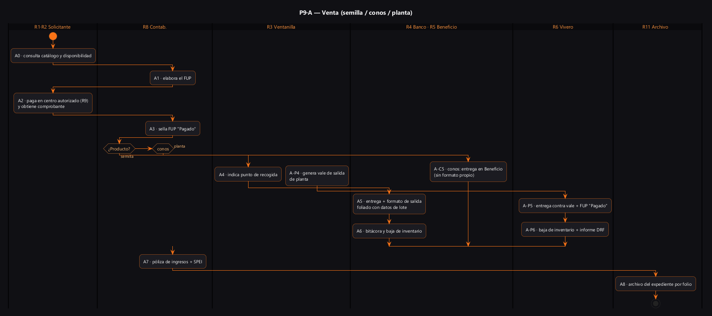
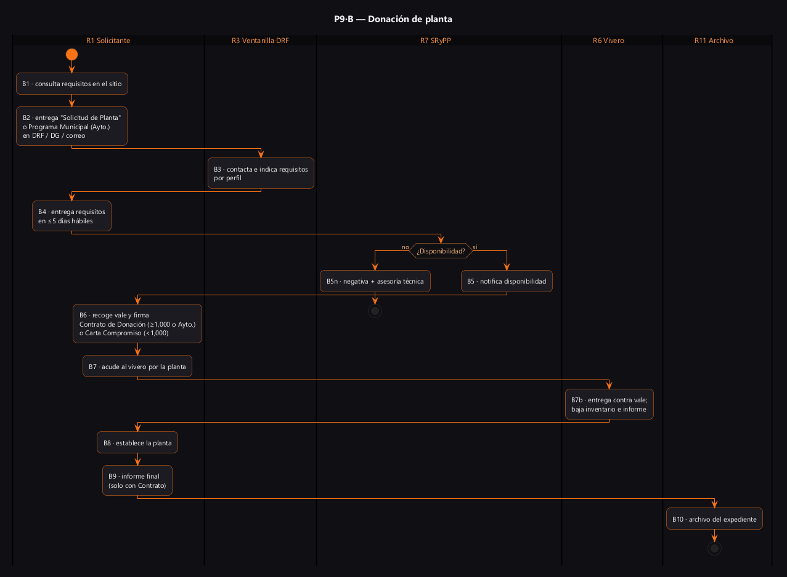

# P9 — Salida externa del banco: distribución de germoplasma (venta de semilla/conos/planta y donación de planta)

> Proyecto: Sistema de Gestión Documental PROBOSQUE (trazabilidad y automatización).
> **Este documento es el análisis del proceso P9 del mapa [`01_MAPA_PROCESOS_Y_VACIOS_GERMOPLASMA.md`](./01_MAPA_PROCESOS_Y_VACIOS_GERMOPLASMA.md)** (antes `02_PROCEDIMIENTO_DISTRIBUCION_GERMOPLASMA.md`, renombrado y renumerado 2026-09-14).
> Fecha de análisis: 2026-09-10. **v2: 2026-09-14** — reescrito con las metodologías oficiales RETYS (transcritas), el MP DRFF 2006, el formato de solicitud 2026 capturado y el MP de Contabilidad 2025; orígenes auditados con página contra el disco. Citación externa de pasos: **P9·A5**, **P9·B6**, etc.

---

## 1. Objeto y alcance

Regular la **salida de germoplasma (semilla, conos forestales y planta) desde las áreas de PROBOSQUE hacia usuarios externos**, en dos modalidades:

- **Venta** (tres trámites oficiales distintos, cada uno con su cédula RETYS):
  - **Semilla** [RETYS-1162]: presencial; se entrega en el **Banco de Germoplasma** (Vivero Invernaderos, Conjunto SEDAGRO, Metepec). Resultado del trámite: **"Formato de salida de Semilla del Banco de Germoplasma"**.
  - **Conos** [VEN]: se venden y entregan en el **Área de Beneficio de Semilla** (misma ubicación). ⚠️ Sin cédula RETYS ni formato propio documentado → vacío A8 del mapa.
  - **Planta** [RETYS-1068]: se tramita en DRF u Oficinas Centrales; se entrega en el vivero. Resultado: **"Vale de salida de planta forestal"**.
  - Pago siempre mediante **Formato Universal de Pago (FUP)** elaborado y sellado por el Departamento de Contabilidad; nunca efectivo en oficina [RETYS-1162/1068].
- **Donación** [RETYS-2092]: planta gratuita según disponibilidad, con **metodología oficial de 9 pasos** + modalidad especial por **acta de nacimiento/defunción (art. 3.79 Bis del Código para la Biodiversidad del EdoMéx)**.

**Dentro del alcance:** solicitud → verificación de existencia → cobro/autorización → entrega → registro de salida → archivo del expediente.
**Fuera del alcance (procesos hermanos del mapa):** programación y colecta (P1–P2), beneficio (P4), laboratorio (P5), almacenamiento (P6), inventario (P7), entrega interna a viveros (P8) y retornos/bajas (P10). El vale de planta **dentro de los programas de apoyo** ([RO-PS], [RO-RHF]) es un canal paralelo que consume el mismo inventario: véase S8 del mapa.

## 2. Base documental (origen de los requisitos)

| Clave | Documento (ruta real en `Docs/Comun/`) | Uso — páginas verificadas |
|---|---|---|
| [MGO] | `Manual Jurídico/dic161d.pdf` — MGO 2025 (Gaceta 16-dic-2025, Tomo CCXX No. 112) | p. 12 codificación estructural; p. 13 organigrama; pp. 17–20 OIC; pp. 20–21 **UVI** (225C0201000600S; f.3 canaliza solicitudes, **f.6 apoya a entidades en la adquisición de semilla, conos y planta**); pp. 21–22 **UCSyTI** (f.2/f.4 gestión ante ADEM y contenidos del portal); p. 25 **DRFF** (f.1 reporta avances de germoplasma/producción a la DG); pp. 25–26 **SRyPP** (225C0201020100L: f.3 coordina recolecta de germoplasma, f.10 atiende solicitudes de restauración forestal social con las DRF, **f.12 coordina venta y capitalización de semillas, conos y planta**, f.13 portal, f.15 transparencia/datos); pp. 26–27 **SAPCAT** (f.11 huertos semilleros y propagación in vitro, f.20 visitas guiadas); pp. 35–36 **9 DRF** (225C0201050100T–0900T) |
| [RIG] | `Manual Jurídico/rglvig245.pdf` — Reglamento Interno (Gaceta 12-ene-2017, últ. reforma 14-nov-2025) | **Art. 15, fracc. II (p. 9): crear/operar viveros; fracc. XVIII (p. 10): huertos semilleros y bancos de germoplasma in situ** |
| [TAR] | `Germoplasma/PRECIOS_Y_TARIFAS_Servicios_PROBOSQUE_2024_abr301a.pdf` (Gaceta 30-abr-2024) | **p. 2**: lista de especies con precio máximo legal de semilla por kg |
| [CAT-S] | `Germoplasma/COSTOS_Venta_Semilla_Conos_2026.pdf` (2 pp.) | Catálogo operativo 2026: nombre común/científico, semilla o cono, precio |
| [CAT-P] | `Germoplasma/COSTOS_Venta_Planta_2026.pdf` (3 pp.) | Catálogo operativo 2026 de planta por tipo de envase |
| [VEN] | `Sitio web/venta_semilla_planta.html` | Lugares, horarios (9:00–15:00 ⚠️ contradice 9:00–17:00 de RETYS), FUP y puntos de entrega |
| [DON] | `Sitio web/donacion-planta.html` | Temporada de solicitud jun–ago; formato "Solicitud de Restauración Forestal Social" (el "clic aquí" lleva a la cédula RETYS 2092) |
| [DON1000] | `Sitio web/donacion-1000.html` | Donación **≥1,000 plantas**: atención jun–sep; mismo formato; entrega en OC/DRF/correo |
| [RETYS-1162] | `Retys EdoMex/CEDULAS_RETYS_PROBOSQUE_GERMOPLASMA.md` §Venta de Semilla | **Metodología oficial 3 pasos**, costo fijo, requisito único = comprobante de pago, resultado = Formato de salida de Semilla, respuesta 15 min, horario 9:00–17:00 |
| [RETYS-1068] | idem §Venta de Planta | Metodología oficial 3 pasos (DPP **genera el Vale de Salida de Planta**); resultado = Vale de salida de planta forestal; 11 oficinas (DRFF+9 DRF+OC) |
| [RETYS-2092] | idem §Donación de planta | **Metodología oficial 9 pasos + modalidad 3.79 Bis (4 pasos)**, 17 requisitos por perfil, Contrato de Donación ≥1,000/Ayuntamiento vs Carta Compromiso <1,000, plazos (5 días hábiles para requisitos, resolución 9 meses, ficta negativa) |
| [SOL-DON] | `Germoplasma/RETYS_2092_SOLICITUD_DONACION_PLANTA_2026.pdf` | **Formato "Solicitud de Planta" 2026** (v.1; elaboró SRyPP, validó DRFF): campos reales de la solicitud (§9) |
| [MP06] | `Germoplasma/86_manualProcDirRestYFtoFtal.pdf` — MP DRFF, sep-2006 | 4.1 flujo pp. 12–14 y formatos pp. 16–27 (**Vale de Salida de Planta de Viveros pp. 26–27**); 4.2 flujo pp. 31–37, formatos pp. 38–42 (**Salida de Semilla del Banco pp. 41–42**). Diseño operativo; vigencia por confirmar (A1/A6) |
| [CONT25] | `Manual Jurídico/jul301b.pdf` — MP Depto. de Contabilidad (ed. feb-2025, Gaceta 30-jul-2025, 37 pp., con texto) | p. 2 índice: solo 3 procedimientos (presupuesto, transferencias, pagos diversos) — **no hay procedimiento de ingreso por venta** (vacío A7); p. 19 registro de ingresos: **póliza de ingresos + SPEI/contra-recibo** |
| [ARC] | `Gestión documental y calidad/GUIA_Simple_Archivo_2026.pdf` + `CUADRO_Gral_Clasif_Archivística_2024.pdf` + `INVENTARIO_Gral_Archivo_2025.pdf` | **Verificado: no existe serie documental de semilla/germoplasma** → retenciones por definir en el SGD |
| [MR] | `Gestión documental y calidad/LINEAMIENTOS_Comité_MejoraRegulatoria.pdf` + `FORMATO_Ficha_Dato_Tramite_Servicio.pdf` | Obligación de fichas RETYS vigentes |
| [ISO] | `Gestión documental y calidad/CERT_ISO9001_NYCE_2022.pdf` / `_IQNET_` (escaneados: abrir como imagen) | Alcance verificado visualmente: producción de planta certificada; **venta de semilla/conos NO declarada**; certificado vencido 2025-10-10 (renovación = vacío A9) |
| [DIR] | `Manual Jurídico/Directorio.txt` | Titulares reales por puesto (Iván Delfino Gómez Patiño SRyPP; Emmanuel Mondragón Romero DRFF; Juan Hernández Martínez UVI) |
| [TRAM] | `Sitio web/tramites_servicios.html` | Catálogo oficial de trámites: enlaza las cédulas 1162/1068/2092 |

## 2.1 Glosario

| Término | Significado | Fuente |
|---|---|---|
| FUP | Formato Universal de Pago: lo **elabora el Departamento de Contabilidad**, se paga en centro autorizado y **Contabilidad lo sella "Pagado"** contra comprobante | [RETYS-1162/1068] |
| Centro autorizado de pago | Banco o establecimiento mercantil (no definido en normatividad; aparece en sitio y RETYS) | [VEN][RETYS] |
| Folio | Número consecutivo que encadena solicitud→FUP→comprobante→formato de salida→archivo (los formatos 2006 ya lo prevén: "folio" en vale de planta, "foliado" en salida de semilla) | [MP06 pp. 26, 41] |
| Capitalización | Registro contable del ingreso por venta (función SRyPP f.12; el asiento real: póliza de ingresos + SPEI/contra-recibo; procedimiento de venta no documentado → A7) | [MGO p. 26][CONT25 p. 19] |
| Contrato de Donación | Instrumento para donaciones ≥1,000 plantas o Ayuntamientos; obliga a **informe final de actividades** | [RETYS-2092] |
| Carta Compromiso | Instrumento para donaciones <1,000 plantas (y modalidad 3.79 Bis) | [RETYS-2092] |
| Art. 3.79 Bis | Código para la Biodiversidad EdoMéx: derecho a recibir planta por nacimiento/hijo o defunción/ascendiente (acta del EdoMéx ≥12-dic-2025, ≤1 año del registro) | [RETYS-2092] |
| Ficta negativa | Si la autoridad no resuelve en el plazo (9 meses en donación), se entiende negativa | [RETYS-2092] |
| PFC | Plantación Forestal Comercial (código de identificación exigido en la solicitud; constancia obligatoria para especies navideñas) | [SOL-DON][RETYS-2092] |
| OC / DRF / UVI / DPP / SRyPP / SAPCAT / UCSyTI / ADEM / OIC / CEMER / RETYS / NTEA / SGD | Oficinas Centrales (Metepec) · Delegación Regional Forestal (9) · Unidad de Vinculación Interinstitucional · Depto. de Producción de Planta · Subdirección de Restauración y Producción de Planta · Subdirección de Apoyo a las Plantaciones Comerciales y Asistencia Técnica · Unidad de Comunicación Social y TI · Agencia Digital del EdoMéx · Órgano Interno de Control · Comité de Mejora Regulatoria · Registro Estatal de Trámites y Servicios · Norma Técnica Estatal Ambiental NTEA019 (espacios públicos → ecología municipal) · Sistema de Gestión Documental (nuestro software) | [MGO][DON][MR] |

## 3. Roles (stakeholders)

| ID | Rol | Unidad real | Tipo |
|---|---|---|---|
| R1 | Solicitante (ciudadano, ejido/municipio vía ayuntamiento, empresa, institución) | — | Externo |
| R2 | Entidad interesada (otras dependencias/entidades) | canalizada por UVI [MGO pp. 20–21 f.3/f.6] | Externo |
| R3 | Ventanilla DPP/UVI: informa, **indica el punto de recogida (venta semilla)** y **genera el vale de salida (venta planta)** | DPP (SRyPP) y UVI [RETYS-1162 m2 / RETYS-1068 m2] | Interno |
| R4 | Custodio del Banco de Germoplasma — **entrega semilla** y firma "ENTREGÓ" en el formato de salida (2006: Jefe del Programa de Colecta de Germoplasma Forestal) | Banco (Vivero Invernaderos, SEDAGRO) [MP06 pp. 41–42] | Interno |
| R5 | Responsable del Área de Beneficio de Semilla — **entrega conos** | misma ubicación que R4 [VEN] | Interno |
| R6 | Responsable de vivero — entrega planta contra vale, descuenta inventario, informa salida | 17 viveros / 9 DRF [MP06 p. 14][RETYS-1068] | Interno |
| R7 | SRyPP: coordina venta y capitalización (f.12), atiende restauración forestal social (f.10), autoriza disponibilidad en donación | SRyPP — Iván Delfino Gómez Patiño [MGO pp. 25–26][DIR] | Interno |
| R8 | Contabilidad: **elabora el FUP, lo sella "Pagado"**, registra el ingreso (póliza) | Depto. de Contabilidad [RETYS-1162/1068][CONT25] | Interno |
| R9 | Centro autorizado de pago (banco/establecimiento mercantil) | — | Externo |
| R10 | Publicador del catálogo, tarifas y fichas en portal | UCSyTI + ADEM [MGO pp. 21–22 f.2/f.4; SRyPP f.13] | Interno |
| R11 | Archivo: custodia del expediente por folio | Depto. de Gestión Documental y Administración de Archivos [DIR] | Interno |
| R12 | Validador regulatorio (ficha RETYS vigente) | CEMER [MR] | Interno/Externo |
| R13 | Supervisor de legalidad y trazabilidad | OIC [MGO pp. 17–20]; transparencia INFOEM/IPOMEX | Interno/Externo |

## 4. Funciones y actividades por rol

| Rol | Función | Actividades clave (pasos §6) |
|---|---|---|
| R1/R2 | Adquirir o recibir germoplasma | A0, A2, A-P2, B1–B2, B4, B6–B9 |
| R3 | Atención en ventanilla | A4 (indica sitio), A-P4 (genera vale de planta), B3 (contacta e indica requisitos) |
| R4 | Entrega de semilla | A5 (formato de salida foliado con datos del lote), A6 (bitácora/inventario) |
| R5 | Entrega de conos | A-C5 (⚠️ sin formato propio: A8) |
| R6 | Entrega de planta | A-P5, B7b (vale, inventario, informe de salida) |
| R7 | Autorizar y coordinar | B5 (disponibilidad), coordinación de capitalización [MGO f.12] |
| R8 | FUP y contabilidad | A1/A3, A-P1/A-P3 (elabora/sella), A7 (póliza de ingresos) |
| R10 | Publicar | Sostén de A0/B1 (catálogo, fichas RETYS) |
| R11 | Archivar | A8, B10 (expediente por folio) |
| R12 | Documentar el trámite | Fichas 1162/1068/2092 vigentes [MR] |

## 5. Reglas de negocio

- **BR-1** Venta de semilla y conos: **solo en Oficinas Centrales** (9:00–15:00 según [VEN]; **9:00–17:00 según [RETYS-1162]** ⚠️ contradicción → confirmar A#); semilla se entrega en el Banco, conos en el Área de Beneficio (ambas en Vivero Invernaderos, SEDAGRO, Metepec).
- **BR-2** Venta de planta: se tramita en DRF u OC (DPP/UVI) y **se entrega en el vivero** [RETYS-1068][VEN].
- **BR-3** Pago: **nunca efectivo en oficina**; el FUP lo **elabora Contabilidad**, se paga en centro autorizado y **Contabilidad lo sella "Pagado"** contra comprobante [RETYS-1162/1068].
- **BR-4** Donación: solicitudes jun–ago [DON] (≥1,000 plantas: jun–sep [DON1000]); entrega en temporada de reforestación jun–sep, según disponibilidad [RETYS-2092].
- **BR-5** Precios: catálogo operativo 2026 [CAT-S]/[CAT-P] dentro del máximo legal de Gaceta [TAR p. 2]. Deben coincidir.
- **BR-6** Espacios públicos (parques, glorietas, camellones): derivar a ecología municipal por la NTEA019-SeMAGEM-DS-2017 [DON][RETYS-2092].
- **BR-7** Instrumento según volumen: **≥1,000 plantas o Ayuntamientos → Contrato de Donación + informe final; <1,000 → Carta Compromiso** [RETYS-2092]. ⚠️ MP06 (2006) usaba el umbral 2,000 con "Convenio de Reforestación" → confirmar en entrevista (A6).
- **BR-8** Modalidad 3.79 Bis (acta de nacimiento ≤1 año o defunción, actas del EdoMéx ≥12-dic-2025): exenta de solicitud y de acreditar propiedad; solo acta + ID + carta compromiso [RETYS-2092].
- **BR-9** Donación: requisitos adicionales en **≤5 días hábiles** tras la notificación, o el expediente se da por concluido; **plazo de resolución 9 meses, ficta negativa**; exención de acreditar propiedad en **<250 plantas** [RETYS-2092][SOL-DON].
- **BR-10** Ventas: tiempo de respuesta **15 minutos**; requisito único = comprobante de pago; el documento de resultado es el formato de salida (semilla) o el vale (planta) [RETYS-1162/1068].
- **BR-11** Conos: se venden ([VEN]) pero **no existe cédula RETYS ni formato de salida documentado** → regla por definir (vacío A8 del mapa).

## 6. Procedimiento narrado (los IDs de paso son el ancla de trazabilidad)

**Modalidad A — Venta**

*Semilla* [RETYS-1162]:
- **A0** *(inferido)* R1 consulta catálogo/precios [CAT-S][TAR] y solicita disponibilidad a R3. La verificación contra inventario real no está en la metodología oficial → depende de P7 (vacío A5).
- **A1** R8 **elabora el FUP** con el importe. *(RETYS m.1)*
- **A2** R1 **paga en R9** (banco/establecimiento) y obtiene comprobante. *(RETYS m.1)*
- **A3** R1 entrega el comprobante a R8, que **sella el FUP "Pagado"**. *(RETYS m.2)*
- **A4** R3 (DPP) **indica el sitio de recogida**. *(RETYS m.2)*
- **A5** R4 **entrega la semilla** contra FUP "Pagado" y emite el **"Formato de salida de Semilla del Banco de Germoplasma"** foliado con datos técnicos del lote (lote, fecha de colecta, kg, semillas/kg, % llenas, % germinación, fecha límite de siembra). *(RETYS m.3; campos [MP06 pp. 41–42])*
- **A6** *(inferido)* R4 registra la salida en bitácora y descuenta inventario. *[MP06 p. 37]*
- **A7** *(inferido)* R8 registra el ingreso (póliza + SPEI/contra-recibo). *[CONT25 p. 19]* ⚠️ sin procedimiento de ingreso por venta → vacío A7 del mapa.
- **A8** *(inferido)* Expediente (FUP sellado + comprobante + formato de salida) → R11 archiva por folio. *[ARC]*

*Conos*: réplica A1–A4; **A-C5** R5 entrega en el Área de Beneficio — **sin formato oficial de salida** (BR-11, vacío A8).

*Planta* [RETYS-1068]:
- **A-P0** *(inferido)* Consulta de catálogo [CAT-P].
- **A-P1** R8 elabora FUP → **A-P2** R1 paga en R9 → **A-P3** R8 sella "Pagado". *(RETYS m.1–2)*
- **A-P4** R3 (DPP) **genera el "Vale de salida de planta forestal"**. *(RETYS m.2; diseño del vale [MP06 pp. 26–27])*
- **A-P5** R6 **entrega en el vivero** contra vale + FUP "Pagado". *(RETYS m.3)*
- **A-P6** *(inferido)* R6 registra salida, descuenta inventario y elabora informe para la DRF. *[MP06 p. 14]* → y A7/A8 contable/archivístico.

**Modalidad B — Donación de planta** [RETYS-2092] (9 pasos oficiales):
- **B1** R1 consulta en el sitio requisitos y metodología.
- **B2** R1 entrega la **"Solicitud de Planta"** [SOL-DON] (o el Programa Municipal de Restauración Forestal, si es Ayuntamiento) en DRF, Dirección General o correo `probosque.dg@edomex.gob.mx`.
- **B3** R3/R7 **contacta** al solicitante e indica los requisitos aplicables según su perfil (17 posibles; ej.: identificación, comprobante de domicilio, CURP, acreditación del predio —exenta <250 plantas—, PHINA/ADDATE para núcleos agrarios, permiso de terreno ajeno, constancia PFC para navideñas).
- **B4** R1 entrega los requisitos en **≤5 días hábiles** (BR-9); si no, expediente concluido.
- **B5** R7 notifica la **disponibilidad** (por cualquier medio); si no hay planta: respuesta negativa + **asesoría técnica para restauración** (resultado oficial de la cédula).
- **B6** R1 recoge el **vale de planta** en la DRF y firma **Contrato de Donación** (≥1,000 o Ayuntamiento) o **Carta Compromiso** (<1,000) (BR-7).
- **B7** R1 recoge la planta en el vivero; **B7b** *(inferido)* R6 entrega contra vale, descuenta inventario e informa salida [MP06 p. 14].
- **B8** R1 **establece la planta** conforme al contrato/carta.
- **B9** R1 rinde **informe final de actividades** — solo con Contrato de Donación (BR-7). → expediente a R11 (**B10** inferido).

**Modalidad B·79 — Donación especial (art. 3.79 Bis)** [RETYS-2092]:
- **B·79.1** R1 entrega **acta** (nacimiento de hija/hijo o defunción de ascendiente; del EdoMéx, ≥12-dic-2025, ≤1 año de registro) + identificación en la DRF o en la SRyPP.
- **B·79.2** Firma **Carta Compromiso** y recoge el vale.
- **B·79.3** Recoge la planta en el vivero (R6).
- **B·79.4** Establece la planta conforme a la carta.

## 7. Diagramas de actividad (PlantUML con carriles por rol)

> Cada nodo lleva su **ID de paso** (P9·A#, P9·B#); las **claves de fuente** van en §2/§5 y §8, no en el gráfico. Los `.puml` fuente y los PNG viven en [`../Diagramas/P09/`](../Diagramas/P09/); para regenerar: `java -jar plantuml.jar -tpng Docs/Joni/Diagramas/P09/*.puml`.

### P9·A — Venta

### P9·B — Donación

> La **modalidad B·79** (art. 3.79 Bis: acta + ID → Carta Compromiso + vale → vivero → establecer, pasos B·79.1–B·79.4) es un carril corto alternativo a B2–B9; véase §6.

## 8. Tabla de necesidades (con ancla al paso)

Prioridad: **A** = obligatoria (la exige ley/norma o el proceso se detiene) · **M** = media · **B** = deseable.

| ID | Rol | Necesidad | Prior. | Paso | Origen (verificado en disco) |
|---|---|---|---|---|---|
| N-01 | R1 | Conocer especies, precios y disponibilidad sin desplazarse (catálogo público) | A | A0 | [TAR p. 2]; [CAT-S pp. 1–2]; [CAT-P pp. 1–3]; obligación proactiva [MGO pp. 25–26 SRyPP f.15] |
| N-02 | R1 | Pagar mediante FUP en centro autorizado y obtener comprobante válido | A | A1–A3 | [RETYS-1162 m.1–2]; [RETYS-1068 m.1–3]; disciplina de cobro [CONT25] |
| N-03 | R1 | Recibir el producto en punto y horario definidos, con constancia de entrega | A | A5 / A-C5 / A-P5 | [RETYS-1162 m.3]; [RETYS-1068 m.3]; BR-1/BR-2 |
| N-04 | R1 | Solicitar donación (también por correo) con formato oficial y recibir respuesta | A | B2–B3 | [RETYS-2092 p.2–3]; [MGO p. 26 SRyPP f.10]; formato [SOL-DON] |
| N-05 | R2 | Adquirir semilla/conos/planta vía oficio/acuerdo canalizado por UVI | M | A0 (R2) | [MGO pp. 20–21 UVI f.3 y f.6] |
| N-06 | R3 | Consultar existencia real del Banco/viveros al cotizar y al autorizar | A | A0, B5 | [RETYS-2092 p.5 "disponibilidad"]; inventario [MP06 p. 37]; **hoy sin registro público → vacío A5 del mapa, oportunidad central del SGD** |
| N-07 | R3·R8 | Emitir FUP ligado a un folio único de solicitud | A | A1, A-P1 | [RETYS-1162/1068]; folio en formatos [MP06 pp. 26, 41]; trazabilidad exigible [RIG art. 15] |
| N-08 | R4·R5·R6 | Registrar entradas/salidas por lote (especie, lote, peso, destino, fecha) con firmas | A | A5–A6, A-P6 | [MP06 pp. 41–42] (18 campos, 4 firmas); [MGO p. 26 SRyPP f.12]; conos: vacío A8 |
| N-09 | R7 | Reportar avance de venta y capitalización a la Dirección General | M | tras A7 | [MGO p. 25 DRFF f.1] |
| N-10 | R8 | Registrar ingresos y capitalizar conforme a manual contable | A | A7 | [MGO p. 26 SRyPP f.12]; [CONT25 p. 19] — **sin procedimiento de ingreso por venta: vacío A7** |
| N-11 | R10 | Publicar y actualizar catálogo, tarifas y ficha del trámite en el portal | A | A0, B1 | [MGO pp. 21–22 UCSyTI f.2/f.4; SRyPP f.13]; [MR]; catálogo oficial [TRAM] |
| N-12 | R6·R7 | Generar y honrar el vale (planta) con datos completos (especie, cantidad, vivero, punto, folio, vigencia) | A | A-P4, B6 | [RETYS-1068 m.2]; [RETYS-2092 p.6]; diseño [MP06 pp. 26–27] |
| N-13 | R11 | Definir clasificación, tiempos de retención y serie del expediente de distribución | M | A8, B10 | [ARC] — verificado: no existe serie de semilla/germoplasma en el inventario 2025 |
| N-14 | R12 | Mantener vigentes las fichas RETYS de venta y donación (1162/1068/2092) | M | transversal | [MR]; enlaces en [TRAM]; ⚠️ las cédulas citan el MGO 2023 (pende actualizar) |
| N-15 | R1 | Tratamiento legítimo de datos personales (INE, CURP, domicilio, actas) en solicitud y requisitos | A | B2–B4 | requisitos [RETYS-2092]; Ley de Protección de Datos Personales de Sujetos Obligados EdoMéx, citada en [MGO p. 26 SRyPP f.15]; aviso de privacidad del sitio |
| N-16 | R13 | Pista de auditoría: toda salida ligada a folio + FUP/vale + firmas | M | A5–A8, B6–B10 | [RIG art. 15]; funciones OIC [MGO pp. 17–20] |
| N-17 | R7 (calidad) | Control de información documentada en el alcance ISO (venta no declarada; certificado vencido 2025-10-10) | M | transversal | [ISO] verificado en imagen; renovación = vacío A9 |
| N-18 | SGD | Numeración única de folios que encadene solicitud→pago→entrega→archivo | A | A1–A8, B2–B10 | derivada de N-06..N-10; folios ya presentes en formatos [MP06 pp. 26, 41] |
| **N-19** | R5 | **Registro de salida de conos** (hoy inexistente: se venden sin formato ni cédula) | A | A-C5 | vacío A8 del mapa; venta documentada solo en [VEN] |
| **N-20** | R6→R4 | **Retorno de semilla no sembrada antes de la fecha límite** y política de bajas/mermas | A | (P10 del mapa, fuera de P9) | obligación anotada en el vale 2006 [MP06 p. 41]; proceso inexistente |
| **N-21** | R7·R11 | **Plantillas oficiales** del vale de salida de planta (uso externo), Contrato de Donación y Carta Compromiso | A | A-P4, B6 | vacío A6 del mapa; los formatos 2006 no prevén el Contrato de Donación (figura 2026) |

## 9. Registros que el SGD debe gestionar (catálogo documental)

| Registro | Genera (paso) | Contiene (campos verificados en la fuente) | Retención |
|---|---|---|---|
| Catálogo público semilla/conos [CAT-S] / planta [CAT-P] | R10 (A0) | especie común/científica, producto, precio (semilla/cono); planta por tipo de envase | anual (por ejercicio) |
| FUP + comprobante de pago | R8 (A1/A-P1) → R9 (A2) | importe, solicitante; sello "Pagado" de Contabilidad | fiscal (CFF/estatal) |
| **Formato de salida de Semilla del Banco de Germoplasma** [MP06 pp. 41–42] | R4 (A5) | folio, fecha de salida, solicitante, vivero, región, uso (producción/reposición/otro), especie (científica/común), **lote, fecha de colecta, presupuesto, peso kg, semillas/kg, % llenas, % germinación, planta a obtener, fecha límite de siembra**; firmas: solicitante, Vo.Bo. Jefe DPP, Entregó Jefe Programa Colecta, Recibió | clave para trazabilidad |
| **Vale de salida de planta forestal** [RETYS-1068; diseño MP06 pp. 26–27] | R3 (A-P4) / R7 (B6) | folio, fecha de expedición y **de vencimiento**, vivero, beneficiario, domicilio, predio, tipo de plantación, densidad, plantas/especie/talla/envase; Autorizó (2006: Dir. DRFF), Entregó (jefe de vivero), Recibió | a definir (S6) |
| **Solicitud de Planta 2026** [SOL-DON] | R1 (B2) | fecha, tipo de solicitante (particular/núcleo agrario/institución/otro), datos personales y de contacto, predio (nombre, municipio, localidad, **tenencia**, PFC: año/código/comercialización), establecimiento (urbana/rural, tipo de área verde, superficie ha), especies y cantidades, aceptación del plazo de 5 días y del compromiso de cuidado; validó DRFF / elaboró SRyPP, v.1 | a definir |
| Carta Compromiso (<1,000) / **Contrato de Donación** (≥1,000) + **informe final** | R7 (B6/B9) | plantilla pendiente (A6); el contrato es figura nueva 2026 ausente en MP06 | a definir |
| Bitácora de entradas/salidas del Banco | R4 (A6) | lote, especie, procedencia, destino | hoy sin medio conocido (A2) |
| Inventario de semillas | R4→R7 (base de A0/B5) | existencias por especie y lote | medio/frecuencia actuales: vacío A5 |

## 10. Vacíos y siguientes pasos

**Cerrados en v2 (2026-09-14):** ~~alcance ISO~~ (verificado, vencido → A9); ~~formato de solicitud de donación~~ (capturado [SOL-DON]); ~~metodologías de los 3 trámites~~ (transcritas [RETYS]); ~~[CONT] ilegible~~ (jul301b = versión 2025 con texto).

**Abiertos** (los IDs remiten a la lista A#/B# de [`01_MAPA_PROCESOS_Y_VACIOS_GERMOPLASMA.md`](./01_MAPA_PROCESOS_Y_VACIOS_GERMOPLASMA.md)):
1. **A7** — ningún documento publica el procedimiento contable del **ingreso por venta** (el MP 2025 solo cubre egresos/transferencias).
2. **A8** — salida de **conos** sin registro (N-19).
3. **A2/A5** — bitácoras e inventario reales (¿los formatos 2006 siguen en uso? ¿papel o Excel?).
4. **A6** — plantillas: Contrato de Donación, Carta Compromiso, vale de salida de planta de uso externo (N-21).
5. **Contradicciones por confirmar en entrevista**: horario 9–15 [VEN] vs 9–17 [RETYS]; umbral 1,000 [RETYS] vs 2,000 [MP06]; nombre "Solicitud de Restauración Forestal Social" [DON] vs "Solicitud de Planta" 2026 [SOL-DON]; cédulas RETYS citan el MGO 2023.
6. **A4/F10→P10** — retornos y bajas de semilla (N-20).
7. Convertir N-01..N-21 en requisitos de software (RF/RN) y validar en entrevista con SRyPP (`probosque.dpp@edomex.gob.mx`).

## 11. Nota de mantenimiento

Este archivo es el análisis del **proceso P9** del mapa 01 y vive en `Docs/Joni/Germoplasma/P09_DISTRIBUCION_GERMOPLASMA.md` (renombrado el 2026-09-14 desde `02_...`; el historial conserva el nombre anterior). Las fuentes están en `Docs/Comun/`; el contenido web dinámico que se cita (RETYS) vive transcrito y fechado en `Docs/Comun/Retys EdoMex/`. Los `.puml` de §7 se exportan a `Docs/Joni/Diagramas/P09/`. Evitar copias paralelas: editar siempre aquí.
