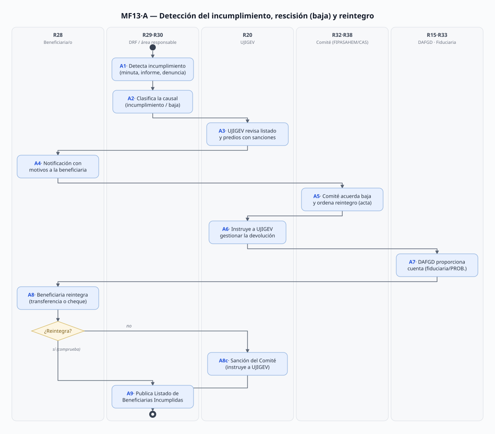
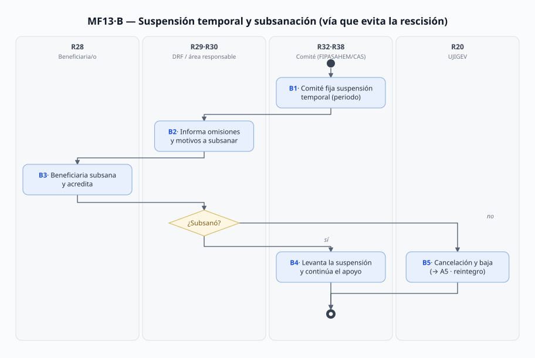
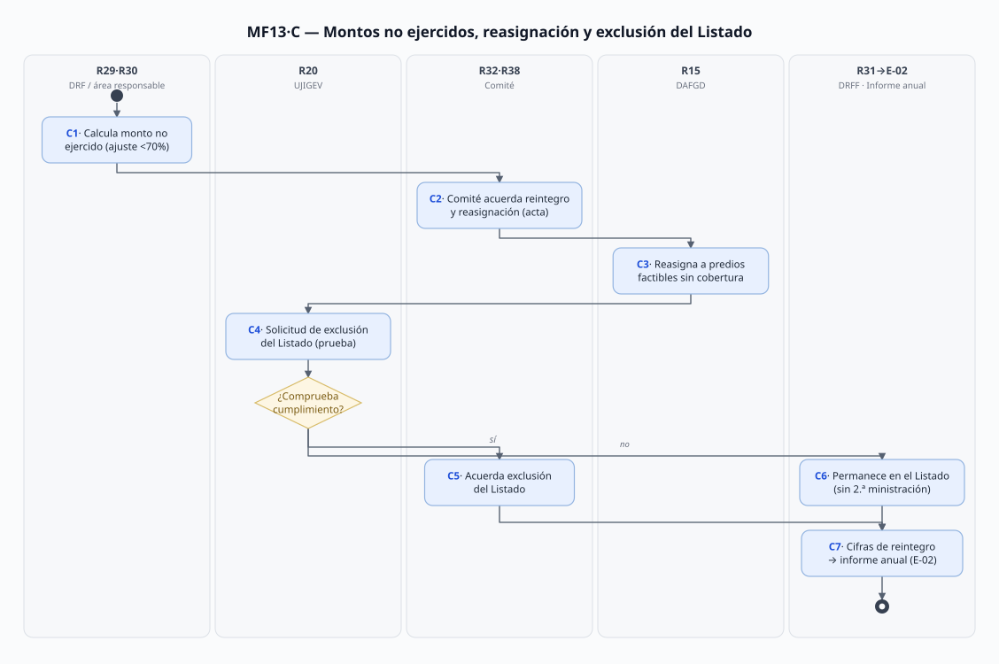

# MF-13 · Rescisión y reintegro de recursos (cierre de la fiscalización de los apoyos)

> Proceso MF-13 (README 2026-09-22: "rescisión y reintegro de recursos"; en el README de Valeria figuraba como "MF-08"). Cierra la cadena del dinero del profesor: **PA-01→E-02→E-04** y **MF-13** ("¿cómo se cobra un apoyo mal aplicado?").
> Fecha de análisis: 2026-09-23. Método: plantilla de 12 secciones; verificado contra RO PSAH pp. 16–18, RO Capturando Carbono pp. 15–17, homólogos de RHF/PS/MFS y `Reg_LGDFS.pdf`.
> Citación externa de pasos: **MF13·A5**, **MF13·B3**, **MF13·C2** (proceso·paso).

## 1. Objeto y alcance

**Incluye** lo que pasa cuando una persona beneficiaria de los programas de apoyo incumple: detección y clasificación de la causal, suspensión temporal con oportunidad de subsanar, **baja/rescisión del apoyo**, **reintegro del dinero** (o del valor de la planta) a la cuenta que corresponda, reasignación de montos no ejercidos, y el **Listado de Personas Beneficiarias Incumplidas** con su vía de exclusión. Aplica a los 6 programas (el mecanismo es homólogo: RO-PSAH §§8.1.8–8.1.9 y RO-CC §§8.1.8–8.1.9 con redacción casi idéntica).

**Fuera del alcance:** el procedimiento sancionador forestal ante la Procuraduría/autoridad ambiental por infracciones a la normatividad forestal (solo se cruza cuando alimenta la causal o la inelegibilidad — [LGDFS]); el cobro jurisdiccional (juicio) del adeudo — solo se registra el resultado; la ministración y verificación del ciclo normal (PA-01·B–C); las cifras de la Cuenta Pública (T-03/E-04 las consumen de aquí).

## 2. Base documental (claves de cita)

| Clave | Archivo / ubicación | Qué aporta (anclas en pág. PDF, verificadas 2026-09-23) |
|---|---|---|
| [RO-PSAH] | `Docs/Comun/Programas de apoyo/RO_2026_PagoServiciosAmbientales_Hidrológicos.pdf` | **§8.1.8 causas de incumplimiento** (I–X) **pp. 16–17**; **§8.1.9.1 suspensión temporal**, **§8.1.9.2 Baja del Programa** (I–XVIII) **p. 17**; **§8.1.9.3 Reintegro** (I–VII) **p. 17** — "previo acuerdo del Comité y notificación a la UJIGEV… devolución a la cuenta bancaria de la **FIDUCIARIA**"; obligación XIV "Reintegrar los recursos… no aplicados" **p. 16**; inelegibles (adeudos, listados de sancionados PROBOSQUE/CONAFOR, predios sancionados sin reintegro previo) **pp. 9–10**; glosario "Listado de personas Beneficiarias Incumplidas" **p. 5**; 10.1·XV UJIGEV gestiona la devolución **p. 20** |
| [RO-CC] | `Docs/Comun/Programas de apoyo/RO_2026_CapturandoCarbono.pdf` | **§8.1.8.1 Incumplimiento** (I–VIII) **p. 15**; **§8.1.9 a) suspensión, b) Baja** (I–XIV), **c) Reintegro** (I–V) **p. 15** — "reintegro… a la cuenta bancaria de **PROBOSQUE**… proporcionada por la DAFGD… caso contrario se procederá a sancionar conforme indique el Comité y notificación a la UJIGEV"; facultad V del Comité: "exigir la devolución de los recursos… por conducto de la UJIGEV" **p. 17**; comité CAS **pp. 16** (9.3–9.4) |
| [RO-RHF] | `RO_2026_Restauración_Hidrológico-Forestal.pdf` | Baja por verificación: "la superficie no trabajada será cancelada, misma que no podrá ser menor al pago de la primera ministración" **p. 14** (8.1.9.2·15); **reintegro del valor de la planta no establecida** "conforme al listado de precio de venta oficial autorizado por la Secretaría de Finanzas" **p. 15** |
| [RO-PS] | `RO_2026_PlantacionesSustentables.pdf` | Ídem: planta asignada no establecida → **reintegro del monto** al precio de venta oficial de la Secretaría de Finanzas o costo de producción **p. 16** |
| [RO-MFS] | `RO_2026_ManejoForestalSustentable.pdf` | Causas de incumplimiento **p. 22**; cancelación con previa oportunidad de **subsanar** e inclusión en el Listado **p. 23** |
| [RIC] | `Docs/Comun/Programas de apoyo/FIPASAHEM/REGLAMENTO_Interno_Comite_Tecnico_FIPASAHEM.pdf` | Facultades del Comité Técnico: "acordar el reintegro de los cheques de apoyos autorizados no reclamados o de recursos no ejercidos… si es procedente dejar a salvo los derechos" **p. 8** |
| [LGDFS] | `Docs/Comun/Masa forestal/Reg_LGDFS.pdf` (Reglamento de la LGDFS, 88 pp.) | **Art. 36** (pdf p. 16): la Secretaría puede "suspender, revocar, extinguir o declarar la caducidad" de autorizaciones (procedimientos arts. 78–79); **art. 25** (p. 14): anotación de suspensión/revocación/extinción en el Registro Forestal; **art. 18** (p. 13): la Procuraduría notifica clausuras/suspensiones (anotación en 5 días); padrón: predios con **sanción firme** en los 5 años previos **p. 27** |
| [CPUB] | `Docs/Comun/Finanzas y adquisiciones/FINANZAS_CuentaPublica_2024.pdf` | Candidata a contener las cifras históricas de reintegro ("¿cuánto dinero regresó?") — **no auditada en este análisis** → **V-04** |
| [LPA] | **Ley de Procedimiento Administrativo del Estado de México** — ⚠️ **no está en el repo** (el README la cita como fuente) | Plazos de notificación y recursos contra la resolución de rescisión → **V-01** |

> Convención: `pdf p.` = página del PDF. REPARTO ubicaba las cláusulas de PSAH "pp. 21–23" y de CC "pp. 11–13" (numeración del pie de Gaceta); en páginas PDF reales son **PSAH 16–18** y **CC 15–16** (mismo Tomo CCXXI No. 15) — verificado hoy.

## 3. Glosario de siglas

| Sigla | Significado |
|---|---|
| CAS | Comité de Admisión y Seguimiento (Instancia Normativa de RHF, CC, PS, MFS) |
| DAFGD | Dirección de Administración, Finanzas y de Gestión Documental (proporciona la cuenta de reintegro) |
| FIPASAHEM | Fideicomiso F/663 — su Comité Técnico es la Instancia Normativa del PSAHEM; su cuenta fiduciaria recibe los reintegros de PSAH |
| Listado | **Listado de Personas Beneficiarias Incumplidas**: documento publicado por la instancia responsable con las personas sancionadas por incumplimiento del contrato [RO-PSAH glosario p. 5] |
| Reintegro | Devolución de los montos de las ministraciones otorgadas (o del valor de la planta) por incumplimiento, baja o desistimiento |
| Subsanación | Corrección de omisiones/motivos durante la suspensión temporal, que evita la cancelación |

## 4. Roles (personificados)

Se reutilizan IDs ya definidos (PA-01, E-02): donde el rol es deliberativo se conserva como cuerpo decisor **「posible fuera de alcance del SGD」** — el SGD gestiona lo que **entra** (informes, listados) y lo que **sale** (acta, acuerdo, notificación).

| ID | Rol | Puesto y titular (fuente) | Tipo |
|---|---|---|---|
| R28 | Persona beneficiaria que incumple (o su 2ª persona/sucesor; núcleo agrario vía Comisariado) | — (ciudadanía) | Externo |
| R29 | DRF: detecta en campo (verificación/visita de seguimiento), notifica, recibe comprobantes | 9 titulares 2026 en [DIR]; Coord. **Tania Rivera Martínez** | Interno desconcentrado |
| R30 | Área responsable del programa (SSA/MIF en PSAH/CC; SRyPP/SAPCyAT según programa → E-02·V-09): clasifica la causal, elabora el listado de incumplidos, calcula montos | PSAH/CC: **Rigoberto León Contreras** ([DIR] l.98–101) | Interno |
| R31 | DRFF — Instancia Ejecutora: consolida cifras de reintegro para el informe anual (→ E-02) | **Emmanuel Mondragón Romero** ([DIR] l.81) | Interno |
| R20 | UJIGEV: revisa el listado y predios con procedimientos/sanciones; **gestiona la devolución** por instrucción del Comité; notificaciones | **María Elena Juárez de Jesús** ([DIR] l.17–21) | Interno |
| R15 | DAFGD: **proporciona la cuenta de reintegro** (fiduciaria o PROBOSQUE) y registra la devolución | **Irán Terán Cordero** ([DIR] l.111/117) | Interno |
| R32 | Comité Técnico FIPASAHEM (PSAHEM) — acuerda baja, reintegro, reasignación, exclusión del Listado | Presidencia: titular de la Secretaría del Campo ⚠️ (V-03 PA-01); Sec. Técnica: titular de DAFGD [RIC art. 7] | Colegiado 「fuera de alcance」 |
| R38 | Comité de Admisión y Seguimiento del programa (RHF, CC, PS, MFS) — mismas facultades sobre su programa | Sec. Técnica = titular de PROBOSQUE (DG **Alejandro Santiago Sánchez Vélez**) [RCE art. 5] | Colegiado 「fuera de alcance」 |
| R33 | Fiduciaria del F/663 — recibe los reintegros del PSAHEM y reexpide cheques | ⚠️ identidad desconocida (PA-01·V-01) | Externo 「fuera de alcance」 |
| R13 | OIC: recibe denuncias que disparan la detección; audita la pista del dinero | **Jesús Alejandro Rentería Núñez** ([DIR] l.42) | Interno |
| (externos) | OSFEM, Secretaría de la Contraloría, autoridad ambiental (Procuraduría), juzgados/agraria: fiscalizan o sancionan fuera del SGD | — | Externo destino |

## 5. Funciones y actividades por rol

| Rol | Función en MF-13 | Pasos |
|---|---|---|
| R29·R30 | Detectar el incumplimiento con evidencia (verificación, minuta, informe), clasificar la causal, informar motivos, calcular montos no ejercidos | A1, A2, A4, B2, C1 |
| R20 | Revisar listado de incumplidos y predios con procedimientos/sanciones; gestionar la devolución; instruir sanción si no reintegra; resolver exclusiones | A3, A6, A8c, C4 |
| R32/R38 | Acordar suspensión, baja y reintegro (acta); ordenar la reasignación; acordar la exclusión del Listado | A5, B1, B4/B5, C2, C5 |
| R28 | Recibir la notificación, subsanar, desistir por escrito, **reintegrar** y comprobar; solicitar exclusión del Listado | A4, A8, B3, C4 |
| R15 | Proporcionar la cuenta de reintegro (fiduciaria o PROBOSQUE) y registrar la devolución | A7, A8 |
| R31 | Consolidar cifras de reintegro/reasignación para el informe anual (E-02) | C7 |
| R13 | Recibir denuncias que disparan A1; auditar la pista del reintegro | A1, C7 |

## 6. Reglas de negocio

- **BR-1** **Suspensión temporal** primero: por incumplimiento a las condiciones de elegibilidad, el Comité puede suspender el apoyo "durante el periodo que determine" para que se **subsanen** las omisiones; si no se subsanan → cancelación, baja e inclusión en el Listado [RO-PSAH §8.1.9.1 p. 17; RO-CC §8.1.9.a p. 15].
- **BR-2** Causas de incumplimiento (no realizar actividades, información falsa, no seguir la asesoría, ocultar litigios, destinar el apoyo a otros fines, no cumplir el contrato) [RO-PSAH §8.1.8 pp. 16–17; RO-CC §8.1.8.1 p. 15] y causales de **baja** (18 fracciones en PSAH: alteración de cobertura >10% por cambio de uso, litigio, cheque caducado, desistimiento, fallecimiento sin notificar en 30 días hábiles, negligencia ante incendios, doble programa con el mismo propósito…) [RO-PSAH §8.1.9.2 p. 17; RO-CC §8.1.9.b p. 15].
- **BR-3** El **reintegro** de los montos ministrados es obligación de la persona beneficiaria **previo acuerdo del Comité y notificación a UJIGEV**; la notificación de la situación se hace "por cualquier medio" [RO-PSAH §8.1.9.3 p. 17].
- **BR-4** **Destino del dinero (diferencia clave por programa):** en PSAHEM la devolución va a la **cuenta de la FIDUCIARIA** (F/663) [RO-PSAH §8.1.9.3 p. 17]; en Capturando Carbono va a la **cuenta bancaria de PROBOSQUE** [RO-CC §8.1.9.c p. 15]. En ambos casos **la cuenta la proporciona la DAFGD** y, si no se reintegra, se sanciona conforme indique el Comité con notificación a UJIGEV.
- **BR-5** Montos no ejercidos (ajustes menores al 70%, cancelaciones y desistimientos): reintegro **inmediato** y **reasignación** a otros predios factibles del ejercicio sin cobertura presupuestal, previo acuerdo del Comité [RO-PSAH §8.1.9.3·IV p. 17; RO-CC p. 15]. El Comité también acuerda el reintegro de **cheques no reclamados** y recursos no ejercidos, definiendo si se dejan a salvo derechos [RIC p. 8].
- **BR-6** **Exclusión del Listado** de Incumplidas: la persona puede solicitarla comprobando cumplimiento de obligaciones "equivalente a los recursos económicos que le fueron ministrados"; **en ningún caso** se le paga la ministración pendiente [RO-PSAH §8.1.9.3·VI p. 17; RO-CC §8.1.9.b·XIII p. 15].
- **BR-7** La **UJIGEV** revisa el listado de incumplidos y los predios con procedimientos o sanciones administrativas, y es quien **gestiona la devolución** por acuerdo e instrucción del Comité [RO-PSAH 10.1·XV p. 20; RO-CC p. 17].
- **BR-8** **Inelegibilidad retroalimentada por MF-13:** adeudos o incumplimientos previos con PROBOSQUE, estar en los listados de sancionados de PROBOSQUE y CONAFOR, y predios sancionados por infracciones forestales "siempre y cuando no se haga el reintegro… previo a la aprobación de la Instancia Normativa" [RO-PSAH pp. 9–10; RO-CC p. 8].
- **BR-9** Reintegro **en especie/valor** (programas con planta): si la verificación encuentra que la planta no se estableció, se reintegra su monto conforme al **listado de precio de venta oficial autorizado por la Secretaría de Finanzas** (o costo de producción) [RO-RHF p. 15; RO-PS p. 16]; en RHF, la superficie no trabajada se cancela "no menor al pago de la primera ministración" [RO-RHF p. 14].
- **BR-10** Normatividad forestal conexa: la autoridad puede clausurar/suspender/revocar autorizaciones forestales (LGDFS arts. 68–69; Reg. art. 36 → procedimientos 78–79); las suspensiones se **anotan en el Registro Forestal** en 5 días (arts. 18 y 25) y los predios con **sanción firme** de los 5 años previos salen del padrón (art. 27) [LGDFS]. Esos actos externos disparan o refuerzan la causal de este proceso.
- **BR-11** La resolución de admisión es "fallo inapelable" [CONV QUINTA·III]; los RO **no prevén recurso** contra la resolución de rescisión/reintegro — el vacío de procedimiento administrativo estatal queda en **V-01**.

## 7. Procedimiento

### Proceso A — Detección, rescisión (baja) y reintegro

- **A1** Detección del incumplimiento: verificación de cierre (minuta/informe — PA-01·C3–C4), visita de seguimiento, denuncia turnada al OIC, o acto de autoridad (conflicto, sanción forestal) [RO-PSAH §§8.1.8, 10.1·XI].
- **A2** R29/R30 registran y **clasifican la causal** (incumplimiento §8.1.8 o causal de baja §8.1.9.2) con la evidencia adjunta [RO-PSAH pp. 16–17; RO-CC p. 15].
- **A3** R20 (UJIGEV) revisa el **listado de incumplidos** y los predios con procedimientos o sanciones administrativas [RO-PSAH 10.1·XV p. 20].
- **A4** Notificación a R28 con los **motivos** (por cualquier medio); si hay desistimiento: **escrito firmado** (y sellado por el Comisariado en núcleos agrarios); si fallecimiento del titular: 30 días hábiles para que la 2ª persona manifieste interés [RO-PSAH §8.1.9.2·X–XII p. 17; RO-CC §8.1.9.b·VII–IX p. 15].
- **A5** **R32/R38 acuerdan en sesión** la baja/cancelación del apoyo y ordenan el reintegro; el acuerdo se asienta en **acta** [RO-PSAH §8.1.9.3 p. 17; RIC p. 8].
- **A6** El acuerdo se notifica a **R20**, quien queda instruido para **gestionar la devolución** [RO-PSAH 10.1·XV p. 20; RO-CC p. 17].
- **A7** R15 (DAFGD) **proporciona la cuenta de reintegro** — fiduciaria en PSAHEM, cuenta de PROBOSQUE en los demás (BR-4) — y se notifica a R28 [RO-PSAH §8.1.9.3 p. 17; RO-CC §8.1.9.c p. 15].
- **A8** R28 **reintegra** los montos (transferencia o cheque) y entrega el comprobante; si no reintegra → **A8c** sanción conforme indique el Comité con notificación a UJIGEV [RO-CC §8.1.9.c p. 15].
- **A9** Publicación del **Listado de Personas Beneficiarias Incumplidas** por la instancia responsable → alimenta la inelegibilidad de futuras convocatorias (BR-8) [RO-PSAH glosario p. 5 y §8.1.1.3].

### Proceso B — Suspensión temporal y subsanación (vía que evita la rescisión)

- **B1** El R32/R38 acuerda la **suspensión temporal** del apoyo y fija el periodo [RO-PSAH §8.1.9.1 p. 17].
- **B2** R29/R30 **informan las omisiones o motivos** a subsanar [ídem].
- **B3** R28 **subsaná** y acredita la corrección ante la DRF/área responsable.
- **B4** Si subsana: el Comité **levanta la suspensión** y el apoyo continúa.
- **B5** Si no subsana: **cancelación y baja** del programa e inclusión en el Listado → continúa en **A5** (reintegro si hay ministraciones) [RO-PSAH §8.1.9.1 p. 17; RO-MFS p. 23].

### Proceso C — Montos no ejercidos, reasignación y exclusión del Listado

- **C1** R29/R30 calculan el **monto no ejercido** (ajustes menores al 70%, cancelaciones, desistimientos, cheques caducados/no reclamados) [RO-PSAH §8.1.9.3·IV p. 17; RIC p. 8].
- **C2** R32/R38 acuerdan el **reintegro inmediato** y la **reasignación** de esos montos [ídem].
- **C3** R15 ejecuta la **reasignación a predios factibles** del ejercicio que quedaron sin cobertura presupuestal (→ PA-01·C7 reasignados) [RO-PSAH §8.1.9.3·IV p. 17].
- **C4** R28 (del Listado) puede **solicitar su exclusión** acreditando cumplimiento equivalente a lo ministrado (nunca pidiendo la ministración pendiente) [RO-PSAH §8.1.9.3·VI p. 17].
- **C5** R32/R38 **acuerdan la exclusión** del Listado (o la permanencia) [ídem].
- **C6** Sin prueba de cumplimiento: la persona **permanece en el Listado** y sin segunda ministración [RO-CC §8.1.9.b·XIII p. 15].
- **C7** R31 consolida las **cifras de reintegro y reasignación** del ejercicio → informe anual de ejecución (**E-02·A2**) y estadística institucional (**E-04**); la pista queda para OSFEM/Contraloría/OIC y las auditorías ISO (→ **T-03**) [RO-PSAH §16.1 y §17 pp. 20–21].

## 8. Diagramas de actividad

Generados por `Docs/Joni/Diagramas/MF13/gen-diagramas.mjs` (editar el script, no los `.svg`).

## 9. Tabla de necesidades

| ID | Rol | Necesidad | P | Paso | Origen |
|---|---|---|---|---|---|
| N-01 | R29·R30 | **Documentar el incumplimiento con evidencia** (minuta, informe, verificación, denuncia) y adjuntarla al expediente | A | A1–A2 | [RO-PSAH] pp. 16–17 §8.1.8 (cada causal exige un hecho comprobable) |
| N-02 | R20 | Revisar **listado de incumplidos y predios con procedimientos/sanciones** antes de proponer la baja | A | A3 | [RO-PSAH] p. 20 §10.1·XV (verbatim) |
| N-03 | R28 | Recibir **notificación con motivos** y saber cómo subsanar, desistir o acreditar al sucesor | A | A4, B2–B3 | [RO-PSAH] p. 17 §8.1.9.2·X–XII ("por cualquier medio"; desistimiento por escrito; 30 días hábiles) |
| N-04 | Sec. Técnica (R19) / R32·R38 | Someter a sesión el **acuerdo de baja y reintegro** y asentarlo en acta | A | A5 | [RO-PSAH] p. 17 §8.1.9.3 ("previo acuerdo del Comité"); [RIC] p. 8 |
| N-05 | R20 | **Gestionar la devolución** con acuerdo e instrucción del Comité (sin instrucción, no hay cobro) | A | A6–A8c | [RO-PSAH] p. 20 §10.1·XV; [RO-CC] p. 17 f. V |
| N-06 | R15 | Proporcionar **la cuenta correcta** (fiduciaria en PSAHEM / PROBOSQUE en los demás) y registrar la devolución | A | A7–A8 | [RO-PSAH] p. 17 §8.1.9.3 vs [RO-CC] p. 15 §8.1.9.c — discrepancia verificada (BR-4) |
| N-07 | R28 | **Comprobar el reintegro** (recibo/transferencia) y poder **salir del Listado** con prueba de cumplimiento | A | A8, C4 | [RO-PSAH] p. 17 §8.1.9.3·VI |
| N-08 | R31·R15 | **Reasignar montos no ejercidos** a predios factibles sin cobertura, del mismo ejercicio | M | C1–C3 | [RO-PSAH] p. 17 §8.1.9.3·IV |
| N-09 | R13 / OSFEM | **Pista de auditoría del dinero**: ministración → reintegro → reasignación, con fechas y montos ("¿cuánto regresó?") | A | C7 | [RO-PSAH] p. 21 §17 (OSFEM/Contraloría/OIC + auditorías ISO); pregunta del profesor 2026-09-22 |
| N-10 | R31 → E-02 | Cifras de **reintegro y reasignación del ejercicio** listas para el informe anual sin recompilar | A | C7 | [RO-PSAH] p. 20 §16.1 → E-02·A2 |

## 10. Registros que el SGD debe gestionar (catálogo documental)

| Registro | Identificador | Fuente |
|---|---|---|
| Expediente de incumplimiento | folio de expediente (PA-01) + causal (§8.1.8/§8.1.9.2) + evidencia | [RO-PSAH] pp. 16–17 |
| Notificación de suspensión / de baja con motivos | expediente + fecha + medio de notificación | [RO-PSAH] §8.1.9.1–2 |
| Escrito de desistimiento (firmado/sellado) | expediente + fecha | [RO-PSAH] §8.1.9.2·X |
| Acta del Comité con acuerdo de baja, reintegro, reasignación o exclusión | clave tipo CAS-…/PBE-… + fecha de sesión | [RO-PSAH] §8.1.9.3; [RIC] p. 8 |
| Comprobante de reintegro (transferencia/cheque) | expediente + monto + fecha + cuenta destino (fiduciaria/PROBOSQUE) | [RO-PSAH] p. 17; [RO-CC] p. 15 |
| Listado de Personas Beneficiarias Incumplidas (versiones) | fecha de publicación + ejercicio | glosario [RO-PSAH] p. 5 |
| Acuerdo y comprobante de reasignación a predio factible | predio receptor + expediente origen | [RO-PSAH] §8.1.9.3·IV |
| Solicitud y resolución de exclusión del Listado | expediente + prueba de cumplimiento | [RO-PSAH] §8.1.9.3·VI |
| Cifras de reintegro/reasignación del ejercicio | ejercicio + programa (→ E-02 §10) | [RO-PSAH] §16.1 |

## 11. Vacíos y siguientes pasos

### 11.1 Tabla de vacíos

| ID | Qué falta en el mundo real | Evidencia de que es vacío | Cómo se cierra | Afecta |
|---|---|---|---|---|
| **V-01** | La **Ley de Procedimiento Administrativo del EdoMéx** (citada por el README como fuente de este proceso) y, con ella, los **plazos y recursos** contra la resolución de rescisión/reintegro: ¿procede revisión o apelación? Los RO solo dicen "fallo inapelable" para la admisión | No hay PDF de la LPA en `Docs/Comun/` (búsqueda 2026-09-23); [RO-PSAH] §8.1.9 sin mención de recursos | Capturar la LPA de legislacion.edomex.gob.mx + entrevista UJIGEV (¿qué recurso se notifica?) | A5, A8 · N-03, N-04 |
| **V-02** | **Plazos concretos del reintegro** ("una vez notificada…", sin días) y del periodo de suspensión ("el que determine el Comité"): sin fechas, el cobro es indeterminado | [RO-PSAH] §8.1.9.1 y §8.1.9.3 p. 17; [RO-CC] §8.1.9.a/c p. 15 | Entrevista DAFGD/UJIGEV (práctica real: ¿30 días? ¿cobranza?) | A7–A8, B1 · N-06 |
| **V-03** | **Formatos del proceso** (todos ausentes): escrito de desistimiento, notificación de suspensión/baja, acta de acuerdo de reintegro, comprobante de reintegro, solicitud de exclusión del Listado | Nombrados en [RO-PSAH]/[RO-CC] sin formato; `Docs/Comun/Programas de apoyo/` solo tiene 501A/501B/502 | Inventario **X-03·V-01**; pedir a SSA/MIF y UJIGEV | A4–A8, C4 · N-03, N-07 |
| **V-04** | **Cifras históricas de reintegro** ("¿cuánto dinero regresó?" — pregunta del profesor): montos ministrados vs. reintegrados vs. reasignados por ejercicio | Ningún registro de montos de reintegro en las fuentes; candidata: `Docs/Comun/Finanzas y adquisiciones/FINANZAS_CuentaPublica_2024.pdf` (no auditada) | Auditar la Cuenta Pública 2024 y la de 2025/2026 con **T-03** (Octavio); DAFGD puede tener el auxiliar de la cuenta fiduciaria | C7 · N-09 (E-02, E-04) |
| **V-05** | **Destino del reintegro en RHF/PS/MFS**: solo PSAHEM nombra la cuenta de la fiduciaria y solo CC nombra la cuenta de PROBOSQUE; los otros tres RO no especifican la cuenta | comparación textual [RO-PSAH] p. 17 vs [RO-CC] p. 15; [RO-RHF]/[RO-PS]/[RO-MFS] sin cuenta | Entrevista DAFGD (Irán Terán) — confirmar si hay flujos fiduciarios fuera de PSAH | A7 · N-06 |

### 11.2 Cerrados durante este análisis (2026-09-23)

- Ubicación real de las cláusulas (REPARTO decía PSAH "pp. 21–23" y CC "pp. 11–13" por el pie de Gaceta; en PDF son PSAH 16–18 y CC 15–16) — verificado leyendo ambas secciones completas (§8.1.8, 8.1.9.1–3 en PSAH; 8.1.8.1, 8.1.9.a–c en CC).
- **Discrepancia de cuenta de reintegro** (fiduciaria vs. PROBOSQUE) verificada textualmente en los dos RO → BR-4 y V-05.
- Confirmación de que el mecanismo es homólogo en los 5 RO del inventario (RHF y PS con el añadido del reintegro del valor de la planta; MFS con la subsanación previa) → BR-9.
- Anclaje normativo forestal del Reg_LGDFS (arts. 18, 25, 36 y padrón de sanciones firmes) para los casos en que la autoridad dispara la causal.
- **Captura del Listado de Beneficiarios Incumplidas real** (actualización 8-jul-2026) → `Docs/Comun/Programas de apoyo/Listado_Beneficiarios_Incumplidos_2026-07-08.pdf` (buscado y descargado del sitio 2026-09-23): evidencia viva del producto de **A9** y primer ejemplo del registro de §10.

### 11.3 Tareas nuestras (no vacíos)

- T-1: capturar la LPA del EdoMéx (cierra V-01).
- T-2: con **T-03** (Octavio), auditar `FINANZAS_CuentaPublica_2024.pdf` y la cuenta fiduciaria en busca de cifras de reintegro (V-04) — es la respuesta a "¿cuánto dinero regresó?".
- T-3: cruzar con **MF-07** (inspección/fiscalización, Valeria): la detección de A1 nace ahí; y con **MF-13→E-03/E-04** para las cifras de cierre.
- T-4: cuando existan formatos (X-03), enlazarlos en el §12 de este documento.

## 12. Insumos y productos por paso

> Retro-ajuste integrado desde el inicio (énfasis 1). Rutas reales en `Docs/Comun/` o `[clave]` + página del §2; sistemas externos con su campo. Huecos → `V-##`.

| Paso | Documento / dato de entrada | Datos que se capturan / procesan | Documento de salida |
|---|---|---|---|
| **A1** — detección del incumplimiento | Minuta de verificación e informe final (PA-01·C3–C4 → **X-03·V-01**); visita de seguimiento de la DRF; denuncia turnada al OIC (canal [RO-PSAH] §18); acto de autoridad (p. ej. sanción anotada en el Registro Forestal, [LGDFS] arts. 18/25) | Hecho observado, fecha, predio, expediente, fuente de la detección | **Registro de detección** en el expediente de incumplimiento (sin formato → **V-03**) |
| **A2** — clasificación de la causal | Detección de A1 + catálogo de causales [RO-PSAH] §§8.1.8 y 8.1.9.2 pp. 16–17; [RO-CC] §§8.1.8.1 y 8.1.9.b p. 15 | Causal aplicable (incumplimiento / baja), evidencia adjunta, montos ministrados hasta la fecha | **Propuesta de baja/cancelación** por expediente (sin formato → **V-03**) |
| **A3** — revisión jurídica | Propuesta de A2; **listado de incumplidos** y predios con procedimientos/sanciones [RO-PSAH] p. 20 §10.1·XV | Confirmación de antecedentes, litigios y sanciones; observaciones | **Revisión de UJIGEV** con visto bueno o correcciones (sin formato → **V-03**) |
| **A4** — notificación a la beneficiaria | Revisión de A3; datos de contacto del expediente (FO-PB-502) | Motivos de la baja; medios de notificación (llamada/correo/visita); en desistimiento: escrito firmado/sellado; en fallecimiento: aviso de la 2ª persona (30 días hábiles) | **Notificación con motivos** a R28 (sin formato → **V-03**) + **escrito de desistimiento** si aplica (→ **V-03**) |
| **A5** — acuerdo del Comité | Expediente completo (A1–A4) + dictamen de UJIGEV; convocatoria a sesión ([RIC] arts. 25–26 / [RCE] art. 19) | Acuerdo: baja/cancelación, monto a reintegrar, orden de gestión de la devolución | **Acta de sesión** del Comité Técnico FIPASAHEM o del CAS con el acuerdo (no publicadas → E-02·V-02; plantilla → **V-03**) |
| **A6** — instrucción de gestión | Acta de A5 [RO-PSAH] p. 20 §10.1·XV | Instrucción formal a UJIGEV; folio del acuerdo | **Oficio/instrucción de gestión de la devolución** (sin formato → **V-03**) |
| **A7** — cuenta de reintegro | Instrucción de A6; política de cuentas de la **DAFGD** (campo: cuenta destino y CLABE) | Cuenta destino: **fiduciaria F/663** (PSAHEM) o **PROBOSQUE** (demás) — BR-4 | **Notificación de la cuenta de reintegro** a R28 (sin formato → **V-03**; identidad de la fiduciaria → PA-01·V-01) |
| **A8** — reintegro | Notificación de A7; monto determinado en A5 | Importe, fecha y medio del pago (transferencia/cheque); conciliación con el monto ministrado | **Comprobante de reintegro** (recibo/transferencia) → registro contable en DAFGD (sin formato → **V-03**; plazo → **V-02**) |
| **A8c** — sanción por no reintegrar | Constancia de no pago; [RO-CC] §8.1.9.c ("sancionar conforme indique el Comité y notificación a la UJIGEV") | Determinación de la sanción adicional por el Comité | **Acuerdo de sanción** (acta) + notificación a UJIGEV (→ **V-03**) |
| **A9** — Listado de Incumplidas | Acuerdos de A5/A8c; formato del Listado (glosario [RO-PSAH] p. 5) | Nombre/expediente de la persona sancionada, causal, ejercicio | **Listado de Personas Beneficiarias Incumplidas** publicado por la instancia responsable (sin plantilla → **V-03**) → alimenta inelegibilidad (BR-8) |
| **B1** — suspensión temporal | Detección de A1 + condiciones de elegibilidad [RO-PSAH] §8.1.9.1 p. 17 | Periodo de suspensión que fija el Comité (**sin plazo mínimo/máximo → V-02**) | **Acuerdo de suspensión temporal** (acta del Comité) |
| **B2** — información de motivos | Acuerdo de B1 | Omisiones/motivos concretos a subsanar | **Notificación de omisiones** a R28 (sin formato → **V-03**) |
| **B3** — subsanación | Notificación de B2; pruebas de corrección | Resultado de la subsanación | **Acreditación de subsanación** ante DRF/área (sin formato → **V-03**) |
| **B4** — levantamiento | Acreditación de B3 | Constancia de cumplimiento | **Acuerdo de levantamiento de la suspensión** (acta) → el apoyo continúa (fin) |
| **B5** — cancelación por no subsanar | Falta de subsanación dentro del periodo | Determinación de cancelación | **Acuerdo de cancelación y baja** (acta) → continúa en **A5–A9** |
| **C1** — monto no ejercido | Control de ministraciones (PA-01·C5); casos: ajuste <70%, cancelación, desistimiento, cheque caducado [RO-PSAH] §8.1.9.3·IV p. 17; [RIC] p. 8 | Cálculo del monto no ejercido por expediente | **Cálculo de montos no ejercidos** (sin formato → **V-03**) |
| **C2** — acuerdo de reintegro y reasignación | Cálculo de C1 | Monto a reintegrar "de manera inmediata" y predios candidatos a reasignación | **Acta del Comité** con reintegro y reasignación |
| **C3** — reasignación | Acuerdo de C2; listado de solicitudes **factibles sin cobertura presupuestal** del ejercicio (PA-01·A9) | Predio receptor, monto reasignado | **Acuerdo/comprobante de reasignación** al predio factible (→ PA-01·B3 como reasignado) |
| **C4** — solicitud de exclusión del Listado | Prueba de cumplimiento equivalente a lo ministrado [RO-PSAH] §8.1.9.3·VI p. 17 | Evidencias del cumplimiento (visita/evaluación documental) | **Solicitud de exclusión** de R28 (sin formato → **V-03**) |
| **C5** — acuerdo de exclusión | Solicitud de C4 + verificación | Resolución: excluida / permanece | **Acta del Comité** con la exclusión (o su negativa) |
| **C6** — permanencia en el Listado | Negativa de C5 | Estado: sigue en Listado; sin ministración pendiente | **Listado** vigente sin cambios (BR-6) |
| **C7** — cierre de la cadena del dinero | Comprobantes de reintegro (A8) y reasignaciones (C3) del ejercicio | Cifras: ministrado / reintegrado / reasignado por programa y ejercicio (**sin registros históricos → V-04**) | **Cifras de reintegro y reasignación** → informe anual (**E-02·A2**) y E-04; pista para OSFEM/Contraloría/OIC y T-03 |
