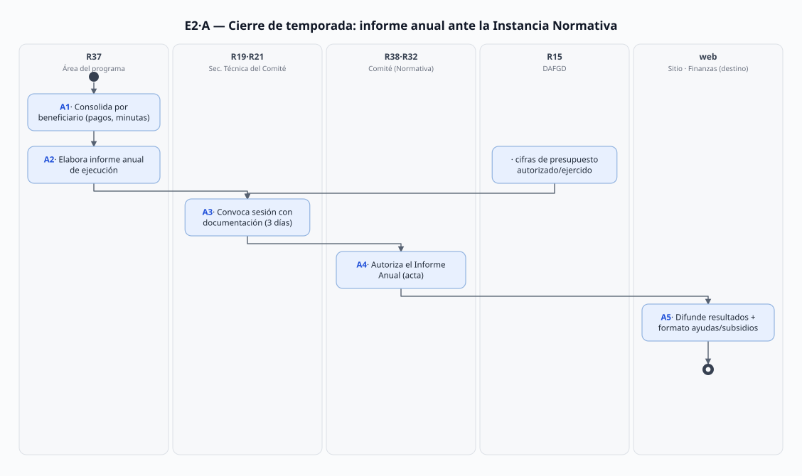
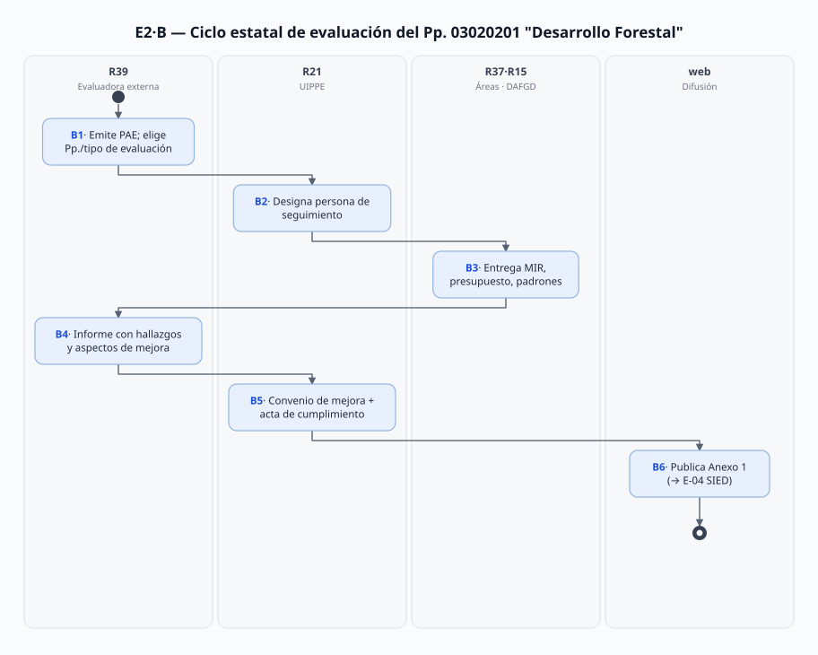

# E-02 · Estadística y evaluación de temporada de los programas de apoyo

> Proceso estadístico E-02 (cadena de la estadística: PA-01..PA-06 → **E-02** → E-04).
> Fecha de análisis: 2026-09-21 (sustento verificado 2026-09-19; fuentes ampliadas hoy). Método: 8 pasos (fuentes → mapa → roles → flujo → diagramas → necesidades → doble check → vacíos).
> Citación externa de pasos: **E2·A3**, **E2·B4** (proceso·paso).

## 1. Objeto y alcance

**Incluye** los dos circuitos que cierran la temporada de los programas de apoyo:
- **Proceso A** — el **informe anual de ejecución** que cada programa debe rendir al cierre del ejercicio fiscal ante su Instancia Normativa (Comité de Admisión y Seguimiento, o Comité Técnico FIPASAHEM en PSAHEM), y su aprobación en sesión con acta;
- **Proceso B** — el **ciclo estatal de evaluación** del Programa Presupuestario 03020201 "Desarrollo Forestal" (los 6 apoyos viven en su proyecto "Servicios ambientales de los ecosistemas forestales"): Programa Anual de Evaluación (PAE), evaluación externa (diseño/consistencia/desempeño), convenio de mejora y difusión de resultados.

**Fuera del alcance:** la ejecución del programa mismo (PA-01..PA-06 — este proceso **consume** sus registros: contratos, pagos, minutas, incumplidos); la estadística institucional que consolida todo (E-04, UIPPE → SIED/Finanzas/Consejo); la estadística de aprovechamientos forestales (E-03, mismo Pp. pero proyecto distinto); el Guardabosques (fuera de inventario).

## 2. Base documental (claves de cita)

| Clave | Archivo / ubicación | Qué aporta (anclas en pág. PDF) |
|---|---|---|
| [RO-PSAH] | `Programas de apoyo/RO_2026_PagoServiciosAmbientales_Hidrológicos.pdf` | §15 seguimiento y **informe anual de la Instancia Responsable "al final del ejercicio fiscal"** **p. 20**; §16.1 evaluación externa "en función de la suficiencia presupuestal" **p. 20**; §17 auditoría OSFEM/Contraloría/OIC/ISO **p. 21** |
| [RO-RHF] | `RO_2026_Restauración_Hidrológico-Forestal.pdf` | §15/§16: "la Instancia **Ejecutora** presentará un informe anual a la Instancia Normativa" **p. 18**; Comité = "Admisión y Seguimiento del Programa RHF" (glosario) **p. 3** |
| [RO-CC] | `RO_2026_CapturandoCarbono.pdf` | Instancia Normativa = Comité de Admisión y Seguimiento **p. 4**; informe anual de la Responsable al final del ejercicio **p. 18**; §16 **p. 19**; RO 2026 aprobadas por **acuerdo CAS-CC/04.EXT/001/2025 (16-dic-2025) y PBE/06-2025/004 del Consejo Directivo (15-dic-2025)** **p. 3** |
| [RO-PS] | `RO_2026_PlantacionesSustentables.pdf` | Instancia Normativa = Comité Admisión y Seguimiento Plantaciones **p. 4**; informe anual Ejecutora **p. 19**; "Informe de Resultados": Responsable al cierre del ejercicio **p. 19** |
| [RO-MFS] | `RO_2026_ManejoForestalSustentable.pdf` | Instancia Normativa = Comité Admisión y Seguimiento MFS **p. 5**; informe anual de la Ejecutora + §16.1 externa **p. 27** |
| [RCE] | `Programas de apoyo/Comites/REGLAMENTO_Comite_*.pdf` (4 archivos, Gaceta **15-ene-2025**, sin reformas) — capturados hoy de `legislacion.edomex/rglvig{859,860,862,865}.pdf` | Art. 4 Comité permanente **p. 2**; **art. 5 integración** (Presidencia = titular de la Secretaría a la que está adscito PROBOSQUE; **Sec. Técnica = titular de PROBOSQUE (DG)**; vocales federales/académicos/sociales + 5 internos: DAFGD, UJIGEV, OIC, Coord. Delegaciones, Dpto. Servicios Ambientales) **p. 3**; **facultad XI "Autorizar el Informe Anual de Resultados del Programa"** **p. 4**; citación 3 días hábiles (ordinaria)/24 h (extraordinaria) con documentación **p. 4**; quórum Presidencia+Sec. Técnica+mitad más uno de vocales **p. 6**; orden de sesiones **pp. 6–7** |
| [RIC] | `Programas de apoyo/FIPASAHEM/REGLAMENTO_Interno_Comite_Tecnico_FIPASAHEM.pdf` | Para PSAHEM la Instancia Normativa es el Comité Técnico del fideicomiso (arts. 2, 7 **pp. 3**; facultades **cap. IV**) |
| [CONAC23] | `Masa forestal/2023-CONAC-Desarrollo-forestal-PROBOSQUE.pdf` (8 pp.) | Anexo 1 estatal de difusión: **Evaluación Específica de Desempeño del Pp. 03020201 "Desarrollo Forestal"**, FF2022; inicio 25-may-2023, término 11-dic-2023; **seguimiento a cargo de la UIPPE (Lic. Jessica Fabiola Luja Navas)** **p. 1**; objetivos: indicadores MIR, hallazgos de evaluaciones previas, calidad de la información para rendición de cuentas **pp. 1–2** |
| [ANEXOS23] | `Masa forestal/2023-Anexos-Desarrollo-forestal-PROBOSQUE.pdf` (7 pp.) | **Anexo 1 "Datos generales"**: unidad responsable Secretaría del Campo; ejecutoras DPF y DRFF; **6 proyectos presupuestarios** (el 6.º = "Servicios ambientales de los ecosistemas forestales" — donde operan los 6 apoyos); narrativa MIR; historial de evaluaciones 2014/2015/2019; **presupuesto FF2022: autorizado $228.6 M / modificado $240.2 M / ejercido $168.3 M**; cobertura 28.55% **p. 2**; evaluadora externa contratada: consultoría SINSA (Monterrey) pie de firma **p. 2** |
| [EVAL-H] | `Sitio web/evaluacion_programas.html` | Cumplimiento de la **Vigésima Sexta de los Lineamientos Generales para la Evaluación de los Pp. del Gobierno del EdoMéx**: publicadas las evaluaciones 2014 (diseño), 2015 (procesos), 2019 (consistencia y resultados, FF2018), 2023 (específica de desempeño, FF2022) — cada una con **Convenio para la mejora del desempeño** y **acta de cumplimiento de hallazgos** |
| [FIN-AYS] | `Finanzas y adquisiciones/FINANZAS_AyudasYSubsidios_2026T2.pdf` | Formato oficial trimestral "Montos pagados por ayudas y subsidios" (verificado visualmente 2026-09-19: escaneado; el T2-2026 declara "NO APLICA") |
| [RECL] | `Programas de apoyo/Reportes por reclamar/` (PSAHEM_Probosque_Informe.pdf + 2 docx + PNG) | Informes de investigación elaborados por el equipo (sep-2026) a partir de fuentes públicas — **secundarios**, no son los informes oficiales de ejecución |
| [MGO25] | `Manual Jurídico/dic161d.pdf` | SSA/MIF f.2 "remitir información al Comité Técnico FIPASAHEM" **pdf p. 28**; DRFF f.1 avances a la DG **pdf p. 25**; UIPPE funciones de evaluación **pdf pp. 16–17** |
| [T02] | `Docs/Joni/Transversal/T02_MARCO_JURIDICO_INSTITUCIONAL.md` | El circuito A ocurre dentro de los comités que gobierna T-02 (acuerdos, actas, Gaceta); el Consejo Directivo aprueba las RO (PBE/…) |

> Convención: `pdf p.` = página del archivo PDF. En [RO-*] el pie de la Gaceta difiere del PDF (p. ej. RO-PSAH pdf p. 20 = pie impreso 42).

## 3. Glosario de siglas

| Sigla | Significado |
|---|---|
| CAS-CC | Clave de acuerdos del Comité de Admisión y Seguimiento de Capturando Carbono (p. ej. CAS-CC/04.EXT/001/2025) |
| MIR | Matriz de Indicadores para Resultados (del Pp. 03020201) |
| PAE | Programa Anual de Evaluación (estatal; selecciona qué Pp. se evalúan cada año) |
| Pp. 03020201 | Programa presupuestario "Desarrollo Forestal" (2022→; clave y nombre verificados en [CONAC23]/[ANEXOS23]) |
| SIED | Sistema de Información del Ejercicio del Gasto / indicadores estatales (destino de E-04) |
| OSFEM | Órgano Superior de Fiscalización del Estado de México |

## 4. Roles (personificados)

Reutilizo IDs previos (R13 OIC, R15 DAFGD, R19 DG, R20 UJIGEV, R21 UIPPE, R29 DRF, R30 SSA/MIF, R31 DRFF, R32 Comité FIPASAHEM).

> **Regla de personificación aplicada:** no se asigna función a una institución ("la biblioteca"): cada necesidad se atribuye a la **persona con puesto y nombre que actúa** (el bibliotecario). Los órganos colegiados (R32, R38) se conservan como cuerpo decisor **「posible fuera de alcance del SGD」**: deliberar no se automatiza lo que el SGD gestiona de ellos es solo lo que **entra** (el informe de ejecución) y lo que **sale** (acta, acuerdo de autorización) — el flujo A/B sí es automatizable en esos registros. Donde las fuentes no nombran al operador concreto (ingeniero que recibe y ejecuta), el rol lo marca ⚠️ y el vacío correspondiente (V-04, V-09) registra la búsqueda — o la no-necesidad.

| ID | Rol | Puesto y titular (fuente) | Tipo |
|---|---|---|---|
| R37 | Quien consolida los datos de temporada por beneficiario y **redacta el informe anual** de cada programa | PSAHEM/Capturando: **Rigoberto León Contreras** (SSA/MIF, R30); RHF: candidata la **SRyPP (Iván Delfino Gómez Patiño)** y PS/MFS: candidata la **SAPCyAT (Sergio Cuevas Solórzano)** — ⚠️ la RO no nombra la subdirección responsable de cada programa por su nombre ("área responsable del programa"); el mapeo requiere confirmación (V-09) bajo el mando de la Instancia Ejecutora DRFF (**Emmanuel Mondragón Romero**, R31) | Interno |
| R38 | Comités de Admisión y Seguimiento (4 programas: RHF-REEM, Capturando, Plantaciones, MFS) — el órgano que **autoriza el Informe Anual de Resultados**; actúa a través de personas concretas | **Quien convoca, remite documentación y registra: Secretaría Técnica = titular de PROBOSQUE, DG R19 Alejandro Santiago Sánchez Vélez** [RCE art. 5 p. 3]; **quien firma convocatorias y preside: titular de la Secretaría del Campo — ⚠️ desconocido (V-04)**; vocales internos nombrables: **Irán Terán Cordero** (DAFGD), **María Elena Juárez de Jesús** (UJIGEV), **Jesús Alejandro Rentería Núñez** (OIC), **Tania Rivera Martínez** (Coord. Delegaciones), **Rigoberto León Contreras** (Dpto./Subdirección de Servicios Ambientales); vocales externos (CONAFOR, SEMARNAT, Chapingo, Colegio de Profesionistas Forestales, AMPF, Programa Mexicano del Carbono, Organización de Ejidos Comunes — varían por programa [RCE art. 5 p. 3]): ⚠️ nombres desconocidos (V-04) | Colegiado interinstitucional 「posible fuera de alcance del SGD」 |
| R32 | Comité Técnico FIPASAHEM — Instancia Normativa de PSAHEM (recibe el informe anual de la Responsable) | integración [RIC art. 7 p. 3]; ⚠️ nombres 2026 → T-02·V-03 | Colegiado 「posible fuera de alcance del SGD」 |
| R39 | Evaluación externa del Pp. — quien realmente ejecuta la evaluación es la **consultora contratada por ciclo**: FF2022 = **Lic. María Eugenia Morales Rodríguez** (Coordinadora de proyectos, Servicios Integrados del Noreste S.A. de C.V. "SINSA"), con colaboradores **Mtra. Nora Marín Álvarez, Lic. José Luis Ferretis Velázquez, Lic. Patricia Vázquez Maya** [CONAC23 pdf p. 6 §4]; el convocante estatal (DG de Evaluación del Desempeño Institucional, Subsecretaría de Planeación y Presupuesto) ⚠️ titulares desconocidos → V-09; evaluadora del ciclo 2026 ⚠️ desconocida | Externo |
| R21 | UIPPE — enlace con la evaluación estatal: pone la **persona responsable del seguimiento** de cada evaluación (2023: Lic. Jessica Fabiola Luja Navas), provee datos de MIR/presupuesto, consolida para E-04 | **Margarita Olivares Márquez** ([DIR] l.23–26; [CONAC23 p. 1 §1.4]) | Interno |
| R19 | DG — Secretaría Técnica de los R38; firma y presenta los acuerdos (RO, informes) | **Alejandro Santiago Sánchez Vélez** | Interno |
| R15 | DAFGD — cifras de presupuesto autorizado/modificado/ejercido (insumo del informe y del Anexo 1) | **Irán Terán Cordero** | Interno |
| R13 | OIC — vocal de los comités; recibe quejas/denuncias turnadas (facultad XII del comité) | **Jesús Alejandro Rentería Núñez** | Interno |
| R15 | — (no se crea rol para Finanzas estatal: **es destino, no actor**; quien reporta es **Irán Terán Cordero**, DAFGD, ya personificada como R15 en G09/GS3/PA-01) | — | Externo destino |

## 5. Funciones y actividades por rol

| Rol | Función en E-02 | Pasos |
|---|---|---|
| R37 | Consolidar ejecución por beneficiario (contratos, pagos, minutas, incumplidos); elaborar informe anual de ejecución | A1, A2 |
| R19/R21 (Sec. Técnica) | Convocar sesión (3 días con documentación), turnar el informe, levantar acta | A3, A4 |
| R38/R32 | **Autorizar el Informe Anual de Resultados** (f. XI); conocer listados y resultados | A4 |
| R37/R21 | Difundir: resultados en sitio, formato de ayudas y subsidios, transparencia | A5 |
| R39 | Ejecuta la evaluación externa (recaba, analiza, entrega informe con hallazgos); el PAE lo emite la instancia estatal convocante | B3, B4 |
| R21 | Responsable del seguimiento interno de la evaluación; proveer MIR/presupuesto/cobertura; dar cumplimiento a hallazgos (acta) | B2, B3, B5 |
| R15 | Datos de presupuesto autorizado/modificado/ejercido del ejercicio | A1, B3 |
| R13 | Denuncias turnadas que afectan la estadística de incumplimiento | A1, A4 |

## 6. Reglas de negocio

- **BR-1** Todo RO 2026 manda un **informe anual de ejecución a la Instancia Normativa**: [RO-PSAH pdf p. 20] y [RO-CC pdf p. 18] lo ponen a cargo de la **Responsable** "al final del ejercicio fiscal"; [RO-RHF pdf p. 18], [RO-PS pdf p. 19] y [RO-MFS pdf p. 27] a cargo de la **Ejecutora** (sin plazo explícito; PS lo repite bajo "Informe de Resultados"). *La disparidad Responsable/Ejecutora está verificada textualmente — no es error de transcripción.*
- **BR-2** El Comité de Admisión y Seguimiento **autoriza el Informe Anual de Resultados del Programa** "para los trámites correspondientes" [RCE art. 5 facultad XI, pdf p. 4]; en PSAHEM la instancia equivalente es el Comité Técnico FIPASAHEM [RIC; RO-PSAH §9.3 p. 18].
- **BR-3** Sesiones de los comités: citación por oficio/correo con **3 días hábiles** (ordinaria) o **24 h** (extraordinaria) adjuntando la documentación; quórum = Presidencia + Secretaría Técnica + mitad más uno de vocales; lo acordado se asienta en **acta** [RCE arts. 19–21, pdf pp. 4–7].
- **BR-4** La evaluación externa del programa es **discrecional según suficiencia presupuestal** de PROBOSQUE [RO §16.1 en los 5 RO — PSAH p. 20, RHF p. 18, CC p. 19, PS p. 19, MFS p. 27]; la evaluación estatal (PAE) no es discrecional: cumple la **Vigésima Sexta de los Lineamientos Generales para la Evaluación de los Pp.** [EVAL-H].
- **BR-5** El marco estadístico es la **MIR del Pp. 03020201 "Desarrollo Forestal"** (6 proyectos; los apoyos = proyecto "Servicios ambientales de los ecosistemas forestales"); las evaluaciones estatales valoran metas, indicadores y calidad de la información para rendición de cuentas [ANEXOS23 pdf p. 2; CONAC23 pdf pp. 1–2].
- **BR-6** Cada evaluación estatal cierra con **Convenio para la mejora del desempeño y resultados gubernamentales** + **acta de cumplimiento de hallazgos y recomendaciones**, publicados en el sitio [EVAL-H].
- **BR-7** La ejecución se reporta también en el formato trimestral oficial de **"Montos pagados por ayudas y subsidios"** [FIN-AYS — el T2-2026 visto el 2026-09-19 declara "NO APLICA" ⚠️ V-05].
- **BR-8** Auditoría y fiscalización de los resultados: OSFEM, Contraloría, OIC y auditorías ISO sobre el proceso certificado [RO §17]; las quejas turnadas al OIC alimentan el listado de incumplidos [RCE art. 5 f. XII p. 4; RO-PSAH §18 p. 21].
- **BR-9** Los acuerdos que modifican RO y reglamentos de comité pasan por los canales de T-02: aprobación del comité (CAS-CC/…), del Consejo Directivo (PBE/…) y publicación en Gaceta [RO-CC p. 3; RCE cabecera 15-ene-2025].
- **BR-10** E-02 alimenta a E-04: la UIPPE consolida avances de metas del Programa Anual y del SIED con estos resultados [MGO25 pdf pp. 16–17 UIPPE f.11/f.13].

## 7. Procedimiento

### Proceso A — Cierre de temporada e informe anual por programa

- **A1** R37 consolida por beneficiario: contratos firmados, ministraciones pagadas (70/30), minutas de verificación, informes finales, bajas/reintegros e incumplidos [RO-PSAH §7.2, 8.1.9; PA-01·C4–C7].
- **A2** R37 elabora el **informe anual de ejecución** (contenido no estandarizado — V-01); R15 aporta cifras de presupuesto autorizado/modificado/ejercido [ANEXOS23 p. 2 como precedente del tipo de cifras].
- **A3** R19/R21 como **Secretaría Técnica** convoca a sesión y remite la documentación 3 días hábiles antes [RCE arts. 19–20 p. 4].
- **A4** R38 (o R32 en PSAHEM) **aprueba/autoriza el Informe Anual de Resultados** en sesión; acuerdos asentados en acta [RCE f. XI p. 4; BR-2].
- **A5** Difusión y obligación accesoria: resultados en el sitio, formato trimestral de ayudas y subsidios a Finanzas, obligaciones de transparencia [RO §14; FIN-AYS; BR-7].

### Proceso B — Ciclo estatal de evaluación (Pp. 03020201)

- **B1** La **instancia estatal convocante** (Subsecretaría de Planeación / DG de Evaluación del Desempeño — ⚠️ titulares desconocidos V-09) emite el **PAE** del año e incluye el Pp. "Desarrollo Forestal" (tipos: diseño, procesos, consistencia y resultados, específica de desempeño — historial 2014/2015/2019/2023) [EVAL-H; ANEXOS23 p. 2].
- **B2** R21 (UIPPE) designa la **persona responsable del seguimiento** de la evaluación (2023: Luja Navas) [CONAC23 p. 1 §1.4].
- **B3** La evaluadora externa (2023: SINSA) recaba información: MIR, presupuesto (autorizado/modificado/ejercido), cobertura, padrones y resultados de los proyectos [CONAC23 pp. 1–2; ANEXOS23 p. 2].
- **B4** Entrega del informe de evaluación con hallazgos y **aspectos susceptibles de mejora** (término 11-dic-2023 en el ciclo 2023) [CONAC23 p. 1].
- **B5** Firma del **Convenio para la mejora del desempeño** y, después, **acta de cumplimiento de hallazgos** entre la evaluadora/estado y PROBOSQUE (vía R21) [EVAL-H].
- **B6** Difusión: **Anexo 1** de resultados publicado (formato de la DG de Evaluación) y colgado en `evaluacion_programas`; la información consolida hacia E-04 (SIED, informe de gobierno) [CONAC23 p. 1; BR-10].

## 8. Diagramas de actividad

Generados por `Docs/Joni/Diagramas/E02/gen-diagramas.mjs`.

## 9. Tabla de necesidades

| ID | Rol | Necesidad | P | Paso | Origen |
|---|---|---|---|---|---|
| N-01 | R37 | **Consolidar por beneficiario** lo ejecutado en el año (contrato, pagos, minuta, informe final, incumplimiento) sin rehacer expedientes a mano | A | A1 | [RO-PSAH pdf p. 20 §15 seguimiento; pdf p. 17 §8.1.9]; el registro existe paso a paso en PA-01·C3–C7 |
| N-02 | R37 | Saber **qué se le pide al informe anual** (contenido mínimo) y con qué cifras de presupuesto cerrar | A | A2 | [RO-CC pdf p. 18 "ejecución del programa"; ANEXOS23 pdf p. 2 muestra las cifras exigidas (autorizado/modificado/ejercido)] ⚠️ ningún RO define el contenido → V-01 |
| N-03 | R19·R21 (Sec. Técnica) | Convocar con la **documentación completa 3 días hábiles antes** y registrar asistencia/quórum | A | A3 | [RCE arts. 19–20 pdf p. 4 y p. 6] |
| N-04 | vocales R38/R32 (vía **Sec. Técnica = R19**) | Recibir el informe **antes de autorizarlo** y dejar el acuerdo en acta (quien remite y registra es R19; quien firma convocatorias es la Presidencia — V-04) | A | A4 | [RCE art. 5 f. XI pdf p. 4; arts. 20–21 pdf pp. 6–7] |
| N-05 | R15 | Reportar el **trimestre en el formato de ayudas y subsidios** sin duplicar capturas | M | A5 | [FIN-AYS — escaneado; verificado visualmente 2026-09-19: hoja T2-2026 declara "NO APLICA"] ⚠️ contradicción aparente → V-05 |
| N-06 | R21 | Saber **qué Pp./proyecto será evaluado** cada año (PAE) para preparar la información | A | B1, B3 | [EVAL-H serie 2014–2023; CONAC23 pdf p. 1 §1.5] |
| N-07 | R21 | Designar y sostener a la **persona de seguimiento** durante los ~6 meses que dura la evaluación (25-may→11-dic en 2023) | A | B2, B4 | [CONAC23 pdf p. 1 §§1.2–1.4] |
| N-08 | R21·R37 | Entregar a la evaluadora (FF2022: **María Eugenia Morales Rodríguez**, SINSA) **padrones y evidencia de ejecución** (superficies, beneficiarios, montos) con calidad verificable | A | B3 | [CONAC23 pdf p. 2 obj. específicos; pdf p. 6 §4 datos de la instancia evaluadora] |
| N-09 | R21 | Dar **cumplimiento documentado a los hallazgos** (convenio + acta) y conservar la evidencia para la siguiente evaluación | A | B5, B6 | [EVAL-H §Vigésima Sexta: cada evaluación 2014–2023 publicada con convenio y acta de cumplimiento] |
| N-10 | R13 | Cruzar **quejas/denuncias turnadas** con el listado de incumplidos del año | M | A1, A4 | [RCE art. 5 f. XII pdf p. 4; RO-PSAH §18 pdf p. 21] |
| N-11 | R21 | Alimentary E-04 con los resultados **sin volver a preguntar a las áreas** (una sola captura temporada→SIED) | M | A5, B6 | [MGO25 pdf pp. 16–17 UIPPE f.11/f.13; BR-10] |

## 10. Registros que el SGD debe gestionar

| Registro | Identificador | Fuente |
|---|---|---|
| Informe anual de ejecución por programa | ejercicio + programa + acta de autorización del comité | [RO §15/§16; RCE f. XI] |
| Actas de sesión del Comité de Admisión y Seguimiento | clave tipo CAS-CC/nn.EXT/nnn/aaaa | [RO-CC p. 3; RCE arts. 19–21] |
| Autorización de RO por consejo/comité | acuerdo PBE/… (Consejo) + CAS/… (comité) + Gaceta | [RO-CC p. 3; T-02] |
| Padrones y resultados por beneficiario-año | folio de expediente (PA-01) → agregado por programa | [PA-01 §10] |
| Formato trimestral de ayudas y subsidios | ejercicio + trimestre | [FIN-AYS] |
| Evaluaciones externas + convenios de mejora + actas de cumplimiento | año + tipo de evaluación + Pp. | [EVAL-H; CONAC23] |
| MIR del Pp. 03020201 (proyecto "Servicios ambientales…") | ejercicio; metas por indicador | [ANEXOS23 p. 2] |

## 11. Vacíos y siguientes pasos

### 11.1 Tabla de vacíos

| ID | Qué falta en el mundo real | Evidencia de que es vacío | Cómo se cierra | Afecta |
|---|---|---|---|---|
| **V-01** | La **plantilla/contenido del informe anual de ejecución**: ningún RO ni reglamento de comité define qué debe traer (métricas, formato, anexos) | [RO pdf §15/§16 en los 5] solo mandan "presentar"; [RCE f. XI] solo "autorizar"; los PDF/docx de `Reportes por reclamar/` son informes de investigación del equipo, no oficiales | Entrevistar SSA/MIF y Sec. Técnica de un comité; pedir un informe de ejercicio anterior anonimizado | N-02 · A2 |
| **V-02** | **Actas de los Comités de Admisión y Seguimiento** (las que autorizan informes y aprueban RO): no publicadas (a diferencia de las del Comité de Mejora Regulatoria de T-02) | `mejora-regulatoria.html` sí publica actas; no hay sección equivalente para los comités CAS (búsqueda en [MJ-HTML]/[MR-HTML]) | SAIMEX/transparencia; entrevista UJIGEV | N-04 · A4 |
| **V-03** | **PAE 2026**: no se capturó el programa anual de evaluación vigente (solo el historial 2014–2023 del sitio) | [EVAL-H] lista hasta 2023; no hay liga a PAE 2026 | Sitio de la Subsecretaría de Planeación (estatal) — tarea | N-06 · B1 |
| **V-04** | **Titulares 2026 de los comités** (Presidencia por la Secretaría del Campo; quiénes ocupan las vocalías externas e internas) | [RCE art. 5] define cargos sin nombres; [DIR] no cubre nivel estatal | Acta de instalación/primera sesión (V-02) o oficios de designación | N-03, N-04 · A3–A4 |
| **V-05** | Contradicción aparente del **formato de ayudas y subsidios**: el programa paga estímulos económicos pero el formato T2-2026 declara "NO APLICA" | [FIN-AYS] verificado visualmente 2026-09-19 | Entrevista DAFGD (¿reporta la fiduciaria/otro formato? ¿umbral?) | N-05 · A5 |
| **V-06** | **MIR 2026** del Pp. 03020201 (metas por indicador del proyecto "Servicios ambientales") no está en el repo — solo el anexo del FF2022 | [ANEXOS23] es de la evaluación 2023/FF2022 | Pp. 2026 de Finanzas / SIED (tarea de captura) | N-08 · B3 |
| **V-07** | **Disparidad Responsable/Ejecutora** del informe anual sin justificación documentada (¿refleja quién firma realmente?) | comparación textual [RO-PSAH/CC p. 20/18] vs [RO-RHF/PS/MFS p. 18/19/27] — verificada hoy | Entrevista a la Instancia Ejecutora (DRFF) — cerrar con evidencia de firma del último informe | N-02 · A2 |
| **V-08** | Los reglamentos de comité (ene-2025) citan el **"Departamento de Servicios Ambientales"** y la "Unidad Jurídica y de Igualdad de Género": denominaciones **desactualizadas** tras la estructura jun-2025 (SSA/MIF; UJIGEV) | [RCE art. 5 p. 3] vs [MGO25 pdf p. 4 estructura 6-jun-2025] — sin reformas publicadas [RCE cabecera] | Nota para UJIGEV (podría proponer reforma vía T-02·C) | N-03 · A3 |
| **V-09** | **Personificación incompleta por faltante de fuentes**: (a) quién realmente redacta el informe en RHF/PS/MFS (subdirección responsable no nombrada en las RO); (b) titulares de la instancia estatal convocante (Subsec. Planeación/DG Evaluación); (c) evaluadora del ciclo 2026 | (a) búsquedas "[sub]dirección responsable" en los 4 RO sin resultado concreto; (b) los documentos estatales firman por institución; (c) [CONAC23 pdf p. 6] solo lista la del FF2022 (SINSA/Morales Rodríguez) | (a) y (b)+(c): entrevista + PAE 2026 (tarea T-1) | N-01, N-02, N-08 · A2, B1, B3 |

### 11.2 Cerrados durante este análisis (2026-09-21)

- Verificación de la cláusula del informe anual en **los 5 RO 2026** con página (pendiente abierto del 2026-09-19: "confirmar en los otros 4") — con hallazgo de disparidad de sujeto (V-07).
- Captura de los **4 reglamentos de los Comités de Admisión y Seguimiento** (rglvig859/860/862/865) → `Programas de apoyo/Comites/` — cierra la duda de quién es la Instancia Normativa de cada programa.
- Identificación del circuito de evaluación estatal (DG de Evaluación del Desempeño; tipos de evaluación; convenio+acta; evaluadora externa SINSA) y de su enlace interno (UIPPE, con nombre 2023).

### 11.3 Tareas nuestras (no vacíos)

- T-1: capturar el PAE 2026 y la MIR 2026 del Pp. 03020201 (V-03, V-06).
- T-2: guion de entrevista SSA/MIF + DRFF + DAFGD cubriendo V-01, V-05, V-07 (y V-02 por transparencia).
- T-3: cuando se documenten PA-02..PA-06, marcar para cada uno su Instancia Normativa exacta y el sujeto del informe anual (evitar replicar la ambigüedad).
- T-4: enlazar con E-04: definir qué campos del cierre de temporada suben al SIED (evitar doble captura — N-11).
