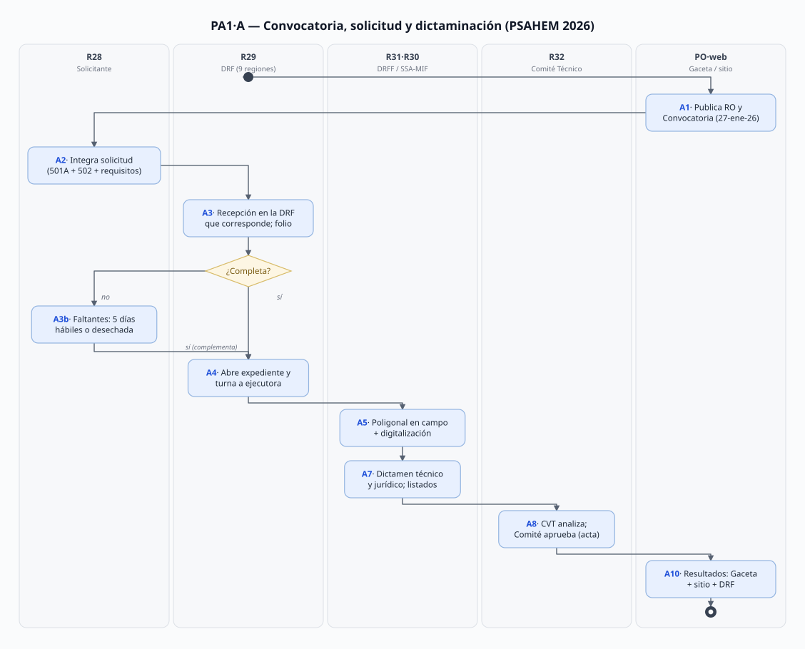
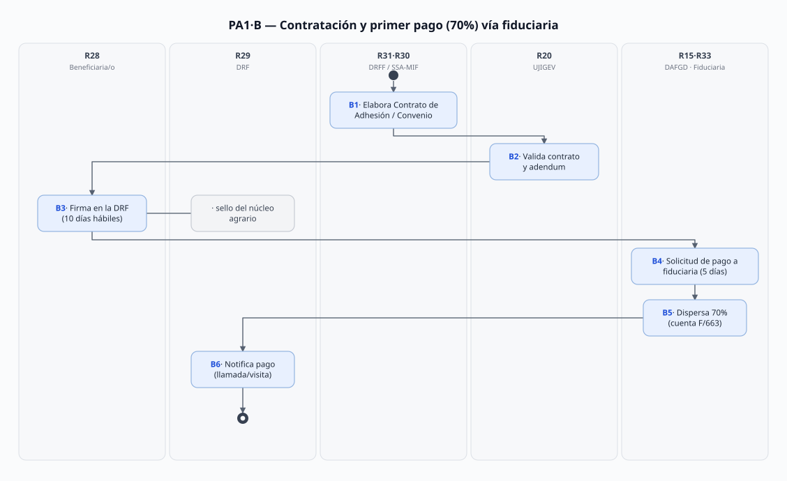
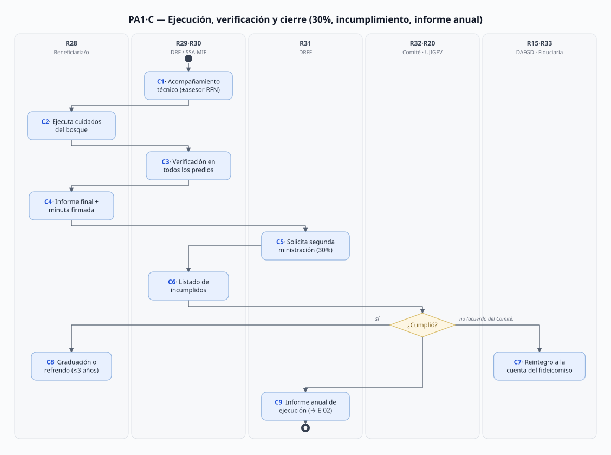

# PA-01 · Pago por Servicios Ambientales Hidrológicos del Estado de México (PSAHEM)

> Plantilla de los 6 programas de apoyo (README: "documentar 1 a fondo acelera los otros 5").
> Fecha de análisis: 2026-09-21. Método: búsqueda de referencias en todas las fuentes → mapa de fuentes → roles → flujo → diagramas → necesidades con doble check → vacíos.
> Citación externa de pasos: **PA1·A5**, **PA1·B3**, **PA1·C7** (proceso·paso).

## 1. Objeto y alcance

**Incluye** el ciclo anual completo del PSAHEM 2026: publicación de RO y convocatoria → recepción de solicitudes en Delegaciones Regionales Forestales (DRF) → integración y digitalización del expediente → levantamiento en campo de la poligonal → dictaminación técnica y jurídica → aprobación del Comité Técnico FIPASAHEM → publicación de resultados → contrato de adhesión / convenio de concertación → pago 70/30 vía fiduciaria → ejecución y acompañamiento técnico → verificación en campo e informe final → cumplimiento/incumplimiento, reintegro y reasignación → graduación o refrendo → informe anual de ejecución.

**Fuera del alcance (procesos hermanos):** la operación del fideicomiso como entidad (contrato F/663 y sus modificatorios — fuente, no proceso propio de PROBOSQUE); los otros 5 programas (PA-02..PA-06, comparten formatos y ciclo); la estadística de cierre (E-02 consume este proceso); la certificación FSC (solo aparece como criterio de monto/precio); el Convenio de Asunción de Funciones con la Federación (MF-##).

## 2. Base documental (claves de cita)

| Clave | Archivo / ubicación | Qué aporta |
|---|---|---|
| [RO] | `Docs/Comun/Programas de apoyo/RO_2026_PagoServiciosAmbientales_Hidrológicos.pdf` — RO 2026 (Gaceta 27-ene-2026, Tomo CCXXI No. 15, 22 págs.) | Reglas completas. Anclas (pág. PDF): §7 apoyo **p. 7**; 8.1.1.1 criterios/tabla **pp. 8–9**; 8.1.1.2 requisitos **pp. 10–12**; 8.1.9 suspensión/baja/reintegro **p. 17**; 8.2 graduación **p. 18**; §9 instancias **p. 18**; 10.1 mecánica I–VII **p. 19**, VIII–XV y 10.2 **p. 20**; §11–16 **p. 20**; §17–18 **p. 21** |
| [CONV] | `Docs/Comun/Programas de apoyo/CONVOCATORIA_2026_Programas_Apoyo.pdf` (= `..._ene271c.pdf`, 13 págs.) | Bases: SEGUNDA/TERCERA **p. 4**; CUARTA recepción + tabla de 9 DRF **pp. 8–9** (folio de solicitud **p. 9**); QUINTA calendarios **pp. 9–11** (30% **p. 10**) |
| [501A] | `Docs/Comun/Programas de apoyo/FORMATO_FO-PB-501A_SolicitudUnica_2026.docx` (v.15, revisión 29-ene-2026, 2 hojas) | Solicitud Única multiprograma: folio del programa 2026 + **folios de refrendo 2023-2025** (hoja 1), tipos de persona, superficies por concepto; **comprobante de recepción** con folio de expediente, checklist 1–11, declaratoria de no litigio, nota de simplificación para refrendos (hoja 2) |
| [502] | `Docs/Comun/Programas de apoyo/FORMATO_FO-PB-502_RegInfo_Solicitante_Beneficiario_2026.docx` | Registro de información de la persona solicitante/beneficiaria (datos obligatorios, tratamiento de datos personales) |
| [RIC] | `Docs/Comun/Programas de apoyo/FIPASAHEM/REGLAMENTO_Interno_Comite_Tecnico_FIPASAHEM.pdf` (Gaceta 16-dic-2019, última reforma 14-oct-2022, 12 págs.) — **capturado hoy** desde `legislacion.edomex.gob.mx/.../rglvig392.pdf` | Comité = órgano de gobierno del fideicomiso (art. 2 **p. 3**); definiciones (art. 4 **pp. 2–3**); facultades del fideicomitente (art. 6 **p. 3**); **integración art. 7 p. 3**; suplencias art. 8 **p. 4**; subcomisiones art. 10 **p. 4**; voz sin voto art. 11 **p. 4**; operación art. 13 **p. 4**; Sec. Técnica art. 20 **p. 7**; convocatorias a sesión arts. 25–26 **pp. 8–9** (72 h) |
| [ACU-F] | `Docs/Comun/Programas de apoyo/FIPASAHEM/ACUERDO_EJECUTIVO_creacion_FIPASAHEM.pdf` — capturado hoy | Decreto del Ejecutivo 13-ago-2007 que crea el fideicomiso (contrato F/663, 14-ago-2007; fideicomitente = Gobierno del Estado por conducto de la Secretaría de Finanzas) |
| [MGO25] | `Docs/Comun/Manual Jurídico/dic161d.pdf` | Funciones: SSA/MIF `225C0201020300L` (pdf p. 28: f.2 remitir información al Comité Técnico FIPASAHEM, f.3 fomentar y asesorar PSAHEM, f.13 apoyo FSC, f.19 contenidos del portal, f.20 su propio MP); DRFF; UJIGEV (dictaminación) |
| [DIR] | `Docs/Comun/Manual Jurídico/Directorio.txt` | Titulares 2026: DRFF Emmanuel Mondragón Romero (Encargado, l.81); SSA/MIF **Rigoberto León Contreras** (l.98–101); Coord. Delegaciones Regionales Forestales Tania Rivera Martínez (l.144); 9 DRF con titulares y correos (l.149–211) |
| [AGENDA25] | `Docs/Comun/Manual Jurídico/Normateca/AGENDA_REGULATORIA_2025.pdf` | PSAHEM = **trámite RETYS ID 51**, modificación enero-2026, 645 beneficiarios externos previstos (campo 19) |
| [INF-PSAHEM] | `Docs/Comun/Programas de apoyo/Reportes por reclamar/PSAHEM_Probosque_Informe.pdf` | Informe del equipo (sep-2026) elaborado de fuentes públicas — **secundario**, solo para cruce, no como evidencia |
| [HIST] | `Docs/Comun/Sitio web/historico.html` | Serie histórica de listados de beneficiarios publicados para Gaceta (2017–2018, fondos concurrentes) — evidencia del paso A10 |

> **Convención**: `pdf p.` = página del archivo PDF. Las RO están redactadas en numerales (no artículos): se citan como §7.2, 10.1·VI, etc. [RIC] usa artículos.

## 3. Glosario de siglas

| Sigla | Significado |
|---|---|
| CAEM | Comisión del Agua del Estado de México (vocal del Comité Técnico) |
| CVT | Comisión de Verificación Técnica: órgano del Comité Técnico para vigilancia y supervisión [RO §3; RIC art. 10 — se integra por acuerdo por mayoría, puede incluir sociedad] |
| DRF | Delegación Regional Forestal (9: Toluca, Naucalpan, Texcoco, Tejupilco, Atlacomulco, Coatepec Harinas, Valle de Bravo, Amecameca, Jilotepec) |
| FIPASAHEM | Fideicomiso Público de Administración e Inversión **F/663**, "Pago por Servicios Ambientales Hidrológicos del EdoMéx" (creado 13-ago-2007) |
| MLPSA-FC | Mecanismos Locales de Pago por Servicios Ambientales a través de Fondos Concurrentes (esquema CONAFOR–PROBOSQUE) |
| PSAHEM | Programa Pago por Servicios Ambientales Hidrológicos del Estado de México |
| RAN | Registro Agrario Nacional (actas ejidales/comunales inscritas o en trámite) |
| RFN | Registro Forestal Nacional (SEMARNAT) — habilita asesores técnicos externos |
| SSA/MIF | Subdirección de Servicios Ambientales y Manejo Integral Forestal (el "área responsable del programa") |
| ZRHCEM | Zonas de Recarga Hídrica de las Cuencas del Estado de México (cuenca alta = prioridad 1; media/baja = prioridad 2) |

## 4. Roles (personificados)

Se reutilizan IDs de procesos previos cuando la unidad ya estaba definida (R13 OIC en G09; R15 DAFGD en GS3; R19 DG, R20 UJIGEV en T-02).

| ID | Rol | Puesto y titular (fuente) | Tipo |
|---|---|---|---|
| R28 | Persona solicitante / beneficiaria (física, jurídico colectiva o **núcleo agrario** con Comisariado; designa **segunda persona beneficiaria** obligatoria en la solicitud) | — (ciudadanía: ejidatarios, comuneros, propietarios, poseedores, usufructuarios) | Externo |
| R29 | DRF receptoras: ventanilla, comprobante de recepción, folio, turno del expediente, levantamiento de poligonal, firma de contratos, notificación de pagos, verificación en campo | 9 titulares 2026 en [DIR l.149–211] (p. ej. Toluca: **Antonio Contreras Aguado**, Encargado del Despacho, probosque.drf.toluca@); coordinación: **Tania Rivera Martínez** (l.144–147) | Interno desconcentrado |
| R30 | SSA/MIF — área responsable del programa: integra/digitaliza expedientes, dictamen técnico, listados, acompañamiento, informe | **Rigoberto León Contreras**, Subdirector ([DIR] l.98–101; clave `225C0201020300L` [MGO25 pdf p. 28]) | Interno |
| R31 | DRFF — Instancia Ejecutora: revisa/valida expedientes, convoca a la CVT, elabora contratos, listados finales al Comité | **Emmanuel Mondragón Romero**, Encargado del Despacho ([DIR] l.81–85) | Interno |
| R32 | Comité Técnico FIPASAHEM — Instancia Normativa: aprueba listados, autoriza pagos/reintegros/reasignaciones, resuelve lo no previsto | Presidencia: titular de la Secretaría del Campo — ⚠️ nombre **desconocido** (V-03); Presidencia suplente: DG R19; 8 vocalías (Finanzas, SMA, SEDUO, CAEM, PROBOSQUE, OPDM agua, municipios sin OPDM, CONAFOR); Comisario (Contraloría, voz sin voto); **Secretaría Técnica: titular de la Dirección de Administración y Finanzas de PROBOSQUE** [RIC art. 7 y 11] — ⚠️ ¿= DAFGD (Irán Terán Cordero)? (V-03) | Colegiado externo-al-organismo 「posible fuera de alcance del SGD」 |
| R33 | Fiduciaria — institución financiera que custodia y dispersa el F/663 | ⚠️ **identidad desconocida** (contrato F/663 y 4 modificatorios no capturados — V-01)「fuera de alcance del SGD」 |
| R34 | CONAFOR — fondos concurrentes MLPSA-FC (su convocatoria propia; verificación para el 30%) | representante ante Comité Técnico [RIC art. 7 A.8] | Externo federal 「posible fuera de alcance del SGD」 |
| R35 | Fideicomitente (Gobierno del Estado por conducto de la **Secretaría de Finanzas**) — transfiere las Aportaciones de Mejoras (3.5% del agua) al fideicomiso; nombra/remueve al Comité | ⚠️ nombre del titular no aplica (institucional) [ACU-F; RIC art. 6; RO §7.3] | Externo 「fuera de alcance del SGD」 |
| R36 | CVT — analiza dictámenes y clasifica factibilidad antes del Comité | composición no documentada (V-02) | Colegiado |
| R15 | DAFGD — administración de recursos, solicitud de pagos a la fiduciaria, cuenta de reintegro | **Irán Terán Cordero** ([DIR] l.111/117; [MGO25 pdf p. 37]) | Interno |
| R20 | UJIGEV — dictamen jurídico, revisión de contratos/adéndums, listado de incumplidos, gestión de devoluciones | **María Elena Juárez de Jesús** ([DIR] l.17–21) | Interno |
| R19 | DG — preside el Comité Técnico (suplente) y representa a la Instancia Responsable | **Alejandro Santiago Sánchez Vélez** ([DIR] l.1–8) | Interno |
| R13 | OIC — auditoría del programa; recibe denuncias turnadas | **Jesús Alejandro Rentería Núñez** ([MGO25 pdf p. 37]; [DIR] l.42) | Interno |

## 5. Funciones y actividades por rol

| Rol | Función en PA-01 | Pasos |
|---|---|---|
| R28 | Solicitar (con segunda persona designada), integrar requisitos, firmar contrato, ejecutar cuidados, rendir informe, recibir pago | A2, B3, C2, C4 |
| R29 | Recibir con folio, comprobante, requerir faltantes (5 días), turno, poligonal, firma, notificar pago, verificar en campo | A3, A4, A5, B3, B6, C3 |
| R30 | Revisar/digitalizar expediente, dictamen técnico con puntos, listados, acompañamiento, solicitud de segunda ministración | A5, A6, A7, C1, C5 |
| R31 | Validar integración, convocar CVT, emitir contratos (con UJIGEV), publicar resultados, presentar listados finales | A6, A8, A10, B1, C9 |
| R32 | Aprobar factibles/no factibles (fundado), autorizar pagos y reintegros, reasignar, resolver lo no previsto | A9, B4(aprob.), C7 |
| R33 | Dispersar ministraciones a beneficiarios; recibir reintegros | B5, C7 |
| R34 | Concurrentes: su convocatoria, su verificación para el 30% | A2(alternativa), C3(FC) |
| R35 | Transferir mejoras 3.5% al fideicomiso (día hábil siguiente) | B5(sostén) |
| R20 | Dictamen jurídico, validación de contratos, incumplidos, devolución (con acuerdo del Comité) | A7, B2, C6, C7 |
| R15 | Solicitar pagos a fiduciaria (5 días), cuenta para reintegros | B4, C7 |

## 6. Reglas de negocio

- **BR-1** Montos/ha 2026: cuenca alta $3,500 (FSC $3,600, máx. 450 ha); cuenca media/baja $1,500 (FSC $1,700, máx. 300 ha); máx. general 400 ha; coberturas mínimas por formación (templado 50%, tropical caducifolio 40%, semiárido 20%) [RO §7.1.1 y tabla §8.1.1.1].
- **BR-2** El pago sale del FIPASAHEM (F/663): capital semilla $26.4 M + **Aportaciones de Mejoras = 3.5% de los ingresos por suministro de agua potable** (Código Financiero arts. 216-I/J); el fideicomitente las transfiere a más tardar el día hábil siguiente de recibirlas [RO §7.3; RIC art. 6 fr. II].
- **BR-3** La solicitud se recibe **únicamente en la DRF que corresponde al predio**; prohibido recibirla en oficinas centrales o DRF que no corresponda [RO 10.1·I].
- **BR-4** Documentación incompleta: 5 días hábiles para complementar (sin exceder el cierre de la convocatoria); después se **tiene por desechada**; el folio de solicitud se genera al completar [CONV CUARTA].
- **BR-5** Toda solicitud designa **segunda persona beneficiaria** (en núcleos agrarios, integrante titular del Comisariado) — sustitución por imposibilidad o fallecimiento (notificar en 30 días hábiles) [RO 8.1.1.2·II; 8.1.9.2·XI-XII; 501A].
- **BR-6** Dictaminación doble: **jurídico** (UJIGEV: propiedad/posesión, RAN, representación, no litigio) y **técnico** (área responsable, formato del Sistema de Gestión de Calidad, con tabla de puntos: cobertura, no doble PSA, tala clandestina, plagas…); la dictaminación va **por orden de recepción hasta agotar presupuesto** [RO 8.1.1.1 criterios, 10.1·IV; 501A declaratoria].
- **BR-7** El Comité Técnico aprueba el listado de factibles/no factibles; todo rechazo debe estar **fundado y motivado**; el fallo es **inapelable** [RO 10.1·VI; CONV QUINTA·III].
- **BR-8** Pago en dos ministraciones: **70%** tras la firma del contrato (10 días hábiles posteriores a resultados); **30%** contra informe final + **minuta de verificación en campo firmada** (beneficiaria/o + técnico de PROBOSQUE ± asesor externo); no debe exceder el último bimestre de vigencia del contrato [RO §7.2; CONV QUINTA·V-VI].
- **BR-9** Los pagos se solicitan a la fiduciaria **por conducto de la Secretaría Técnica del Comité**, máximo 5 días hábiles desde la solicitud del área operativa; la notificación al beneficiario la hacen las DRF (llamada, medio electrónico o visita) [RO 10.1·X].
- **BR-10** **Refrendo** (hasta 3 años atrás): validación simplificada — solo visita en campo + solicitud + CURP + documentación legal actualizada "mencionando el **folio del expediente** donde se ubica dicha documentación"; **sí requiere nuevo dictamen jurídico** [RO 10.1·II; nota 501A].
- **BR-11** Causales de cancelación (18 fracciones: fines distintos, no firma del contrato, información falsa, negligencia ante incendios, doble programa con el mismo propósito…) y de **reintegro** (a la cuenta del fideicomiso, con acuerdo del Comité y notificación a UJIGEV); los incumplidos pueden solicitar su exclusión del listado comprobando cumplimiento [RO 8.1.9.2, 8.1.9.3].
- **BR-12** La Instancia Responsable (PROBOSQUE) presenta **informe anual de ejecución a la Instancia Normativa al final del ejercicio fiscal** [RO §16.1 — insumo de E-02].
- **BR-13** Datos personales conforme a la LPDPPSO del Estado de México; es **información clasificada** la de beneficiarias vulnerables ante ilícitos por superficie/monto [RO §8.1.1.2·III, §14].
- **BR-14** En MLPSA-FC concurrente con CONAFOR: los requisitos siguen la convocatoria CONAFOR; la verificación del 30%/siguiente año concurrente tiene prioridad [RO 8.1.1.2·a.2, 10.1·X].
- **BR-15** PROBOSQUE **no cubre costos de gestión** de la solicitud (anti-intermediarios) y la recepción no implica compromiso de otorgamiento [501A; CONV CUARTA].
- **BR-16** El Comité Técnico: 9 propietarios + Comisario (Contraloría) + Secretaría Técnica (Dirección de Administración y Finanzas de PROBOSQUE) con voz sin voto; suplencias por escrito; sesiones convocadas por la Secretaría Técnica firmadas por la Presidencia (72 h anticipación); puede crear subcomisiones (CVT) con participación social [RIC arts. 7–11, 25–26].
- **BR-17** Quejas y denuncias: Comité Técnico (turna al OIC), OIC, Comité de Admisión y Seguimiento, Contraloría, SAM, app "Denuncia EDOMÉX" [RO §18].
- **BR-18** Auditoría: OSFEM + Secretaría de la Contraloría + OIC + auditorías ISO 9001 internas/externas sobre el proceso certificado [RO §17 — vincula T-01].

## 7. Procedimiento

### Proceso A — Convocatoria, solicitud y dictaminación

- **A1** Publicación en la **Gaceta** (27-ene-2026) y en el sitio de las RO y la Convocatoria [RO; CONV; BR-16 T-02·A8].
- **A2** R28 integra la solicitud: [501A] + [502] + identificación + CURP + documento de propiedad/posesión (PHINA/ADDATE para núcleos; escritura, inmatriculación, constancia de posesión del Comisariado o del Ayuntamiento con plano y coordenadas) + actas RAN; plazo: día hábil siguiente de la publicación **hasta el 27-mar-2026** [RO 8.1; CONV CUARTA/QUINTA].
- **A3** R29 recibe **en la DRF que corresponde al predio**, verifica requisitos, entrega **comprobante de recepción** y genera el **folio de solicitud**; faltantes: 5 días hábiles [RO 10.1·I; CONV CUARTA; 501A anverso].
- **A4** R29 abre el expediente y lo **turna en conjunto** al área ejecutora (no se reciben expedientes sueltos) [RO 8.1.1.2·II].
- **A5** **Levantamiento en campo de la poligonal** y recopilación de datos técnicos (R29 + R30) [RO 10.1·I].
- **A6** R30/R31 revisan, registran, integran, validan y **digitalizan** expedientes; los refrendos ≤3 años se validan con visita + nuevo dictamen jurídico [RO 10.1·II; BR-10].
- **A7** **Dictámenes**: jurídico (R20) y técnico (R30, formato SGC con puntos) + listado preliminar de factibles/no factibles; documentación complementaria se notifica dentro del plazo de evaluación [RO 10.1·III-IV; BR-6].
- **A8** R31 (vía área responsable) **convoca a la CVT**: conoce el ingreso de solicitudes y analiza cada dictamen → clasificación factible / no factible de pago [RO 10.1·V].
- **A9** **R32 Comité Técnico aprueba** los listados (sesión; rechazo fundado y motivado; decisión asentada en **acta**) [RO 10.1·VI; RIC arts. 25–26; BR-7].
- **A10** Publicación de resultados: sitio de PROBOSQUE para todos; **también Gaceta** para PSAHEM; consulta en oficinas centrales y DRF; los no aprobados son notificados por R31 vía Secretaría Técnica del Comité en el plazo que el propio Comité fije [RO 10.1·VI; CONV QUINTA·IV; BR-7].

### Proceso B — Contratación y pago

- **B1** R31/área responsable elabora el **Contrato de Adhesión** (o Convenio de Concertación con CONAFOR) y adendum [RO 10.1·VI].
- **B2** R20 (UJIGEV) revisa la fundamentación legal y **valida el proyecto de contrato/adendum** [RO 10.1·VII].
- **B3** R28 firma (y sello del núcleo agrario) **en la DRF** dentro de los **10 días hábiles** posteriores a resultados (reasignados: hasta último día hábil de septiembre) [RO 10.1·VI; CONV QUINTA·V].
- **B4** R15 (DAFGD), a solicitud del área operativa y **por conducto de la Secretaría Técnica del R32**, pide a R33 la emisión del pago — máximo **5 días hábiles** [RO 10.1·X; BR-9].
- **B5** R33 dispersa la **primera ministración (70% o 100% según caso)** desde la cuenta F/663 [RO §7.2; CONV QUINTA·VI].
- **B6** R29 notifica y acompaña el cobro (llamada, medio electrónico o visita), con prioridad a los MLPSA-FC [RO 10.1·X; BR-14].

### Proceso C — Ejecución, verificación y cierre

- **C1** R30/R29 (o asesores externos con RFN/registro CONAFOR) dan **acompañamiento técnico** y capacitación [RO §7.1.2].
- **C2** R28 ejecuta las actividades de protección/conservación comprometidas durante la vigencia del contrato [RO §8.1.10 corresponsabilidades].
- **C3** **Verificación en campo**: R29 acude a **todos los predios beneficiados**, genera el documento que avala la acción (minuta firmada por R28 + técnico) → al área responsable con copia a R31; en concurrentes, la verificación puede ser de CONAFOR [RO 10.1·XI; §7.2].
- **C4** R28 presenta **Informe final de actividades** [RO §7.2].
- **C5** R30 solicita la **segunda ministración (30%)** vía R15 (o la solicitud de cancelación) [RO 10.1·XII].
- **C6** R20 revisa el **listado de incumplidos** y predios con procedimientos/sanciones; R28 puede solicitar su exclusión comprobando cumplimiento [RO 10.1·XV; 8.1.9.3·VI].
- **C7** **Reintegros y reasignaciones**: con acuerdo del R32 y notificación a R20, la devolución va a la cuenta del fideicomiso (R33); montos no ejercidos se reasignan a predios factibles sin cobertura presupuestal [RO 8.1.9.3; 10.1·XV; CONV QUINTA].
- **C8** **Graduación** (cumplió todo: visita de campo + evaluación documental) o **refrendo** al siguiente ejercicio (simplificado, BR-10) [RO §8.2].
- **C9** R31 elabora el **informe anual de ejecución** para el R32 al cierre del ejercicio (→ E-02) [RO §16.1].

## 8. Diagramas de actividad

Generados por `Docs/Joni/Diagramas/PA01/gen-diagramas.mjs` (editar el script, no los `.svg`).

## 9. Tabla de necesidades

| ID | Rol | Necesidad | P | Paso | Origen |
|---|---|---|---|---|---|
| N-01 | R28 | Saber **dónde y hasta cuándo** presentar (DRF que le corresponde por municipio) y qué documentos exactos requiere | A | A2 | [CONV pdf pp. 8–9 tabla de 9 DRF con municipios]; [RO pdf pp. 10–12 §8.1.1.2 I–XII] |
| N-02 | R28 | Obtener **acuse con folio** que compruebe la entrega de su solicitud | A | A3 | [501A hoja 2: "De este anexo se otorga a la persona solicitante comprobante de la recepción… con firma y sello de la Delegación"]; [CONV pdf p. 9] |
| N-03 | R29 | Verificar requisitos con **original y copia cotejada** (constancias de posesión del Comisariado o del Ayuntamiento, actas RAN, vigencia) | A | A3 | [RO pdf pp. 10–11 §8.1.1.2 VI–VII — exige original/cotejada, firmas de Presidencia/Secretaría/Tesorería, vigencia ligada al periodo del comisariado] |
| N-04 | R29 | Comunicar faltantes y controlar los **5 días hábiles** antes del desechamiento | A | A3 | [CONV pdf p. 9: "contará con un término de cinco días hábiles… en caso de no complementar… se tendrá por desechada"] |
| N-05 | R30 | **Localizar el expediente de años anteriores** (folio de expediente) para el refrendo simplificado | A | A6 | [501A hoja 2 nota: "mencionando el folio del expediente donde se ubica dicha documentación"]; [RO pdf p. 19 §10.1·II] |
| N-06 | R29·R30 | Levantar la **poligonal en campo** (coordenadas, cobertura arbolada por formación) y adjuntarla al expediente | A | A5 | [RO pdf p. 19 §10.1·I "levantamiento en campo de la poligonal"; pdf p. 11 §8.1.1.2·VI plano/croquis con al menos una coordenada firmado] |
| N-07 | R20 | Dictaminar con la **prueba documental completa digitalizada** (titulación, RAN, representación, no litigio) | A | A7 | [RO pdf pp. 19–20 §10.1·IV y XV; pdf p. 6 glosario "Dictamen Jurídico… emitido por la UJIGEV"] |
| N-08 | R30 | Aplicar la **tabla de puntos** del formato "Dictamen Técnico" del SGC (cobertura, doble PSA, tala, plagas) | A | A7 | [RO pdf pp. 8–9 §8.1.1.1 criterios I–III con tabla de puntos — "en apego al formato de Dictamen Técnico del Sistema de Gestión de Calidad"] ⚠️ el formato no está en el repo → V-05 |
| N-09 | Sec. Técnica del R32 (= **titular de la Dirección de Administración y Finanzas** [RIC art. 7·C — ⚠️ ¿Irán Terán Cordero? → V-03]) | Circulaciones **antes de la sesión** los dictámenes y listados, con citación 72 h firmada por la Presidencia | M | A9 | [RIC pdf pp. 8–9 arts. 25–26; art. 7·C pdf p. 3] |
| N-10 | R31 | Publicar y notificar resultados **fundados** (Gaceta + sitio + DRF; no aprobados con motivo) | A | A10 | [RO pdf p. 19 §10.1·VI; CONV pdf pp. 9–10 QUINTA·IV] |
| N-11 | R31·R20 | Contar con la **plantilla de Contrato de Adhesión/Convenio y adendum** jurídicamente validada | A | B1–B2 | [RO pdf pp. 19–20 §10.1·VI–VII] ⚠️ plantilla no existe en el repo → V-04 |
| N-12 | R15 | Girar la solicitud de pago a la fiduciaria **por la vía formal correcta** (Secretaría Técnica del Comité, 5 días hábiles) y conservar acuse | A | B4 | [RO pdf p. 20 §10.1·X] |
| N-13 | R28 | **Enterarse de que el pago fue liberado** y cómo/cuándo cobrar (prioridad concurrentes) | A | B6 | [RO pdf p. 20 §10.1·X "la notificación… por llamada telefónica, medios electrónicos o visita domiciliaria"] |
| N-14 | R29 | Verificar en **todos** los predios las acciones del contrato y levantar la **minuta firmada** | A | C3 | [RO pdf p. 20 §10.1·XI; pdf p. 7 §7.2 "minuta de verificación en campo… firmada por la persona beneficiaria así como el técnico comisionado"] |
| N-15 | R30 | Llevar el **control por beneficiario** de ministraciones (70/30), informes e informes pendientes para solicitar la segunda | A | C5 | [RO pdf p. 20 §10.1·XII; pdf p. 7 §7.2] |
| N-16 | R20 | Gestionar **devoluciones** con acuerdo del Comité y cuenta de la fiduciaria | M | C7 | [RO pdf p. 20 §10.1·XV; pdf p. 17 §8.1.9.3] |
| N-17 | R31 | Consolidar el **informe anual de ejecución** al cierre del ejercicio | A | C9 | [RO pdf p. 20 §16.1] |
| N-18 | R34 | Coordinar **verificación concurrente** (CONAFOR) para liberar el 30% o el año siguiente | M | B6, C3 | [RO pdf p. 20 §10.1·X; pdf p. 11 §8.1.1.2·a.2] |
| N-19 | R36 (CVT) | Recibir el aviso de ingreso de solicitudes y el **paquete de dictámenes** para su análisis | M | A8 | [RO pdf p. 19 §10.1·V] ⚠️ composición y reglas de la CVT → V-02 |
| N-20 | R13 | Pista de auditoría del programa: expediente → dictamen → acta del Comité → contrato → comprobante de pago → minuta | M | transversal | [RO pdf p. 21 §17 (OSFEM/Contraloría/OIC + auditorías ISO) y §18 (denuncias turnadas al OIC)] |

## 10. Registros que el SGD debe gestionar (catálogo documental)

| Registro | Identificador | Fuente |
|---|---|---|
| Solicitud Única (multiprograma) | **folio de solicitud** + folio del programa por ejercicio + folios de refrendo (2023-25) | [501A] |
| Comprobante de recepción (DRF) | folio, nombre/firma/sello de quien recibe | [501A anverso; CONV CUARTA] |
| Expediente del predio (físico→digital) | **folio de expediente** (encadena refrendos) | [RO 8.1.1.2·II, 10.1·II; 501A nota] |
| Poligonal/datos geoespaciales del predio | coordenadas, superficie, formación | [RO 10.1·I; 8.1.1.2·VI] |
| Dictamen jurídico / Dictamen técnico (SGC) | por expediente; tabla de puntos | [RO 10.1·IV; 8.1.1.1] |
| Listados preliminar y de factibles/no factibles | sesión del Comité (acta, acuerdo) | [RO 10.1·V-VI] |
| Publicación de resultados | Gaceta (PSAHEM) + sitio | [RO 10.1·VI; CONV; HIST serie 2017-18] |
| Contrato de Adhesión / Convenio de Concertación (+adendum) | partes, vigencia, monto/ha, superficie | [RO 10.1·VI–VII] |
| Solicitud de pago a fiduciaria y comprobante de depósito | ministración 70%/30%, fecha | [RO 10.1·X] |
| Minuta de verificación en campo | firmas beneficiario+técnico (±CONAFOR) | [RO §7.2, 10.1·XI] |
| Informe final de actividades | por beneficiario/año | [RO §7.2] |
| Listado de beneficiarios incumplidos | exclusión/reintegro | [RO 8.1.9.3·VI] |
| Acuerdos de reintegro/reasignación | acta del Comité | [RO 8.1.9.3] |
| Informe anual de ejecución | ejercicio fiscal (→ E-02) | [RO §16.1] |
| Bitácora de trabajos (concurrentes) | para autorización de pago CONAFOR | [CONV QUINTA·VI RFI; RO §7.2] |

## 11. Vacíos y siguientes pasos

### 11.1 Tabla de vacíos

| ID | Qué falta en el mundo real | Evidencia de que es vacío | Cómo se cierra | Afecta |
|---|---|---|---|---|
| **V-01** | El **Contrato F/663 y sus 4 convenios modificatorios**: identidad de la fiduciaria, montos, composición vigente del Comité | [RIC] los menciona (modificatorios 2009/2009/2014/2019) pero no están en el repo; [RO 10.1·X] ordena pagar "a través de la Fiduciaria" sin nombrarla | Secretaría de Finanzas / SAIMEX / entrevista DAFGD | N-12 · B4–B5 |
| **V-02** | La **Comisión de Verificación Técnica**: quiénes la integran, cómo sesiona, qué resuelve exactamente | [RO 10.1·V] la manda "conocer el ingreso y analizar dictámenes"; [RIC art. 10] permite subcomisiones con sociedad — sin composición documentada | Entrevista a SSA/MIF (León Contreras) | N-19 · A8 |
| **V-03** | **Nombres de los integrantes 2026 del Comité Técnico FIPASAHEM** (presidente de la Secretaría del Campo, 8 vocalías, Sec. Técnica —¿coincide con DAFGD?) | [RIC art. 7] define cargos; ningún documento capturado los lista con nombre | Actas de sesiones (no publicadas — V-08) + entrevista | N-09 · A9 |
| **V-04** | Las **plantillas de Contrato de Adhesión, Convenio de Concertación y adendum** no existen en el repo | [RO 10.1·VI–VII] los manda elaborar/validar; no hay formato FO-PB asociado ni en RETYS | Pedir a UJIGEV/SSA-MIF (anonimizado) | N-11 · B1–B3 |
| **V-05** | El **formato "Dictamen Técnico" del Sistema de Gestión de Calidad** (con la tabla de puntos) no está capturado | [RO 8.1.1.1·criterio 1] lo cita por nombre | Área ISO / SSA-MIF (vincula T-01) | N-08 · A7 |
| **V-06** | Formatos de **informe final de actividades y minuta de verificación** no existen en el repo | [RO §7.2 y 10.1·XI] los exigen con firmas | SSA/MIF | N-14, N-15 · C3–C5 |
| **V-07** | La **cédula RETYS del trámite PSAHEM (ID 51)** no está transcrita | [AGENDA25 campo 17] da el ID; las únicas cédulas transcritas (germoplasma) quedaron fuera de alcance en `Docs/Comun/germoplasma-archivo/Retys EdoMex/` | Capturar de retys.edomex.gob.mx a `Docs/Comun/Trámites RETYS/` (tarea T-1) | N-01 · A2 |
| **V-08** | Las **actas de sesiones del Comité Técnico** (que aprueban listados y pagos) no son públicas: el RO las menciona pero no se localizan en el sitio | [RO 10.1·VI] "quedando plasmada en el acta de la sesión"; búsqueda en [MJ-HTML]/[MR-HTML] sin resultado | Transparencia (SAIMEX) / entrevista | N-09, N-20 · A9 |
| **V-09** | El **Manual de Procedimientos de SSA/MIF** no existe pese a la obligación de f.20 | [MGO25 pdf p. 28 f.20]; la Normateca del sitio solo lista MP-UIPPE y MP-Contabilidad | Pedir a SSA/MIF (¿existe?) | A5–A7 |
| **V-10** | El **listado 2026 de beneficiarios aprobados** (Gaceta/sitio) no fue capturado: solo hay evidencia histórica 2017-18 | [HIST] enlaza listados 2017-18; [RO 10.1·VI] manda publicar cada año | Capturar Gaceta jul-2026 (tarea T-2) | N-10 · A10 |
| **V-11** | **Aportaciones de mejoras 3.5%: flujo real** (quién recauda, cuándo transfiere Finanzas al fideicomiso, montos del ejercicio) | [RO §7.3] y [RIC art. 6·II] lo norman; ningún registro de montos en el repo | Finanzas/SAIMEX; informe anual §16.1 | B5(sostén) · E-02 |

### 11.2 Cerrados durante este análisis (2026-09-21)

- Captura de [RIC] (rglvig392) y [ACU-F] desde el sitio de la Normateca → `Programas de apoyo/FIPASAHEM/` (magic bytes verificados).
- Localización del **sistema de folios real** (a diferencia de germoplasma): folio de solicitud [CONV], folio del programa por ejercicio y folios de refrendo [501A], folio de expediente citado nominalmente en la nota de simplificación — cierra la duda de diseño arrastrada de G09·V-03 para el dominio de programas.
- Confirmación de que el "área responsable del programa" = SSA/MIF (creada jun-2025, [MGO25 pdf p. 4 y p. 28]) y su titular.
- Doble check de montos y topes 2026 contra la tabla de criterios (§7.1.1 y §8.1.1.1 — consistentes).
- Las RO 2026 son las publicadas en Gaceta 27-ene-2026 (el README las llamaba "web consolidado"; verificable: mismo Tomo CCXXI No. 15 que [CONV]).

### 11.3 Tareas nuestras (no vacíos)

- T-1: transcribir la cédula RETYS ID 51 (PSAH) a `Docs/Comun/Trámites RETYS/` (cierra V-07; el patrón de captura ya está probado en las cédulas archivadas de germoplasma).
- T-2: capturar del sitio/Gaceta el listado 2026 de beneficiarios PSAHEM (V-10) — evidencia viva del paso A10.
- T-3: al replicar la plantilla a PA-02..PA-06, reutilizar el ciclo A/B/C y marcar solo las divergencias (etapas del calendario por programa [CONV QUINTA]; RFI usa bitácora y estudio técnico; RHF/Capturando tienen sus montos y modalidades).
- T-4: cruzar con GS8 (entrega de planta por vale dentro de programas) cuando se documente.
