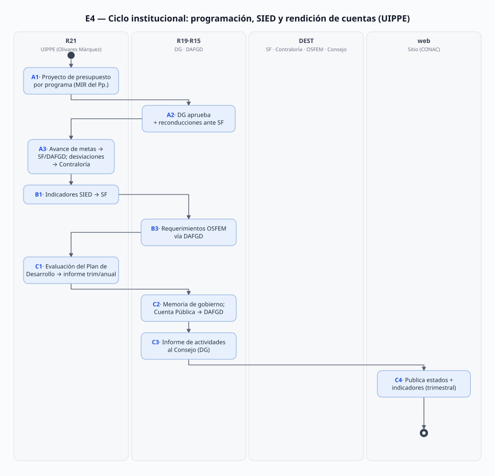

# E-04 · Estadística institucional y rendición de cuentas (avance de metas, SIED, informes)

> Proceso estadístico E-04 (cadena: E-01/E-02/E-03 → **E-04** → Secretaría de Finanzas, Contraloría, Consejo Directivo).
> Fecha de análisis: 2026-09-21. Método: 8 pasos (fuentes → mapa → roles → flujo → diagramas → necesidades con anclas → doble check → vacíos).
> Citación externa de pasos: **E4·A3**, **E4·B2**, **E4·C1** (proceso·paso).

## 1. Objeto y alcance

**Incluye** los tres circuitos por los que PROBOSQUE entrega su información estadística programática hacia arriba, a cargo de la UIPPE:
- **Proceso A** — ciclo de programación y **avance de metas del Programa Anual** (presupuesto por programa, reconducciones, reporte de avances a SF/DAFGD, notificación de desviaciones);
- **Proceso B** — **estadística básica y SIED**: integración de la información programática cuando la instancia la requiere, indicadores al Sistema Integral de Evaluación del Desempeño, atención de requerimientos estatales y fiscalizadores;
- **Proceso C** — **rendición de cuentas**: evaluación de la ejecución del Plan de Desarrollo (informe trimestral y anual), informe y memoria de gobierno, Cuenta Pública, informe de actividades de la DG al Consejo Directivo y publicación de estados financieros/indicadores en el sitio (CONAC).

**Fuera del alcance (por deliberación, no por falta de documentos):** SF, Contraloría, OSFEM y el Consejo Directivo **deciden** — no se personifican (「posible fuera de alcance del SGD」): sus registros (acuerdos, reportes recibidos) sí se gestionan. La estadística por dominio (E-01/E-02/E-03) es **insumo**: este proceso consume sus productos sin re-auditarlos.

## 2. Base documental (claves de cita)

| Clave | Archivo / ubicación | Qué aporta (anclas en pág. PDF) |
|---|---|---|
| [MGO25] | `Manual Jurídico/dic161d.pdf` | **Funciones UIPPE (36), pdf pp. 16–17**: f.1 estadística básica "cuando sea requerida"; f.2 información a SF "para la evaluación de la gestión pública"; f.5 seguimiento de programas sectoriales/anuales; f.8 reconducciones ante SF; f.9 proyecto de presupuesto por programa (con DAFGD, aprobación DG); **f.11 avances de metas del Programa Anual a SF y DAFGD; f.12 desviaciones a Contraloría y SF; f.13 indicadores SIED a SF; f.14 información programática para OSFEM → DAFGD; f.15 evaluación Plan de Desarrollo → informe trimestral/anual; f.17 informe y memoria de gobierno; f.19 información programática de la Cuenta Pública → DAFGD**; f.16 dictamen de reconducción; f.23–27 coadyuvar IPOMEX/SAIMEX/SARCOEM/SISPEC/Comité de Transparencia; f.31 su propio MP |
| [MGO25-DG] | `dic161d.pdf` | Función de la DG: "informar al Consejo Directivo en cada sesión ordinaria, de los estados financieros y de las actividades de PROBOSQUE, así como rendir el informe de actividades del periodo" **pdf p. 10** |
| [DIR] | `Manual Jurídico/Directorio.txt` | **Margarita Olivares Márquez**, Jefa de UIPPE (**l.23–26**, probosque.uippe@); DAFGD **Irán Terán Cordero** (l.111/117); DG **Alejandro Santiago Sánchez Vélez** (l.1–8); OIC **Jesús Alejandro Rentería Núñez** (l.42); UCSyTI **Ana Yaritzy Medina Eleno** ([MGO25 pdf p. 37]) |
| [INFO-F] | `Sitio web/informacion_financiera.html` | Inventario **trimestral** publicado por PROBOSQUE: 15+ estados financieros por Ley General de Contabilidad Gubernamental (CONAC, Títulos IV–V), **"Indicadores de resultados"**, cuenta pública, calendarios de egresos/ingresos base mensual, "Montos pagados por ayudas y subsidios", gasto federalizado (muestra 2022) |
| [CONAC23] | `Masa forestal/2023-CONAC-Desarrollo-forestal-PROBOSQUE.pdf` | Evaluación estatal del Pp. 03020201 con **responsable del seguimiento en la UIPPE (Lic. Jessica Fabiola Luja Navas)** **p. 1 §1.4**; evaluadora externa: coordinadora **Lic. María Eugenia Morales Rodríguez** (SINSA) + 3 colaboradores **p. 6 §4** |
| [ANEXOS23] | `Masa forestal/2023-Anexos-Desarrollo-forestal-PROBOSQUE.pdf` | **p. 2**: unidad responsable = Secretaría del Campo; ejecutoras DPF+DRFF; **6 proyectos del Pp.** (el 6.º = "Servicios ambientales de los ecosistemas forestales" — donde viven los apoyos E-02); narrativa MIR; **cifras FF2022: autorizado $228.6 M / modificado $240.2 M / ejercido $168.3 M**; fuente de las cifras: UIPPE + DAFGD + DRFF + DPF |
| [MIR-2022] | [ANEXOS23 pdf p. 2 narrativa] | Estrategias/líneas del Plan de Desarrollo a las que responden los 6 proyectos (la MIR 2026 vigente no está en el repo → V-04) |
| [DICT-MPUIPPE] | `Manual Jurídico/Normateca/DICTAMEN_SAIR_MP_UIPPE_2020.pdf` — capturado hoy | **No es el manual**: es el **dictamen de exención SAIR de CEMER** para el MP de UIPPE (27-jul-2020; aprobado por el Comité Interno de MR el 30-jun-2020; oficio DGI 20706006L-0757/2020; Enlace 2020: **Edgar Tinoco González**; Resolución firmada por **José Miguel Remis Durán**, DG CEMER) — cadena de aprobación del manual, pero **el manual en sí no está en el sitio** (V-01) |
| [FIN-AYS] | `Finanzas y adquisiciones/FINANZAS_AyudasYSubsidios_2026T2.pdf` | Formato trimestral "Montos pagados por ayudas y subsidios" (escaneado; T2-2026 "NO APLICA" — verificado visualmente 2026-09-19) |
| [T02] | `Docs/Joni/Transversal/T02_MARCO_JURIDICO_INSTITUCIONAL.md` | Circuito institucional donde llegan los productos (Gaceta, sitios); R26 = el operador del sitio |

## 3. Glosario de siglas

| Sigla | Significado |
|---|---|
| CONAC | Consejo Nacional de Armonización Contable (Ley General de Contabilidad Gubernamental) |
| OSFEM | Órgano Superior de Fiscalización del Estado de México |
| Pp. 03020201 | Programa presupuestario "Desarrollo Forestal" (la unidad responsable es la Secretaría del Campo; ejecución: DPF y DRFF) |
| SIED | Sistema Integral de Evaluación del Desempeño (en Secretaría de Finanzas) |
| SF | Secretaría de Finanzas del Estado de México |
| SISPEC | Sistema de Peticiones Ciudadanas del Estado de México |

## 4. Roles (personificados); no se crean roles nuevos

> Regla aplicada: necesidades a **la persona que ejecuta**; los órganos que solo deciden (SF, Contraloría, OSFEM, Consejo Directivo, la instancia estatal evaluadora) van etiquetados **「posible fuera de alcance del SGD」**: el SGD gestiona solo lo que **entra** a ellos (avances, indicadores, informes) y genera el respaldo documental de cada entrega.

| ID | Rol (personificado) | Función en E-04 | Pasos |
|---|---|---|---|
| R21 | **Margarita Olivares Márquez**, Jefa de UIPPE ([DIR] l.23–26; [MGO25 pdf p. 37]) — el "bibliotecario" del proceso: integra, revisa, reporta y firma desde su Unidad; su equipo es el operador desconocido a nivel de captura (⚠️ V-01) | El único rol ACTIVO en A/B/C | Todas |
| R19 | **Alejandro Santiago Sánchez Vélez**, DG — aprueba el proyecto de presupuesto por programa [f.9] y rinde el **informe de actividades al Consejo** [MGO25-DG pdf p. 10] | A2, C3 | |
| R15 | **Irán Terán Cordero**, DAFGD — coproductora del presupuesto por programa [f.9], conducto del paquete para OSFEM [f.14] y responsable de la publicación de la información programática de la Cuenta Pública [f.19] | A2, B3, C2 | |
| R13 | **Jesús Alejandro Rentería Núñez**, OIC — recibe la notificación de desviaciones de metas (junto con la Contraloría estatal, destino) [f.12] | A3 (destino interno) | |
| R26 | El operador de la publicación: contenido interno por **Ana Yaritzy Medina Eleno** (Jefa UCSyTI) + quien sube la página (⚠️ Agencia Digital/sin identificar → T-02·V-06) — el "ingeniero que recibe la hoja y actualiza la página" [INFO-F] | C4 | |
| (destinos) | SF, Contraloría, OSFEM, Consejo Directivo (R18), instancia evaluadora estatal — 「posible fuera de alcance del SGD」 | reciben, no ejecutan dentro de PROBOSQUE | — |

## 5. Funciones y actividades por rol

| Rol | Función (cita [MGO25] pdf pp. 16–17) | Pasos |
|---|---|---|
| R21 | f.1 estadística básica bajo demanda; f.2 evaluación de gestión pública; f.3 información extraordinaria; f.5 seguimiento de programas; f.8 reconducciones; f.10 revisar avances; f.11 avances a SF/DAFGD; f.12 desviaciones; f.13 SIED; f.14 OSFEM→DAFGD; f.15 Plan→informes; f.17 memoria de gobierno; f.19 Cuenta Pública; f.23–27 transparencia | A1–A4, B1–B3, C1–C2 |
| R19 | f.9 (aprobación del presupuesto por programa); informe de actividades al Consejo [pdf p. 10] | A2, C3 |
| R15 | coproductora del presupuesto; trámite OSFEM; publicación de Cuenta Pública | A2, B3, C2 |
| R13 | recibir la notificación de desviaciones [f.12] | A3 |
| R26 | publicar los estados e indicadores trimestrales [INFO-F] | C4 |

## 6. Reglas de negocio

- **BR-1** La estadística programática se produce **bajo requerimiento** de la instancia correspondiente — no es un flujo continuo por defecto [MGO25 pdf p. 16 f.1: "cuando sea requerida por la instancia correspondiente"].
- **BR-2** El ciclo de metas se alinea al **Programa Anual aprobado**: revisar avances [f.10], reportarlos a SF/DAFGD [f.11], y **notificar las desviaciones a Contraloría y SF** [f.12].
- **BR-3** El proyecto de presupuesto por programa lo elabora UIPPE junto con DAFGD y lo **aprueba la DG** [f.9]; la reconducción se tramita ante SF [f.8, f.16].
- **BR-4** Los indicadores del **SIED** se envían a SF por UIPPE, que además "gestiona su actualización y modificación" [f.13] — marco de metas = la MIR del Pp. 03020201 [ANEXOS23 pdf p. 2].
- **BR-5** La evaluación de la ejecución del **Plan de Desarrollo** exige de UIPPE el **informe trimestral y anual** [f.15], construido con el seguimiento de los programas sectoriales/anuales [f.5] — o sea, el insumo de E-01/E-02/E-03.
- **BR-6** El **informe y la memoria de gobierno** se coordinan y envían al requerimiento de la instancia correspondiente [f.17].
- **BR-7** La **Cuenta Pública**: UIPPE integra y envía la información programática **a DAFGD, para su publicación** [f.19] — quien publica es DAFGD.
- **BR-8** La publicación en el sitio de estados financieros e "Indicadores de resultados" es **trimestral** por Ley General de Contabilidad Gubernamental/CONAC [INFO-F, serie 2022 visible] — detalle contable en T-03, aquí solo como destino del canal.
- **BR-9** La DG rinde el **informe de actividades** (con estados financieros) en cada sesión ordinaria del Consejo Directivo [MGO25-DG pdf p. 10].
- **BR-10** El MP de UIPPE existe pero no está publicado: solo su dictamen de exención [DICT-MPUIPPE] — su contenido define formatos internos (V-01).

## 7. Procedimiento

### Proceso A — Programación anual y avance de metas

- **A1** R21 construye el **proyecto de presupuesto por programa** con DAFGD [f.9], anclado a la MIR del Pp. 03020201 y al Plan de Desarrollo [ANEXOS23 pdf p. 2].
- **A2** R19 **aprueba** [f.9]; reconducciones ante SF [f.8, f.16] — R21 trámite.
- **A3** R21 revisa el avance de metas [f.10], **reporta avances a SF y DAFGD** [f.11] y **notifica desviaciones a Contraloría y SF** [f.12].
- **A4** R21 atiende la **estadística básica** cuando la instancia la requiere [f.1], incorporando los productos de E-01/E-02/E-03.

### Proceso B — Estadística básica y SIED

- **B1** R21 integra y **envía a SF los indicadores del SIED** [f.13] con su gestión de actualización.
- **B2** R21 remite la información "para la evaluación de la gestión pública" [f.2] y la información extraordinaria solicitada por OM/SF/SDE [f.3] (frecuencia/canal no documentados → V-02).
- **B3** Los requerimientos de OSFEM se canalizan **vía DAFGD, para su trámite** [f.14].

### Proceso C — Evaluación y rendición pública

- **C1** R21 integra y **envía la evaluación de la ejecución del Plan de Desarrollo** a SF para integrar el **informe trimestral y anual** [f.15].
- **C2** R21 coordina y envía el **informe y memoria de gobierno** [f.17]; **la información programática de la Cuenta Pública → DAFGD** para su publicación [f.19].
- **C3** R19 rinde el **informe de actividades** (con estados financieros) en cada sesión ordinaria del Consejo [MGO25-DG pdf p. 10; T-02].
- **C4** R15 y el operador del sitio (R26) publican los **estados e "Indicadores de resultados" trimestrales** en `informacion_financiera` (el operador recibe los archivos y actualiza la página) [INFO-F].

## 8. Diagramas de actividad

Generados por `Docs/Joni/Diagramas/E04/gen-diagramas.mjs`.

## 9. Tabla de necesidades

| ID | Rol | Necesidad | P | Paso | Origen |
|---|---|---|---|---|---|
| N-01 | R21 | Recibir el avance por dominio (E-01/E-02/E-03) **en un formato consolidado capturado una vez**, en vez de pedir a mano a cada área en cada requerimiento | A | A3–A4 | [MGO25 pdf pp. 16–17 f.1 y f.11]; los registros por dominio ya se capturan en E-01/E-02/E-03 → V-03 |
| N-02 | R21 | Tener las **metas vigentes del Programa Anual** (MIR del Pp. 03020201) con qué comparar y detectar desviación | A | A1, A3 | [MGO25 pdf pp. 16–17 f.10 "revisar el avance de las metas… congruencia con la programación aprobada"; ANEXOS23 pdf p. 2 modelo] ⚠️ MIR 2026 no está → V-04 |
| N-03 | R21 | Conocer el **calendario real** de entregas (avances, SIED, Plan de Desarrollo, memoria) — hoy ninguna fuente documenta fecha de corte | A | A3, B1–B2, C1 | [MGO25 pdf pp. 16–17 f.11/f.13/f.15/f.17 sin plazos] → V-02 |
| N-04 | R15 | Entregar las **cifras ejecutadas** por trimestre (autorizado/modificado/ejercido) listas para cada informe | A | A2, B3, C2 | [MGO25 pdf pp. 16–17 f.9/f.19; ANEXOS23 pdf p. 2 muestra el formato de cifras exigido] |
| N-05 | R19 | Disponer el estado de metas y financiamiento **al momento de cada sesión** del Consejo | M | C3 | [MGO25-DG pdf p. 10: informe en cada sesión ordinaria] |
| N-06 | R21 | Un canal único y trazable para **requerimientos extraordinarios** (OM, SF, Desarrollo Económico, OSFEM) — saber quién pidió qué y qué se entregó | M | B2, B3 | [MGO25 pdf pp. 16–17 f.2/f.3/f.14] |
| N-07 | R21 | Reportar la ejecución del Plan de Desarrollo **desde los productos por dominio** sin recompilar a mano cada trimestre | A | C1 | [MGO25 pdf pp. 16–17 f.15 + f.5; E-01/02/03 como insumos] |
| N-08 | R15 | Recibir la información programática de la **Cuenta Pública** completa y calificada para publicarla | M | C2 | [MGO25 pdf pp. 16–17 f.19; INFO-F evidencia la publicación] |
| N-09 | R26 (operador del sitio) | Recibir los archivos trimestrales (estados + indicadores CONAC) **con un canal y versionado definidos** para actualizar la página sin reprocesos | A | C4 | [INFO-F serie trimestral visible; el mecanismo de carga → T-02·V-06] |

## 10. Registros que el SGD debe gestionar

| Registro | Identificador | Fuente |
|---|---|---|
| Entregas de información programática consumidas por outside (SF, SIED, OSFEM, Cuentas) | ejercicio + trimestre + receptor + oficio de solicitud | [MGO25 f.2/f.3/f.11/f.13/f.14/f.15] |
| Programa Anual aprobado + reconducciones | ejercicio + oficio de reconducción [f.16] | [f.8/f.9/f.16] |
| Indicadores del SIED en el tiempo (valores por trimestre) | Pp. 03020201 / proyecto "Servicios ambientales…" | [f.13; ANEXOS23; CONAC23] |
| Evaluación de ejecución del Plan de Desarrollo (trimestral y anual) | administración vigente + ejercicio | [f.15] |
| Informe y memoria de gobierno | cuando sea requerida [f.17] | [f.17] |
| Cuenta pública (paquete información programática → DAFGD) | ejercicio fiscal | [f.19] |
| Estados trimestrales CONAC + "Indicadores de resultados" publicados | trimestre | [INFO-F] |
| Bases por dominio (E-01/E-02/E-03) — la fuente primaria de la estadística institucional | ejercicio | sus §10 |

## 11. Vacíos y siguientes pasos

### 11.1 Tabla de vacíos

| ID | Qué falta en el mundo real | Evidencia de que es vacío | Cómo se cierra | Afecta |
|---|---|---|---|---|
| **V-01** | El **MP de la UIPPE** (formatos internos para avances, SIED, informes; quién captura dentro de la unidad) no está en el sitio — la Normateca lista el título pero la URL baja **el dictamen de exención, no el manual** | [DICT-MPUIPPE 2020] capturado el dictamen (cabecera del acuerdo 2020-06-30) [MJ-HTML §Manuales] | Pedir a UIPPE (¿versión actual?) — parte de la entrevista grupal | N-01, N-03 · A/B/C |
| **V-02** | El **calendario real** de las entregas (fechas de corte trimestrales del ciclo A/B/C): ninguna fuente lo fija; solo se deduce del pulso CONAC | [MGO25 sin plazos]; [INFO-F] trimestres 2022; [FIN-AYS] "NO APLICA" T2-2026 | Entrevista a UIPPE (calendario real) | N-03 · A3/B1-B2/C1 |
| **V-03** | El **camino de los datos**: cada unidad genera su propio avance y a UIPPE le llega **distribuido**; no hay registro único de quién entrega qué estadística a qué fecha | [MGO25] no traza el flujo de datos internos; [E-01/E-02/E-03] subsisten como regimen de cada unidad | **Oportunidad central del SGD**: única base por trimestre con trazabilidad por unidad y por programa (evita doble pregunta) | N-01, N-02 · A3/A4 |
| **V-04** | La **MIR 2026** del Pp. 03020201 con metas por indicador (solo FF2022 en el repo) | [ANEXOS23] es FF2022 | Captura de Pp. 2026/SF — tarea | N-02 |
| **V-05** | El **SIED como interfaz real**: ¿cómo se envía? (web/hoja/API) y bajo qué frecuencia se actualiza | [MGO25 f.13 menciona el envío sin formato] | Preguntar a UIPPE/o SF (「fuera de alcance del SGD」 si es solo transmisión) | N-03, N-06 · B2/B3 |
| **V-06** | Los **PDF reales de "Indicadores de resultados"** del sitio: el listado indica su existencia pero no se capturó un ejemplo | [INFO-F] los lista; sin descarga | Descargar un trimestre de muestra (tarea T-3) | N-08 · C4 |

### 11.2 Cerrados durante este análisis (2026-09-21)

- Funciones de la UIPPE completas (36 fracciones) con todas las anclas de estadística/SIED/informes identificadas (f.1–f.19) y la función de la DG respecto del informe al Consejo.
- Captura del **dictamen de exención SAIR del MP-UIPPE** — revela la cadena de aprobación (Comité de MR 30-jun-2020; DGI oficio; Enlace de 2020 Edgar Tinoco González) y deja claro que el manual en sí no es público hoy (V-01).
- Verificación [INFO-F]: la sección de **"Indicadores de resultados"** (T4/T2 2022) existe en el sitio; el canal de publicación corrobora el rol de DAFGD [f.19].
- Zigzag del ciclo estadístico del estado [CONAC23]: la responsable del seguimiento (2023) es UIPPE, **la misma unidad que centraliza avances de metas/SIED en este proceso** — único punto de consolidación interna.
- Nexo con E-02: los mismos datos (proyectos del Pp. + cifras autorizado/modificado/ejercido + MIR sirven ambas disciplinas de análisis estadístico **entre sí** sin duplicar; el flujo es: áreas producen la estadística por dominio → E-04 la entrega hacia arriba (SIED/SF/Consejo) y al pulso público CONAC.

### 11.3 Tareas nuestras (no vacíos)

- T-1: buscar y capturar el **MP-UIPPE vigente** (¿existe versión posterior a 2020?) con sus formatos (cierra V-01, V-02).
- T-2: obtener la **MIR 2026** del Pp. 03020201 (V-04).
- T-3: descargar un trimestre de [INFO-F] — "Indicadores de resultados" como evidencia del campo del SIED (V-06).
- T-4: en cada E-01/E-02/E-03 marcar los **campos canónicos** que suben a E-04 (evitar copiar/duplicar cifras).

## 12. Insumos y productos por paso

> Retro-ajuste del **2026-09-23** (énfasis 1 del sprint). Una fila por paso del §7. Rutas reales en `Docs/Comun/` o `[clave]` + página del §2; sistemas externos nombrados con su campo. Huecos → `V-##` (aquí los formatos internos sin plantilla los cubre **V-01** = MP-UIPPE ausente). Casi todos los productos son **entregas hacia fuera** (SF, SIED, Contraloría, OSFEM, Consejo): lo que el SGD gestiona es el documento de entrega + su acuse.

| Paso | Documento / dato de entrada | Datos que se capturan / procesan | Documento de salida |
|---|---|---|---|
| **A1** — proyecto de presupuesto por programa | **MIR del Pp. 03020201** (solo la narrativa FF2022 en `Docs/Comun/Masa forestal/2023-Anexos-Desarrollo-forestal-PROBOSQUE.pdf` [ANEXOS23] p. 2 → MIR 2026 **V-04**); cifras de la **DAFGD/contabilidad** (campo: presupuesto del ejercicio por programa); anclas al Plan de Desarrollo [ANEXOS23 p. 2] | Presupuesto por programa y por los 6 proyectos (el 6.º = "Servicios ambientales de los ecosistemas forestales"); metas por indicador; estrategias del Plan | **Proyecto de presupuesto por programa** [MGO25 f.9] — sin formato capturado (MP-UIPPE ausente) → **V-01** |
| **A2** — aprobación y reconducciones | Proyecto de A1; [MGO25] f.8/f.9/f.16 (`Docs/Comun/Manual Jurídico/dic161d.pdf` pp. 16–17) | Aprobación de la DG (R19); montos de reconducción solicitados a la Secretaría de Finanzas | **Presupuesto por programa aprobado** (v.Bo. DG) + **dictamen/oficio de reconducción** ante SF — sin formato capturado → **V-01** |
| **A3** — avance de metas y desviaciones | Bases por dominio del ejercicio (productos de **E-02** §10 y **E-03** §10; E-01 archivado) + Programa Anual aprobado (A2); [MGO25] f.10–f.12 | Avance por meta vs. programación aprobada; % de cumplimiento; **desviaciones** detectadas | **Reporte de avance de metas a SF y DAFGD** (f.11) + **notificación de desviaciones a Contraloría y SF** (f.12) — sin formato capturado → **V-01**; fechas de corte → **V-02** |
| **A4** — estadística básica bajo requerimiento | Oficio/requerimiento de la instancia (OM, SF, SDE — documento externo); productos de E-02/E-03; [MGO25] f.1 ("cuando sea requerida") | Alcance de lo solicitado, periodo, cifras entregadas | **Respuesta de estadística básica** (informe/oficio a la instancia) — sin formato capturado → **V-01** |
| **B1** — indicadores del SIED | MIR [ANEXOS23 p. 2] + valores por trimestre consolidados (E-02/E-03); plataforma **SIED** de la Secretaría de Finanzas (campo: valor del indicador por trimestre) — interfaz de envío no documentada → **V-05** | Valores de indicadores por trimestre; actualizaciones y modificaciones que UIPPE gestiona [f.13] | **Envío de indicadores al SIED** con acuse de la plataforma (sin formato local capturado → **V-05**; calendario → **V-02**) |
| **B2** — evaluación de gestión pública y requerimientos extraordinarios | Oficio de solicitud (SF/OM/Secretaría de Desarrollo Económico); consolidados E-02/E-03; [MGO25] f.2–f.3 | Registro de trazabilidad: quién pidió, qué, fecha de entrega (canal no documentado → **V-02**) | **Informe para evaluación de la gestión pública** / **respuesta extraordinaria** (f.2–f.3) — sin formato capturado → **V-01** |
| **B3** — requerimientos de OSFEM vía DAFGD | Requerimiento de **OSFEM** (documento externo); información programática consolidada; [MGO25] f.14 | Folio y fecha del requerimiento; contenido del paquete entregado a DAFGD | **Paquete de información programática a DAFGD** para su trámite ante OSFEM (f.14) + acuse de DAFGD — sin formato capturado → **V-01** |
| **C1** — evaluación de la ejecución del Plan de Desarrollo | Seguimiento de programas [f.5] = productos de E-02/E-03; metas del Plan de Desarrollo [ANEXOS23 p. 2]; [MGO25] f.15 | Avance por programa/estrategia del Plan, por trimestre y al cierre | **Informe trimestral y anual de evaluación del Plan de Desarrollo** a SF (f.15) — sin formato capturado → **V-01** |
| **C2** — memoria de gobierno y Cuenta Pública | Consolidado del ejercicio (A3–C1); [MGO25] f.17 y f.19 | Cifras programáticas del ejercicio para la memoria; información programática de la Cuenta Pública | **Informe y memoria de gobierno** (a requerimiento, f.17) + **paquete de la Cuenta Pública a DAFGD** para su publicación (f.19) + acuse |
| **C3** — informe de la DG al Consejo Directivo | Estados financieros del ejercicio (sistema de **contabilidad/DAFGD**, campo: cifras del periodo) + resumen de actividades (A1–C2); [MGO25-DG] pdf p. 10; calendario de sesiones del Consejo (cf. T-02) | Estado de metas y financiamiento al momento de la sesión; actividades del periodo | **Informe de actividades de la DG al Consejo Directivo** (con estados financieros) + **acta de la sesión del Consejo** (registro 「fuera de alcance del SGD」) |
| **C4** — publicación trimestral en el sitio | **15+ estados financieros CONAC** (Ley General de Contabilidad Gubernamental, Títulos IV–V) + **"Indicadores de resultados"** preparados por DAFGD [INFO-F] `Docs/Comun/Sitio web/informacion_financiera.html`; formato `Docs/Comun/Finanzas y adquisiciones/FINANZAS_AyudasYSubsidios_2026T2.pdf` [FIN-AYS] | Archivos del trimestre, fecha de actualización de la página, versionado | **Estados financieros e indicadores publicados** en `informacion_financiera` (PDFs trimestrales; ejemplos no capturados → **V-06**); incluye "Montos pagados por ayudas y subsidios" [FIN-AYS]. Operador: R26 (mecanismo de carga → T-02·V-06) |
