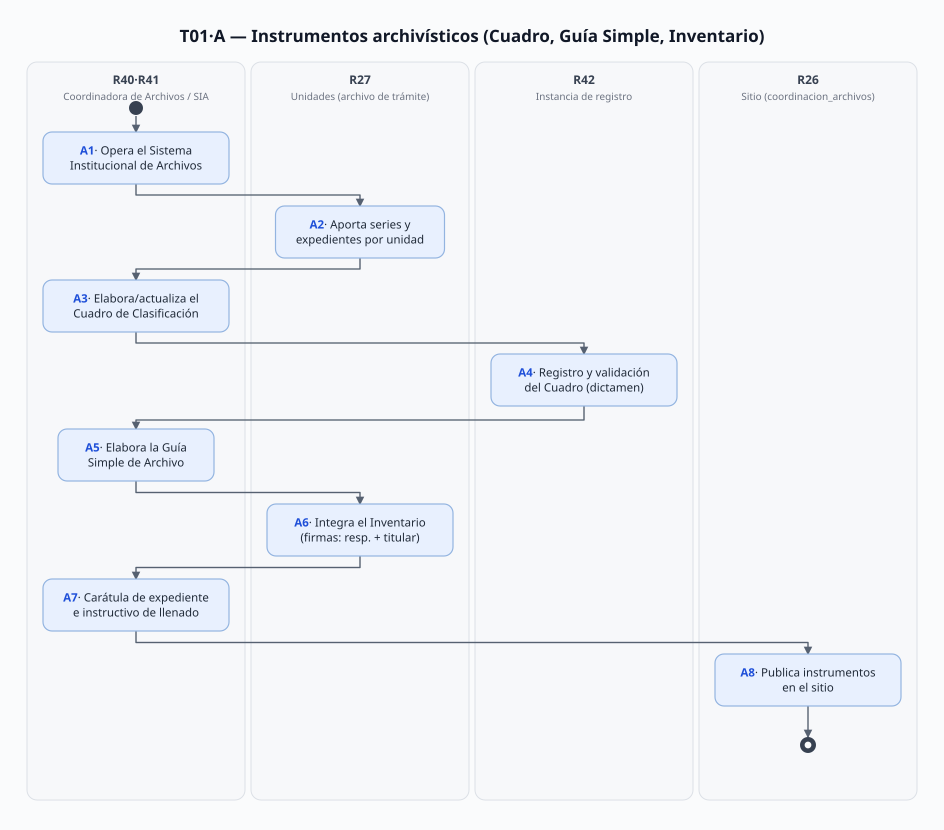
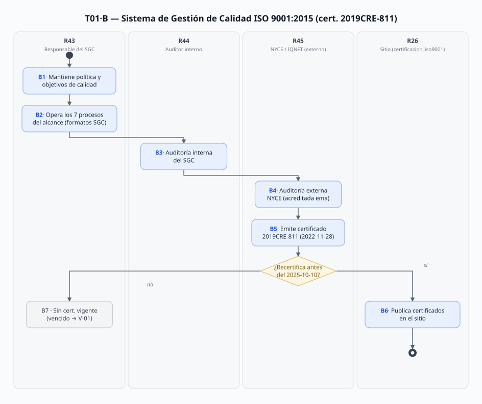
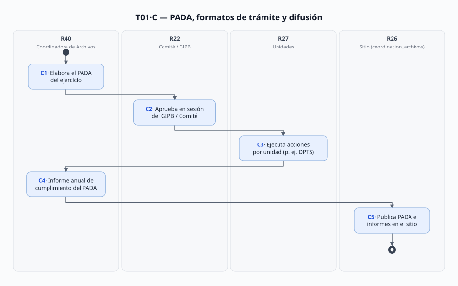

# T-01 · Gestión documental y calidad (ISO 9001 — recertificación vencida 2025-10-10)

> Proceso transversal T-01 (REPARTO 2026-09-22: "gestión documental y la calidad ISO 9001"). Hermano de T-02: T-02 produce el andamiaje normativo; **T-01 controla los documentos y el Sistema de Gestión de Calidad** (SGC) que los RO llaman "formato del Sistema de Gestión de Calidad" (p. ej. el Dictamen Técnico de PA-01·A7).
> Fecha de análisis: 2026-09-23. **Los certificados ISO están escaneados: leídos como imagen** (verificado hoy, con trampa AGENTS aplicada).
> Citación externa de pasos: **T1·A5**, **T1·B4**, **T1·C4** (proceso·paso).

## 1. Objeto y alcance

**Incluye** dos circuitos y un anexo de trámites:
- **Proceso A** — gestión documental archivística: el **Sistema Institucional de Archivos (SIA)** y sus instrumentos de control y consulta (**Cuadro General de Clasificación Archivística**, **Guía Simple de Archivo**, **Inventario General de Archivo**, carátula de expediente);
- **Proceso B** — el **Sistema de Gestión de Calidad ISO 9001:2015** (certificado **2019CRE-811** por NYCE/IQNET): política y objetivos de calidad, operación de los 7 procesos del alcance, auditorías internas y externas, emisión y **recertificación** del certificado;
- **Proceso C** — el **Programa Anual de Desarrollo Archivístico (PADA)**, los formatos de descripción de trámites (Formato 1 DPTS) y la difusión pública de todo lo anterior.

**Fuera del alcance:** la mejora regulatoria y la Normateca (T-02 — los RES_CEMER de la carpeta son insumo de allí); el contenido de los procedimientos por dominio (MF/PA); la archivística de expedientes de beneficiarios como tal (cada PA-## cita este T-01 solo para el control).

## 2. Base documental (claves de cita)

| Clave | Archivo / ubicación | Qué aporta (verificado 2026-09-23) |
|---|---|---|
| [GUIA] | `Docs/Comun/Gestión documental y calidad/GUIA_Simple_Archivo_2026.pdf` (mar-2026) | Objeto: descripción de series conforme al Cuadro; **Área Coordinadora de Archivos** = responsable de vigilar la normatividad archivística con los responsables del Archivo de Trámite (p. 2); marco: Ley General de Archivos, **Ley de Archivos y Administración de Documentos del EdoMéx (26-nov-2020)**, MGO 2025, RI (pp. 3–4) |
| [INVG] | `Docs/Comun/Gestión documental y calidad/INVENTARIO_Gral_Archivo_2025.pdf` (mar-2025) | Fundamento art. 13 Ley General de Archivos; trío de instrumentos (Cuadro + Guía + Inventario); **hoja de inventario con 19 campos** y firmas de **responsable del archivo** y **titular de la unidad** (pp. 2, 6); SIA = resultado del trabajo conjunto (p. 2) |
| [CUADRO] | `Docs/Comun/Gestión documental y calidad/CUADRO_Gral_Clasif_Archivística_2024.pdf` (nov-2024) | Metodología de clasificación/codificación por unidad; anexos: **Carátula de Expediente de Archivo (8.1)**, instructivo (8.2) y **Dictamen de Registro y Validación (8.3)** (pp. 2, 4–5); Criterios técnicos Gaceta 03-may-2023 (p. 5) |
| [CERT-N] | `Docs/Comun/Gestión documental y calidad/CERT_ISO9001_NYCE_2022.pdf` (**escaneado — leído como imagen**) | Certificado **No. 2019CRE-811** NYCE (acreditada ema **85/12**), norma **NMX-CC-9001-IMNC-2015 / ISO 9001:2015**; alcance = 7 procesos; **emisión 2022-11-28 · vigente al 2025-10-10 · certificado desde 2018-08-28**; firma Carlos Manuel Pérez Munguía (DG NYCE) |
| [CERT-I] | `Docs/Comun/Gestión documental y calidad/CERT_ISO9001_IQNET_2022.pdf` (**escaneado — leído como imagen**) | Registro IQNET **MX-2019CRE-811**; ISO 9001:2015; issued 2022-11-28, first issued 2018-08-28, **expires 2025-10-10**; firmas Alex Stoichitoiu (Presidente IQNET) y Pérez Munguía (NYCE) |
| [ISO-HTML] | `Docs/Comun/Sitio web/certificacion_iso9001.html` | Historia (ISO 9001:2000 jun-2004 en "Autorizaciones de Aprovechamiento Forestal Maderable"; 2008 en 2010; 2015 actual); **política, objetivo y 7 procesos del alcance + objetivos de calidad cuantificados**; enlaces `CalidadISO/IQNET20221128.pdf` y `NYCE20221128.pdf` |
| [ARCH-HTML] | `Docs/Comun/Sitio web/coordinacion_archivos.html` | Definición del Área Coordinadora (Ley de Archivos art. 4 fr. XI); **serie PADA/PIDA 2020–2026** con informes anuales, Cuadros 2020/2021/2022/2024, Guías 2025/2026, Inventarios 2025 y **2026 (en SharePoint de UIPPE)**, actas del SIA y del **Grupo Interdisciplinario (GIPB)** y sus reglas de operación |
| [DPTS] | `Docs/Comun/Gestión documental y calidad/FORMATO_Ficha_Dato_Tramite_Servicio.pdf` (**escaneado — leído como imagen**) | **Formato 1 DPTS "Descripción del Programa por Trámite y/o Servicio"** del Programa Anual de Mejora Regulatoria **2020** de CEMER: clave `221C03010`, **18 trámites/servicios**, 1 acción 2020 = "Estudio de análisis geoespacial" (reporte 12/2020, **DRFF**); firmas 28/31-oct-2019: **Zahidi Tatiana Díaz Salgado** (Dir. Restauración y Fomento Forestal), **Lucía Margarita Burciaga Valdez** (Enlace MR, UIPPE), **Edgar Conzuelo Contreras** (DG 2019) |
| [PROT-VV] | `Docs/Comun/Gestión documental y calidad/RES_CEMER_Aprueba_Prot_VisitaVerificación_2020.pdf` | Exención CEMER (29-jul-2020, Enlace Edgar Tinoco González; DGI oficio 20706006L-0723/2020) del **"Procedimiento: Visita de Verificación y Emisión de la Evaluación Técnica de Factibilidad de Transformación Forestal"** (UAZC + Depto. Inspección y Vigilancia) — ejemplo de **procedimiento documentado** del organismo (vínculo X-03·momento 7 y MF-07) |
| [DIR] | `Docs/Comun/Sitio web/directorio.html` | **Sergio Edgar Díaz Bernal, Jefe del Departamento de Gestión Documental y Administración de Archivos** (l. 370–371, probosque.archivo@); Diana Martínez Silva, Jefa de Área, probosque.auditoria@ (l. 323) |
| [RO-§17] | los 5 RO (PSAH p. 21 · RHF p. 19 · CC p. 19 · PS p. 20 · MFS p. 27) | Mandato de **auditorías ISO internas y externas** ("empresa acreditada") sobre el proceso certificado — este T-01 es el cumplimiento de esa cláusula |

> Los certificados [CERT-N]/[CERT-I] y [DPTS] están **escaneados sin capa de texto**: verificados renderizándolos como imagen hoy (trampa AGENTS). El resto de `Gestión documental y calidad/` (7 RES_CEMER y LINEAMIENTOS) pertenece al ciclo de mejora regulatoria → **T-02**.

## 3. Glosario de siglas

| Sigla | Significado |
|---|---|
| CGCA | Cuadro General de Clasificación Archivística (instrumento técnico de la estructura del archivo por atribuciones y funciones) |
| DPTS | Formato 1 "Descripción del Programa por Trámite y/o Servicio" del Programa Anual de Mejora Regulatoria (CEMER) |
| ema | Entidad Mexicana de Acreditación (acredita a NYCE con el número 85/12) |
| GIPB | Grupo Interdisciplinario de PROBOSQUE (colegiado archivístico con reglas de operación propias, 2022 y 2025/2026) |
| IQNET | Red internacional de organismos de certificación (NYCE es miembro; emite el registro MX-…) |
| NYCE | Normalización y Certificación NYCE, S.C. — organismo de certificación del SGC |
| PADA / PIDA | Programa (antes Plan) Institucional/Anual de Desarrollo Archivístico |
| SGC | Sistema de Gestión de la Calidad (ISO 9001) |
| SIA | Sistema Institucional de Archivos de PROBOSQUE |
| UAZC | Unidad de Atención a Zonas Críticas (aparece en el Prot. Visita de Verificación) |

## 4. Roles (personificados)

| ID | Rol | Puesto y titular (fuente) | Tipo |
|---|---|---|---|
| R40 | Área Coordinadora de Archivos / **Departamento de Gestión Documental y Administración de Archivos**: promueve y vigila la normatividad archivística y coordina las áreas operativas del SIA | **Sergio Edgar Díaz Bernal**, Jefe de Departamento ([DIR] l. 370–371) | Interno |
| R41 | Responsable del **Archivo de Trámite** de cada unidad administrativa (el "bibliotecario" de su unidad: integra inventarios y carátulas) | ⚠️ uno por unidad, nombres no listados en [DIR] → **V-03** | Interno |
| R27 | Titulares de unidad administrativa — **firman el Inventario** con el responsable del archivo [INVG] p. 6 | los del [DIR] (p. ej. DRFF: Emmanuel Mondragón Romero) | Interno |
| R42 | Instancia de **registro y validación** del CGCA (expide el "Dictamen de Registro y Validación", anexo 8.3 del [CUADRO]) | ⚠️ instancia estatal no nombrada en las fuentes → **V-02** | Externo destino |
| R43 | Responsable del **SGC** (opera política, objetivos y formatos; prepara la certificación) | ⚠️ unidad no nombrada: ¿UCSyTI, UIPPE o una "Representante de la Dirección" del certificado? → **V-04** | Interno |
| R44 | Auditor **interno** del SGC | ⚠️ no identificado (candidata: **Diana Martínez Silva**, Jefa de Área, probosque.auditoria@ [DIR] l. 323) → **V-04** | Interno |
| R45 | **NYCE / IQNET** (organismo de certificación externo) | **Carlos Manuel Pérez Munguía**, DG de NYCE [CERT-N]; **Alex Stoichitoiu**, Presidente IQNET [CERT-I] | Externo 「fuera de alcance del SGD」 |
| R22 | **GIPB / Comité** archivístico: aprueba reglas de operación y sesiona (actas 2022, 2026) [ARCH-HTML] | integración nombrada solo en actas (no capturadas) → **V-03** | Colegiado 「posible fuera de alcance」 |
| R26 | Operador del sitio: publica instrumentos y certificados en `coordinacion_archivos` / `certificacion_iso9001` | UCSyTI (Ana Yaritzy Medina Eleno) + Agencia Digital (cf. T-02·R26) | Interno + externo |

## 5. Funciones y actividades por rol

| Rol | Función en T-01 | Pasos |
|---|---|---|
| R40 | Vigilar la normatividad archivística; coordinar el SIA; elaborar CGCA, Guía e Inventario; PADA e informe anual | A1–A8, C1, C4–C5 |
| R41·R27 | Aportar series/expedientes, integrar inventarios y carátulas, firmar el inventario de su unidad | A2, A6–A7, C3 |
| R42 | Registrar y validar el CGCA (dictamen) | A4 |
| R43 | Operar los 7 procesos del alcance del SGC con sus formatos; sostener política y objetivos de calidad | B1–B2 |
| R44 | Auditoría interna del SGC | B3 |
| R45 | Auditoría externa, emisión y renovación del certificado | B4–B5 |
| R22 | Aprobar reglas del GIPB y acciones del PADA | C2 |
| R26 | Publicar instrumentos, informes y certificados en el sitio | A8, C5, B6 |

## 6. Reglas de negocio

- **BR-1** El **Área Coordinadora de Archivos** promueve y vigila el cumplimiento de las disposiciones en materia de gestión documental y coordina las áreas operativas del SIA (Ley de Archivos y Administración de Documentos del EdoMéx, **art. 4 fr. XI**) [ARCH-HTML].
- **BR-2** Todo sujeto obligado debe contar con **instrumentos de control y consulta archivísticos** actualizados y disponibles — en PROBOSQUE el trío es **CGCA + Guía Simple + Inventario General** (art. 13 Ley General de Archivos; Ley de Archivos EdoMéx 26-nov-2020) [INVG p. 2; GUIA pp. 2–4].
- **BR-3** El CGCA se somete a **registro y validación** (Dictamen de Registro y Validación, anexo 8.3) conforme a los **Criterios técnicos** de Gaceta 03-may-2023 [CUADRO pp. 5 y anexos].
- **BR-4** Cada hoja del Inventario se **firma por el responsable del archivo y el titular de la unidad administrativa** (19 campos: fondo/subfondo, serie, fórmula clasificadora, legajos, documentos, fechas, ubicación física) [INVG p. 6].
- **BR-5** El SGC está certificado bajo **NMX-CC-9001-IMNC-2015 / ISO 9001:2015** por NYCE (acreditada ema 85/12, reconocida por IQNET): certificado **2019CRE-811** (registro IQNET MX-2019CRE-811), emitido 2022-11-28, **vigente únicamente hasta el 2025-10-10**, con antigüedad desde 2018-08-28 [CERT-N; CERT-I].
- **BR-6** **Alcance del SGC = 7 procesos**: resolutivos para aprovechamientos/registro de plantaciones comerciales/saneamiento forestal; producción de planta; asesoría para plantaciones comerciales; estímulos para protección, conservación, restauración y manejo forestal (= los programas PA-##); prevención y combate de incendios; asistencia técnica; desarrollo de la investigación [CERT-N; ISO-HTML]. El sitio afirma que es el "único proceso certificado en materia forestal a nivel nacional con funciones descentralizadas" [ISO-HTML].
- **BR-7** **Objetivos de calidad cuantificados** por proceso (2026 publicados): −20% tiempos en resolutivos; 90% de abasto de planta; 150 asesorías/año; mínimo 90% de metas de los programas de estímulos (= superficie beneficiada o estudios y certificaciones — el KPI de los PA); 700 km de brechas cortafuego + 600 ha de quemas controladas + 140 km de líneas negras; 100% de reportes de incendios con tolerancia 3% en el índice de afectación; 1,950 personas capacitadas + 25 eventos; 2 proyectos de investigación [ISO-HTML].
- **BR-8** Los RO mandan **auditorías internas y externas ISO** ("empresa acreditada") sobre el proceso certificado, además de OSFEM/Contraloría/OIC [RO-§17] — cumplimiento = **B3–B5** de este proceso.
- **BR-9** El **PADA** se elabora, aprueba, ejecuta e informa cada año y se publica en el sitio (serie PIDA 2020 → PADA 2021–2026 con informes 2020–2025) [ARCH-HTML].
- **BR-10** Los procedimientos internos del organismo se documentan y pasan por **mejora regulatoria** (exención/AIR vía SAIR) antes de regir — ej. el Procedimiento de Visita de Verificación de la UAZC (exención CEMER 29-jul-2020) [PROT-VV] — nexo con T-02·C.
- **BR-11** El certificado es válido "siempre que se cumpla de manera permanente con los requisitos… salvo **suspensión o retiro** notificados por NYCE" [CERT-N letra pequeña]: sin recertificación capturada, la vigencia declarada por el sitio es **contradictoria con la fecha del certificado** (V-01).

## 7. Procedimiento

### Proceso A — Instrumentos de control y consulta archivísticos

- **A1** R40 opera el **Sistema Institucional de Archivos (SIA)**: actas de instalación y sesiones (2022, 2026) y **reglas de operación del GIPB** [ARCH-HTML].
- **A2** R41 (responsables de Archivo de Trámite) **aportan series y expedientes** de su unidad [GUIA p. 2].
- **A3** R40 **elabora/actualiza el CGCA** (2020 → 2021 → 2022 → 2024): fórmula clasificadora por unidad y serie [CUADRO pp. 6–15].
- **A4** R42 **registra y valida** el CGCA y expide el **Dictamen de Registro y Validación** [CUADRO anexo 8.3] ⚠️ instancia → V-02.
- **A5** R40 elabora la **Guía Simple de Archivo** (2025 y 2026): descripción de series conforme al CGCA [GUIA].
- **A6** R41+R27 integran y **firman el Inventario General de Archivo** (2025 capturado; 2026 solo en SharePoint de UIPPE → **V-05**) [INVG p. 6].
- **A7** R40 expide la **Carátula de Expediente de Archivo** y su instructivo de llenado [CUADRO anexos 8.1–8.2].
- **A8** R26 **publica** los instrumentos en `coordinacion_archivos` [ARCH-HTML].

### Proceso B — Sistema de Gestión de Calidad ISO 9001:2015

- **B1** R43 sostiene la **política y los objetivos de calidad** publicados (BR-7) [ISO-HTML].
- **B2** R43 opera los **7 procesos del alcance** con los **formatos del SGC** (p. ej. el formato "Dictamen Técnico" citado por los RO → PA-01·V-05; procedimientos documentados como el Prot. Visita de Verificación [PROT-VV]).
- **B3** R44 ejecuta la **auditoría interna** del SGC ⚠️ sin evidencia capturada → **V-04** (el mandato está en [RO-§17]).
- **B4** R45 (**NYCE**, acreditada ema 85/12) ejecuta la **auditoría externa** de certificación/renovación.
- **B5** NYCE **emite el certificado 2019CRE-811** (2022-11-28; vigencia hasta **2025-10-10**; antigüedad desde 2018-08-28) + registro IQNET MX-2019CRE-811 [CERT-N; CERT-I].
- **B6** R26 **publica los certificados** en `certificacion_iso9001` (`CalidadISO/NYCE20221128.pdf`, `IQNET20221128.pdf`) [ISO-HTML].
- **B7** **Recertificación antes del 2025-10-10**: ⚠️ **no hay certificado posterior** en el repo ni en el sitio (hoy 2026-09-23 el sitio sigue publicando los de 2022 con vigencia vencida) → **V-01**.

### Proceso C — PADA, formatos de trámite y difusión

- **C1** R40 elabora el **PADA** del ejercicio (PIDA 2020 → PADA 2021–2026) [ARCH-HTML].
- **C2** El **GIPB/Comité** lo aprueba en sesión (reglas de operación 2022, 2025, 2026) [ARCH-HTML].
- **C3** Las unidades **ejecutan las acciones** programadas — p. ej. el **Formato 1 DPTS** del PMR 2020: 18 trámites/servicios declarados y la acción "Estudio de análisis geoespacial" (reporte 12/2020, DRFF) [DPTS] — nexo con X-01 y T-02·C.
- **C4** R40 integra el **Informe Anual de Cumplimiento del PADA** (2020–2025 publicados) [ARCH-HTML].
- **C5** R26 publica PADA, informes, actas y reglas en `coordinacion_archivos` [ARCH-HTML].

## 8. Diagramas de actividad

Generados por `Docs/Joni/Diagramas/T01/gen-diagramas.mjs` (editar el script, no los `.svg`).

## 9. Tabla de necesidades

| ID | Rol | Necesidad | P | Paso | Origen |
|---|---|---|---|---|---|
| N-01 | R41 | Saber **cómo se clasifica y codifica** cada expediente de su unidad (fórmula clasificadora vigente) | A | A3, A7 | [CUADRO] pp. 4–5 ("aplicar los procedimientos generales para la clasificación y codificación") |
| N-02 | R40 | Mantener **CGCA, Guía e Inventario sincronizados** con la estructura real (cada reforma del MGO cambia unidades) | A | A3–A6 | [INVG] p. 2; [GUIA] p. 2 — el MGO 2025 (dic-2025) es posterior al CGCA 2024 (nov-2024) ⚠️ posible desfase |
| N-03 | R41·R27 | **Firmar el inventario** de su unidad con datos verificables (legajos, fechas, ubicación física) | A | A6 | [INVG] p. 6 (firmas obligatorias) |
| N-04 | R43 | Contar con los **formatos del SGC** vigentes (Dictamen Técnico, minutas, etc.) para operar los 7 procesos del alcance | B | B2 | [RO-§17]; [ISO-HTML] alcance; formato "Dictamen Técnico" citado por [RO-PSAH] p. 8 → PA-01·V-05, X-03·V-01 |
| N-05 | R44 | **Programa y evidencias de auditoría interna** (plan anual, hallazgos, acciones correctivas) | B | B3 | [RO-§17] ("auditorías internas… se verificará la conformidad") ⚠️ nada capturado → V-04 |
| N-06 | R43 | **Recertificar a tiempo**: agenda de auditoría externa NYCE antes de cada vencimiento (hoy vencido) | B | B4–B7 | [CERT-N] "vigente al 2025-10-10"; [BR-11] |
| N-07 | R26 | Publicar **certificados e instrumentos vigentes** sin que la página contradiga los documentos (el sitio dice "actualmente certificado") | B | B6 | [ISO-HTML] vs [CERT-N] — contradicción verificada hoy |
| N-08 | R40 | Un **PADA con acciones trazables por unidad** y su informe anual (patrón DPTS: trámite → acción → unidad → fecha) | C | C1–C4 | [DPTS]; [ARCH-HTML] serie 2020–2026 |
| N-09 | R27 | Localizar cualquier expediente por **fórmula clasificadora + ubicación física** (memoria institucional y transparencia) | A | A5–A6 | [GUIA] p. 4 ("facilitar la localización… acceso a la memoria institucional") |

## 10. Registros que el SGD debe gestionar (catálogo documental)

| Registro | Identificador | Fuente |
|---|---|---|
| CGCA (cada versión) | año (2020, 2021, 2022, 2024…) + Dictamen de Registro y Validación | [CUADRO]; [ARCH-HTML] |
| Guía Simple de Archivo | año (2025, 2026) | [GUIA]; [ARCH-HTML] |
| Inventario General de Archivo | año + unidad + firma de responsable y titular | [INVG]; [ARCH-HTML] (2026 → **V-05**) |
| Carátula de Expediente de Archivo | fórmula clasificadora + no. de expediente | [CUADRO] anexos 8.1–8.2 |
| Certificados ISO (NYCE e IQNET) | cert. 2019CRE-811 / MX-2019CRE-811 + fechas emisión/vigencia | [CERT-N]; [CERT-I] |
| Programa y evidencias de auditoría (interna/externa) | ejercicio + plan + hallazgos | ⚠️ → **V-04** |
| PADA / PIDA + Informe anual de cumplimiento | ejercicio (2020–2026) | [ARCH-HTML] |
| Formato 1 DPTS y acciones por trámite | clave `221C03010` + trámite + año | [DPTS] |
| Actas y reglas del SIA / GIPB | sesión + año (2022, 2026) | [ARCH-HTML] |
| Procedimientos documentados del organismo | título + exención/AIR CEMER asociada | [PROT-VV]; T-02 |

## 11. Vacíos y siguientes pasos

### 11.1 Tabla de vacíos

| ID | Qué falta en el mundo real | Evidencia de que es vacío (2026-09-23) | Cómo se cierra | Afecta |
|---|---|---|---|---|
| **V-01** | **Certificado ISO 9001 vigente**: el único disponible (repo y sitio) vence el **2025-10-10** y no hay recertificación 2025/2026 ni acta de suspensión/retiro. El sitio dice "actualmente el organismo se encuentra certificado" — contradicción con la fecha del certificado | [CERT-N] "Vigente al: 2025-10-10"; [CERT-I] "Expires on: 2025-10-10"; [ISO-HTML] sin versión posterior (los enlaces `CalidadISO/…20221128.pdf` siguen siendo los de 2022) | Pedir el certificado reciente a NYCE/área del SGC; si fue suspendido/retirado, corregir el sitio | B5–B7 · N-06, N-07 (y la cláusula ISO de los RO §17) |
| **V-02** | La **instancia que registra y valida el CGCA** y su dictamen: el anexo 8.3 existe en blanco y ninguna fuente nombra al órgano receptor (¿Archivo General del Estado? ¿CEMER?) | [CUADRO] anexo 8.3 sin diligenciar; [GUIA]/[INVG] citan la Ley de Archivos sin nombrar la instancia | Entrevista a R40 (Sergio Edgar Díaz Bernal) | A4 · N-2 |
| **V-03** | **Personificación del SIA/GIPB**: nombres de los responsables del Archivo de Trámite por unidad y de la integración vigente del GIPB (solo hay actas 2022/2026 sin capturar) | [DIR] solo nombra al Jefe de Departamento; [ARCH-HTML] enlaza actas sin integrantes | Capturar las actas del sitio + entrevista R40 | A1–A2, A6 · N-3 |
| **V-04** | La **operación del SGC**: unidad responsable formal, auditor interno, programa de auditorías internas y sus hallazgos; catálogo de **formatos del SGC** (el "Dictamen Técnico" de PA-01·V-05 y demás) | [ISO-HTML] publica política/objetivos pero no organigrama del SGC ni formatos; [RO-§17] exige las auditorías sin evidencia; candidata Diana Martínez Silva (probosque.auditoria@) sin confirmar | Entrevista a R40/R43 + pedir el manual de calidad y el catálogo de formatos | B2–B3 · N-4, N-5 (→ X-03·V-01) |
| **V-05** | El **Inventario General de Archivo 2026** no está en el repo: el sitio lo enlaza a un **SharePoint de UIPPE** (URL con caducidad) — solo el de 2025 está capturado | [ARCH-HTML] enlace `gobedomex-my.sharepoint.com/…Inventarios General de Archivos 2026.pdf` | Descargar desde el enlace del sitio a `Docs/Comun/Gestión documental y calidad/` (tarea) | A6 · N-3, N-9 |
| **V-06** | **Desfase de versión CGCA vs. estructura**: el CGCA es de nov-2024 y el MGO vigente es del 16-dic-2025 (reordenó unidades: SSA/MIF, UJIGEV…) — ¿está actualizada la fórmula clasificadora? | [CUADRO] nov-2024 vs [GUIA] mar-2026 que ya cita el MGO 2025 (el marco normativo del [INVG] 2025 aún cita el MGO 2023) | Contrastar el CGCA 2024 con la estructura MGO 2025 (tarea de análisis) | A3 · N-2 |

### 11.2 Cerrados durante este análisis (2026-09-23)

- **Lectura de los dos certificados ISO escaneados como imagen** (trampa AGENTS cumplida): datos del certificado 2019CRE-811 / MX-2019CRE-811, alcance de 7 procesos, ema 85/12 y —el dato clave— **vigencia 2022-11-28 → 2025-10-10**, verificada en NYCE e IQNET por separado.
- Identificación real del **Formato 1 DPTS** (PMR 2020, clave 221C03010, 18 trámites, acción "análisis geoespacial" a cargo de DRFF) — la "ficha de dato de trámite" del README era este formato de CEMER.
- Personificación del área archivística: **Sergio Edgar Díaz Bernal** (Jefe de Gestión Documental y Administración de Archivos) — cierra la búsqueda de "quién vigila la normatividad archivística".
- Mapeo de la serie **PADA 2020–2026** completa con sus informes anuales en el sitio (patrón estable: programa + informe por ejercicio).
- Localización del **Procedimiento de Visita de Verificación UAZC** (exención CEMER 2020) como ejemplo real de procedimiento documentado del organismo.

### 11.3 Tareas nuestras (no vacíos)

- T-1: descargar el **Inventario 2026** desde el SharePoint del sitio (cierra V-05) y capturar las actas del SIA/GIPB (V-03).
- T-2: guion de entrevista a R40 (Díaz Bernal) cubriendo V-02, V-04 y el desfase V-06.
- T-3: pedir el **catálogo de formatos del SGC** (V-04) y enlazarlo en **X-03·V-01** (formatos sin FO-PB) — es la misma cadena de vacíos.
- T-4: alertar al equipo/docencia del **certificado vencido** (V-01): es el hallazgo de calidad más visible del proyecto y alimenta el énfasis 5 (fiscalización) junto con [RO-§17].

## 12. Insumos y productos por paso

> Una fila por paso del §7. Rutas reales en `Docs/Comun/` o `[clave]` + página; sistemas externos con su campo. Huecos → `V-##`.

| Paso | Documento / dato de entrada | Datos que se capturan / procesan | Documento de salida |
|---|---|---|---|
| **A1** — operación del SIA | Actas de instalación y sesiones del SIA/GIPB (en `coordinacionDeArchivos/` del sitio — no capturadas → **V-03**); reglas de operación del GIPB (2022, 2025, 2026) | Integración del GIPB, acuerdos, calendario de sesiones | **Actas y reglas de operación del SIA/GIPB** (publicadas en [ARCH-HTML]) |
| **A2** — aportación de series | Expedientes y series producidos en cada unidad (Archivos de Trámite — responsables → **V-03**) | Serie/subserie, volumen de expedientes, unidad productora | **Relación de series por unidad** (insumo del CGCA) |
| **A3** — elaboración del CGCA | Relación de A2; estructura funcional del **MGO 2025** `Docs/Comun/Manual Jurídico/dic161d.pdf`; Criterios técnicos Gaceta 03-may-2023 [CUADRO] p. 5 | Fórmula clasificadora (unidad-sección-serie), códigos, delimitación de series | **Cuadro General de Clasificación Archivística** (versión 2024 capturada: `Gestión documental y calidad/CUADRO_Gral_Clasif_Archivística_2024.pdf`) |
| **A4** — registro y validación | CGCA de A3 + anexo 8.3 "Dictamen de Registro y Validación" | Datos de registro, observaciones de la instancia | **Dictamen de Registro y Validación del CGCA** (formato existe en blanco; instancia emisora → **V-02**) |
| **A5** — Guía Simple | CGCA validado [GUIA] pp. 2–4 | Descripción de series: características fundamentales y control | **Guía Simple de Archivo 2026** (`Gestión documental y calidad/GUIA_Simple_Archivo_2026.pdf`; serie 2025–2026 en el sitio) |
| **A6** — Inventario General | Expedientes por unidad (A2); hoja de inventario de 19 campos [INVG] p. 6 | No. progresivo, no. de expediente, serie, fórmula, nombre, legajos, documentos, fechas, ubicación física | **Inventario General de Archivo** firmado por responsable del archivo y titular (2025 capturado; 2026 → **V-05**) |
| **A7** — carátula de expediente | CGCA (fórmula clasificadora) [CUADRO] anexos 8.1–8.2 | Código del expediente, título, fechas, unidad | **Carátula de Expediente de Archivo** (formato definido en el [CUADRO]) |
| **A8** — publicación | Instrumentos de A3–A7 | Versión y fecha de publicación | Instrumentos publicados en `Docs/Comun/Sitio web/coordinacion_archivos.html` (mecanismo de carga → T-02·V-06) |
| **B1** — política y objetivos | Política y objetivos de calidad aprobados [ISO-HTML] | Metas cuantificadas por proceso (BR-7) | **Política y objetivos de calidad** publicados en `certificacion_iso9001.html` |
| **B2** — operación del alcance | Formatos del SGC (Dictamen Técnico → **PA-01·V-05**; catálogo → **V-04**); procedimientos documentados (p. ej. `Gestión documental y calidad/RES_CEMER_Aprueba_Prot_VisitaVerificación_2020.pdf`) | Evidencias de operación de los 7 procesos (resoluciones, dictámenes, minutas, informes) | Registros del SGC por proceso (catálogo sin publicar → **V-04**) |
| **B3** — auditoría interna | Plan de auditoría anual + registros de B2 [RO-§17] | Hallazgos, no conformidades, acciones correctivas | **Informe de auditoría interna** y acciones (sin evidencia capturada → **V-04**) |
| **B4** — auditoría externa NYCE | Sistema documentado + evidencias (B2–B3) | Resultado de la auditoría de certificación/renovación | **Informe de auditoría NYCE** (externo al SGD 「fuera de alcance」) |
| **B5** — emisión del certificado | Resultado de B4 | No. de certificado, fechas, alcance | **Certificado NYCE 2019CRE-811** + **registro IQNET MX-2019CRE-811** (emitidos 2022-11-28; vigencia hasta **2025-10-10**) |
| **B6** — publicación | Certificados de B5 | Archivos PDF para el sitio | `Docs/Comun/Sitio web/certificacion_iso9001.html` con `CalidadISO/NYCE20221128.pdf` e `IQNET20221128.pdf` |
| **B7** — recertificación | Vigencia de B5 (venció 2025-10-10) | Programación de la auditoría de renovación | **Nuevo certificado** (no existe en fuentes → **V-01**) o acta de suspensión/retiro |
| **C1** — PADA | Diagnóstico archivístico + acciones por unidad; precedente [DPTS] (`FORMATO_Ficha_Dato_Tramite_Servicio.pdf`: 18 trámites, acciones con unidad y fecha) | Acciones programadas por ejercicio con unidad responsable y fecha de cumplimiento | **Programa Anual de Desarrollo Archivístico** (PADA 2021–2026; antes PIDA 2020) |
| **C2** — aprobación | PADA de C1; reglas del GIPB | Acuerdo de aprobación en sesión | **Acta del GIPB/Comité** con el PADA aprobado (→ **V-03**) |
| **C3** — ejecución de acciones | PADA aprobado + **Formato 1 DPTS** por trámite [DPTS] (clave `221C03010`) | Avance por acción (p. ej. "Estudio de análisis geoespacial" → reporte 12/2020, DRFF) | Reportes de acción por trámite (patrón DPTS; nexo con X-01 y T-02·C) |
| **C4** — informe anual | Avances de C3 [ARCH-HTML] serie de informes 2020–2025 | % de cumplimiento del PADA | **Informe Anual de Cumplimiento del PADA** |
| **C5** — difusión | PADA, informes, actas (C1–C4) | Publicación en el sitio | Serie publicada en `Docs/Comun/Sitio web/coordinacion_archivos.html` |
