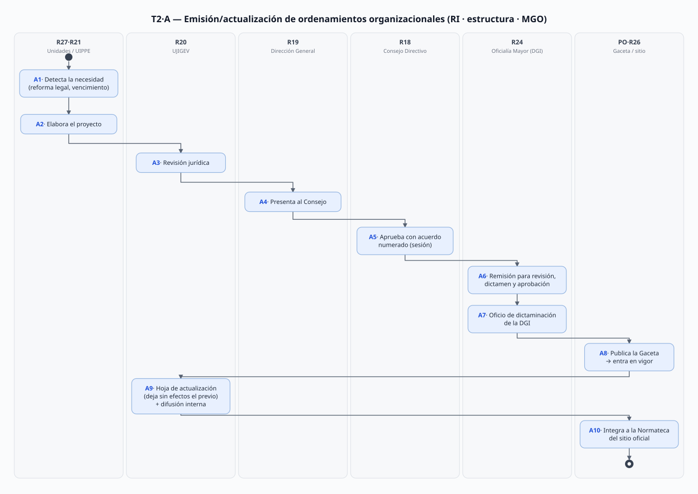
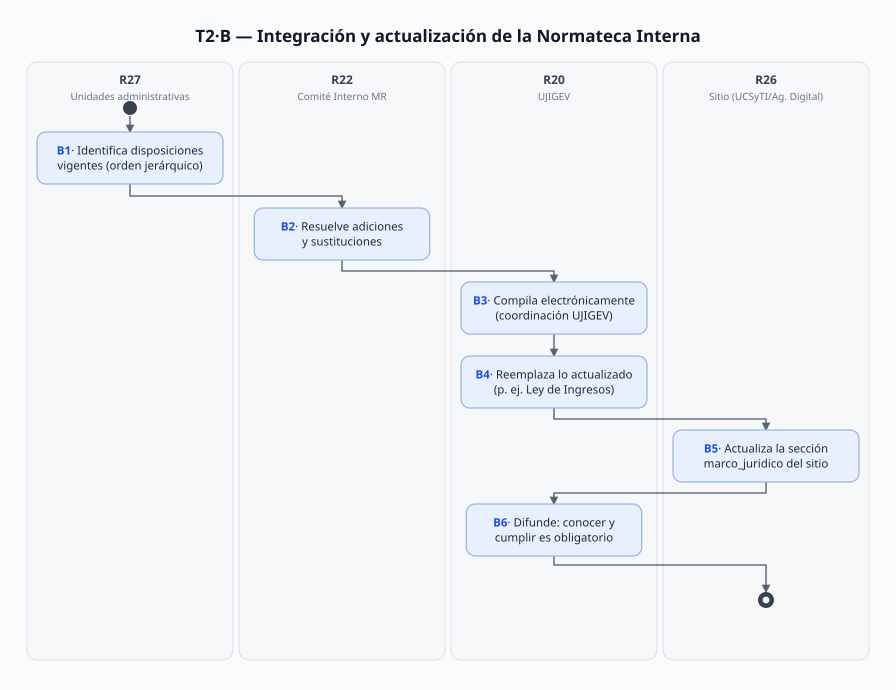
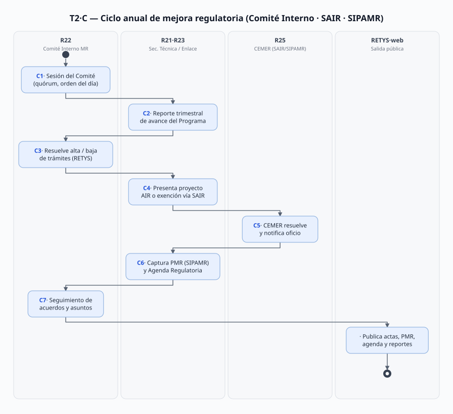

# T-02 · Marco jurídico e institucional (Normateca, mejora regulatoria y ordenamientos organizacionales)

> Proceso transversal T-02 (README: da los roles reales que todos los demás análisis necesitan).
> Fecha de análisis: 2026-09-21. Método: búsqueda de referencias en todas las fuentes → mapa de fuentes → roles → flujo → diagramas → necesidades con doble check → vacíos.
> Citación externa de pasos: **T2·A5**, **T2·B3**, **T2·C4** (proceso·paso).

## 1. Objeto y alcance

**Incluye** el ciclo de vida del marco normativo y administrativo del organismo:
- **Proceso A** — emisión y actualización de los ordenamientos organizacionales propios (Reglamento Interno, estructura orgánica, Manual General de Organización y demás disposiciones de organización), desde la propuesta hasta su publicación en la Gaceta del Gobierno;
- **Proceso B** — integración, actualización y difusión de la **Normateca Interna** (inventario electrónico del marco jurídico vigente, publicado en el sitio web);
- **Proceso C** — ciclo anual de **mejora regulatoria** (Comité Interno de Mejora Regulatoria: programa, agenda regulatoria, reportes trimestrales, altas/bajas de trámites RETYS, análisis de impacto regulatorio vía SAIR/CEMER).

**Fuera del alcance (procesos hermanos):** la gestión documental archivística de los documentos administrativos (T-01); el contenido de cada RO de programa (PA-01); los procedimientos de cada dominio (G##, GS##, MF-##, E-##) — este proceso produce y mantiene *el andamiaje* que ellos citan como fundamento.

## 2. Base documental (claves de cita)

| Clave | Archivo / ubicación | Qué aporta |
|---|---|---|
| [MGO25] | `Docs/Comun/Manual Jurídico/dic161d.pdf` — Manual General de Organización 2025, Gaceta 16-dic-2025, Tomo CCXX No. 112 | Estructura, atribuciones del Consejo (art. 9), DG (art. 10), funciones por unidad (pp. 15–36), validación (p. 37), aprobación y hoja de actualización (p. 38), dictaminación y créditos (p. 39) |
| [MGO12] | `Docs/Comun/Manual Jurídico/may281.pdf` — MGO 2012, Gaceta 28-may-2012, Tomo CXCIII No. 98 | Primer MGO en el repo; índice con estructura de la época (línea genealógica) |
| [RI] | `Docs/Comun/Manual Jurídico/rglvig245.pdf` — Reglamento Interno vigente, publicado Gaceta 12-ene-2017, **última reforma 14-nov-2025** | Arts. 6–9: dirección y gobierno (Consejo: composición y atribuciones, fr. IV); art. 10: DG |
| [DIR] | `Docs/Comun/Manual Jurídico/Directorio.txt` | Titulares 2026 por unidad |
| [MOR-N] | `Docs/Comun/Manual Jurídico/manualDeOperacionNormatecaInterna.pdf` — Manual de Operaciones de la Normateca Interna, enero 2020 | Objetivo, alcance, integración jerárquica, operación y actualización de la Normateca; definiciones (Comité Interno, Enlace) |
| [ACTA25] | `Docs/Comun/Manual Jurídico/Normateca/ACTA_1a_Sesion_Ordinaria_Comite_2025.pdf` (escaneado; verificado visualmente 2026-09-21) | Sesión 20-mar-2025: integración real del Comité, fundamento (arts. 27–28 Ley MR; arts. 23/26/27/29 Reglamento MR; arts. 4 y 7 fr. IV del Acuerdo creador), orden del día |
| [AGENDA25] | `.../Normateca/AGENDA_REGULATORIA_2025.pdf` (escaneado; formato CEMER de 19 campos; verificado 2026-09-21) | 7 propuestas regulatorias 2025-26 (RO PSAHEM modif. ID-RETYS 51; Restauración Hidrológico-Forestal **creación** ID 627; Capturando Carbono modif. ID 309…); presentación 23-oct-2025 |
| [PMR26] | `.../Normateca/PMR_2026.pdf` — impresión del **Sistema del SIPAMR**, periodo 2026 | Programa anual en SIPAMR; diagnóstico de la regulación vigente; DAFO con debilidades auto-declaradas ("fundamentación jurídica identificada de manera incorrecta", "plataformas no actualizadas periódicamente") |
| [DICT-LINE] | `.../Normateca/LINEAMIENTOS_Comite_Interno_MejoraRegulatoria.pdf` (escaneado; 01-oct-2019) | Dictamen CEMER–SAIR de **exención de AIR** del "Acuerdo por el que se crea el Comité Interno de Mejora Regulatoria… y se establecen los Lineamientos" (dirigido a la Enlace 2019, Mtra. Lucía Margarita Burciaga Valdez) |
| [DICT-RI] | `.../Normateca/DICTAMEN_AIR_Reglamento_Interno.pdf` (09-oct-2019) | Exención de AIR de la reforma 2019 al Reglamento Interno, vía SAIR |
| [MJ-HTML] | `Docs/Comun/Sitio web/marco_juridico.html` | La Normateca publicada: inventario jerárquico (constituciones → tratados → leyes generales/federales/locales → códigos → reglamentos → decreto 191 → convenios → lineamientos/criterios/NOM → **manuales** → acuerdos → otros) |
| [MR-HTML] | `Docs/Comun/Sitio web/mejora-regulatoria.html` | Serie documental 2018–2026 del ciclo de mejora (PMR, agendas, actas de sesiones, reportes trimestrales, AIR/dictámenes, lineamientos del Comité) con URLs reales en `probosque.edomex.gob.mx/sites/.../mejoraRegulatoria/...` |
| [FUNC] | `Docs/Comun/Sitio web/funciones.html` | Atribuciones del organismo: art. 3.17 del Código para la Biodiversidad (última reforma del Código: **16-jun-2026**) |
| [ANTEC] | `Docs/Comun/Sitio web/antecedentes.html` | Genealogía jurídica: Decreto 124 (13-jun-1990, creación OPD), sectorizaciones 1992–2011, Código 2006 (Decreto 183), Decreto 191 (29-sep-2020 → Secretaría del Campo) |
| [TITULAR] | `Docs/Comun/Sitio web/titular.html` | DG actual: Mtro. Alejandro Santiago Sánchez Vélez |
| [COD-CON] | `Docs/Comun/Manual Jurídico/mar271h.pdf` — Código de Conducta y Reglas de Integridad, Gaceta 27-mar-2026 | Ejemplo reciente del ciclo A→B completo (DG firma, Gaceta, Normateca lo lista) |
| [MP2020] | `Docs/Comun/Manual Jurídico/MANUALES_PROC_PROBOSQUE_2020_sep091_(...).pdf` | Manuales de procedimientos 2020 (UAZC/Industria/UIPPE) que citan el MGO como fundamento con **claves de unidad** (p. ej. `221C0301000200S` = UIPPE) |
| [GACETA] | Periódico Oficial "Gaceta del Gobierno" (medio, no archivo local) | Publicación oficial constitutiva |

> **Convención**: `pdf p.` = página del archivo PDF. (Ej. en [MGO25] la hoja de actualización cae en pág. PDF 38.) Fuentes escaneadas ([ACTA25], [AGENDA25], [PMR26], [DICT-*]) verificadas renderizando imagen 2026-09-21.

## 3. Glosario de siglas

| Sigla | Significado |
|---|---|
| AIR | Análisis de Impacto Regulatorio (o Exención del AIR) |
| CEMER | Comisión Estatal de Mejora Regulatoria (adscrita a la Secretaría de Justicia y Derechos Humanos) |
| DGI | Dirección General de Innovación (de la **Oficialía Mayor** del Estado) |
| Enlace | Enlace de Mejora Regulatoria de PROBOSQUE (designado por el titular del organismo [MOR-N §definiciones]) |
| Gaceta / POGG | Periódico Oficial "Gaceta del Gobierno" del Estado de México |
| MGO | Manual General de Organización |
| Normateca (Interna) | Conjunto de disposiciones legales, reglamentarias y administrativas **vigentes** aplicables al organismo, compilado electrónicamente [MOR-N §definiciones] |
| PMR | Programa (Anual) de Mejora Regulatoria |
| RETYS | Registro Estatal de Trámites y Servicios (edomex.gob.mx) |
| SAIR | Sistema del Análisis de Impacto Regulatorio (plataforma CEMER) |
| SIPAMR | Sistema del Programa Anual de Mejora Regulatoria (plataforma estatal; [PMR26] es su impresión) |
| UJIGEV | Unidad Jurídica, de Igualdad de Género y Erradicación de la Violencia |
| UIPPE | Unidad de Información, Planeación, Programación y Evaluación |

## 4. Roles (personificados)

| ID | Rol | Puesto y titular (fuente) | Tipo |
|---|---|---|---|
| R18 | Consejo Directivo (órgano de gobierno; sus determinaciones obligan a DG y unidades [RI art. 7]) | Presidencia: titular de la Secretaría del Campo — ⚠️ **desconocido** (no está en [DIR]); Secretaría Técnica: **Blga. Ángela Marcela Blas González** ([MGO25 pdf p. 37] rúbrica 2025; ⚠️ no aparece en [DIR]); Comisaría: representante de la Secretaría de la Contraloría — ⚠️ desconocido; 7 vocalías conforme al Código y la Ley de Coordinación y Control de Organismos Auxiliares [RI art. 8] — ⚠️ nombres **desconocidos**; invitada permanente con voz sin voto: Consejería Jurídica | Colegiado, mixto (externo-preside) 「posible fuera de alcance del SGD」 |
| R19 | Persona titular de la Dirección General — propone normas y ordenamientos al Consejo y los impulsa en todo el ciclo | **Alejandro Santiago Sánchez Vélez** ([DIR] l.1–8; [TITULAR]; firma [COD-CON]; en [MGO25 pdf p. 37] "Dr.", en [ACTA25] "Mtro." — mismo nombre, tratamiento inconsistente) | Interno |
| R20 | UJIGEV — gestiona la actualización del RI y su publicación en Gaceta; mantiene actualizado el marco jurídico y lo difunde; coordina la compilación electrónica de la Normateca; asesora a las unidades | **María Elena Juárez de Jesús** ([DIR] l.17–21, probosque.uj@). ⚠️ hasta al menos mar-2025 lo fue **Lic. María de los Ángeles Espíritu Salazar** ([ACTA25]; [MGO25 pdf p. 37]) — cambio de titular sin fecha documentada (V-08) | Interno |
| R21 | UIPPE — coadyuva la integración de la información de mejora regulatoria con las unidades; elabora/instruye los instrumentos de planeación; custodia la Secretaría Técnica **del Comité** | **Margarita Olivares Márquez** ([DIR] l.23–26; [MGO25 pdf p. 37]). En la práctica de Secretaría Técnica del Comité: **Lic. Anaí Campos Toxqui**, Jefa de la Unidad de Información de UIPPE [ACTA25] — ⚠️ puesto no listado en [DIR] | Interno |
| R22 | Comité Interno de Mejora Regulatoria (creado por Acuerdo interno 2019 [DICT-LINE]; preside el titular de la DG — en la 1ª sesión 2025 lo suplía el Director de DRFF **Mtro. José Ricardo Sánchez Velázquez**; vocales titulares UJIGEV y UCSyTI; suplentes DAFGD-Personal, UAZC (**Ing. Armando Márquez Vega**) y DRFF-Proyecto "B" (**Lic. Laura Beatriz Ortiz Zamudio**); representante del OIC (**C. Madelen Georgina Mercado Vargas**, Área de Auditoría); asesora CEMER (**Mtra. Maritza Minerva López García**) [ACTA25]) | Integración nominal documentada a mar-2025; designaciones vigentes 2026 ⚠️ **desconocidas** | Colegiado interno 「posible fuera de alcance del SGD」 |
| R23 | Enlace de Mejora Regulatoria — presenta proyectos/AIR/exenciones ante CEMER vía SAIR [MOR-N; DICT-*] | 2019: **Mtra. Lucía Margarita Burciaga Valdez** [DICT-LINE p. 1]; titular actual ⚠️ **desconocido** (V-03) | Interno |
| R24 | Oficialía Mayor — DGI: revisa, dictamina y aprueba (según corresponda) los ordenamientos que le remite el Consejo; emite oficio de dictaminación (p. ej. 23400006L-0979/2025 del 21-nov-2025) | **Alfonso Campuzano Ramírez**, Director General de Innovación ([MGO25 pdf p. 38] rúbrica); dictaminadores: Dir. de Organización y Desarrollo Institucional **Verónica García Munguía**, Subdir. de Manuales **Adrián Martínez Maximino**, Dpto. "I" **Gerardo J. Osorio Mendoza** [MGO25 pdf p. 39] | Externo |
| R25 | CEMER — resuelve exenciones/AIR vía SAIR; integra el SIPAMR; asesora al Comité | Secretaría de Justicia y Derechos Humanos; asesora adscrita [ACTA25] | Externo 「posible fuera de alcance del SGD」 |
| R26 | El operador del sitio (el "ingeniero que recibe la hoja y actualiza la página"): la Normateca "operará en la página electrónica oficial" [MOR-N]; el sitio lo construye la Agencia Digital del Estado (footer de las páginas capturadas) y el contenido interno lo maneja **Ana Yaritzy Medina Eleno**, Jefa de UCSyTI ([MGO25 pdf p. 37]; [PMR26 §fortalezas: UCSyTI diseña plataformas]). ⚠️ el **operador conocido que realmente sube cada página** no está identificado → V-06 | Interno (UCSyTI) + externo (Agencia Digital) |
| R27 | Unidades administrativas (colectivo) — la integración de la Normateca está a su cargo [MOR-N]; el personal "está obligado a conocer y cumplir" sus disposiciones; cada manual de procedimientos se fundamenta en el MGO con la **clave de unidad** (p. ej. UIPPE `221C0301000200S` [MP2020 pdf p. 49]) | Todas las del [DIR] | Interno |

## 5. Funciones y actividades por rol

| Rol | Función en T-02 | Pasos |
|---|---|---|
| R18 Consejo | Aprobar RI/estructura/MGO y sus reformas (fr. IV); establecer normas y políticas (fr. I) | A5 |
| R19 DG | Proponer modificaciones jurídicas y administrativas (art. 10 fr. IX MGO); presentar proyectos al Consejo; validar; presidir el Comité | A1, A4, A6(impulso), C1 |
| R20 UJIGEV | Gestionar actualización del RI + publicación en Gaceta; revisar jurídicamente; coordinar compilación electrónica de la Normateca; difundir | A3, B3, B4, B6, A9 |
| R21 UIPPE | Coadyuvar la integración de información de mejora regulatoria; Secretaría Técnica del Comité; elaborar el MGO (créditos 2025 junto con DAFGD) | A2, C2, C5, C7 |
| R22 Comité | Resolver Programa/Agenda/avances trimestrales; altas y bajas de trámites; modificaciones al Manual de Operaciones de la Normateca | C1–C7, B2 |
| R23 Enlace | Presentar y dar seguimiento a AIR/exenciones en SAIR; ventanilla ante CEMER | C4, C5 |
| R24 Oficialía Mayor (DGI) | Revisión, dictamen y aprobación estatal; oficio de dictaminación | A7 |
| R25 CEMER | Dictaminar AIR o exención; administrar SIPAMR/SAIR; asesora al Comité | C4–C6 |
| R26 UCSyTI/Agencia Digital | Publicar y mantener la Normateca en el sitio oficial | B5 |
| R27 Unidades | Detectar necesidad de actualización; aportar disposiciones vigentes de su competencia; conocer y cumplir | A1, B1, B2 |

## 6. Reglas de negocio

- **BR-1** El Consejo Directivo aprueba el Reglamento Interno, la estructura orgánica, el Manual General de Organización y demás disposiciones de organización **y sus modificaciones**, y las remite a la Oficialía Mayor para revisión, dictamen y aprobación según corresponda. [RI art. 9 fr. IV; MGO25 art. 9 fr. IV — texto idéntico]
- **BR-2** Los ordenamientos entran en vigor con su publicación en la Gaceta del Gobierno; cada MGO deja sin efectos al anterior (el de 2025 "deja sin efectos al publicado el 25 de mayo de 2023"). [MGO25 pdf p. 38 §X hoja de actualización; práctica constante en [RI] p. 1 "Publicado… Última reforma…"]
- **BR-3** La UJIGEV tiene asignadas nominalmente la gestión de la actualización del RI y su publicación en Gaceta, y el mantenimiento/difusión del marco jurídico vigente. [MGO25 pdf pp. 15–16, funciones UJIGEV — verbatim: "Gestionar la actualización del Reglamento Interno de PROBOSQUE y su publicación en Gaceta del Gobierno"]
- **BR-4** La integración de la Normateca está a cargo de las unidades responsables; su compilación electrónica y difusión, coordinadas por la UJIGEV; las disposiciones se **reemplazan conforme se actualiza el marco**; su conocimiento es obligatorio para el personal. [MOR-N §operación; MGO25 pdf pp. 15–16]
- **BR-5** La Normateca opera en la página electrónica oficial, en la sección de Mejora Regulatoria y vía el ícono "marco normativo" de Acerca de PROBOSQUE; puede modificarse en estructura/contenido "para su mejor presentación". [MOR-N §operación; verificado: [MJ-HTML] existe y es la Normateca publicada]
- **BR-6** Todo proyecto de regulación (incluidas reformas al RI y acuerdos internos como el creador del Comité) se somete a AIR o a **exención** ante la CEMER a través del SAIR. [DICT-LINE; DICT-RI — dos exenciones 2019 verificadas]
- **BR-7** El Comité Interno se conduce por los arts. 27 y 28 de la Ley para la Mejora Regulatoria (17-sep-2018), arts. 23/26/27/29 de su Reglamento (31-jul-2019) y arts. 4 y 7 fr. IV del Acuerdo creador de 2019 (quórum, sesiones). [ACTA25 p. 1]
- **BR-8** La estructura orgánica autorizada del organismo es aprobada por la Secretaría de Finanzas (así ocurrió el 22-may-2019: 30 unidades administrativas con claves 221C…). [MGO25 pdf p. 3 §antecedentes; claves en [MP2020]]
- **BR-9** La propuesta de ordenamientos al Consejo parte de la DG ("proponer normas, políticas y lineamientos", "proponer modificaciones jurídicas y administrativas"). [MGO25 art. 10 frs. III y IX; RI art. 10 fr. III]
- **BR-10** El ciclo anual de mejora regulatoria produce: Programa Anual/PMR (en SIPAMR), Agenda Regulatoria (formato CEMER, ≥7 propuestas 2025), actas de sesiones (4 ordinarias + extraordinarias en 2025) y reportes trimestrales de avance — todos publicados en el sitio. [MR-HTML serie 2018–2026; AGENDA25; ACTA25; PMR26]
- **BR-11** Las bajas/altas/modificaciones de trámites se resuelven en sesión del Comité y se reflejan en RETYS (cada RO de programa lleva ID RETYS: PSAHEM 51, Restauración HF 627, Capturando Carbono 309). [ACTA25 orden del día V "baja del trámite Reforestación Social y Urbana"; AGENDA25 campo 17]
- **BR-12** El Manual de Operaciones de la Normateca solo puede modificarse a petición de integrantes del Comité Interno y con aprobación del mismo; casos no previstos, resueltos por el Comité. [MOR-N §operación]

## 7. Procedimiento

### Proceso A — Emisión/actualización de un ordenamiento organizacional (RI, estructura, MGO)

- **A1** R27 (unidad dueña de la materia) o R19 detectan la necesidad: reforma legal superior (Código, Ley de Ingresos), cambio de estructura, o vencimiento de vigencia (las RO de programa vencen cada año [AGENDA25: "la vigencia anual de los plazos… es una limitante"]).
- **A2** R21/R27 elaboran el proyecto (créditos 2025: el MGO lo elaboraron DAFGD —Lic. Irán Terán Cordero— y UIPPE —Lic. Margarita Olivares— [MGO25 pdf p. 39]).
- **A3** R20 UJIGEV revisa el aspecto jurídico y da el visto bueno para el cauce institucional. *(inferido de sus funciones [MGO25 pp. 15–16]; el paso exacto no está documentado → V-05)*
- **A4** R19 presenta el proyecto al R18 Consejo Directivo (sesión; ordinaria o extraordinaria).
- **A5** R18 aprueba y emite **acuerdo numerado** (MGO 2025: Séptima Sesión Extraordinaria, 01-dic-2025, Acuerdo PBE/07-2025/003SE [MGO25 pdf p. 38]).
- **A6** El ordenamiento aprobado se remite a la Oficialía Mayor (R24) para revisión, dictamen y aprobación [BR-1].
- **A7** R24 DGI revisa contra los lineamientos técnicos estatales y emite **oficio de dictaminación** (23400006L-0979/2025, 21-nov-2025: "dictaminó procedente… para que sea implementado y publicado en… Gaceta" [MGO25 pdf p. 39]). Las validaciones de las 10 titularidades se integran en el apartado IX [MGO25 pdf p. 37].
- **A8** Publicación en la **Gaceta del Gobierno** (MGO 2025: 16-dic-2025, Tomo CCXX No. 112 [MGO25 p. 1]; RI: 12-ene-2017 con última reforma 14-nov-2025 [RI p. 1]) → entra en vigor [BR-2].
- **A9** R20 actualiza la hoja de actualización ("deja sin efectos al publicado…") y difunde el nuevo marco entre las unidades [MOR-N; MGO25 pp. 15–16].
- **A10** R26 publica el ordenamiento en la Normateca del sitio (proceso B) [BR-5]. Paralelamente, si el ordenamiento es una reforma regulatoria, el ciclo A5→A8 va precedido de la exención/AIR vía SAIR (paso C5) [BR-6].

### Proceso B — Integración y actualización de la Normateca (inventario electrónico)

- **B1** R27 identifica las disposiciones vigentes aplicables a su área conforme al orden jerárquico (constitución → leyes → códigos → reglamentos → decretos → convenios → lineamientos/NOM → manuales → acuerdos) [MOR-N §integración; estructura verificada en [MJ-HTML]].
- **B2** R22 (como órgano de las políticas de la Normateca) y R20 resuelven adiciones/sustituciones; "las disposiciones normativas serán reemplazadas conforme sea actualizado el marco correspondiente" [MOR-N].
- **B3** R20 **coordina la compilación y difusión electrónica** del marco jurídico [MGO25 pp. 15–16].
- **B4** R20 da de baja/actualiza disposiciones superadas (p. ej. el [MJ-HTML] 2026 lista "Ley de Ingresos… 2026" y "Presupuesto de Egresos… 2026" — reemplazo anual visible).
- **B5** R26 actualiza la sección del sitio (marco_juridico + mejora-regulatoria) [BR-5; footer "Creado por la Agencia Digital del Estado de México"].
- **B6** Difusión interna: el personal está obligado a conocer y cumplir [MOR-N]; la UJIGEV difunde entre unidades [BR-4].

### Proceso C — Ciclo anual de mejora regulatoria

- **C1** R22 sesiona (ordinarias y extraordinarias; 2025: ≥5 sesiones [MR-HTML]); instala el Presidente (R19 o suplente) y conduce la Secretaría Técnica (R21) [ACTA25].
- **C2** R21 presenta el **reporte trimestral de avance** del Programa Anual (p. ej. "Primer Reporte de Avance del Programa Anual 2025" [ACTA25 orden IV]); la serie 2018–2025 está publicada [MR-HTML].
- **C3** R22 resuelve **altas, modificaciones y bajas de trámites y servicios** (baja "Reforestación Social y Urbana" [ACTA25 orden V]) → reflejo en RETYS [BR-11].
- **C4** R23 Enlace prepara y presenta cada proyecto de regulación ante CEMER vía **SAIR**, con solicitud de AIR o de **exención** (la exención procede si no crea obligaciones, no restringe derechos, no añade trámites, no modifica definiciones [DICT-LINE/DICT-RI considerandos 1–4]).
- **C5** R25 CEMER resuelve y notifica oficio a la Enlace (19-oct/09-oct-2019 ejemplares [DICT-*]).
- **C6** El programa y la agenda del siguiente ejercicio se capturan en **SIPAMR** (PMR 2026) y se elabora la **Agenda Regulatoria** con el formato CEMER de 19 campos (presentada 23-oct-2025, vigencia junio–noviembre + diciembre–mayo, 7 propuestas [PMR26; AGENDA25]).
- **C7** R22 da seguimiento de acuerdos y asuntos generales [ACTA25 órdenes VI–VIII]; los productos (PMR, agenda, actas, reportes) se publican en el sitio [MR-HTML].

## 8. Diagramas de actividad

Generados por `Docs/Joni/Diagramas/T02/gen-diagramas.mjs` (editar el script, no los `.svg`).

## 9. Tabla de necesidades

Regla: necesidad = lo que el rol **requiere para ejecutar su paso**; las soluciones del SGD van a §10.

| ID | Rol | Necesidad | P | Paso | Origen |
|---|---|---|---|---|---|
| N-01 | R27 | Saber **cuáles disposiciones rigen su materia y en qué versión vigente** para integrarlas a la Normateca | A | B1 | [MOR-N §integración/§operación] (la integración está a cargo de las unidades; el personal está obligado a conocerlas) |
| N-02 | R20 | Enterarse de qué disposiciones se publicaron o reformaron en la Gaceta para **reemplazarlas** en la Normateca | A | B4, A9 | [MOR-N §operación] ("serán reemplazadas conforme sea actualizado el marco"); [MGO25 pdf p. 16] (mantener actualizado el marco jurídico) |
| N-03 | R20 | **Conocer el estado del expediente de reforma del RI**: acuerdo del Consejo, oficio de dictamen, fecha de publicación | A | A3–A8 | [MGO25 pdf p. 16] (función verbatim: "gestionar la actualización del RI y su publicación en Gaceta") |
| N-04 | R19·R21 | Obtener el **acuerdo numerado de sesión del Consejo** para poder remitir el ordenamiento a Oficialía Mayor | A | A5→A6 | [MGO25 pdf p. 38] (aprobado en 7ª Sesión Extraordinaria, Acuerdo PBE/07-2025/003SE); [RI art. 9 fr. IV] |
| N-05 | R21 (Sec. Técnica) | Recopilar de cada unidad los **avances del programa anual** para integrar el reporte trimestral | A | C2 | [ACTA25 orden IV] (aprobación del 1er reporte de avance 2025); [MGO25 pdf p. 17] (UIPPE coadyuva la integración de información de MR) |
| N-06 | R22 | Saber **vigencias y plazos legales** de RO y trámites para resolver altas/bajas/modificaciones | M | C3 | [AGENDA25 campos 13/15] ("la vigencia anual de los plazos… es una limitante"; presentación tentativa enero 2026); [ACTA25 orden V] (baja del trámite "Reforestación Social y Urbana") |
| N-07 | R23 (Enlace) | Presentar cada proyecto regulatorio en **SAIR** y conocer la resolución de CEMER (AIR o exención) | A | C4–C5 | [DICT-LINE; DICT-RI] (solicitudes de exención recibidas por CEMER vía SAIR; notificación por oficio a la Enlace) |
| N-08 | R23·R21 | Capturar y mantener el **PMR en SIPAMR** (el PMR publicado es impresión del sistema, no documento propio) | M | C6 | [PMR26] (encabezado "Sistema del SIPAMR — Programa Anual / Consulta", periodo 2026) |
| N-09 | R26 | Recibir de R20 el contenido actualizado **con un canal y periodicidad definidos** (quién sube, cuándo) | A | B5 | [MOR-N §operación] (la Normateca opera en la página oficial) ⚠️ el mecanismo de carga no está documentado → V-06 |
| N-10 | R27 | Ser **avisados cuando cambia una disposición** en la que se funda un trámite o procedimiento | A | B6 | [PMR26 §debilidades, verificado imagen 2026-09-21] ("Fundamentación jurídica del trámite identificado de manera incorrecta" — auto-declarado); [MP2020] (los MP citan el MGO con artículo/apartado que cambia entre versiones) |
| N-11 | R18 | Recibir los proyectos **con revisión jurídica y créditos completos** antes de aprobar | M | A5 | [RI art. 9 fr. IV] (el Consejo aprueba y remite a OM para revisión/dictamen → necesita el expediente completo); [MGO25 pdf p. 39] (validación de 10 titularidades) |
| N-12 | todos | **Consultar el marco vigente desde una sola fuente con certeza de vigencia** (ciudadanía y personal) | A | B5, B6 | [MOR-N §presentación] ("brindar a la ciudadanía y al personal certeza jurídica, afianzar la legalidad y la transparencia") ⚠️ la Normateca del sitio lista títulos sin fecha/versión → V-08 |

## 10. Registros que el SGD debe gestionar (catálogo documental)

| Registro | Claves que lo identifican | Fuentes |
|---|---|---|
| MGO (cada versión) | año; acuerdo de aprobación del Consejo (tipo "PBE/07-2025/003SE"); fecha Gaceta (tomo/número/sección); hoja de actualización (cuál deja sin efectos); oficio DGI | [MGO25 pdf pp. 37–39], [MGO12] |
| Reglamento Interno y sus reformas | fecha publicación + "última reforma POGG" (encabezado de cada página) | [RI p. 1] |
| Ordenamientos de conducta (Código de Conducta) | Gaceta + firma DG + fecha carta de presentación | [COD-CON] |
| Manual de Operaciones de la Normateca | año (ene-2020); modificaciones aprobadas por el Comité | [MOR-N] |
| Acuerdo creador del Comité + Lineamientos (2019) | fecha (2019); dictamen CEMER asociado | [DICT-LINE] ⚠️ el acuerdo en sí no está en el repo → V-02 |
| PMR / Agenda Regulatoria / Actas / Reportes trimestrales | ejercicio; tipo; sesión (n.ª ordinaria/extraordinaria); trimestre | [MR-HTML], [PMR26], [AGENDA25], [ACTA25] |
| AIR o exenciones | proyecto regulatorio; folio SAIR; oficio CEMER (fecha) | [DICT-LINE], [DICT-RI] |
| Disposiciones de la Normateca (inventario) | título; tipo jerárquico; **medio y fecha de última publicación**; estado (vigente/reemplazada) | [MJ-HTML] ⚠️ hoy sin fecha/versión visible → V-08 |
| Claves de unidad administrativa | clave oficial (p. ej. `221C0301000200S` = UIPPE) | [MP2020 pdf pp. 49, 58, 65, 72]; estructura autorizada [MGO25 pdf p. 3] |
| Trámites RETYS | ID RETYS (51, 627, 309…) ↔ RO/trámite | [AGENDA25 campo 17] |

## 11. Vacíos y siguientes pasos

### 11.1 Tabla de vacíos

| ID | Qué falta en el mundo real | Evidencia de que es vacío | Cómo se cierra | Afecta |
|---|---|---|---|---|
| **V-01** | La **versión 2023 del MGO** (Gaceta 25-may-2023) no está en el repo: la cadena 2012→2020→2023→2025 tiene un eslabón perdido | [MGO25 pdf p. 38] "deja sin efectos al publicado el 25 de mayo de 2023"; no hay archivo de esa fecha en `Manual Jurídico/` | Gaceta del Gobierno (archivo histórico) / SAIMEX | N-12 · B4 |
| **V-02** | El **Acuerdo 2019 que crea el Comité Interno de Mejora Regulatoria** (con sus arts. 4 y 7 fr. IV de quórum) no está en el repo — solo el dictamen CEMER sobre él | [ACTA25] lo cita como fundamento; [MR-HTML] enlaza "lineamientosComiteMejoraRegulatoria.pdf" = el dictamen, no el acuerdo | Pedir a UIPPE/Enlace (acuerdo interno, quizá no publicado) | C1 · N-05 |
| **V-03** | **Titular actual del Enlace de Mejora Regulatoria**: desconocido (2019: Mtra. Lucía Margarita Burciaga Valdez; en [ACTA25] 2025 no aparece el rol por su nombre) | [DICT-LINE p. 1] vs [ACTA25 p. 1] y [DIR] (no hay entrada "Enlace") | Entrevista a UIPPE | N-07, N-08 · C4–C6 |
| **V-04** | **Integración real del Consejo Directivo 2026**: quién preside (titular de la Secretaría del Campo), quiénes son las 7 vocalías y la Comisaría | [RI art. 8] define la composición pero ningún documento capturado lista los nombres vigentes | SIPOT/Transparencia (designaciones) + entrevista DG | N-11 · A5 |
| **V-05** | El **flujo interno de elaboración y revisión** (cómo se formó realmente el proyecto 2025: ¿comisión? ¿orden A2→A3?) no está documentado; el orden A1–A5 es reconstrucción de los créditos finales | [MGO25 pdf p. 39] solo lista "la elaboración estuvo a cargo de…" | Entrevista a DAFGD (Irán Terán) y UIPPE (Margarita Olivares) — ambas firmaron el MGO | A2, A3 · N-04 |
| **V-06** | **Mecanismo de actualización del sitio**: quién sube contenido a marco_juridico/mejora-regulatoria, con qué solicitud y qué SLA (el sitio es operado por la Agencia Digital) | [MOR-N] dice que la Normateca "operará en la página electrónica" pero no el procedimiento de carga; footer "Creado por la Agencia Digital del Estado de México" | Entrevista a UCSyTI (Medina Eleno) | N-09 · B5 |
| **V-07** | **Contradicción de titularidad UJIGEV** sin fecha de cambio documentada: [DIR] (2026) dice María Elena Juárez de Jesús; [MGO25 pdf p. 37] (dic-2025) y [ACTA25] (mar-2025) dicen María de los Ángeles Espíritu Salazar | Comparación directa de ambas fuentes (verificadas 2026-09-21) | Entrevista DG/Archivo de nombramientos — ya registrada en [DIR] como actual; confirmar cuándo | N-02, N-03 · rol R20 |
| **V-08** | La Normateca del sitio **no muestra versión ni fecha de vigencia** por disposición (solo el título); no hay registro de "última actualización" | [MJ-HTML] verificado 2026-09-21: lista de ~150 títulos sin fechas (salvo las que van en el propio nombre, p. ej. "Presupuesto de Egresos… 2026") | **Oportunidad central del SGD** (control de versiones y vigencia del catálogo normativo) | N-12 · B3–B5 |
| **V-09** | Los **"lineamientos técnicos" estatales** para manuales de organización (DGI/Oficialía Mayor) no están en el repo | [MGO25 pdf p. 39] "cumple con los lineamientos técnicos establecidos en la materia" (sin citar el documento) | Solicitar a DGI / Gaceta | A6, A7 · N-11 |
| **V-10** | El **Código para la Biodiversidad** (fundamento constitutivo: arts. 3.17–3.19, con reforma vigente al 16-jun-2026) no está capturado en el repo | [FUNC] lo cita con fecha de reforma; [MJ-HTML] lo lista; no hay PDF local | Capturar de legislacion.edomex.gob.mx (pendiente de tarea, abajo) | A1 · BR-1 |

### 11.2 Cerrados durante este análisis (2026-09-21)

- Identificación de los PDF anónimos de `Manual Jurídico/` (rglvig245 = RI vigente con reforma 14-nov-2025; ago292 = Manual de Gasto Público estatal 2025; mar271h = Código de Conducta 2026; may281 = MGO 2012; dic161d = MGO 2025).
- Captura desde el sitio de 6 piezas del ciclo de mejora ([ACTA25], [AGENDA25], [PMR26], [DICT-LINE], [DICT-RI], Programa 2026) a `Docs/Comun/Manual Jurídico/Normateca/` — verificación de magic bytes (%PDF; uno con BOM UTF-8 previo, legítimo).
- Verificación visual de los 4 escaneados (trampa AGENTS.md): acta, agenda y PMR existen y aportan datos aunque `search_pdf` devuelva 0.
- Confirmación de que [MJ-HTML] es la Normateca publicada y de su estructura jerárquica (coincide con la del [MOR-N]).
- DG 2026 confirmado consistente en tres fuentes ([DIR], [TITULAR], [COD-CON]).

### 11.3 Tareas nuestras (no vacíos)

- T-1: capturar el Código para la Biodiversidad vigente (cierra V-10) y el MGO 2023 si está en el archivo de la Gaceta (V-01).
- T-2: preparar el guion de entrevista UIPPE/Enlace/UCSyTI cubriendo V-02, V-03, V-05, V-06, V-07.
- T-3: registrar en `Docs/Comun/README.md` la subcarpeta `Manual Jurídico/Normateca/` y su contenido.
- T-4: al documentar PA-01, reutilizar BR-6/BR-11 (todo RO nuevo o reformado pasa por SAIR y por la Agenda Regulatoria) — el ciclo C es el "cordón umbilical" normativo de los 6 programas.
