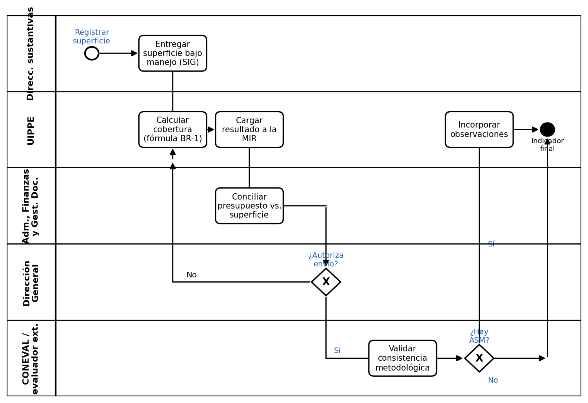

# Proceso P-03 — Cálculo de índices de cobertura y deforestación

> Proyecto: Documentación de procesos PROBOSQUE — Cobertura de la masa forestal.
> Proceso elegido por ser uno de los tres más sencillos de las 8 fases del diagrama general, medido por: número de actores (3), ausencia de coordinación interinstitucional externa vinculante y ausencia de trabajo de campo o tecnología especializada.

---

## 1. Objeto y alcance

Calcular el **indicador de cobertura de la masa forestal** del programa presupuestario 03020201 «Desarrollo Forestal» — porcentaje de la superficie objetivo efectivamente atendida (bajo manejo) — y conciliarlo contra el presupuesto ejercido del ejercicio fiscal, dejándolo listo para su validación metodológica externa.

**Dentro del alcance:** recepción del dato de superficie desde el SIG/campo → cálculo del porcentaje de cobertura → conciliación con presupuesto ejercido → revisión interna → envío a validación externa.

**Fuera del alcance:** el levantamiento de datos en campo y su carga al SIG (proceso previo, Fase 2), el dictamen de solicitudes individuales (Fase 4), y la publicación final del informe (Fase 8, que consume el resultado de este proceso).

## 2. Base documental (origen de los requisitos)

| Clave | Documento | Uso |
|---|---|---|
| [EVAL23-ANEXOS] | Evaluación Específica de Desempeño del Pp. 03020201 «Desarrollo Forestal», Anexos, PROBOSQUE, 2023 (evalúa ejercicio 2022) — transparenciafiscal.edomex.gob.mx | Fuente del dato duro de cobertura 2022 (28.55 %) y de las cifras presupuestales del ejercicio |
| [EVAL23-CONAC] | Evaluación Específica de Desempeño, Formato CONAC de difusión de resultados, PROBOSQUE, 2023 | Confirma la existencia del SIG y del Sistema de Gestión de Calidad como fuente del dato, y documenta debilidades de sistematización |
| [MGO] | Manual General de Organización de PROBOSQUE, Gaceta del Gobierno, 28-may-2012 | Ubica a la Unidad de Información, Planeación, Programación y Evaluación (UIPPE) y a las Direcciones sustantivas dentro del organigrama |
| [CONEVAL-FICHA] | Ficha de Monitoreo Sectorial Forestal, CONEVAL, 2017 | Marco de referencia federal (CONAFOR) usado como comparativo, no como meta propia de PROBOSQUE |
| [ROP-GEN] | Reglas de Operación de programas forestales de PROBOSQUE (ediciones 2013–2026, estructura homóloga) | Define la superficie objetivo y los criterios de qué cuenta como "superficie bajo manejo" |

**Nota de transparencia:** no se localizó públicamente la fórmula exacta de cálculo del indicador tal como aparece en la Matriz de Indicadores para Resultados (MIR); la fórmula descrita en (BR-1) se reconstruye a partir del dato reportado (28.55 % = superficie bajo manejo / superficie objetivo) y debe confirmarse contra la ficha técnica de indicador vigente.

## 2.1 Glosario

| Término / sigla | Significado | Fuente |
|---|---|---|
| MIR | Matriz de Indicadores para Resultados del Pp. «Desarrollo Forestal» | [EVAL23-ANEXOS] |
| UIPPE | Unidad de Información, Planeación, Programación y Evaluación de PROBOSQUE | [MGO] |
| PAE | Programa Anual de Evaluación del Estado de México | [EVAL23-CONAC] |
| ASM | Aspectos Susceptibles de Mejora, hallazgos de una evaluación externa que retroalimentan el proceso | [EVAL23-CONAC] |
| Superficie bajo manejo | Superficie que efectivamente recibió intervención (reforestación, plantación, aprovechamiento, etc.), a diferencia de la superficie sólo planeada | [EVAL23-ANEXOS] |
| Superficie objetivo | Meta de superficie a atender en el ejercicio fiscal, definida en la planeación del programa | [EVAL23-ANEXOS] |
| Pp. | Programa presupuestario (nomenclatura CONAC/estatal) | [EVAL23-CONAC] |

## 3. Roles (stakeholders)

| ID-rol | Rol / Stakeholder | Unidad real | Tipo |
|---|---|---|---|
| R1 | Direcciones sustantivas (Protección Forestal; Restauración y Fomento Forestal) | Fuente del dato de campo/SIG (Fase 2) | Interno |
| R2 | Unidad de Información, Planeación, Programación y Evaluación (UIPPE) | Calcula y reporta el indicador en la MIR | Interno |
| R3 | Dirección de Administración, Finanzas y de Gestión Documental | Concilia presupuesto ejercido vs. superficie atendida | Interno |
| R4 | Dirección General de PROBOSQUE | Revisa y autoriza el indicador antes de enviarlo a validación externa | Interno |
| R5 | CONEVAL / instancia evaluadora externa contratada bajo el PAE | Valida consistencia metodológica del indicador | Externo |

## 4. Funciones y actividades por rol

| Rol | Función | Actividades clave |
|---|---|---|
| R1 | Proveer el dato base | Entregar la superficie bajo manejo actualizada del SIG (heredada de la Fase 2) |
| R2 | Calcular el indicador | Aplicar la fórmula de cobertura, cargarla a la MIR, documentar memoria de cálculo |
| R3 | Conciliar presupuesto | Cruzar el presupuesto ejercido del ejercicio fiscal contra la superficie reportada |
| R4 | Autorizar | Revisar el cálculo preliminar y autorizar su envío a evaluación externa |
| R5 | Validar | Revisar la consistencia metodológica y emitir observaciones (ASM) si corresponde |

## 5. Reglas de negocio verificadas

- **BR-1** Fórmula reconstruida del indicador: `% cobertura = (superficie bajo manejo atendida / superficie objetivo) × 100`. Dato duro verificado del ejercicio 2022: **28.55 %** [EVAL23-ANEXOS].
- **BR-2** Sólo cuenta para el indicador la superficie efectivamente **bajo manejo** dentro del área de enfoque atendida; la superficie sólo planeada no ejecutada no se contabiliza [EVAL23-ANEXOS].
- **BR-3** El cálculo se concilia contra el presupuesto del mismo ejercicio fiscal. Dato 2022: autorizado $228,647,305.00; modificado $240,187,757.61; ejercido $168,340,090.95 [EVAL23-ANEXOS].
- **BR-4** El indicador debe someterse a validación metodológica externa dentro del Programa Anual de Evaluación (PAE) estatal [EVAL23-CONAC].
- **BR-5** Los indicadores federales de referencia (CONAFOR: tasa de deforestación neta anual, cobertura restaurada) se usan como marco comparativo de tendencia, **no** como meta propia de PROBOSQUE [CONEVAL-FICHA].

## 6. Procedimiento narrado

1. R1 aporta el dato de superficie bajo manejo actualizado en el SIG (resultado de la Fase 2).
2. R2 aplica la fórmula de cobertura (BR-1) y carga el resultado preliminar a la MIR del Pp. «Desarrollo Forestal».
3. R3 concilia el dato de superficie contra el presupuesto ejercido del ejercicio fiscal (BR-3).
4. R2 integra la memoria de cálculo y remite el indicador preliminar a R4.
5. R4 (Dirección General) revisa y autoriza el indicador para su envío a validación externa.
6. R5 (instancia evaluadora bajo el PAE) valida la consistencia metodológica y, en su caso, emite Aspectos Susceptibles de Mejora (ASM).
7. R2 incorpora las observaciones de R5 si existen, y consolida el indicador final del ejercicio.
8. El indicador final pasa a la Fase 8 (Reporte de resultados e indicadores) para su publicación.

## 7. Diagrama de proceso (carriles por rol, notación BPMN)

Inicia cuando las Direcciones sustantivas entregan la superficie bajo manejo (heredada de la Fase 2). UIPPE calcula el indicador y lo carga a la MIR; Administración concilia contra presupuesto; Dirección General autoriza (o regresa el cálculo si no autoriza); CONEVAL/evaluador externo valida la metodología y, si emite ASM, UIPPE los incorpora antes de consolidar el indicador final que alimenta la Fase 8.

## 8. Tabla de necesidades

Prioridad: **A** = obligatoria (la exige norma o el proceso se detiene), **M** = media (control/consistencia), **B** = deseable.

| ID | Rol / Stakeholder | Necesidad | Prioridad | Origen | Paso del procedimiento relacionado|
|---|---|---|---|---| --- |
| N-01 | R2 UIPPE | Calcular y reportar el indicador de cobertura en la MIR | A | Normativo — CONEVAL / Programa Anual de Evaluación estatal | Paso 2: R2 aplica la fórmula de cobertura y carga el resultado preliminar a la MIR |
| N-02 | R3 Administración | Vincular presupuesto ejercido con la superficie efectivamente cubierta | A | Organizacional | Paso 3: R3 concilia el dato de superficie contra el presupuesto ejercido °
| N-03 | R5 CONEVAL/evaluador | Validar consistencia metodológica del indicador | M | Normativo — Programa Anual de Evaluación | Paso 6: R5 valida la consistencia metodológica y emite ASM si corresponde |
| N-04 | R2 UIPPE | Recibir de la Fase 2 un dato de superficie confiable y sistematizado | A | Derivada — hoy el dato de origen vive en hojas de cálculo no sistematizadas (hallazgo Fase 2) | Paso 1: R1 aporta el dato de superficie bajo manejo actualizado en el SIG |
| N-05 | R4 Dirección General | Contar con memoria de cálculo documentada antes de autorizar | M | Buenas prácticas de control interno | Paso 4: R2 integra la memoria de cálculo y remite el indicador a R4 |
| N-06 | R1 Direcciones sustantivas | Entregar el dato de campo/SIG con periodicidad definida | M | Inferida — no hay evidencia pública de la periodicidad exacta | Paso 1: R1 aporta el dato de superficie bajo manejo actualizado en el SIG

## 9. Registros que el proceso debe gestionar

| Registro | Genera | Contiene | Retención sugerida |
|---|---|---|---|
| Ficha técnica de indicador (MIR) | R2 | Fórmula, meta, avance, fuente de datos | Ciclo del ejercicio fiscal + histórico comparativo |
| Memoria de cálculo del indicador | R2 | Superficie bajo manejo, superficie objetivo, cálculo paso a paso | A definir por Archivo institucional |
| Reporte de conciliación presupuestal | R3 | Presupuesto autorizado/modificado/ejercido vs. superficie atendida | Fiscal (Cuenta Pública) |
| Informe de validación metodológica (ASM) | R5 | Hallazgos, observaciones, recomendaciones | Ciclo de mejora continua (retroalimenta Fases 2 y 3) |

## 10. Vacíos y siguientes pasos

1. No se localizó la fórmula exacta publicada en una ficha técnica de indicador vigente; la fórmula de BR-1 es una **reconstrucción razonada** a partir del dato reportado (28.55 %), pendiente de confirmar contra el documento MIR original.
2. El dato de origen (Fase 2) proviene de hojas de cálculo no sistematizadas, lo que introduce riesgo de inconsistencia en este cálculo — riesgo heredado, no propio de esta fase.
