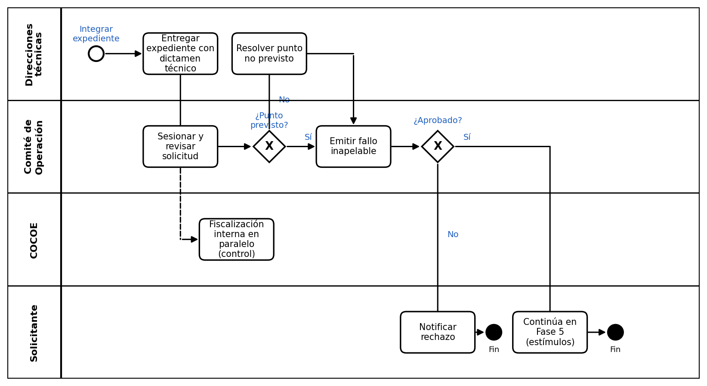

# Proceso P-04 — Dictamen del Comité de Operación (Admisión y Seguimiento)

> Proyecto: Documentación de procesos PROBOSQUE — Cobertura de la masa forestal.
> Proceso elegido por ser uno de los tres más sencillos de las 8 fases del diagrama general, medido por: número de actores (3), una sola decisión central (calificar/aprobar/resolver) y ausencia de trabajo de campo.

---

## 1. Objeto y alcance

Calificar y resolver, con carácter de **fallo inapelable**, las solicitudes de apoyo forestal que llegan integradas y con dictamen técnico preliminar desde las fases previas, determinando su factibilidad técnica, legal y presupuestal para recibir estímulos.

**Dentro del alcance:** recepción del expediente dictaminado técnicamente → sesión del Comité de Admisión y Seguimiento (interinstitucional) → fiscalización en paralelo sin derecho a voto → resolución de puntos no previstos → emisión del fallo y publicación de listados.

**Fuera del alcance:** la integración inicial del expediente (fases previas), la asignación económica derivada de un fallo favorable (Fase 5), y las revisiones ex post realizadas por el Comité de Control y Evaluación (COCOE).

## 2. Base documental (origen de los requisitos)

| Clave | Documento | Uso |
|---|---|---|
| [REGL-CAS-2025] | Reglamento Interno del Comité de Admisión y Seguimiento del Programa Plantaciones Sustentables, Gaceta del Gobierno, 15-ene-2025. | Define la integración interinstitucional, quórum, periodicidad, mecanismo de notificación pública y atribuciones resolutivas del Comité operativo. |
| [REGL-COCOE-2008] | Reglamento Interno del Comité de Control y Evaluación de PROBOSQUE, 12-dic-2008. | Define las atribuciones del COCOE, limitándolo al análisis y seguimiento del Modelo Integral de Control Interno (MICI) y auditorías, sin injerencia en el dictamen técnico de expedientes. |
| [ROP-GEN] | Reglas de Operación de programas forestales de PROBOSQUE. | Define el marco general de requisitos, conceptos de apoyo, y la facultad del Comité para emitir fallos inapelables y resolver puntos no previstos. |

## 2.1 Glosario

| Término / sigla | Significado | Fuente |
|---|---|---|
| Comité (CAS) | Comité de Admisión y Seguimiento. Órgano colegiado interinstitucional que califica y aprueba solicitudes. | [REGL-CAS-2025] |
| COCOE | Comité de Control y Evaluación. Órgano interno que da seguimiento a auditorías y control interno. No evalúa solicitudes ciudadanas. | [REGL-COCOE-2008] |
| Fallo inapelable | Resolución del Comité (CAS) contra la que no procede recurso de inconformidad dentro del programa. | [ROP-GEN] |
| Quórum Legal | Asistencia de la mitad más uno de los integrantes del CAS, incluyendo obligatoriamente Presidencia, Secretaría Técnica y Órgano Interno de Control. | [REGL-CAS-2025] |

## 3. Roles (stakeholders)

| ID-rol | Rol / Stakeholder | Unidad real | Tipo |
|---|---|---|---|
| R1 | Comité de Admisión y Seguimiento (Integrantes con voz y voto) | Secretaría del Campo (Presidencia), PROBOSQUE (Secretaría Técnica), y Vocales Federales/Académicos (CONAFOR, SEMARNAT, UACh, UAEMéx, Representante Ejidal). | Interinstitucional |
| R2 | Órgano Interno de Control de PROBOSQUE (Invitado Especial) | Participa en las sesiones del CAS con voz pero sin voto, asegurando transparencia en tiempo real. | Interno (Fiscalizador) |
| R3 | Direcciones técnicas de PROBOSQUE | Sustentan el expediente y operan como "Invitados Especiales" (voz, sin voto) para resolver dudas técnicas. | Interno |
| R4 | Solicitante | Espera la publicación del listado oficial. | Externo |

## 4. Funciones y actividades por rol

| Rol | Función | Actividades clave |
|---|---|---|
| R1 | Calificar y resolver | Analizar y votar la factibilidad de expedientes, aprobar listados de dictamen (aprobados, insuficiencia presupuestal, no factibles), resolver puntos no previstos y cancelar apoyos por conflictos agrarios o incumplimientos. |
| R2 | Fiscalizar (Control Interno en sesión) | Observar el desarrollo de la sesión del CAS para asegurar el cumplimiento normativo (no califica expedientes). |
| R3 | Sustentar técnicamente | Presentar la información técnica, financiera o legal necesaria al CAS. |
| R4 | Consultar resolución | Revisar las listas publicadas en Delegaciones Regionales o sitio web. |

## 5. Reglas de negocio verificadas

- **BR-1 Integración Interinstitucional (Gobernanza):** El dictamen no es exclusivo de PROBOSQUE. El CAS incluye votos de representaciones federales (CONAFOR, SEMARNAT) y académicas (UACh, UAEMéx) para garantizar imparcialidad.
- **BR-2 Separación de Funciones de Control:** El COCOE (como órgano) no dictamina solicitudes; se enfoca en el seguimiento de auditorías (sesiona trimestralmente). El control interno del proceso de dictaminación lo ejerce el titular del Órgano Interno de Control al asistir a las sesiones del CAS como *Invitado Especial* (con voz, sin voto).
- **BR-3 Mecanismo de Notificación (Asimetría de información):** No existe obligación de notificación personal al solicitante. El CAS autoriza que los resultados (aprobados, con insuficiencia presupuestal y no factibles) se publiquen en las Delegaciones Regionales Forestales y en la página web de PROBOSQUE.
- **BR-4 Quórum y Convocatorias:** Las sesiones ordinarias requieren convocatoria de 3 días hábiles; las extraordinarias, de 24 horas. El quórum exige la mitad más uno de los integrantes y la presencia obligatoria de la Presidencia, Secretaría Técnica y el Órgano de Control.
- **BR-5 Resoluciones Inapelables:** El CAS tiene facultad exclusiva para aprobar expedientes, cancelar apoyos (por conflictos agrarios/sociales) y resolver lo no previsto en las convocatorias.

## 6. Procedimiento narrado

1. La Secretaría Técnica del CAS (PROBOSQUE) convoca a sesión ordinaria (3 días hábiles) o extraordinaria (24 horas) remitiendo el orden del día y anexos técnicos (R3).
2. Se instala la sesión verificando el quórum legal (BR-4).
3. R1 (CAS) analiza y discute la factibilidad de las solicitudes basándose en los dictámenes técnicos previos y el presupuesto disponible. R2 (Control Interno) y R3 (Áreas Técnicas) participan con voz para aclaraciones normativas o técnicas, pero sin voto.
4. R1 emite su fallo (aprueba, rechaza, o clasifica como "aprobado con insuficiencia presupuestal") y, de ser necesario, resuelve puntos no previstos en la convocatoria.
5. R1 autoriza la publicación oficial de los listados de resultados.
6. La Secretaría Técnica elabora el acta de la sesión en un plazo máximo de 3 días hábiles y recaba las firmas en los 6 días hábiles siguientes (máximo 10 días en total).
7. PROBOSQUE publica los listados en sus Delegaciones Regionales y sitio web, fungiendo como mecanismo de notificación al solicitante (R4). Si el fallo es favorable, el expediente continúa a la Fase 5.

## 7. Diagrama de proceso (carriles por rol, notación BPMN)

*(Nota de actualización normativa: El carril denominado "Comité de Operación" en el diagrama original corresponde al Comité de Admisión y Seguimiento, de integración interinstitucional. El carril del "COCOE" representa la fiscalización de control interno; operativamente, durante la sesión de dictaminación ciudadana, esta función la ejerce el titular del Órgano Interno de Control de PROBOSQUE, participando como invitado especial).*

## 8. Tabla de necesidades

Prioridad: **A** = obligatoria (la exige norma o el proceso se detiene), **M** = media (control/consistencia), **B** = deseable.

| ID | Rol / Stakeholder | Necesidad | Prioridad | Origen | Paso del procedimiento relacionado |
|---|---|---|---|---|---|
| N-01 | R1 CAS | Quórum legal para instalar sesión y votar | A | Normativo — Reglamento Interno CAS | Paso 2. Requisito para iniciar la Fase 4 |
| N-02 | R2 Órgano Interno de Control | Vigilar transparencia de la sesión (voz, sin voto) | A | Normativo — Reglamento Interno CAS | Paso 3. Interno a esta fase (paralelo) |
| N-03 | R4 Solicitante | Acceder oportunamente a los listados publicados | A | Derivada — mecanismo oficial de notificación | Paso 7. Relacionado con Fase 5 (asignación) |
| N-04 | Secretaría Técnica del CAS | Recabar firmas del acta en máximo 10 días hábiles | A | Normativo — Reglamento Interno CAS | Paso 6. Interno a esta fase |

## 9. Registros que el proceso debe gestionar

| Registro | Genera | Contiene | Retención sugerida |
|---|---|---|---|
| Convocatoria a Sesión (con acuses) | Secretaría Técnica | Fecha, hora, modalidad, orden del día, anexos. | Expediente de la sesión |
| Acta de Sesión del CAS | Secretaría Técnica | Lista de asistencia, quórum, discusión, resultados de votación y acuerdos aprobados. | Archivo Institucional |
| Listado oficial de resultados | CAS | Folios/nombres clasificados como aprobados, no factibles o con insuficiencia presupuestal. | Padrón / Archivo Web |

## 10. Vulnerabilidades mitigadas y lecciones del análisis

1. **Gobernanza interinstitucional:** La asunción inicial de que el dictamen recaía solo en funcionarios de PROBOSQUE fue desestimada; la presencia de la academia y autoridades federales descentraliza la decisión (mitigando riesgos de sesgo).
2. **Clarificación del Control Interno:** Se demostró que el **COCOE** y el **Comité de Admisión y Seguimiento** son órganos separados con propósitos distintos. El COCOE audita procesos de forma trimestral (evaluación), mientras que la vigilancia en tiempo real de los dictámenes ciudadanos (operación) la realiza el Órgano Interno de Control como invitado en el CAS.
3. **Notificación al solicitante:** Se confirmó que PROBOSQUE no está obligado a emitir notificaciones individuales de rechazo. La carga de consultar los estrados/web recae en el ciudadano, lo cual, aunque legal, representa una debilidad estructural en términos de atención al usuario.