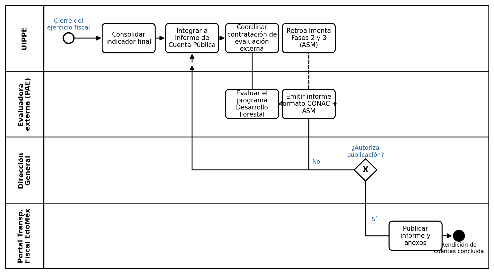

# Proceso P-08 — Reporte de resultados e indicadores

> Proyecto: Documentación de procesos PROBOSQUE — Cobertura de la masa forestal («Del polígono al bosque»).
> Proceso elegido por ser uno de los tres más sencillos de las 8 fases del diagrama general, medido por: número de actores (3), naturaleza administrativa/documental (sin campo ni tecnología especializada) y flujo lineal de reporte.

---

## 1. Objeto y alcance

Consolidar, validar externamente y **difundir públicamente** los resultados del indicador de cobertura de la masa forestal (heredado de la Fase 3)[cite: 3], incluyendo su rendición en Cuenta Pública y su evaluación bajo el Programa Anual de Evaluación (PAE) estatal[cite: 3].

**Dentro del alcance:** consolidación del indicador final → revisión y suscripción por la Dirección General → evaluación externa contratada bajo el PAE → publicación en el portal de transparencia fiscal[cite: 3].

**Fuera del alcance:** el cálculo mismo del indicador (Fase 3), y la implementación de los Aspectos Susceptibles de Mejora (ASM) resultantes, que retroalimentan procesos anteriores (Fases 2 y 3) pero no se ejecutan dentro de este proceso[cite: 3].

## 2. Base documental (origen de los requisitos)

| Clave | Documento | Uso |
|---|---|---|
| [EVAL23-ANEXOS] | Evaluación Específica de Desempeño del Pp. 03020201 «Desarrollo Forestal», Anexos, PROBOSQUE, 2023 (evalúa ejercicio 2022) — transparenciafiscal.edomex.gob.mx | Fuente del proceso de evaluación externa, costo del contrato y canal de difusión[cite: 3]. |
| [EVAL23-CONAC] | Evaluación Específica de Desempeño, Formato CONAC de difusión de resultados, PROBOSQUE, 2023 | Confirma el formato estandarizado de difusión de resultados (CONAC)[cite: 3]. |
| [CONEVAL-FICHA] | Ficha de Monitoreo Sectorial Forestal, CONEVAL, 2017 | Marco metodológico de referencia para evaluaciones de desempeño en el sector forestal[cite: 3]. |
| [MGO] | Manual General de Organización de PROBOSQUE, Gaceta del Gobierno, 28-may-2012 | Ubica a la UIPPE y a la Dirección General dentro del organigrama institucional[cite: 3]. |

## 2.1 Glosario

| Término / sigla | Significado | Fuente |
|---|---|---|
| PAE | Programa Anual de Evaluación del Estado de México | [EVAL23-CONAC][cite: 3] |
| CONAC | Consejo Nacional de Armonización Contable — define el formato estandarizado de difusión de resultados de evaluaciones | [EVAL23-CONAC][cite: 3] |
| ASM | Aspectos Susceptibles de Mejora — hallazgos de la evaluación externa que retroalimentan el proceso | [EVAL23-CONAC][cite: 3] |
| Cuenta Pública | Informe anual de resultados financieros y programáticos que el Estado de México rinde conforme a la normatividad de armonización contable | [EVAL23-ANEXOS][cite: 3] |
| UIPPE | Unidad de Información, Planeación, Programación y Evaluación de PROBOSQUE | [MGO][cite: 3] |

## 3. Roles (stakeholders)

| ID-rol | Rol / Stakeholder | Unidad real | Tipo |
|---|---|---|---|
| R1 | Unidad de Información, Planeación, Programación y Evaluación (UIPPE) | Da seguimiento y difunde los resultados de la evaluación | Interno[cite: 3] |
| R2 | Instancia evaluadora externa contratada bajo el PAE | Emite hallazgos y Aspectos Susceptibles de Mejora (ASM) | Externo[cite: 3] |
| R3 | Dirección General de PROBOSQUE | Suscribe y valida los resultados publicados | Interno[cite: 3] |
| R4 | Portal de Transparencia Fiscal del Estado de México | Canal de difusión pública del informe | Externo (infraestructura estatal)[cite: 3] |

## 4. Funciones y actividades por rol

| Rol | Función | Actividades clave |
|---|---|---|
| R1 | Consolidar y dar seguimiento | Integrar el indicador final (Fase 3) al informe de Cuenta Pública, coordinar la contratación de la evaluación externa[cite: 3]. |
| R2 | Evaluar externamente | Revisar el programa, identificar fortalezas y debilidades, emitir el informe con formato CONAC y los ASM[cite: 3]. |
| R3 | Suscribir y validar | Revisar y autorizar el informe final antes de su publicación[cite: 3]. |
| R4 | Difundir | Publicar el informe y sus anexos en el portal de transparencia fiscal[cite: 3]. |

## 5. Reglas de negocio verificadas

- **BR-1** Los resultados de cobertura se reportan en Cuenta Pública del ejercicio fiscal correspondiente[cite: 3].
- **BR-2** Las evaluaciones externas se contratan bajo el Programa Anual de Evaluación (PAE) estatal, con costo público documentado; ejemplo verificado del ejercicio 2022: contrato con Servicios Integrados del Noreste, S. A. de C. V., por $460,000.00 (IVA incluido)[cite: 3].
- **BR-3** Los resultados se difunden públicamente en el portal de transparencia fiscal del Estado de México, en el formato estandarizado del CONAC[cite: 3].
- **BR-4** La evaluación puede generar Aspectos Susceptibles de Mejora (ASM) que retroalimentan los procesos previos — ciclo de mejora continua, no un cierre definitivo[cite: 3].

## 6. Procedimiento narrado

1. R1 (UIPPE) consolida el indicador final de cobertura (heredado de la Fase 3) y lo integra al informe de Cuenta Pública del ejercicio fiscal[cite: 3, 6].
2. R1 coordina la contratación de la instancia evaluadora externa (R2) bajo el Programa Anual de Evaluación estatal[cite: 3, 6].
3. R2 evalúa el programa «Desarrollo Forestal», identifica fortalezas y debilidades, y emite su informe en el formato estandarizado del CONAC, incluyendo los Aspectos Susceptibles de Mejora (ASM) si los hay[cite: 3, 6].
4. R3 (Dirección General) revisa y suscribe el informe final antes de su publicación (o lo regresa para ajustes)[cite: 3, 6].
5. R4 (portal de transparencia fiscal del Estado de México) publica el informe y sus anexos una vez autorizado[cite: 3, 6].
6. Los ASM emitidos por R2 se remiten de vuelta a las áreas responsables de las Fases 2 y 3 para su atención — cierre del ciclo de mejora continua, operando como un canal no bloqueante[cite: 3, 6].

## 7. Diagrama de proceso (carriles por rol, notación BPMN)

[cite: 6]

## 8. Tabla de necesidades

Prioridad: **A** = obligatoria (la exige norma o el proceso se detiene), **M** = media (control/consistencia), **B** = deseable.

| ID | Rol / Stakeholder | Necesidad | Prioridad | Origen | Paso del procedimiento relacionado |
|---|---|---|---|---|---|
| N-01 | R1 UIPPE | Dar seguimiento y difundir los resultados de la evaluación | A | Normativo — Programa Anual de Evaluación[cite: 3] | Paso 1 y 2. Origen del ciclo de reporte |
| N-02 | R2 Instancia evaluadora externa | Emitir hallazgos y Aspectos Susceptibles de Mejora (ASM) | M | Normativo — CONEVAL / PAE[cite: 3] | Paso 3. Evaluación metodológica |
| N-03 | R3 Dirección General de PROBOSQUE | Suscribir y validar los resultados publicados | A | Organizacional[cite: 3] | Paso 4. Autorización previa a publicación |
| N-04 | Ciudadanía / público general | Acceder al informe de resultados de forma pública y comprensible | A | Inferida — Ley de Transparencia y Acceso a la Información Pública del Edomex[cite: 3] | Paso 5. Difusión final en Portal de Transparencia |
| N-05 | R1 UIPPE | Contar con un mecanismo formal de seguimiento a los ASM (responsables y fechas) | M | Inferida — no se documentó un mecanismo formal más allá de su mención genérica[cite: 3] | Paso 6. Retroalimentación a Fases 2 y 3 |

## 9. Registros que el proceso debe gestionar

| Registro | Genera | Contiene | Retención sugerida |
|---|---|---|---|
| Informe de evaluación específica de desempeño | R2 | Fortalezas, debilidades, ASM, formato CONAC[cite: 3] | Histórico comparativo entre ejercicios |
| Contrato de servicios de evaluación externa | R1 | Objeto, monto, proveedor, vigencia[cite: 3] | Fiscal / transparencia proactiva |
| Oficio de suscripción de la Dirección General | R3 | Validación formal del informe[cite: 3] | Vinculado al expediente del ejercicio fiscal |
| Publicación en portal de transparencia fiscal | R4 | Informe y anexos accesibles públicamente[cite: 3] | Permanente / histórico público |
| Bitácora de seguimiento a ASM | R1 | ASM, responsable, fecha límite, estatus[cite: 3] | Ciclo de mejora continua |

## 10. Vacíos remanentes (Riesgos operativos actuales)

1. **Periodicidad y formalización de seguimiento:** No se encontró evidencia pública de un mecanismo formal de seguimiento a los ASM (responsables, fechas límite, verificación de cierre) más allá de su mención genérica en el informe de evaluación[cite: 3].
2. **Instancias de revisión directiva:** No hay confirmación pública de si el informe pasa formalmente por el Consejo Directivo de PROBOSQUE o únicamente por la Dirección General antes de su publicación[cite: 3].
3. **Procedimiento de contratación:** El procedimiento interno de contratación de la instancia evaluadora (R2) —criterios de selección, tipo de procedimiento de adjudicación— no está documentado de forma abierta en los manuales operativos generales[cite: 3].