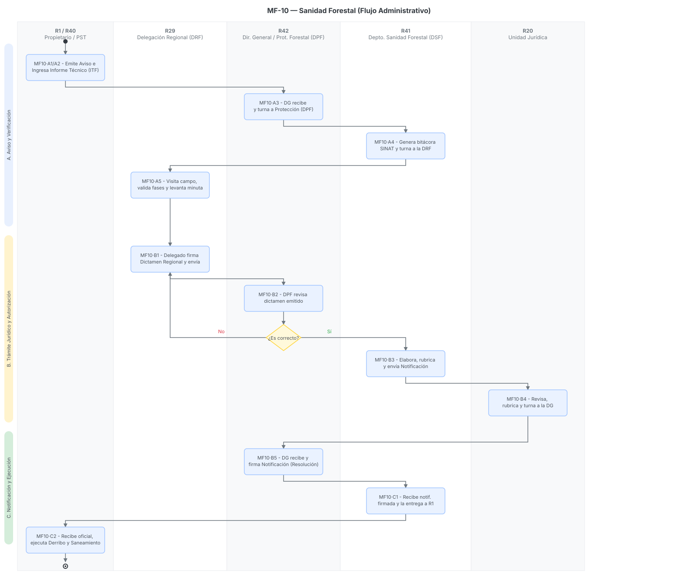

# MF-10 · Sanidad Forestal

> Plantilla adaptada para el proceso de Sanidad Forestal (Detección, Evaluación y Combate de Plagas), alineada a los requerimientos del módulo de Masa Forestal (MF)[cite: 76, 77].
> Fecha de análisis: 23 de septiembre de 2026. Método: extracción de lineamientos operativos, parámetros biológicos (fases de coloración) y normatividad fitosanitaria según el reparto del sprint[cite: 58].
> Citación externa de pasos: **MF10·A2**, **MF10·B3**, **MF10·C2** (proceso·paso).

## 1. Objeto y alcance

**Incluye** el ciclo integral de atención a emergencias fitosanitarias en los bosques del Estado de México: recepción de avisos/notificaciones de plagas → inspección en campo por la Delegación Regional → elaboración del Informe Técnico Fitosanitario (ITF) → validación en el Sistema Nacional de Trámites (SINAT) → emisión y entrega de la "Notificación de Saneamiento" → ejecución de trabajos de control (derribo, descortezado, quema, aplicación química) por parte de los propietarios → verificación de cumplimiento[cite: 76, 77].

**Fuera del alcance:** La inspección fitozoosanitaria en puertos, fronteras o aserraderos (cadena de custodia industrial), que corresponde a facultades estrictamente federales de SEMARNAT/PROFEPA. El alcance se limita a la detección y saneamiento en *masa forestal viva* (bosque en pie)[cite: 77].

## 2. Base documental (claves de cita)

| Clave | Archivo / ubicación | Qué aporta |
|---|---|---|
| [WEB-SAN] | `sanidad_forestal.html` | Sitio web oficial. Define el objetivo institucional, estadísticas de atención (ej. 45 recorridos en 30 municipios, 15 notificaciones emitidas), combate de plantas parásitas (Nevado de Toluca) y peritajes judiciales[cite: 76]. |
| [NOTA-2] | `NOTATEC2_EmergenciaFitosanitaria.pdf` | Documento técnico exhaustivo. Detalla las especies de descortezadores (ej. *Dendroctonus spp.*), la relación fase-coloración (Verde a Café grisáceo), y el diagrama de flujo administrativo "Procedimiento para procesar una notificación" (Fig. 7)[cite: 77]. |
| [RETYS-PLAG] | `Docs/Comun/Trámites RETYS/RETYS_SOLICITUD_CombatePlagas.pdf` y `RETYS_Aviso_PlagasEnfermedades.pdf` (cédulas RETYS 873/876, capturados 2026-09-24) | Formatos descargables reales del trámite de combate/control de plagas y del aviso de posible presencia; posibles homólogos del formato CONAFOR-07-007-A citado en MF10·A1. |

## 3. Glosario de siglas

*   **DSF**: Departamento de Sanidad Forestal de PROBOSQUE[cite: 77].
*   **DPF**: Dirección de Protección Forestal de PROBOSQUE[cite: 77].
*   **SINAT**: Sistema Nacional de Trámites (plataforma federal donde PROBOSQUE carga los informes técnicos)[cite: 77].
*   **ITF**: Informe Técnico Fitosanitario. Documento base elaborado por el asesor técnico que justifica la presencia de la plaga[cite: 77].

## 4. Roles (personificados)

| ID | Rol | Puesto y titular (fuente) | Tipo |
|---|---|---|---|
| R1 | Denunciante / Propietario | Ciudadano, ejidatario o poseedor que detecta el brote o recibe la instrucción de sanear su predio[cite: 76, 77]. | Externo |
| R40 | Prestador de Servicios (PST) | Técnico forestal acreditado que elabora el Informe Técnico Fitosanitario (ITF)[cite: 77]. | Externo |
| R29 | Delegaciones Regionales (DRF) | Personal de campo que recibe el aviso, contacta al promovente, realiza la visita de campo, verifica el ITF y emite el dictamen preliminar[cite: 76, 77]. | Interno desconcentrado |
| R41 | Depto. Sanidad Forestal (DSF) | Analiza el ITF, genera la bitácora en SINAT y redacta la Notificación de Saneamiento oficial[cite: 77]. | Interno |
| R20 | Unidad Jurídica | Revisa y rubrica legalmente la Notificación de Saneamiento antes de su firma final[cite: 77]. | Interno |
| R42 | Dirección Gral / Protección (DPF) | El Director de Protección Forestal recibe y turna; el Director General firma la Notificación de Saneamiento[cite: 77]. | Interno |

## 5. Funciones y actividades por rol

*   **R1 (Propietario):** Da el aviso inicial, recibe la Notificación de Saneamiento firmada y ejecuta (a su costo) los trabajos de derribo, descortezado, picado y control de residuos[cite: 77].
*   **R40 (PST):** Realiza el levantamiento de datos biológicos (identificación taxonómica, fase de coloración) y redacta el ITF[cite: 77].
*   **R29 (DRF):** Valida la congruencia entre el ITF y la realidad del rodal. Elabora la minuta de trabajo y dictamina si procede el saneamiento[cite: 76, 77].
*   **R41 (DSF):** Coordina el flujo administrativo con la federación (SINAT), estructura el documento sancionador y lo gestiona a través de la cadena de mando (UJIGEV, DPF, DG)[cite: 77].

## 6. Reglas de negocio

*   **BR-1** Diagnóstico Visual (Fases de Coloración): Para *Dendroctonus spp.*, la evaluación técnica se rige por la coloración de la copa del pino.
    *   Verde / Verde-Amarillo: Fase de ataque inicial (larvas I y II).
    *   Amarillo / Amarillo-Rojizo: Fase intermedia (larvas III, IV, pupas).
    *   Rojo: Emergencia principal de adultos.
    *   Rojo grisáceo / Café grisáceo: Árbol muerto, sin población activa (abandono)[cite: 77].
*   **BR-2** Tiempo de Respuesta: PROBOSQUE tiene un plazo máximo normado de 15 días para responder a las notificaciones y emitir la autorización de saneamiento[cite: 77].
*   **BR-3** Métodos de Control Autorizados (NOM-019-SEMARNAT-2017): Los tratamientos mecánicos permitidos son: Derribo direccional (tocón <30 cm), Seccionado, Extracción inmediata, Descortezado, Picado, Quema (en fosas o pilas) y Enterrado (mínimo 20 cm de tierra)[cite: 77].
*   **BR-4** Obligatoriedad del Propietario: La ejecución del saneamiento no es opcional. Tras recibir la Notificación oficial, el propietario está legalmente obligado (Art. 114 LGDFS) a ejecutar los trabajos bajo las directrices técnicas[cite: 77].

## 7. Procedimiento

> Basado estrictamente en el "Procedimiento administrativo para procesar una notificación" (Figura 7)[cite: 77].

### Proceso A — Aviso y Verificación de Campo

*   **MF10·A1** R1 (Ciudadanía/Propietario) emite el aviso de plaga a la DRF (R29) o a la Dirección General (vía formato CONAFOR-07-007-A, correo o teléfono)[cite: 77].
*   **MF10·A2** R40 (PST) elabora e ingresa el "Informe Técnico Fitosanitario" (ITF) a la Dirección General[cite: 77].
*   **MF10·A3** La Dirección General recibe el ITF y lo turna a la DPF (R42)[cite: 77].
*   **MF10·A4** R42 (DPF) turna el informe al DSF (R41). El DSF analiza, genera la bitácora en el sistema federal SINAT y envía el ITF a la DRF (R29) correspondiente[cite: 77].
*   **MF10·A5** R29 (DRF) contacta al promovente, realiza la visita de campo para verificar las fases de afectación (coloración), elabora la "Minuta de trabajo" y emite el Dictamen Regional[cite: 77].

### Proceso B — Trámite Jurídico y Autorización Institucional

*   **MF10·B1** El Delegado Regional firma el dictamen y lo devuelve a la DPF (R42)[cite: 77].
*   **MF10·B2 (Bifurcación):** La DPF revisa ¿La información es correcta?
    *   *Si es No:* Se devuelve el trámite para corrección.
    *   *Si es Sí:* La DPF lo turna al DSF (R41)[cite: 77].
*   **MF10·B3** R41 (DSF) elabora el documento oficial "Notificación de Saneamiento", lo rubrica y lo envía a R20 (Unidad Jurídica)[cite: 77].
*   **MF10·B4** R20 (Jurídico) recibe, revisa la fundamentación legal, rubrica y turna a la Dirección General[cite: 77].
*   **MF10·B5** El Director General de PROBOSQUE firma oficialmente la "Notificación de Saneamiento" y la devuelve a la DPF/DSF[cite: 77].

### Proceso C — Notificación y Ejecución de Trabajos

*   **MF10·C1** R41 (DSF) recibe la notificación firmada, saca copias y entrega físicamente el documento a R1 (Dueño o poseedor)[cite: 77].
*   **MF10·C2** R1 recibe la notificación, sella/firma el acuse de recibo y ejecuta a su costo los trabajos de saneamiento (derribo, descortezado, aplicación de químicos) bajo la supervisión del PST[cite: 77].

## 8. Diagramas de actividad

> Cada nodo lleva su **ID de paso** (MF10·#) mapeado a la estructura de 6 carriles, modelando el estricto flujo burocrático documentado en la Figura 7 de la Nota Técnica 2[cite: 77].

## 9. Tabla de necesidades

Prioridad: **A** = obligatoria · **M** = media · **B** = deseable.

| ID | Rol | Necesidad | P | Paso | Origen |
|---|---|---|---|---|---|
| N-01 | R29 | Aplicación móvil GIS offline con un "Módulo de Diagnóstico Visual" que permita catalogar cada árbol muestreado (Verde, Amarillo, Rojo, Gris) y georreferenciar el polígono del brote | A | A5 | [NOTA-2 Cuadro 5][cite: 77] |
| N-02 | R41 | Integración o interfaz del SGD con el sistema federal **SINAT** (SEMARNAT) para evitar doble captura del Informe Técnico Fitosanitario | A | A4 | [NOTA-2 Fig. 7][cite: 77] |
| N-03 | R20 | Flujo de validación digital y firma electrónica (e.firma) interdepartamental (DSF $\rightarrow$ UJIGEV $\rightarrow$ Dir. General) para cumplir el plazo normativo máximo de 15 días | A | B3, B4 | [NOTA-2 Fig. 7][cite: 77] |
| N-04 | R40 | Módulo web (Portal de Prestadores) para que el PST cargue el ITF directamente al SGD de PROBOSQUE con sus anexos cartográficos | M | A2 | [NOTA-2 Fig. 7][cite: 77] |

## 10. Registros que el SGD debe gestionar (catálogo documental)

*   **Aviso de Plaga** (Formato CONAFOR-07-007-A o reporte libre)[cite: 77].
*   **Informe Técnico Fitosanitario (ITF)** (Elaborado por el PST, incluye datos dasométricos y de coloración)[cite: 77].
*   Minuta de Verificación en Campo (DRF)[cite: 77].
*   Dictamen Técnico Regional[cite: 77].
*   Folio de Bitácora SINAT[cite: 77].
*   **Notificación de Saneamiento Forestal** (Documento resolutivo oficial firmado por la DG)[cite: 76, 77].
*   Acuse de Recepción (firmado por el propietario)[cite: 77].

## 11. Vacíos y siguientes pasos

*   **V-01 Verificación de Cierre:** El diagrama de la Figura 7 termina cuando el propietario "realiza los trabajos de saneamiento". Sin embargo, no se detalla cómo o cuándo PROBOSQUE o la PROFEPA verifican que el saneamiento se ejecutó correctamente (y se liberan las remisiones para transportar la madera enferma).
*   **Siguiente paso:** Vincular el módulo de Sanidad Forestal (MF-10) con el motor de *Aprovechamientos (MF-12)*, ya que los árboles derribados por saneamiento generan madera que el propietario puede comercializar si cuenta con las guías forestales correspondientes.

## 12. Tabla de entrada/salida por paso (Fiscalización y Trazabilidad)

| Paso | Actor | Documento / Dato de Entrada (Fuente) | Datos Capturados en Sistema | Documento de Salida (Formato) |
|---|---|---|---|---|
| **MF10·A1** | R1 (Propietario) | Observación en campo[cite: 77] | Coordenadas preliminares, tipo de daño (follaje/corteza). | Formato CONAFOR-07-007-A (o reporte telefónico)[cite: 77] |
| **MF10·A2** | R40 (PST) | Muestreo dasométrico[cite: 77] | Volumen afectado, especie (ej. *Pinus hartwegii*), fase de desarrollo (color). | Informe Técnico Fitosanitario (ITF)[cite: 77] |
| **MF10·A4** | R41 (DSF) | ITF físico/digital[cite: 77] | Carga de datos en sistema federal para trazabilidad. | Folio de Bitácora SINAT[cite: 77] |
| **MF10·A5** | R29 (DRF) | ITF y Bitácora SINAT[cite: 77] | Ratificación del grado de infestación (polígono GIS real). | Minuta de Trabajo de Campo[cite: 77] |
| **MF10·B1** | R29 (DRF) | Minuta de Trabajo[cite: 77] | Resolución de viabilidad técnica a nivel regional. | Dictamen Técnico Regional[cite: 77] |
| **MF10·B3** | R41 (DSF) | Dictamen aprobado por DPF[cite: 77] | Cuantificación de volúmenes a extraer y métodos (ej. Quema/Descortezado). | Proyecto de Notificación de Saneamiento[cite: 77] |
| **MF10·B4** | R20 (Jurídico) | Proyecto de Notificación[cite: 77] | Aprobación de legalidad y fundamentación (LGDFS). | Proyecto de Notificación rubricado[cite: 77] |
| **MF10·B5** | R42 (Dir. Gral) | Proyecto rubricado[cite: 77] | Firma de máxima autoridad forestal estatal. | Notificación de Saneamiento (Firmada)[cite: 76, 77] |
| **MF10·C2** | R1 (Propietario) | Notificación entregada físicamente[cite: 77] | Fecha de inicio de los trabajos de derribo y control. | Acuse de Recibo con sello y firma autógrafa[cite: 77] |