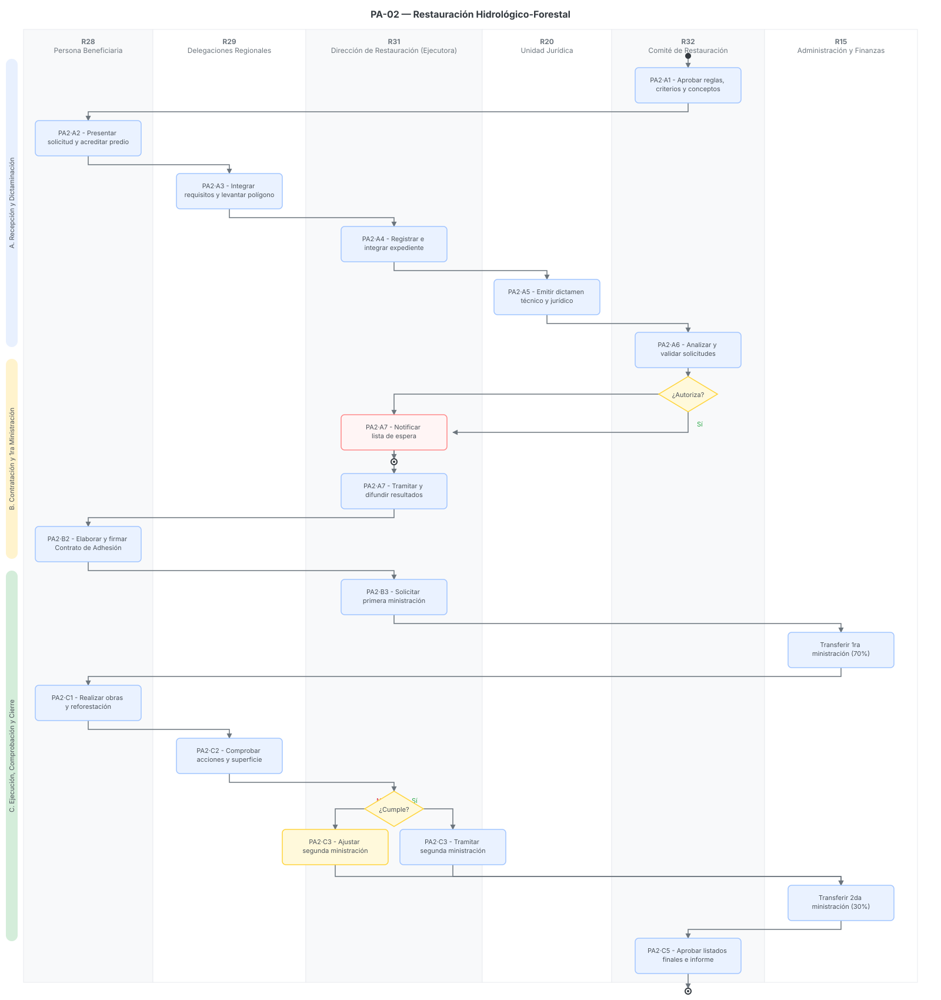

# PA-02 · Restauración Hidrológico-Forestal

> Plantilla adaptada para el Programa de Restauración Hidrológico-Forestal, alineada a los requerimientos técnicos de sus Reglas de Operación y al diagrama institucional de flujo[cite: 46, 54].
> Fecha de análisis: 23 de septiembre de 2026. Método: extracción de lineamientos operativos, requisitos de elegibilidad, roles y fiscalización, con énfasis en las tablas de entrada/salida por paso solicitadas en el reparto del sprint[cite: 54, 55].
> Citación externa de pasos: **PA2·A2**, **PA2·B3**, **PA2·C2** (proceso·paso).

## 1. Objeto y alcance

**Incluye** el ciclo anual completo del Programa de Restauración Hidrológico-Forestal: aprobación de reglas por el Comité → ingreso de Solicitud Única (FO-PB-501A) → levantamiento de poligonal en campo por la Delegación → integración de expediente y emisión de dictámenes (técnico/jurídico) → autorización del Comité → entrega de vale de planta → firma de Contrato de Adhesión → primera ministración (70%) → ejecución de obras (ej. presas de gavión, zanjas trinchera, reforestación) → verificación de superficie sobreviviente/trabajada → ajuste o liberación de la segunda ministración (30%) → informe final y cierre[cite: 46, 54].

**Fuera del alcance:** La producción y mantenimiento físico de la planta forestal dentro de los 17 viveros de PROBOSQUE, lo cual se gestiona de manera interna antes de la emisión del Vale de Planta[cite: 54].

## 2. Base documental (claves de cita)

| Clave | Archivo / ubicación | Qué aporta |
|---|---|---|
| [RO-RHF] | `REGLAS_OPS_Restauración_Hidrológico-Forestal_ene271e.pdf` | Establece los 4 conceptos de apoyo, montos por hectárea (\$30k, \$14k, \$3.5k, \$3k), criterios de elegibilidad, causas de incumplimiento y facultades del Comité[cite: 54]. |
| [FLUJO] | `PRG-02_Restauracion_Hidrologico_Forestal.png` | Diagrama de flujo oficial que dicta la secuencia de pasos y los actores involucrados (desde la solicitud hasta el informe final)[cite: 46]. |
| [501A] | `FORMATO_FO-PB-501A_SolicitudUnica_2026.docx` | Formato de Solicitud Única, detalla los datos del predio, representante legal y la declaratoria de no litigio[cite: 53]. |
| [502] | `FORMATO_FO-PB-502_RegInfo_Solicitante_Beneficiario_2026.docx` | Registro de Información del solicitante y/o beneficiaria con aviso de privacidad y datos generales[cite: 51]. |

## 3. Glosario de siglas

*   **PTRFI**: Proyecto Técnico de Restauración Forestal Integral. Documento obligatorio para las modalidades de Restauración Forestal Integral (1 y 2)[cite: 54].
*   **PSF**: Prestador de Servicios Forestales. Asesor técnico con Registro Forestal Nacional (RFN) facultado para elaborar el PTRFI[cite: 54].
*   **DRF**: Delegación Regional Forestal. Instancia desconcentrada (9 en total) que recibe solicitudes, levanta poligonales y verifica obras[cite: 54].

## 4. Roles (personificados)

| ID | Rol | Puesto y unidad (fuente) | Tipo |
|---|---|---|---|
| R28 | Persona solicitante / beneficiaria | Personas propietarias y/o poseedoras de terrenos forestales (mínimo 0.5 ha)[cite: 54]. | Externo |
| R29 | Delegaciones Regionales (DRF) | Reciben las solicitudes FO-PB-501A, levantan la poligonal (Diagnóstico Técnico) y comprueban las acciones en campo[cite: 46, 54]. | Interno descentralizado |
| R31 | Dirección de Restauración y Fomento Forestal | Instancia Ejecutora; registra expedientes, emite dictamen técnico, tramita resultados, elabora contratos y gestiona ministraciones[cite: 46, 54]. | Interno |
| R20 | Unidad Jurídica (UJIGEV) | Emite el dictamen jurídico sobre la legal propiedad/posesión del predio y gestiona reintegros por incumplimiento[cite: 46, 54]. | Interno |
| R32 | Comité de Admisión y Seguimiento | Instancia Normativa; aprueba reglas, analiza/valida solicitudes y aprueba los listados finales de beneficiarios[cite: 46, 54]. | Colegiado |
| R15 | Administración y Finanzas (DAFGD) | Transfiere o dispersa los recursos económicos (70% y 30%) a las cuentas CLABE de los beneficiarios[cite: 46, 54]. | Interno |

## 5. Funciones y actividades por rol

*   **R28 (Beneficiaria):** Presenta el FO-PB-501A y 502, recibe el vale de planta, ejecuta las obras de suelo o reforestación (ej. Bosques de Agua) y permite la verificación de supervivencia[cite: 46, 53, 54].
*   **R29 (DRF):** Integra los requisitos en ventanilla, levanta la poligonal en el SIG de PROBOSQUE, y realiza la visita para comprobar superficie y acciones[cite: 46, 54].
*   **R31 (Dir. Ejecutora):** Integra el expediente maestro, emite el dictamen técnico, publica los folios factibles, genera el Contrato de Adhesión y calcula ajustes si la superficie verificada es menor a la aprobada[cite: 46, 54].
*   **R32 (Comité):** Sesiona para validar dictámenes, autoriza el presupuesto por solicitud, y cierra el ciclo aprobando el informe final[cite: 46, 54].

## 6. Reglas de negocio

*   **BR-1** Conceptos y Montos de Apoyo:
    1.  *Restauración Forestal Integral (Mod 1):* \$30,000.00/ha (Obras de suelo).
    2.  *Restauración Forestal Integral (Mod 2):* \$14,000.00/ha (Reforestación + obras alternas).
    3.  *Bosques de agua:* \$3,500.00/ha (Reforestación y conservación).
    4.  *Preservación de reforestaciones:* \$3,000.00/ha (Mantenimiento y replante, condicionado a supervivencia histórica ≥70% en clima templado o ≥40% cálido)[cite: 54].
*   **BR-2** Mecánica de Entrega: El apoyo se entrega en dos ministraciones (70% al firmar el contrato y 30% a la conclusión verificada). Todos los conceptos (excepto Mod 1) incluyen Vale de Planta nativa gratuita[cite: 54].
*   **BR-3** Superficie Mínima: La superficie solicitada mínima es de 0.5 hectáreas y los polígonos no pueden ser menores a 0.25 ha[cite: 54].
*   **BR-4** Ajuste Financiero (Ruta de Incumplimiento Parcial): Si en la verificación (C2) se comprueba que se trabajó una superficie menor a la asignada, pero superior al 70%, se aplicará un "Ajuste a la segunda ministración". Si es menor al 70%, procede cancelación y reintegro total[cite: 54].

## 7. Procedimiento

### Proceso A — Recepción y Dictaminación

*   **PA2·A1** R32 (Comité) inicia el ciclo aprobando las Reglas, criterios y conceptos del Programa[cite: 46, 54].
*   **PA2·A2** R28 (Beneficiaria) presenta en la DRF correspondiente su Solicitud Única (FO-PB-501A), FO-PB-502 y documentos legales[cite: 46, 51, 53].
*   **PA2·A3** R29 (DRF) integra requisitos y realiza visita de campo para levantar la poligonal (Diagnóstico Técnico)[cite: 46, 54].
*   **PA2·A4** R31 (Dir. Ejecutora) recibe las poligonales, registra e integra el expediente maestro[cite: 46, 54].
*   **PA2·A5** R20 (UJIGEV) emite el dictamen jurídico; R31 emite el dictamen técnico mediante cruces en el SIG[cite: 46, 54].
*   **PA2·A6** R32 (Comité) analiza y valida los dictámenes de las solicitudes[cite: 46, 54].
*   **PA2·A7 (Bifurcación):** ¿Autoriza el Comité? Si es No, R31 notifica inclusión en Lista de Espera por falta de presupuesto. Si es Sí, R31 tramita y difunde los resultados[cite: 46, 54].

### Proceso B — Adhesión y 1ra Ministración

*   **PA2·B1** R31 emite el "Vale de Planta" y entrega la especie nativa a la persona beneficiaria en el vivero correspondiente[cite: 46, 54].
*   **PA2·B2** R31 elabora el Contrato de Adhesión y recaba la firma de R28 (Beneficiaria)[cite: 46, 54].
*   **PA2·B3** R31 solicita la primera ministración; R15 (Finanzas) realiza la transferencia electrónica (SPEI) equivalente al 70% del apoyo[cite: 46, 54].

### Proceso C — Ejecución, Comprobación y Ajuste

*   **PA2·C1** R28 (Beneficiaria) realiza las obras de conservación, captación de agua y/o reforestación[cite: 46, 54].
*   **PA2·C2** R29 (DRF) acude al predio para comprobar físicamente las acciones y cuantificar la superficie efectivamente trabajada[cite: 46, 54].
*   **PA2·C3 (Bifurcación):** ¿Cumple superficie total? 
    *   Si es No (pero >70%): R31 procesa un Ajuste administrativo a la segunda ministración.
    *   Si es Sí: R31 tramita la segunda ministración intacta[cite: 46, 54].
*   **PA2·C4** R15 (Finanzas) transfiere el 30% final o el monto ajustado[cite: 46].
*   **PA2·C5** R32 (Comité) aprueba los listados finales y el informe anual de cierre del programa[cite: 46, 54].

## 8. Diagramas de actividad

> Cada nodo lleva su **ID de paso** (PA2·#) mapeado a los 6 carriles de responsabilidad, calcado del diagrama oficial de flujo[cite: 46].

## 9. Tabla de necesidades

Prioridad: **A** = obligatoria · **M** = media · **B** = deseable.

| ID | Rol | Necesidad | P | Paso | Origen |
|---|---|---|---|---|---|
| N-01 | R29 | Aplicación móvil GIS offline para que la DRF levante la poligonal en el paso A3 y la sincronice al expediente único | A | A3 | [FLUJO / RO-RHF p. 59][cite: 46, 54] |
| N-02 | R31 | Generador automático de "Contratos de Adhesión" cruzando los datos del FO-PB-502 y los polígonos aprobados | A | B2 | [RO-RHF p. 60][cite: 51, 54] |
| N-03 | R31 | **Módulo de Ajuste Proporcional:** Algoritmo en el SGD que recalcule automáticamente el pago final (30%) si la DRF reporta una superficie trabajada menor a la aprobada | A | C3 | [FLUJO / RO-RHF p. 60][cite: 46, 54] |
| N-04 | R31 | Módulo de "Vale de Planta" interconectado con el inventario de los 17 viveros (Salida G9) para evitar sobre-asignación | M | B1 | [RO-RHF p. 55][cite: 54] |

## 10. Registros que el SGD debe gestionar (catálogo documental)

*   **FO-PB-501A** (Solicitud Única) y **FO-PB-502** (Registro de Información)[cite: 51, 53].
*   Polígonos Shapefile / Diagnóstico Técnico de campo[cite: 54].
*   Dictamen Técnico y Jurídico de Factibilidad[cite: 54].
*   Vale de Planta Forestal[cite: 54].
*   Contrato de Adhesión (firmado)[cite: 54].
*   Comprobantes de Transferencia (SPEI) 70% y 30% / Ajustes[cite: 54].
*   Minutas de comprobación de acciones y superficie en campo[cite: 46, 54].

## 11. Vacíos y siguientes pasos

*   **V-01 Excepción de Vales:** La Mod 1 no recibe planta. El sistema debe tener una validación de negocio (BR) que impida generar un "Vale de Planta" si el concepto apoyado es "Restauración Forestal Integral Modalidad 1"[cite: 54].
*   **V-02 Cruce de Lista de Incumplidos:** El paso A4 (Integración) debe incorporar una llamada a la base de datos de PROBOSQUE para rechazar automáticamente solicitantes que aparezcan en el "Listado de Personas Beneficiarias Incumplidas"[cite: 54].
*   **Siguiente paso:** Desarrollar en el SGD el motor de **Cálculo de Ajustes (C3)**, ya que la regla estipula que si se trabajó entre el 70% y el 99% del polígono, el pago final sufre recortes; si es menor al 70%, detona una alarma a UJIGEV para cancelación.

## 12. Tabla de entrada/salida por paso (Fiscalización y Trazabilidad)

| Paso | Actor | Documento / Dato de Entrada (Fuente) | Datos Capturados en Sistema | Documento de Salida (Formato) |
|---|---|---|---|---|
| **PA2·A1** | R32 (Comité) | RO previas e histórico[cite: 54] | Presupuesto y techos financieros anuales. | Acta de aprobación del Comité[cite: 46, 54] |
| **PA2·A2** | R28 (Beneficiaria) | Convocatoria y reglas[cite: 54] | Datos del predio, cuenta bancaria, beneficiarios (FO-PB-502). | Solicitud Única (FO-PB-501A) y Anexos[cite: 51, 53] |
| **PA2·A3** | R29 (DRF) | Expediente inicial[cite: 54] | Coordenadas y poligonales (Shapefiles) del terreno. | Diagnóstico Técnico de Campo[cite: 46, 54] |
| **PA2·A5** | R20 / R31 | Expediente integrado[cite: 46, 54] | Estatus jurídico (aprobado/rechazado) y cruce espacial. | Dictamen Jurídico y Dictamen Técnico[cite: 46, 54] |
| **PA2·A6** | R32 (Comité) | Dictámenes emitidos[cite: 46, 54] | Asignación de recursos por solicitud (Factibles). | Acta de Validación de Solicitudes[cite: 46, 54] |
| **PA2·B1** | R31 (Ejecutora) | Listado publicado[cite: 54] | Cantidad y especie de planta requerida según polígono. | Vale de Salida de Planta[cite: 46, 54] |
| **PA2·B2** | R28 / R31 | Listado factible y CLABE[cite: 51, 54] | Compromisos formales y superficie exacta validada. | Contrato de Adhesión firmado[cite: 46, 54] |
| **PA2·B3** | R15 (Finanzas) | Contrato de Adhesión[cite: 46, 54] | Fecha de dispersión bancaria del 70%. | Comprobante de Primera Ministración (SPEI)[cite: 46, 54] |
| **PA2·C2** | R29 (DRF) | Obras ejecutadas por R28[cite: 46, 54] | Georreferencias de zanjas, presas, % de supervivencia. | Minuta de Comprobación de Acciones[cite: 46, 54] |
| **PA2·C3** | R31 (Ejecutora) | Minuta de comprobación[cite: 46, 54] | Recálculo de superficie ejecutada vs contratada (>70%). | Dictamen de Ajuste de Ministración[cite: 46, 54] |
| **PA2·C4** | R15 (Finanzas) | Dictamen de Ajuste o Liberación[cite: 46] | Pago procesado por el saldo (30% o menor). | Comprobante de Segunda Ministración (SPEI)[cite: 46, 54] |
| **PA2·C5** | R32 (Comité) | Cierre financiero y operativo[cite: 46, 54] | Cierre de expedientes en estado "Graduado". | Acta de Aprobación de Listados Finales[cite: 46, 54] |