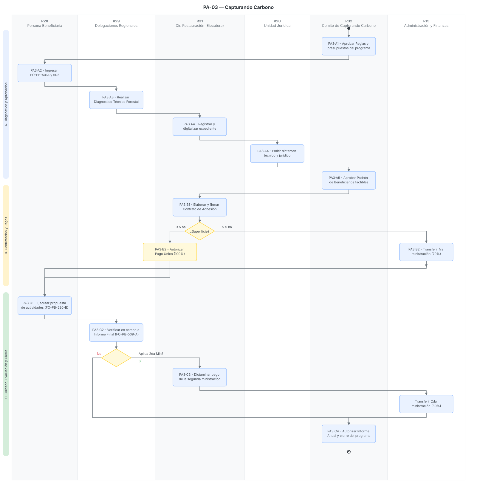

# PA-03 · Capturando Carbono

> Plantilla adaptada para el Programa Capturando Carbono, alineada a los requerimientos técnicos de sus Reglas de Operación, normatividad de su Comité y catálogo de formatos oficiales[cite: 56, 62].
> Fecha de análisis: 23 de septiembre de 2026. Método: extracción de lineamientos operativos, requisitos de masa forestal y fiscalización, incorporando la tabla de entrada/salida por paso según el reparto del sprint[cite: 55, 56].
> Citación externa de pasos: **PA3·A2**, **PA3·B2**, **PA3·C2** (proceso·paso).

## 1. Objeto y alcance

**Incluye** el ciclo anual del Programa Capturando Carbono, enfocado en compensar el mantenimiento e incremento del almacenamiento de bióxido de carbono ($CO_{2}$): aprobación de reglas por el Comité → ingreso de Solicitud Única (FO-PB-501A) → diagnóstico técnico forestal por la Delegación → dictaminación técnica/jurídica → autorización del Comité → firma del Contrato de Adhesión → evaluación de superficie para bifurcación de pagos (pago único del 100% para $\le$ 5 ha, o en dos ministraciones 70/30 para $>$ 5 ha) → ejecución de propuesta de actividades (FO-PB-520-B) → verificación e Informe Final (FO-PB-509-A) → graduación[cite: 56].

**Fuera del alcance:** El establecimiento inicial de plantaciones forestales o reforestaciones, ya que este programa exige de forma excluyente que la masa forestal tenga al menos 4 años de haberse establecido (edad $\ge$ 4 años)[cite: 56].

## 2. Base documental (claves de cita)

| Clave | Archivo / ubicación | Qué aporta |
|---|---|---|
| [RO-CC] | `RO_2026_CapturandoCarbono.pdf` | Reglas de Operación 2026. Fija el monto (\$2,000/ha), los umbrales de edad ($\ge$ 4 años) y densidad (60% templadas, 50% semiáridas/tropicales), y la regla estricta de división de pagos según hectareaje[cite: 56]. |
| [RIC-CC] | `REGLAMENTO_Comite_CapturandoCarbono_4.pdf` | Atribuciones del Comité Interinstitucional, que aprueba padrones, evalúa conflictos, autoriza resultados finales y decreta suspensiones/reintegros[cite: 62]. |
| [501A] | `FORMATO_FO-PB-501A_SolicitudUnica_2026_2.docx` | Formato de Solicitud Única. Capta la superficie específica por tipo (Maderable, Navideña, Reforestación) y verifica exclusividad frente a otros apoyos[cite: 65]. |
| [502] | `FORMATO_FO-PB-502_RegInfo_Solicitante_Beneficiario_2026_2.docx` | Registro de Información de la persona solicitante y/o beneficiaria, incluye la designación obligatoria de una segunda persona beneficiaria[cite: 63]. |

## 3. Glosario de siglas

*   **FO-PB-520-B**: *Propuesta de actividades que permitan mantener o incrementar los almacenes de carbono*. Documento rector de las acciones a ejecutar en campo[cite: 56].
*   **FO-PB-509-A**: *Informe Final de Actividades*. Formato indispensable, validado por PROBOSQUE y la beneficiaria, para liberar el 30% final o concluir la graduación[cite: 56].
*   **Densidad arbolada**: Relación entre el número de árboles y la superficie; el 100% de densidad en este programa equivale a 1,000 árboles por hectárea[cite: 56].

## 4. Roles (personificados)

| ID | Rol | Puesto y unidad (fuente) | Tipo |
|---|---|---|---|
| R28 | Persona beneficiaria | Propietarias y/o poseedoras de plantaciones maderables, navideñas o reforestaciones (1 a 200 ha)[cite: 56]. | Externo |
| R29 | Delegaciones (DRF) | Elaboran el "Diagnóstico Técnico Forestal" mediante visitas y cartografía GIS, y dan el acompañamiento técnico gratuito[cite: 56]. | Interno desconcentrado |
| R31 | Dir. Ejecutora (Restauración) | Registra, emite el Dictamen Técnico Forestal, genera contratos y tramita las ministraciones[cite: 56]. | Interno |
| R20 | Unidad Jurídica (UJIGEV) | Dictamina legalmente la propiedad/posesión y exige devoluciones por incumplimientos[cite: 56, 62]. | Interno |
| R32 | Comité (Capturando Carbono) | Instancia normativa; aprueba padrones, resuelve casos no previstos, evalúa fuerza mayor (siniestros) y aprueba el informe final[cite: 56, 62]. | Colegiado |
| R15 | Administración y Finanzas | Dispersa las transferencias electrónicas a las cuentas bancarias (CLABE) bajo la regla de negocio del hectareaje[cite: 56]. | Interno |

## 5. Funciones y actividades por rol

*   **R28 (Beneficiaria):** Conserva la masa forestal, ejecuta las acciones del FO-PB-520-B, coadyuva en el monitoreo de captura de carbono y firma el Informe Final[cite: 56].
*   **R29 (DRF):** Valida en campo y gabinete (GIS) los umbrales de densidad y cobertura, y supervisa que no haya traslapes ni cambio de uso de suelo[cite: 56].
*   **R31 (Ejecutora) y R20 (UJIGEV):** Emiten los dictámenes y depuran la lista cruzando contra el *Listado de Personas Beneficiarias Incumplidas*[cite: 56].
*   **R32 (Comité):** Analiza conflictos, aprueba la reasignación de recursos no devengados y decreta bajas o suspensiones[cite: 62].

## 6. Reglas de negocio

*   **BR-1** Criterio de Masa Forestal Estricto: Las plantaciones o reforestaciones deben tener $\ge$ 4 años de establecidas. Densidad arbolada mínima: 60% en zonas templadas, 50% en zonas semiáridas/tropicales. No aplica para reforestaciones que presenten cobertura de bosque natural $\ge$ 30% (templadas) o $\ge$ 20% (tropicales)[cite: 56].
*   **BR-2** Monto y Modalidad Financiera: \$2,000.00 MXN anuales por hectárea.
*   **BR-3** Mecánica de Bifurcación de Pagos (Crítica):
    *   **Si la superficie es $\le$ 5 hectáreas:** Se realiza un **Pago Único (100%)** tras firmar el Contrato de Adhesión.
    *   **Si la superficie es $>$ 5 hectáreas:** Se otorgan dos ministraciones: 70% tras la firma del Contrato, y 30% sujeto a la evaluación técnica y firma del Informe Final (FO-PB-509-A)[cite: 56].
*   **BR-4** Dimensiones del polígono: Mínimo 1 hectárea, máximo 200 hectáreas. Se permiten conjuntos prediales si son contiguos o ecológicamente similares en el mismo municipio[cite: 56].
*   **BR-5** Exclusividad: No se otorgará el apoyo a polígonos que ya reciban otros mecanismos de compensación económica por Captura de Carbono u otros servicios ambientales (ej. PSAHEM)[cite: 56].

## 7. Procedimiento

### Proceso A — Diagnóstico y Aprobación

*   **PA3·A1** R32 (Comité) aprueba reglas, modificaciones y presupuestos[cite: 62].
*   **PA3·A2** R28 (Beneficiaria) presenta en R29 (DRF) las solicitudes FO-PB-501A y FO-PB-502 con documentos legales (y/o certificado de registro de plantación)[cite: 56, 63, 65].
*   **PA3·A3** R29 (DRF) realiza el Diagnóstico Técnico Forestal: verifica edad ($\ge$4 años), densidad y levanta las coordenadas GIS[cite: 56].
*   **PA3·A4** R31 (Dir. Ejecutora) recibe el expediente y cruza datos con UJIGEV (R20) para la emisión de Dictámenes Técnico y Jurídico[cite: 56].
*   **PA3·A5** R32 (Comité) revisa y aprueba el Padrón de Beneficiarios. Si el presupuesto es insuficiente, R31 notifica la Lista de Espera[cite: 56, 62].

### Proceso B — Contratación y Bifurcación de Pagos

*   **PA3·B1** R31 elabora el Contrato de Adhesión (estipulando el formato FO-PB-520-B) y recaba firmas de R28[cite: 56].
*   **PA3·B2 (Bifurcación Financiera):** R31 evalúa la superficie aprobada.
    *   *Ruta B2.1 ($\le$ 5 ha):* R31 tramita y R15 (Finanzas) transfiere el **100% (Pago Único)**[cite: 56].
    *   *Ruta B2.2 ($>$ 5 ha):* R31 tramita y R15 (Finanzas) transfiere el **70% (1ra Ministración)**[cite: 56].

### Proceso C — Conservación, Monitoreo y Cierre

*   **PA3·C1** R28 ejecuta las acciones de manejo y protección (FO-PB-520-B) con acompañamiento de R29 para incrementar o mantener los almacenes de carbono[cite: 56].
*   **PA3·C2** R29 verifica en campo y elabora el "Informe Final de Actividades" (FO-PB-509-A) validado junto con R28[cite: 56].
*   **PA3·C3 (Ruta pendiente de $>$ 5 ha):** Con base en el FO-PB-509-A, R31 procesa y R15 transfiere la **2da Ministración (30%)** o aplica el ajuste proporcional correspondiente[cite: 56].
*   **PA3·C4** R32 (Comité) autoriza el Informe Anual de Resultados y cierra el ciclo de las personas graduadas[cite: 56, 62].

## 8. Diagramas de actividad

> Cada nodo lleva su **ID de paso** (PA3·#) mapeado a la estructura de 6 carriles y refleja explícitamente la bifurcación de pago (BR-3).

## 9. Tabla de necesidades

Prioridad: **A** = obligatoria · **M** = media · **B** = deseable.

| ID | Rol | Necesidad | P | Paso | Origen |
|---|---|---|---|---|---|
| N-01 | R29 | Herramienta GIS institucional para clasificar automáticamente densidades arbóreas (umbrales 50%/60%) y cobertura natural (<20%/<30%) | A | A3 | [RO-CC p. 69][cite: 56] |
| N-02 | R31 | **Motor de Reglas de Pago (SGD):** Bifurcación sistémica automática. Si superficie $\le$ 5 ha = Orden de Pago 100%. Si $>$ 5 ha = Orden 70% y bloqueo del 30% hasta captura de formato FO-PB-509-A | A | B2 | [RO-CC p. 69][cite: 56] |
| N-03 | R28 | Plantilla estandarizada en sistema para capturar la "Propuesta de actividades..." (FO-PB-520-B) vinculada al contrato de adhesión | M | B1 | [RO-CC p. 70][cite: 56] |
| N-04 | R32 | Base de datos cruzada en tiempo real para bloquear registros de predios que ya cuenten con PSAHEM u otros fondos de carbono | A | A4 | [RO-CC p. 71][cite: 56] |

## 10. Registros que el SGD debe gestionar (catálogo documental)

*   **FO-PB-501A** (Solicitud Única) y **FO-PB-502** (Registro de Información)[cite: 63, 65].
*   Diagnóstico Técnico Forestal y Archivos GIS (poligonales validadas)[cite: 56].
*   **FO-PB-520-B** (Propuesta de actividades que permitan mantener o incrementar los almacenes de carbono)[cite: 56].
*   Contrato de Adhesión[cite: 56].
*   **FO-PB-509-A** (Informe Final de Actividades)[cite: 56].
*   Comprobantes de Transferencia Bancaria (SPEI - Pago único 100% o particionado 70/30)[cite: 56].

## 11. Vacíos y siguientes pasos

*   **V-01 Inventario de Carbono Técnico:** Los objetivos específicos mencionan "Evaluar los almacenes de carbono en los árboles... a través del levantamiento de un inventario de carbono" (p. 68), pero la mecánica operativa no detalla *quién* elabora dicho inventario dasométrico ni con qué formato metodológico (ecuaciones alométricas).
*   **Siguiente paso:** Para el desarrollo de la aplicación móvil (N-01), es vital integrar un algoritmo que asista a R29 (DRF) en el cálculo estimado de "carbono equivalente ($CO_{2}eq$)" durante el Diagnóstico Técnico Forestal (A3), permitiendo fundamentar rigurosamente el Dictamen.

## 12. Tabla de entrada/salida por paso (Fiscalización y Trazabilidad)

| Paso | Actor | Documento / Dato de Entrada (Fuente) | Datos Capturados en Sistema | Documento de Salida (Formato) |
|---|---|---|---|---|
| **PA3·A1** | R32 (Comité) | RO previas y Presupuesto[cite: 56] | Acuerdos de modificación y presupuestos aprobados. | Acta de Sesión (Reglas)[cite: 62] |
| **PA3·A2** | R28 (Beneficiaria) | Convocatoria vigente[cite: 56] | Superficie maderable/navideña, datos representante. | FO-PB-501A y FO-PB-502[cite: 63, 65] |
| **PA3·A3** | R29 (DRF) | Expediente inicial[cite: 56] | Edad de plantación ($\ge$4 años), densidad arbórea (%), polígono. | Diagnóstico Técnico Forestal (SIG)[cite: 56] |
| **PA3·A4** | R31 / R20 | Polígonos GIS y docs. legales[cite: 56] | Cruce de traslapes (ej. exclusión si tiene PSAHEM). | Dictámenes Técnico y Jurídico[cite: 56] |
| **PA3·A5** | R32 (Comité) | Dictámenes emitidos[cite: 56] | Aprobación de lista de factibles y asignación de recursos. | Acta de Validación (Padrón)[cite: 62] |
| **PA3·B1** | R31 (Ejecutora) | Lista de factibles[cite: 56] | Asignación de compromisos de protección forestal. | Contrato de Adhesión firmado[cite: 56] |
| **PA3·B2** | R15 (Finanzas) | Contrato de Adhesión (superficie)[cite: 56] | Bifurcación sistémica: Orden de pago al 100% o al 70%. | Comprobante de SPEI (Pago Único o 1ra Min.)[cite: 56] |
| **PA3·C1** | R28 (Beneficiaria) | Condiciones del Contrato[cite: 56] | Registro de acciones de protección y manejo de biomasa. | FO-PB-520-B (Propuesta de act.)[cite: 56] |
| **PA3·C2** | R29 (DRF) | Labores de campo ejecutadas[cite: 56] | Verificación de supervivencia y almacenes de carbono. | FO-PB-509-A (Informe Final)[cite: 56] |
| **PA3·C3** | R15 (Finanzas) | Informe Final (FO-PB-509-A)[cite: 56] | Liberación condicionada (solo para predios $>$ 5 ha). | Comprobante SPEI (2da Min. 30%)[cite: 56] |
| **PA3·C4** | R32 (Comité) | Cierre financiero[cite: 56] | Consolidación de expedientes para fiscalización. | Acta de Informe Anual de Resultados[cite: 56, 62] |