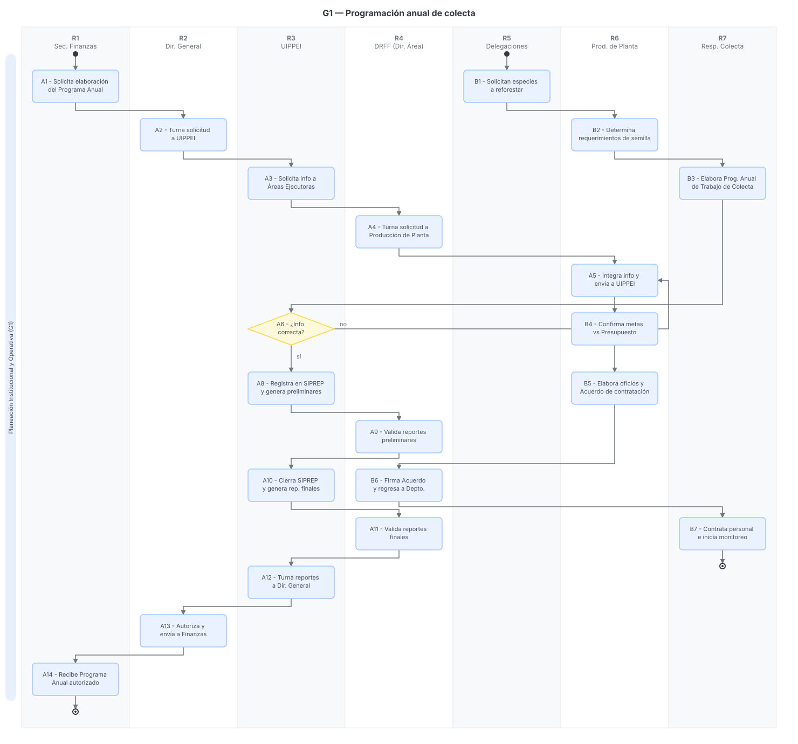

# G1 — Programación anual de colecta (planeación institucional y operativa)

> Proyecto: Sistema de Gestión Documental PROBOSQUE (trazabilidad y automatización).
> **Este documento es el análisis del proceso G1 del mapa `01_MAPA_PROCESOS_Y_VACIOS_GERMOPLASMA.md`**.
> Fecha de análisis: 2026-09-21. Citación externa de pasos: **G1·A1**, **G1·B2**, etc.

---

## 1. Objeto y alcance

Regular la **planeación y programación anual para la colecta de germoplasma**, integrando dos dimensiones que corren en paralelo:
1. **La planeación programática-presupuestal (Institucional):** Gestión de metas y presupuesto a través del Sistema de Planeación y Presupuesto (SIPREP) del Estado de México.
2. **La planeación operativa en campo:** Determinación de especies, cantidades de semilla requeridas y formación de brigadas de colecta.

**Dentro del alcance:** recepción de lineamientos de Finanzas → solicitud de especies por las Delegaciones Regionales → formulación del programa operativo → validación de presupuesto en SIPREP → autorización de contratación de personal eventual.
**Fuera del alcance:** La colecta física en campo (G2), beneficio (G4) y laboratorio (G5).

## 2. Base documental (origen de los requisitos)

| Clave | Documento | Uso — páginas verificadas |
|---|---|---|
| [MP06] | `86_manualProcDirRestYFtoFtal.pdf` — MP DRFF, sep-2006 | **pp. 27-33**: Procedimiento 4.2 "Colecta de Germoplasma Forestal". Define el flujo operativo desde la solicitud regional hasta la contratación de personal. |
| [SEP091] | `MANUALES_PROC_PROBOSQUE_2020_sep091_(UAZC-IndustriaComercialización-UIPPE).pdf` | **pp. 48-57**: Procedimiento "Integración del Programa Anual" de la UIPPEI. Establece los lineamientos para el registro en SIPREP y la generación de reportes (PbR-01a, PbR-02a, PbR-09a). |

## 2.1 Glosario

| Término | Significado | Fuente |
|---|---|---|
| SIPREP | Sistema de Planeación y Presupuesto de la Secretaría de Finanzas, donde se registra el Programa Anual. | [SEP091 p. 50] |
| Áreas Ejecutoras | Jefaturas de departamento (ej. Producción de Planta) que operan proyectos y ejercen recursos del presupuesto anual. | [SEP091 p. 49] |
| Zonas Bioclimáticas | Divisiones para organizar el mundo natural por clima y vegetación, base para la selección de especies a colectar. | [MP06 p. 28] |

## 3. Roles (stakeholders personificados)

| ID | Rol (puesto) | Unidad real | Tipo |
|---|---|---|---|
| R1 | Secretaría de Finanzas | Entidad Estatal | Externo |
| R2 | Dirección General | PROBOSQUE | Interno |
| R3 | UIPPEI (Unidad de Información, Planeación, Programación, Evaluación e Innovación) | PROBOSQUE | Interno |
| R4 | Dirección de Restauración y Fomento Forestal (DRFF) | Dirección de Área | Interno |
| R5 | Delegaciones Regionales Forestales (9) | Órganos desconcentrados | Interno |
| R6 | Titular del Depto. de Producción de Planta | Área Ejecutora | Interno |
| R7 | Responsable de Colecta de Germoplasma Forestal | Operativo | Interno |

## 4. Funciones y actividades por rol

| Rol | Función | Actividades clave (pasos §6) |
|---|---|---|
| R1 | Rectoría presupuestal | Detona el proceso solicitando el Programa Anual (A1) y recibe los reportes finales (A13). |
| R2 | Autorización institucional | Turna requerimientos a UIPPEI (A2) y autoriza el Programa Anual final (A13). |
| R3 | Integración SIPREP | Coordina a las áreas ejecutoras (A3), revisa congruencia, registra en SIPREP y genera reportes (A8, A10). |
| R4 | Validación de Área | Revisa que los reportes operativos y del SIPREP cuadren (A9, A11) y autoriza contratos eventuales (B6). |
| R5 | Demanda operativa | Solicitan las especies forestales a reforestar según necesidades regionales (B1). |
| R6 | Planeación Ejecutora | Determina requerimientos de semilla (B2), confirma presupuesto (B4) y provee información a UIPPEI (A5). |
| R7 | Planeación de Campo | Elabora programa anual de trabajo (B3) y contrata brigadas (B7). |

## 5. Reglas de negocio

- **BR-1** Criterio de Colecta: La colecta de semilla se realizará mediante la selección de especies que vegetan en el Estado de México en función a las Zonas Bioclimáticas.
- **BR-2** Calendario SIPREP: El Programa Anual debe formularse a partir del mes de julio y estar incorporado en el SIPREP a más tardar en la primera semana de agosto.
- **BR-3** Presupuesto como limitante: El programa de trabajo de colecta operativa está estrictamente sujeto a la confirmación de metas versus el presupuesto a ejercer.
- **BR-4** Contratación Eventual: La formación de brigadas de recolección requiere forzosamente un "Acuerdo para la contratación de personal eventual" firmado por la DRFF.

## 6. Procedimiento narrado (los IDs de paso son el ancla de trazabilidad)

**Modalidad A — Integración Institucional (SIPREP)**
- **G1·A1** R1 envía oficio de solicitud a R2 para la elaboración del Programa Anual. 
- **G1·A2** R2 recibe y turna a R3 (UIPPEI).
- **G1·A3** R3 elabora oficio solicitando la información de proyectos programáticos a las Áreas Ejecutoras, a través de R4 (DRFF).
- **G1·A4** R4 recibe y turna la solicitud a R6.
- **G1·A5** R6 integra la información del Programa Anual y la envía a R3 (con copia a R4).
- **G1·A6** R3 analiza la información. Si es incorrecta o incompleta, la regresa a R6 para corrección (**G1·A7**).
- **G1·A8** Si es correcta, R3 registra en el SIPREP y genera reportes preliminares (PbR-01a, PbR-02a, PbR-09a), los firma y envía a R4 para validación.
- **G1·A9** R4 valida que los reportes cuadren con lo propuesto y los devuelve firmados.
- **G1·A10** R3 cierra el SIPREP y genera los reportes finales.
- **G1·A11** R4 vuelve a validar los reportes finales.
- **G1·A12** R3 turna los reportes a R2.
- **G1·A13** R2 los autoriza y envía los originales a R1.

**Modalidad B — Planeación Operativa de Colecta**
- **G1·B1** R5 (Delegaciones) solicitan mediante oficio a R6 las especies forestales programadas para reforestar.
- **G1·B2** R6 determina el requerimiento exacto de especies y cantidades de semilla, y turna la instrucción a R7.
- **G1·B3** R7 elabora el "Programa anual de trabajo de colecta de germoplasma forestal" y lo envía a R6.
- **G1·B4** R6 revisa el programa y, en función del presupuesto autorizado (vinculación con Fase A), confirma o modifica las metas.
- **G1·B5** R6 elabora oficios y el "Acuerdo para la contratación de personal eventual", enviándolo a R4 para su firma.
- **G1·B6** R4 firma el Acuerdo y lo regresa a R6.
- **G1·B7** R6 fotocopia el Acuerdo y lo entrega a R7, quien procede a contratar al personal e iniciar el monitoreo de fuentes semilleras.

## 7. Diagramas de actividad (SVG con carriles por rol)

> Cada nodo lleva su **ID de paso** (G1·A#, G1·B#); las **claves de fuente** van en §2 y §8, no en el gráfico.

### G1 — Programación anual de colecta

## 8. Tabla de necesidades (con ancla al paso)

Prioridad: **A** = obligatoria · **M** = media · **B** = deseable.

| ID | Rol | Necesidad | Prior. | Paso | Origen (archivo) |
|---|---|---|---|---|---|
| N-01 | R5 | Comunicar requerimientos técnicos reales basados en zonas bioclimáticas | A | G1·B1 | [MP06 p. 28, 30] |
| N-02 | R6 | Empalmar la planeación operativa de colecta con los formatos institucionales (PbR-01a, PbR-02a) para evitar doble captura | A | G1·A5 / G1·B4 | Derivado de la desconexión entre [MP06] y [SEP091] |
| N-03 | R3 | Garantizar que los reportes de las Áreas Ejecutoras cumplan los calendarios fiscales (julio-agosto) | A | G1·A6 | [SEP091 p. 50] |
| N-04 | R4 | Trazabilidad documental para autorizar acuerdos de brigadas atados a presupuesto comprobable | M | G1·B6 | [MP06 p. 31] |

## 9. Registros que el SGD debe gestionar (catálogo documental)

Para automatizar este módulo y garantizar la trazabilidad de los datos, el Sistema de Gestión Documental deberá mapear relacionalmente los siguientes documentos:

| Registro | Genera (paso) | Contiene (campos clave) |
|---|---|---|
| **Oficio de requerimiento de especies** | R5 (G1·B1) | Especie, región forestal, cantidades estimadas. |
| **Programa anual de trabajo de colecta** | R7 (G1·B3) | Calendario operativo, zonas bioclimáticas, especies objetivo, recursos materiales. |
| **Reportes SIPREP (PbR-01a, 02a, 09a)** | R3 (G1·A8) | Clave de proyecto, unidad responsable, nombre de la acción, unidad de medida, cantidad, gasto programado y calendarización trimestral. |
| **Acuerdo para contratación eventual** | R6 (G1·B5) | Justificación presupuestal, temporalidad de la brigada, firmas de DRFF. |

## 10. Vacíos y siguientes pasos

1. **Desconexión temporal de manuales (Vacío B1):** El manual operativo de colecta data de 2006 [MP06], mientras que el manual de UIPPEI es de 2020 [SEP091]. Existe un riesgo de desfase en la nomenclatura de los proyectos programáticos.
2. **Ausencia de pipeline de datos (Vacío A5):** Actualmente la consolidación entre la "solicitud regional" (B1) y la "captura en SIPREP" (A8) requiere procesamiento manual por parte del Jefe de Producción de Planta. El SGD deberá automatizar estos flujos para autocompletar las proyecciones presupuestales a partir de la sumatoria de requerimientos regionales.
3. **Validación de Directorio:** Falta mapear al actual Titular del Depto. de Producción de Planta y a los delegados específicos para autorizar acuerdos eventuales, lo que representa un vacío en la asignación de permisos del sistema.
4. **Siguiente paso:** Convertir las necesidades N-01 a N-04 en flujos de trabajo automatizados dentro del motor de procesos del SGD y validar los campos exactos de los reportes `PbR` con UIPPEI.

## 11. Nota de mantenimiento

Este archivo es el análisis del **proceso G1** y vive en `Docs/Octavio/Germoplasma/G01_PROGRAMACION_COLECTA.md`. Los diagramas son SVG generados desde la carpeta `Docs/Octavio/Diagramas/G01/`.