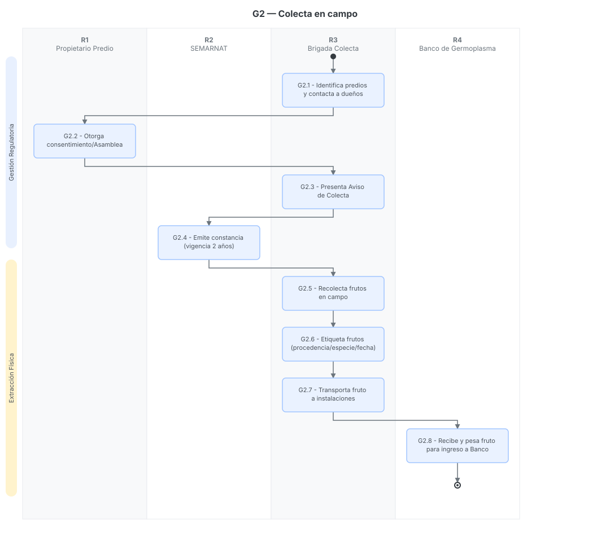

# G2 — Colecta en campo (identificación, recolección y traslado)

> Proyecto: Sistema de Gestión Documental PROBOSQUE (trazabilidad y automatización).
> **Este documento es el análisis del proceso G2 del mapa `01_MAPA_PROCESOS_Y_VACIOS_GERMOPLASMA.md`**[cite: 10].
> Fecha de análisis: 2026-09-21. Citación externa de pasos: **G2·1**, **G2·2**, etc.

---

## 1. Objeto y alcance

Regular la **ejecución física de la recolección de frutos y semillas forestales (germoplasma)**, abarcando desde la gestión de permisos en los predios fuente, la extracción en campo, el etiquetado de trazabilidad, hasta el traslado físico a las instalaciones de PROBOSQUE[cite: 10, 12].

**Dentro del alcance:** obtención del consentimiento legal de los predios, registro del aviso ante SEMARNAT, recolección en campo, identificación/etiquetado de lotes y transporte a SEDAGRO[cite: 11, 12].
**Fuera del alcance:** La planeación anual (G1), el ingreso y bitácora en el Banco (G3), y el beneficio/extracción de la semilla del fruto (G4).

## 2. Base documental (origen de los requisitos)

| Clave | Documento | Uso — páginas verificadas |
|---|---|---|
| [MP06] | `86_manualProcDirRestYFtoFtal.pdf` — MP DRFF, sep-2006 | **pp. 31-37**: Procedimiento 4.2 "Colecta de Germoplasma Forestal". Define la identificación de especies, etiquetado y transporte al Banco de Germoplasma[cite: 10]. |
| [LGDFS] | `Reg_LGDFS.pdf` — Reglamento de la Ley General de Desarrollo Forestal Sustentable | **Arts. 87-88 (p. 40)**: Define el "Aviso de colecta de germoplasma forestal", requisitos, consentimiento del propietario y vigencia[cite: 11]. |
| [WEB-COL] | `colecta_germoplasma.html` — Portal web PROBOSQUE | Define el objetivo del programa, las principales especies a colectar (pino vikingo, pino blanco, oyamel, encino) y el destino final del fruto[cite: 12]. |

## 2.1 Glosario

| Término | Significado | Fuente |
|---|---|---|
| Aviso de Colecta | Trámite federal obligatorio para extraer germoplasma con fines de reforestación/restauración. Requiere anexar métodos, destino y consentimiento[cite: 11]. | [LGDFS Art. 88] |
| Fuente Semillera | Predio o bosque (ejido, comunidad o privado) de donde se extrae el fruto[cite: 10, 11]. | [MP06 / LGDFS] |
| Fruto | Estructura botánica (ej. conos en pinos) que se recolecta en campo y que posteriormente requerirá "beneficio" para extraer la semilla pura[cite: 12]. | [WEB-COL] |

## 3. Roles (stakeholders personificados)

| ID | Rol (puesto) | Unidad real | Tipo |
|---|---|---|---|
| R1 | Propietario / Poseedor del predio | Particular, Ejido, Comunidad Agraria o Autoridad de Terrenos Nacionales | Externo |
| R2 | SEMARNAT / Autoridad Federal | Dependencia que recibe el aviso de colecta | Externo |
| R3 | Responsable de Colecta / Brigada | PROBOSQUE (Depto. Producción Planta) | Interno |
| R4 | Custodio del Banco de Germoplasma | PROBOSQUE (Vivero Invernaderos, SEDAGRO) | Interno |

## 4. Funciones y actividades por rol

| Rol | Función | Actividades clave (pasos §6) |
|---|---|---|
| R1 | Otorgar legalidad territorial | Otorga consentimiento expreso o acta de asamblea para permitir la extracción (G2·2)[cite: 11]. |
| R2 | Autorización regulatoria | Recibe el aviso, acusa recibo y emite constancia con vigencia máxima de 2 años (G2·4)[cite: 11]. |
| R3 | Ejecución operativa en campo | Gestiona permisos (G2·1, G2·3), recolecta (G2·5), etiqueta la trazabilidad (G2·6) y transporta (G2·7)[cite: 10, 11, 12]. |
| R4 | Recepción de inventario bruto | Recibe el fruto en el Banco para iniciar el proceso interno (G2·8)[cite: 10, 12]. |

## 5. Reglas de negocio

- **BR-1** Legalidad de procedencia: Es estrictamente obligatorio contar con el consentimiento por escrito del propietario o Legítimo poseedor del predio. Para ejidos y comunidades, se exige el acta de asamblea[cite: 11].
- **BR-2** Aviso regulatorio: Antes de la recolección, PROBOSQUE debe presentar el Aviso de Colecta ante la autoridad federal (SEMARNAT), indicando especies, cantidades, métodos y destino final[cite: 11].
- **BR-3** Vigencia: La constancia derivada del aviso de colecta tiene una vigencia máxima de dos años[cite: 11].
- **BR-4** Trazabilidad física: Todo fruto recolectado debe ser etiquetado inmediatamente en campo con los datos de: procedencia, especie, fecha de colecta y datos de ubicación[cite: 10].
- **BR-5** Especies prioritarias: El enfoque primario incluye pino vikingo, pino blanco, oyamel y encino[cite: 12].

## 6. Procedimiento narrado (los IDs de paso son el ancla de trazabilidad)

**Fase 1: Gestión Legal y Regulatoria**[cite: 11]
- **G2·1** R3 (Responsable de Colecta) identifica los predios viables según el programa anual y contacta a R1 (Propietarios).
- **G2·2** R1 emite el instrumento jurídico de consentimiento expreso (firma de carta para pequeños propietarios o acta de asamblea agraria para ejidos/comunidades).
- **G2·3** R3 integra el expediente con el consentimiento, métodos y cantidades, y presenta el "Aviso de colecta de Germoplasma forestal" ante R2 (SEMARNAT).
- **G2·4** R2 sella de recibido y emite la constancia de aviso, otorgando legalidad a la colecta con vigencia máxima de 2 años.

**Fase 2: Extracción y Trazabilidad**[cite: 10, 12]
- **G2·5** R3 (Brigada) se traslada a los predios autorizados y ejecuta la recolección manual o mecánica de los frutos de las especies programadas (oyamel, pinos, encinos, etc.).
- **G2·6** R3 identifica las especies en sitio y elabora las etiquetas adheribles/colgantes para los costales. Registra obligatoriamente: procedencia, especie, fecha de colecta y ubicación.
- **G2·7** R3 carga los costales y transporta el fruto cosechado desde las distintas zonas del Estado hacia el Banco de Germoplasma (Metepec).
- **G2·8** R4 recibe el fruto transportado para proceder con su pesaje, ingreso a bitácora y eventual beneficio (Aterriza en procesos G3/G4).

## 7. Diagrama de actividad (SVG con carriles por rol)

> Cada nodo lleva su **ID de paso** (G2·#); las **claves de fuente** van en §2 y §8, no en el gráfico.

## 8. Tabla de necesidades (con ancla al paso)

Prioridad: **A** = obligatoria · **M** = media · **B** = deseable.

| ID | Rol | Necesidad | Prior. | Paso | Origen (archivo) |
|---|---|---|---|---|---|
| N-01 | R3 | Plantillas institucionales para agilizar la obtención del consentimiento de ejidos y propietarios | M | G2·2 | [LGDFS p. 40][cite: 11] |
| N-02 | R3 | Sistema para alertar el vencimiento de los Avisos de Colecta (máximo 2 años) | A | G2·4 | [LGDFS p. 40][cite: 11] |
| N-03 | R3 | Generación de "Etiqueta de Lote" desde sistema móvil o impresa previamente para garantizar estandarización en campo | A | G2·6 | [MP06 p. 33][cite: 10] |
| N-04 | R4 | Trazabilidad del lote: El Banco no puede recibir fruto sin su etiqueta de procedencia y referencia al Aviso de Colecta | A | G2·8 | [MP06 p. 33 / LGDFS p. 40][cite: 10, 11] |

## 9. Registros que el SGD debe gestionar (catálogo documental)

| Registro | Genera (paso) | Contiene (campos clave) |
|---|---|---|
| **Consentimiento de colecta / Acta de Asamblea** | R1 (G2·2) | Nombre del propietario, ubicación del predio, autorización de ingreso y recolección[cite: 11]. |
| **Constancia de Aviso de Colecta** | R2 (G2·4) | Folio SEMARNAT, especies autorizadas, cantidades, vigencia (fechas)[cite: 11]. |
| **Etiqueta de Trazabilidad de Fruto** | R3 (G2·6) | Especie (común/científica), procedencia (municipio/predio), fecha de recolección, brigada responsable[cite: 10]. |
| **Manifiesto de traslado de campo** | R3 (G2·7) | Cantidad de bultos/costales transportados al Banco de Germoplasma[cite: 10]. |

## 10. Vacíos y siguientes pasos

1. **Digitalización de etiquetas en campo (Vacío B2):** Actualmente las etiquetas se llenan a mano, lo que provoca errores de lectura al llegar al Banco. El SGD debe contemplar la impresión de códigos QR o folios pre-generados atados al permiso de SEMARNAT.
2. **Registro de mermas en traslado:** El manual de 2006 no especifica cómo se documenta si la cantidad recolectada en campo difiere de la cantidad que finalmente llega al Banco (pérdidas en transporte).
3. **Siguiente paso:** Diseñar la base de datos relacional donde un "Lote de Semilla" (G3) nazca obligatoriamente asociado al PDF del "Aviso de Colecta" gestionado en esta fase (G2).

## 11. Nota de mantenimiento

Este archivo es el análisis del **proceso G2** y vive en `Docs/Octavio/Germoplasma/G02_COLECTA_CAMPO.md`. Los diagramas de §7 son SVG generados desde la carpeta `Docs/Octavio/Diagramas/G02/`.