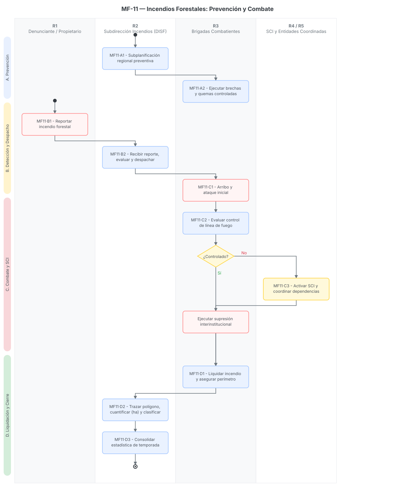

# MF-11 · Incendios Forestales: Prevención y Combate

> Plantilla adaptada para el proceso de Manejo de Fuegos Forestales (Prevención, Combate y Sistema de Comando de Incidentes), alineada a los requerimientos del módulo de Masa Forestal (MF)[cite: 32].
> Fecha de análisis: 23 de septiembre de 2026. Método: extracción de lineamientos operativos, métricas de impacto y protocolos de emergencia según el reparto del sprint[cite: 32].
> Citación externa de pasos: **MF11·A1**, **MF11·B2**, **MF11·C2** (proceso·paso).

## 1. Objeto y alcance

**Incluye** el ciclo completo del Programa Estatal de Manejo de Fuegos Forestales: subplanificación regional de prevención → ejecución de alternativas al uso del fuego y quemas controladas → construcción de brechas cortafuego → recepción de reportes de incendios → despacho de brigadas → activación del Sistema de Comando de Incidentes (SCI) para eventos mayores → combate, control y liquidación → evaluación del impacto y cuantificación de polígonos afectadas (hectáreas)[cite: 11, 31].

**Fuera del alcance:** La restauración ecológica post-incendio, la cual detona un proceso independiente gestionado a través de los Programas de Apoyo (como PA-02 o PA-06)[cite: 11, 32].

## 2. Base documental (claves de cita)

| Clave | Archivo / ubicación | Qué aporta |
|---|---|---|
| [WEB-INF] | `incendios_forestales.html` | Sitio web oficial. Define el objetivo del programa, alternativas a la quema de pastos, metas preventivas (ej. 70 km de brechas cortafuego), métricas de evaluación (incendios y ha afectadas) y al responsable de la Subdirección[cite: 31]. |
| [RLGDFS] | `Reg_LGDFS.pdf` | Reglamento de la Ley General de Desarrollo Forestal Sustentable. Capítulo II (Arts. 207-212). Define el Sistema de Comando de Incidentes, las líneas de manejo del fuego, esquemas de toma de decisiones y la clasificación de impacto post-incendio[cite: 11]. |
| [MGO] | `Manual General de Organización` | Funciones del Sistema de Comando de Incidencias (SCI) y de la Subdirección de Incendios Forestales (referenciado en el reparto)[cite: 32]. |

## 3. Glosario de siglas

*   **DISF**: Subdirección de Incendios Forestales. Área de PROBOSQUE encargada de la prevención y combate[cite: 31].
*   **SCI**: Sistema de Comando de Incidentes. Protocolo estandarizado de respuesta a emergencias que permite el manejo coordinado de recursos interinstitucionales[cite: 11, 32].
*   **Manejo del Fuego**: Estrategia integral que reconoce el rol ecológico del fuego y promueve alternativas a las quemas agropecuarias[cite: 11, 31].

## 4. Roles (personificados)

| ID | Rol | Puesto y titular (fuente) | Tipo |
|---|---|---|---|
| R1 | Denunciante / Propietario | Ciudadanía que reporta el siniestro o dueños de predios afectados[cite: 11, 31]. | Externo |
| R2 | Subdirección de Incendios Forestales (DISF) | Ing. Jaime Díaz Colín, Encargado del Despacho. Coordina el monitoreo, prevención y despacho[cite: 31]. | Interno |
| R3 | Brigadas de Combatientes | Personal operativo en campo encargado de construir brechas y combatir el fuego de manera directa[cite: 31]. | Interno Operativo |
| R4 | Sistema de Comando de Incidentes (SCI) | Estructura organizativa temporal (Mando, Operaciones, Planeación, Logística, Finanzas) activada ante siniestros que superan el ataque inicial[cite: 11, 32]. | Colegiado/Operativo |
| R5 | Entidades Coordinadas | Protección Civil, CONAFOR, Ayuntamientos y fuerzas armadas que participan bajo el SCI[cite: 11]. | Externo Institucional |

## 5. Funciones y actividades por rol

*   **R2 (DISF):** Realiza la subplanificación regional de prevención, atiende los reportes (vía correo o teléfono), opera la infraestructura de monitoreo para evaluar y asignar prioridades, y cuantifica los daños (ej. 3 incendios, 38.32 ha)[cite: 11, 31].
*   **R3 (Brigadas):** Ejecutan quemas controladas, abren brechas cortafuego preventivas y realizan el ataque inicial y liquidación de los incendios forestales[cite: 31].
*   **R4 (SCI):** Toma decisiones estratégicas cuando el incendio escapa al control inicial, asigna recursos especializados y coordina a las múltiples dependencias involucradas[cite: 11, 32].
*   **R1 (Ciudadanía):** Emite el reporte inicial del siniestro y, en caso de ser propietario, colabora en las acciones preventivas y de acceso al predio[cite: 11, 31].

## 6. Reglas de negocio

*   **BR-1** Enfoque Preventivo: La estrategia prioriza atender las causas humanas que originan los incendios, ofreciendo alternativas a la quema de pastos y ejecutando quemas controladas en áreas críticas[cite: 31].
*   **BR-2** Activación del SCI: Para la atención inmediata, se debe diferenciar entre "incendios en fase inicial" (atendidos por R3) y aquellos que "superan las acciones inmediatas de contención", los cuales exigen la definición e instauración del Sistema de Comando de Incidentes (SCI)[cite: 11, 32].
*   **BR-3** Evaluación de Daños (Impacto): Una vez liquidado el incendio, la superficie afectada se debe evaluar para clasificar el daño ecológico: Mínimo (<20% mortalidad), Moderado (20-50% mortalidad), Severo (>50% mortalidad)[cite: 11].
*   **BR-4** Trazabilidad de Métricas: El sistema debe ser capaz de emitir cortes estadísticos que consoliden el número de incendios, la superficie afectada (en hectáreas) y los kilómetros de brechas cortafuego realizadas por temporada[cite: 31].

## 7. Procedimiento

### Proceso A — Prevención y Subplanificación

*   **MF11·A1** R2 (DISF) elabora la subplanificación regional identificando áreas críticas y causas humanas de incendios[cite: 31].
*   **MF11·A2** R3 (Brigadas) ejecutan en campo alternativas de prevención: quemas controladas y construcción/mantenimiento de brechas cortafuego (acumulando kilometraje)[cite: 31].

### Proceso B — Detección y Despacho

*   **MF11·B1** R1 (Ciudadanía) detecta una columna de humo/fuego y emite el reporte a través de los medios de contacto de PROBOSQUE (teléfono, correo)[cite: 31].
*   **MF11·B2** R2 (DISF) recibe el reporte, verifica la ubicación geoespacial, evalúa la prioridad y despacha a R3 (Brigada) para el ataque inicial[cite: 11, 31].

### Proceso C — Combate y Sistema de Comando de Incidentes (SCI)

*   **MF11·C1** R3 (Brigadas) arriba al polígono y ejecuta labores de contención inicial[cite: 11, 31].
*   **MF11·C2** *Bifurcación:* Si el incendio es controlado, se pasa a Liquidación. Si el incendio supera la capacidad de contención inicial, R2 solicita la activación de R4 (SCI)[cite: 11].
*   **MF11·C3** R4 (SCI) asume el mando, estructura la planeación y coordina a R5 (Entidades Coordinadas: CONAFOR, PC, Ayuntamientos) para la supresión del siniestro[cite: 11, 32].

### Proceso D — Liquidación y Evaluación (Cierre)

*   **MF11·D1** R3 (Brigadas) liquida el incendio en su totalidad y asegura el perímetro[cite: 11, 31].
*   **MF11·D2** R2 (DISF) realiza la evaluación post-fuego: traza el polígono final (shapefile), calcula la superficie afectada en hectáreas y clasifica el impacto (Mínimo, Moderado, Severo)[cite: 11, 31].
*   **MF11·D3** R2 consolida la estadística en el informe oficial de la temporada (ej. total de incendios y ha afectadas por mes)[cite: 31].

## 8. Diagramas de actividad

> Cada nodo lleva su **ID de paso** (MF11·#) mapeado a los 4 carriles principales de responsabilidad operativa.

## 9. Tabla de necesidades

Prioridad: **A** = obligatoria · **M** = media · **B** = deseable.

| ID | Rol | Necesidad | P | Paso | Origen |
|---|---|---|---|---|---|
| N-01 | R2 | **Plataforma de Despacho Asistido (CAD)** que permita registrar el reporte, geolocalizar el punto de calor y asignar la brigada más cercana en tiempo real | A | B2 | [RLGDFS Art. 210][cite: 11] |
| N-02 | R3 | Registro en sistema móvil (offline) de los kilómetros de brechas cortafuego construidas para alimentar el tablero de indicadores en tiempo real | A | A2 | [WEB-INF][cite: 31] |
| N-03 | R4 | Módulo del **Sistema de Comando de Incidentes** para documentar el Plan de Acción del Incidente (PAI), asignación de recursos y bitácora de comunicaciones | A | C3 | [MGO / RLGDFS Art. 209][cite: 11, 32] |
| N-04 | R2 | Herramienta SIG para trazar el polígono final quemado, calcular el área exacta (ha) e integrarlo al Histórico de Masa Forestal | A | D2 | [WEB-INF][cite: 31] |
| N-05 | R2 | Clasificador automático de impacto (Mínimo, Moderado, Severo) basado en la evaluación de mortalidad arbórea capturada en campo | M | D2 | [RLGDFS Art. 212][cite: 11] |

## 10. Registros que el SGD debe gestionar (catálogo documental)

*   **Programa de Prevención Regional** (Metas de km de brechas y quemas controladas)[cite: 31].
*   **Ticket / Folio de Reporte de Incendio** (Fecha, hora, coordenadas preliminares, denunciante)[cite: 31].
*   **Bitácora de Despacho** (Tiempos de salida, llegada y control de brigadas)[cite: 11].
*   **Plan de Acción del Incidente (PAI)** (Exclusivo cuando se activa el SCI)[cite: 11, 32].
*   **Reporte Final de Siniestro** (Polígono shapefile, total de hectáreas afectadas, clasificación de impacto, tipo de vegetación dañada)[cite: 11, 31].
*   **Estadística de Temporada** (Consolidado de prevención y afectaciones)[cite: 31].

## 11. Vacíos y siguientes pasos

*   **V-01 Protocolo exacto de interoperabilidad:** No se detalla en los documentos provistos cómo interactúa el sistema de PROBOSQUE con el 911 estatal o la CONAFOR (Centro Nacional de Manejo del Fuego) para evitar duplicidad de despachos.
*   **V-02 Formatos de Campo:** Falta obtener los formatos físicos actuales (ej. Formato de Evaluación de Daños) que utilizan las brigadas para digitalizarlos en la aplicación móvil del SGD.
*   **Siguiente paso:** Diseñar el flujo de datos para que el polígono de "Área Quemada" generado en el paso D2 se convierta automáticamente en una "Capa de Restricción/Prioridad" visible para los analistas que revisan las solicitudes del Programa de Restauración (PA-02 / PA-06).

## 12. Tabla de entrada/salida por paso (Fiscalización y Trazabilidad)

| Paso | Actor | Documento / Dato de Entrada (Fuente) | Datos Capturados en Sistema | Documento de Salida (Formato) |
|---|---|---|---|---|
| **MF11·A1** | R2 (DISF) | Análisis de riesgos e histórico de incendios[cite: 31] | Zonas críticas, metas de kilómetros de brechas cortafuego. | Subprograma de Prevención Regional[cite: 31] |
| **MF11·A2** | R3 (Brigadas) | Subprograma de prevención[cite: 31] | Coordenadas de inicio/fin de brechas, km realizados. | Bitácora de Trabajos Preventivos[cite: 31] |
| **MF11·B1** | R1 (Ciudadanía) | Siniestro en curso[cite: 31] | Medio de reporte (tel, correo), datos de ubicación. | Folio de Reporte de Emergencia[cite: 31] |
| **MF11·B2** | R2 (DISF) | Reporte ciudadano / Monitoreo satelital[cite: 11] | Coordenadas, asignación de brigada, hora de despacho. | Orden de Despacho / Ticket activo[cite: 11] |
| **MF11·C1** | R3 (Brigadas) | Orden de despacho[cite: 11, 31] | Hora de arribo, porcentaje de control, requerimiento de apoyo. | Reporte de Situación Inicial (SITREP)[cite: 11] |
| **MF11·C3** | R4 (SCI) | Magnitud del incendio descontrolado[cite: 11, 32] | Asignación de dependencias (R5), recursos logísticos movilizados. | Plan de Acción del Incidente (PAI)[cite: 11, 32] |
| **MF11·D1** | R3 (Brigadas) | Operaciones de supresión[cite: 31] | Hora de 100% liquidación. | Cierre operativo del Incidente[cite: 31] |
| **MF11·D2** | R2 (DISF) | Recorridos post-incendio[cite: 11, 31] | Polígono GPS, área afectada (ha), % mortalidad, clasificación de impacto. | Reporte de Daños y Evaluación de Siniestro[cite: 11, 31] |
| **MF11·D3** | R2 (DISF) | Reportes de daños acumulados[cite: 31] | Sumatoria de eventos y superficie total por periodo. | Informe Estadístico Mensual/Anual[cite: 31] |