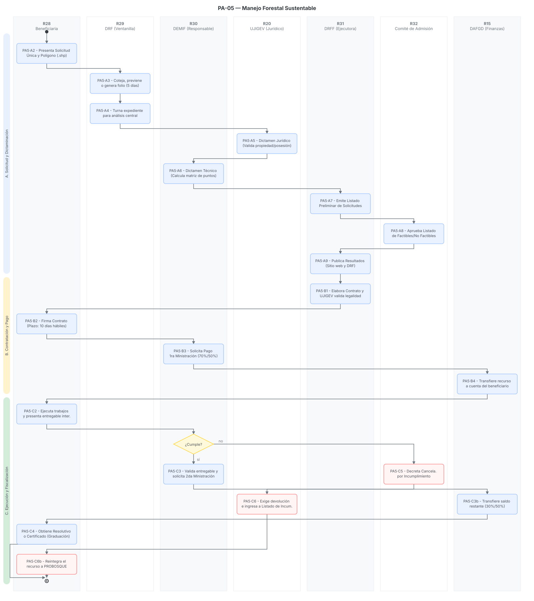

# PA-05 · Manejo Forestal Sustentable

> Plantilla adaptada para el Programa de Manejo Forestal Sustentable, siguiendo la estructura base de los programas de apoyo[cite: 13, 14].
> Fecha de análisis: 23 de septiembre de 2026. Método: extracción de lineamientos operativos, requisitos, roles y fiscalización según el reparto del sprint[cite: 13].
> Citación externa de pasos: **PA5·A2**, **PA5·B3**, **PA5·C2** (proceso·paso).

## 1. Objeto y alcance

**Incluye** el ciclo anual completo del Programa Manejo Forestal Sustentable 2026: publicación de Convocatoria y Reglas de Operación (RO) → recepción de solicitudes en Delegaciones Regionales Forestales (DRF) con verificación de 5 días hábiles → integración de expedientes → dictaminación técnica (mediante sistema de puntos) y jurídica → aprobación de listados por el Comité de Admisión y Seguimiento → publicación de resultados → firma del Contrato de Adhesión (10 días) → pago en dos ministraciones según el concepto (ETF o FSC) → ejecución del proyecto o proceso de certificación → graduación mediante entrega de resolutivo/auditoría, o cancelación y reintegro[cite: 20].

**Fuera del alcance:** La emisión misma de los certificados internacionales FSC o las autorizaciones de SEMARNAT/PROBOSQUE para los aprovechamientos maderables, los cuales son tramitados ante autoridades externas o casas certificadoras independientes y fungen únicamente como entregables dentro de este programa[cite: 20].

## 2. Base documental (claves de cita)

| Clave | Archivo / ubicación | Qué aporta |
|---|---|---|
| [RO] | `RO_2026_ManejoForestalSustentable.pdf` | Reglas completas del programa. Define el glosario, objetivos, cobertura, montos de apoyo por concepto (ETF y FSC), mecanismos de enrolamiento, dictaminación por puntos, causales de incumplimiento/reintegro, y graduación[cite: 20]. |
| [RIC] | `REGLAMENTO_Comite_ManejoForestalSustentable.pdf` | Reglamento Interno del Comité de Admisión y Seguimiento. Establece la integración del comité, facultades, periodicidad de sesiones y proceso de aprobación de beneficiarios y reintegros[cite: 17]. |
| [REP] | `REPARTO.md` | Instrucciones de reestructuración del proyecto, definiendo la necesidad de incluir la fiscalización, los formatos de revisión, y la tabla de entradas y salidas por paso[cite: 13]. |

## 3. Glosario de siglas

*   **DEMIF**: Departamento de Estudios de Manejo Integral Forestal (identificado como el área responsable u operativa)[cite: 17].
*   **DTU**: Documento Técnico Unificado, instrumento para solicitar autorización de aprovechamiento o cambio de uso de suelo[cite: 20].
*   **ETF**: Estudios Técnicos Forestales[cite: 20].
*   **FSC**: Forest Stewardship Council, certificación internacional de manejo responsable[cite: 20].
*   **PMF**: Programa de Manejo Forestal[cite: 20].
*   **UMA**: Unidades para la Conservación, Manejo y Aprovechamiento Sostenible de la Vida Silvestre[cite: 20].

## 4. Roles (personificados)

| ID | Rol | Puesto y titular (fuente) | Tipo |
|---|---|---|---|
| R28 | Persona solicitante / beneficiaria | Propietarias/poseedoras de terrenos forestales o centros de almacenamiento/transformación; designa segunda persona beneficiaria[cite: 20]. | Externo |
| R29 | DRF receptoras | Titulares de las 9 Delegaciones Regionales Forestales; reciben solicitudes, generan folio, notifican faltantes en 5 días y notifican pagos[cite: 20]. | Interno desconcentrado |
| R30 | Área responsable del programa (DEMIF) | Titular del Departamento de Estudios de Manejo Integral Forestal[cite: 17, 20]. | Interno |
| R31 | Instancia Ejecutora | Dirección de Restauración y Fomento Forestal[cite: 20]. | Interno |
| R32 | Instancia Normativa (Comité de Admisión y Seguimiento) | Presidencia: Titular de la Secretaría a la que se adscribe PROBOSQUE; Secretaría Técnica: Titular de PROBOSQUE; 7 vocalías (CONAFOR, SEMARNAT, colegios, asociaciones, UAEMéx)[cite: 17, 20]. | Colegiado |
| R15 | DAFGD | Dirección de Administración, Finanzas y de Gestión Documental; provee cuenta para reintegros y emite pagos[cite: 20]. | Interno |
| R20 | UJIGEV | Unidad Jurídica, de Igualdad de Género y Erradicación de la Violencia; realiza dictamen jurídico y exige devoluciones[cite: 20]. | Interno |
| R13 | OIC | Órgano Interno de Control; audita y recibe denuncias turnadas por el Comité[cite: 17, 20]. | Interno |

## 5. Funciones y actividades por rol

*   **R28 (Beneficiaria):** Entrega solicitud, solventa faltantes, levanta polígono con técnico externo, firma Contrato de Adhesión, ejecuta actividades, entrega bitácora/auditoría y, en caso de incumplimiento, reintegra recursos[cite: 20].
*   **R29 (DRF):** Recibe expedientes físicamente (no se aceptan en oficinas centrales), verifica requisitos, previene faltantes, turna expediente al área ejecutora y notifica al beneficiario[cite: 20].
*   **R30 (DEMIF):** Realiza dictaminación técnica mediante sistema de puntos espaciales y documentales, emite listados preliminares, genera solicitud de pago de ministraciones[cite: 20].
*   **R20 (UJIGEV):** Revisa documentación legal para emitir dictamen jurídico, valida proyectos de contratos/adendums y gestiona jurídicamente la devolución de recursos por incumplimiento[cite: 20].
*   **R32 (Comité):** Aprueba listados de factibles/no factibles, autoriza la admisión para casos especiales, decreta suspensiones o cancelaciones por conflictos, y aprueba reasignaciones de recursos no devengados[cite: 17, 20].
*   **R15 (DAFGD):** Ejecuta la transferencia electrónica o cheque del pago autorizado y administra la cuenta bancaria para reintegros[cite: 20].

## 6. Reglas de negocio

*   **BR-1** El programa cubre dos grandes conceptos de apoyo con topes específicos: A) Estudios Técnicos Forestales (de \$25,000 a \$175,000 según tipo y superficie) y B) Certificación Internacional FSC (Manejo Forestal hasta \$350,000; Cadena de Custodia hasta \$80,000; Mantenimiento y Servicios Ecosistémicos con montos menores)[cite: 20].
*   **BR-2** Mecánica de Pago ETF: Se entrega en dos ministraciones. La primera del 70% ocurre posterior a la firma del Contrato de Adhesión; la segunda del 30% tras presentar copia de la bitácora para la autorización del estudio o el resolutivo respectivo[cite: 20].
*   **BR-3** Mecánica de Pago Certificación FSC: Se entrega en dos ministraciones. La primera del 50% tras la firma del Contrato de Adhesión; la segunda del 50% al presentar copia de la solicitud de auditoría ante la entidad certificadora o el plan de auditoría[cite: 20].
*   **BR-4** Plazo de prevención: Si la solicitud está incompleta, la DRF informa y otorga 5 días hábiles para presentar la documentación faltante; de no hacerlo, la solicitud se tiene por desechada y no se genera folio[cite: 20].
*   **BR-5** Dictaminación por puntos (Técnica): El área responsable evalúa mediante una tabla que otorga puntos por: mayor superficie, doble modalidad, zona de alto potencial, estar en ANP, liderazgo femenino, víctimas de delito, enfermedades crónicas, entre otros. El puntaje máximo varía (100 puntos en ETF y FSC)[cite: 20].
*   **BR-6** Obligación Contractual: El Contrato de Adhesión debe firmarse en un plazo improrrogable de 10 días hábiles posteriores a la notificación de resultados aprobados[cite: 20].
*   **BR-7** Transparencia y Datos: Las personas beneficiarias con montos grandes o vulnerables ante ilícitos tienen su información catalogada como clasificada (protección de datos personales)[cite: 20].
*   **BR-8** Fiscalización y Reintegros: En caso de falsedad, uso distinto del recurso, litigios o desistimiento, la persona está obligada a reintegrar el monto ministrado a la cuenta de PROBOSQUE de manera inmediata. Si no lo hace, ingresa al "Listado de Personas Beneficiarias Incumplidas" y UJIGEV inicia recuperación[cite: 20].

## 7. Procedimiento

### Proceso A — Convocatoria, solicitud y dictaminación

*   **PA5·A1** R31 publica Convocatoria y Reglas de Operación en la Gaceta del Gobierno y sitio web[cite: 20].
*   **PA5·A2** R28 presenta personalmente la Solicitud Única, Registro de Información, identificación, CURP, designación de segunda persona beneficiaria y acreditación de propiedad/posesión (ej. Carpeta Básica, ADDATE, Escritura) junto con el shapefile del polígono **exclusivamente en la DRF correspondiente**[cite: 20].
*   **PA5·A3** R29 (DRF) recibe físicamente, coteja contra originales y entrega acuse. Si hay faltantes, previene por **5 días hábiles**; si se cumple, asigna folio de solicitud. Si no, desecha[cite: 20].
*   **PA5·A4** R29 turna el expediente completo al área ejecutora en oficinas centrales para su digitalización y análisis[cite: 20].
*   **PA5·A5** R20 (UJIGEV) realiza la dictaminación jurídica de la documentación legal para validar la procedencia[cite: 20].
*   **PA5·A6** R30 (DEMIF) realiza la dictaminación técnica aplicando la matriz de puntos (superficie, tipo de ecosistema, certificaciones previas, vulnerabilidad social) para generar puntaje[cite: 20].
*   **PA5·A7** R31 y R30 consolidan el listado preliminar de factibles y no factibles, ordenado descendentemente por puntaje hasta agotar el presupuesto[cite: 20].
*   **PA5·A8** R32 (Comité) sesiona, analiza y aprueba el listado de personas beneficiarias y la lista de espera[cite: 17, 20].
*   **PA5·A9** R31 gestiona la publicación de resultados en DRF y página web[cite: 20].

### Proceso B — Contratación y pago

*   **PA5·B1** R31/R30 elabora los Contratos de Adhesión. R20 valida los proyectos de contrato y adendums[cite: 20].
*   **PA5·B2** R28 acude a firmar el Contrato de Adhesión y presenta documento de cuenta bancaria con CLABE en un plazo de **10 días hábiles** tras la notificación[cite: 20].
*   **PA5·B3** R30 genera la solicitud de entrega del recurso económico (Primera Ministración: 70% para ETF, 50% para FSC)[cite: 20].
*   **PA5·B4** R15 (DAFGD) ejecuta la transferencia electrónica a la cuenta de R28[cite: 20].

### Proceso C — Ejecución, fiscalización y cierre

*   **PA5·C1** R28 contrata al Prestador de Servicios Técnicos o entidad certificadora e inicia los trabajos técnicos en el predio o industria[cite: 20].
*   **PA5·C2** R28 presenta el Entregable Intermedio (Copia de Bitácora para autorización en ETF, o Plan/Solicitud de auditoría en FSC)[cite: 20].
*   **PA5·C3** R30 valida el entregable y solicita a R15 el pago de la Segunda Ministración (30% para ETF, 50% para FSC)[cite: 20].
*   **PA5·C4** R28 culmina el trámite externo y obtiene el Resolutivo de SEMARNAT/PROBOSQUE o el Certificado FSC, consolidando la **Graduación** del programa[cite: 20].
*   **PA5·C5 (Ruta de Incumplimiento):** Si R29 o R30 detectan falsedad, litigios agrarios, o no se presentan entregables, R32 decreta suspensión o cancelación[cite: 20].
*   **PA5·C6** R15 proporciona cuenta bancaria, R20 exige devolución, y R28 reintegra el recurso no ejercido. El predio se anota en el "Listado de Incumplidos"[cite: 20].

## 8. Diagramas de actividad

*(El diagrama SVG se incluye de forma referencial apuntando al directorio de Diagramas del repositorio)*

## 9. Tabla de necesidades

| ID | Rol | Necesidad | P | Paso | Origen |
|---|---|---|---|---|---|
| N-01 | R28 | Conocer con precisión los documentos técnicos requeridos para su modalidad (ej. Shapefiles para ETF, Códigos de cuantificación para FSC Industria) | A | A2 | [RO p. 11-13][cite: 20] |
| N-02 | R29 | Herramienta para registrar el reloj de 5 días hábiles de prevención y detonar el desechamiento automático si no se cumple | A | A3 | [RO p. 14][cite: 20] |
| N-03 | R30 | Calculadora automatizada para la matriz de puntos (criterios de desempate y priorización por género, salud, vulnerabilidad) | A | A6 | [RO p. 15-18][cite: 20] |
| N-04 | R15 | Repositorio seguro para almacenar las carátulas bancarias y CLABEs de los beneficiarios para dispersión | A | B2 | [RO p. 11][cite: 20] |
| N-05 | R30 | Módulo de seguimiento de entregables (Bitácoras, Planes de Auditoría) para detonar la segunda ministración | A | C2 | [RO p. 10][cite: 20] |
| N-06 | R20 | Gestión del "Listado de Personas Beneficiarias Incumplidas" con control de reintegros para habilitar exclusiones | A | C6 | [RO p. 23][cite: 20] |

## 10. Registros que el SGD debe gestionar (catálogo documental)

*   Solicitud Única de Apoyo y Formato de Registro de Información[cite: 20].
*   Shapefiles de polígonos forestales a intervenir[cite: 20].
*   Dictamen Técnico (Matriz de Puntos) y Dictamen Jurídico[cite: 20].
*   Actas de Sesión del Comité de Admisión y Seguimiento[cite: 17].
*   Contrato de Adhesión (firmado)[cite: 20].
*   Entregables (Bitácora de autorización, Plan de auditoría FSC, Resolutivos finales)[cite: 20].
*   Comprobantes de transferencias bancarias y fichas de reintegro[cite: 20].

## 11. Vacíos y siguientes pasos

*   **V-01 Plantillas de Dictamen:** Las Reglas de Operación mencionan la elaboración de un "Dictamen Técnico" y "Dictamen Jurídico", pero los formatos exactos (FO-PB-XXX) no se especifican en el documento fuente[cite: 20]. Se requiere obtenerlos de la Instancia Ejecutora.
*   **V-02 Modelos de Contrato:** El modelo oficial del Contrato de Adhesión para 2026 no se encuentra anexado en las RO[cite: 20].
*   **Siguiente paso:** Configurar en el SGD los flujos de trabajo paralelos para Concepto A (ETF) y Concepto B (FSC), ya que sus porcentajes de pago y entregables difieren.

## 12. Tabla de entrada/salida por paso

| Paso | Actor | Documento / Dato de Entrada (Fuente) | Datos Capturados en Sistema | Documento de Salida (Formato) |
|---|---|---|---|---|
| **PA5·A2** | R28 (Solicitante) | RO y Convocatoria publicadas[cite: 20] | Datos personales, tipo de ecosistema, modalidad de apoyo, designación de segunda persona beneficiaria. | Solicitud Única y Registro de Información (Formatos físicos llenados)[cite: 20] |
| **PA5·A3** | R29 (DRF) | Solicitud, identificación, acreditación legal (Carpeta Básica/Escritura), Shapefile[cite: 20] | Fecha de recepción, validación de completitud, inicio de contador de 5 días (si aplica). | Comprobante de recepción / Folio de Solicitud (V-01)[cite: 20] |
| **PA5·A5** | R20 (UJIGEV) | Expediente digitalizado con documentos de propiedad/posesión[cite: 20] | Validación de vigencia de órganos de representación, ausencia de litigios. | Dictamen Jurídico (V-02)[cite: 20] |
| **PA5·A6** | R30 (DEMIF) | Shapefile, acreditaciones sociales (ej. constancias médicas, actas de asamblea)[cite: 20] | Asignación de puntos por criterios (superficie, ANP, mujer, enfermedad, etc.), cálculo de monto total. | Dictamen Técnico con puntaje (V-03)[cite: 20] |
| **PA5·A8** | R32 (Comité) | Listado preliminar de solicitudes dictaminadas[cite: 17, 20] | Estatus final (Factible / No Factible / Lista de Espera). | Acta de Sesión del Comité y Listado Aprobado[cite: 17, 20] |
| **PA5·B2** | R28 (Beneficiario) | Notificación de aprobación[cite: 20] | CLABE interbancaria, datos de la cuenta. | Contrato de Adhesión firmado (V-04)[cite: 20] |
| **PA5·B4** | R15 (DAFGD) | Solicitud de entrega de recurso económico (por R30) y Contrato firmado[cite: 20] | Fecha de dispersión, confirmación de transferencia. | Comprobante de Transferencia (1ra Ministración 70% o 50%)[cite: 20] |
| **PA5·C2** | R28 (Beneficiario) | Trabajos técnicos realizados con el Prestador de Servicios[cite: 20] | Fecha de recepción de entregable intermedio. | Copia de Bitácora (ETF) o Solicitud de Auditoría (FSC)[cite: 20] |
| **PA5·C4** | R28 (Beneficiario) | Entregables intermedios validados por R30[cite: 20] | Fecha de conclusión del proceso, registro de graduación. | Resolutivo de Autorización o Certificado FSC[cite: 20] |
| **PA5·C6** | R20 / R15 | Acta del comité decretando cancelación por incumplimiento[cite: 17, 20] | Registro de adeudo, alta en Listado de Incumplidos. | Ficha de depósito/transferencia de Reintegro[cite: 20] |