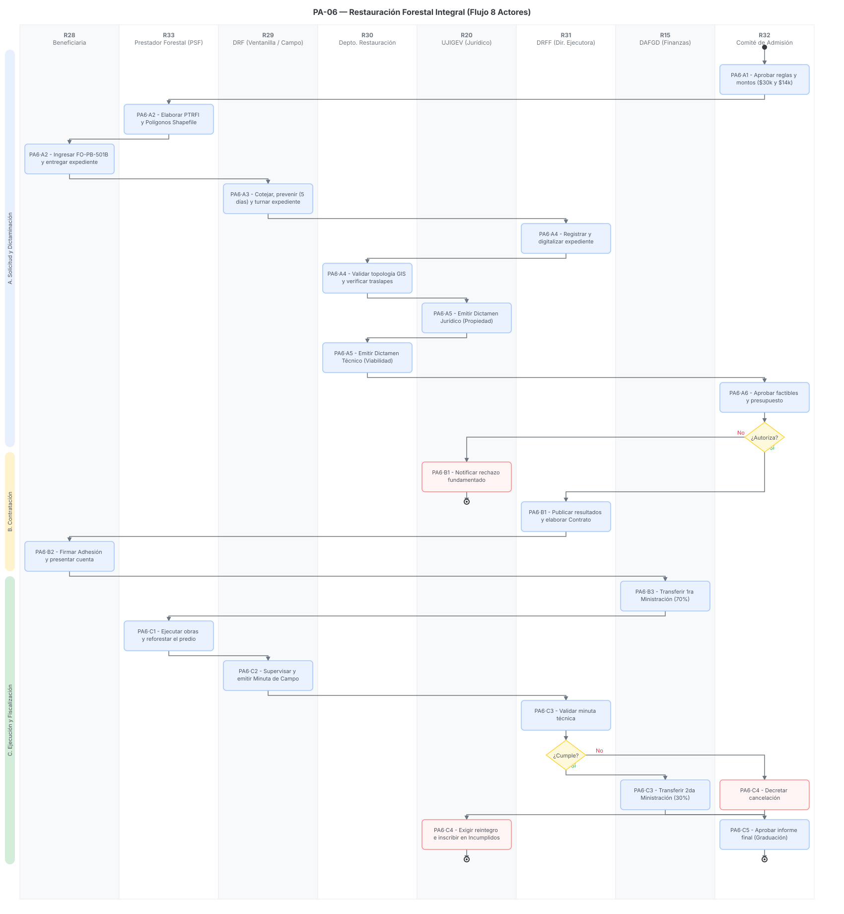

# PA-06 · Restauración Forestal Integral (Restauración Ecológica de Ecosistemas Forestales)

> Plantilla adaptada para el Programa de Restauración Hidrológico-Forestal (Restauración Forestal Integral), alineada a los requerimientos técnicos del PTRFI y el mapa de procesos institucionales[cite: 13, 19, 22].
> Fecha de análisis: 23 de septiembre de 2026. Método: extracción de lineamientos operativos, requisitos de geomática (shapefiles), roles del comité y fiscalización según el reparto del sprint[cite: 13].
> Citación externa de pasos: **PA6·A2**, **PA6·B3**, **PA6·C2** (proceso·paso).

## 1. Objeto y alcance

**Incluye** el ciclo anual completo del Programa de Restauración Ecológica de Ecosistemas Forestales 2026: aprobación de reglas por el Comité de Admisión y Seguimiento → presentación de la Solicitud Única y el Proyecto Técnico de Restauración Forestal Integral (PTRFI) → validación de parámetros geomáticos (shapefiles) → integración de expedientes en Delegaciones Regionales → dictaminación técnica y jurídica → autorización de factibilidad y montos → firma del Contrato de Adhesión → primera ministración (70%) → ejecución de obras de conservación de suelos, captación de agua y reforestación → verificación en campo y minuta → pago final (30%) → informe final y graduación, o en su defecto, cancelación y reintegro por incumplimiento[cite: 15, 19, 22].

**Fuera del alcance:** La producción en vivero de la planta forestal que será donada/entregada para las acciones de reforestación del proyecto, la cual se gestiona mediante el proceso de Salida Externa (G9) y Viveros (G8)[cite: 13, 22].

## 2. Base documental (claves de cita)

| Clave | Archivo / ubicación | Qué aporta |
|---|---|---|
| [GUIA] | `GUÍA_ProyectoTécnico_RestauraciónForestalIntegral_2026_2.pdf` | Establece la estructura obligatoria del PTRFI, las dos modalidades de apoyo financiero ($30k y $14k), el catálogo de obras permitidas (zanjas, presas, terrazas) y los requerimientos estrictos para polígonos GIS[cite: 19, 28]. |
| [RIC-RE] | `REGLAMENTO_Comite_RestauracionEcosistemas_2.pdf` | Reglamento Interno del Comité de Admisión y Seguimiento. Fija la composición del cuerpo colegiado, facultades para asignar recursos y decretar cancelaciones/reintegros[cite: 15, 24]. |
| [501B] | `FORMATO_FO-PB-501B_SolicitudUnica_2026.docx` | Formato de Solicitud Única, incluye la declaratoria de no litigio y el listado de documentos de cotejo legal y técnico[cite: 23]. |
| [INFO] | `Probosque_Programa_Restauracion_Manejo_Forestal_Sustentable.docx` | Informe de investigación que detalla el marco operativo, los montos máximos por hectárea, y la mecánica de ministración 70/30[cite: 22]. |

## 3. Glosario de siglas

*   **ASSOD**: *Assessment of the Status of Human-Induced Soil Degradation*. Nomenclatura para definir la condición de degradación en el predio (erosión hídrica, eólica, química, física)[cite: 19, 28].
*   **PTRFI**: Proyecto Técnico de Restauración Forestal Integral. Documento medular que justifica técnica, espacial y financieramente las obras a realizar[cite: 19, 28].
*   **PSF**: Prestador de Servicios Forestales. Profesional con Registro Forestal Nacional (RFN) sugerido para la elaboración y seguimiento del PTRFI[cite: 19, 28].
*   **SRC 32614**: Sistema de Referencia de Coordenadas UTM Zona 14N (Datum WGS84), estándar obligatorio para la entrega de polígonos[cite: 19, 28].

## 4. Roles (personificados)

| ID | Rol | Puesto y titular (fuente) | Tipo |
|---|---|---|---|
| R28 | Persona solicitante / beneficiaria | Propietarias/poseedoras de terrenos forestales degradados; responsables de firmar y cumplir el PTRFI[cite: 19, 23]. | Externo |
| R33 | Prestador de Servicios Forestales (PSF) | Asesor técnico externo que elabora el PTRFI, define las obras de suelo (ej. presas de gavión) y supervisa su ejecución[cite: 19, 28]. | Externo |
| R29 | DRF receptoras | Titulares de las 9 Delegaciones Regionales Forestales; reciben la solicitud FO-PB-501B, previenen faltantes y supervisan obras[cite: 22, 23]. | Interno desconcentrado |
| R30 | Depto. Restauración Forestal | Área técnica encargada de evaluar el PTRFI, validar la topología de los shapefiles y emitir el dictamen técnico[cite: 15, 19]. | Interno |
| R20 | UJIGEV (Jurídico) | Unidad Jurídica y de Igualdad de Género; elabora el dictamen jurídico de la propiedad y gestiona la recuperación de fondos[cite: 15, 22]. | Interno |
| R31 | DRFF (Dir. Ejecutora) | Dirección de Restauración y Fomento Forestal; coordina la validación, emite contratos y solicita pagos[cite: 22]. | Interno |
| R15 | DAFGD (Finanzas) | Dirección de Administración, Finanzas y Gestión Documental; dispersa los recursos (70/30) y controla la cuenta de reintegros[cite: 15, 22]. | Interno |
| R32 | Comité de Admisión y Seguimiento | Presidencia: Sec. del Campo; Sec. Técnica: PROBOSQUE; aprueba listados, montos, cancelaciones y reintegros[cite: 15, 24]. | Colegiado |

## 5. Funciones y actividades por rol

*   **R28 (Beneficiaria) y R33 (PSF):** Financian/Formulan el PTRFI, ingresan la solicitud, ejecutan el cronograma de obras (presas, terrazas, reforestación) y rinden el informe final[cite: 19, 28].
*   **R29 (Delegaciones):** Cotejan documentos, emiten acuses, previenen faltantes (5 días) y levantan minutas de campo[cite: 22, 23].
*   **R31 (Dir. Ejecutora) y R30 (Depto. Restauración):** R31 registra/digitaliza el expediente; R30 valida topológicamente los shapefiles y la viabilidad técnica y financiera del PTRFI[cite: 19, 28].
*   **R20 (UJIGEV):** Valida la legalidad de tenencia (dictamen jurídico) y exige devoluciones[cite: 15, 22].
*   **R32 (Comité):** Analiza conflictos, aprueba la asignación de recursos y dicta suspensiones por incumplimiento[cite: 15, 24].
*   **R15 (Finanzas):** Transfiere el 70% inicial y el 30% final tras validación de cumplimiento[cite: 15, 22].

## 6. Reglas de negocio

*   **BR-1** Modalidades y Topes:
    *   **Modalidad 1:** \$30,000.00 MXN por hectárea/año para nuevas actividades de Restauración Forestal Integral.
    *   **Modalidad 2:** \$14,000.00 MXN por hectárea/año para continuidad (reforestación obligatoria + 2 actividades alternas)[cite: 19, 28].
*   **BR-2** Mecánica de Pago: El recurso se ministra en dos exhibiciones: 70% a la firma del Contrato de Adhesión y 30% tras la conclusión verificada[cite: 22].
*   **BR-3** Restricciones Espaciales: Los archivos shapefile deben estar en SRC 32614, sin caracteres especiales, con tabla de atributos estricta. Error máximo de margen: 5%[cite: 19, 28].
*   **BR-4** Exclusividad de Apoyos: El polígono no debe presentar traslapes con proyectos gubernamentales en los últimos 5 años[cite: 19, 28].
*   **BR-5** Fiscalización Implacable: El Comité tiene la facultad explícita de exigir, a través de UJIGEV, la devolución de los recursos en caso de incumplimiento[cite: 15, 24].

## 7. Procedimiento

### Proceso A — Aprobación, Solicitud y Dictaminación

*   **PA6·A1** R32 (Comité) sesiona para aprobar criterios y montos del programa de Restauración Ecológica[cite: 15, 24].
*   **PA6·A2** R33 (PSF) elabora el PTRFI y los polígonos GIS; R28 acude a la Ventanilla Regional (R29) para entregar la solicitud FO-PB-501B[cite: 19, 23].
*   **PA6·A3** R29 coteja la documentación y previene faltantes en un lapso de 5 días hábiles; luego turna el expediente[cite: 22, 23].
*   **PA6·A4** R31 registra y digitaliza el expediente; R30 evalúa la topología del shapefile para asegurar que no hay traslapes históricos (-5 años)[cite: 19, 28].
*   **PA6·A5** R20 emite el dictamen jurídico de tenencia de la tierra; R30 emite el dictamen técnico[cite: 15, 22].
*   **PA6·A6** R32 revisa los dictámenes y aprueba el listado de factibles y presupuesto[cite: 15, 24].

### Proceso B — Contratación y 1ra Ministración

*   **PA6·B1** Si el Comité rechaza, R20 notifica formalmente. Si aprueba, R31 publica resultados y elabora el Contrato de Adhesión[cite: 15, 22].
*   **PA6·B2** R28 acude a firmar el Contrato de Adhesión y presenta su cuenta bancaria (CLABE)[cite: 22].
*   **PA6·B3** R31 solicita dispersión y R15 (Finanzas) transfiere la primera ministración (70%)[cite: 22].

### Proceso C — Ejecución Técnica, Supervisión y Cierre

*   **PA6·C1** R28 y R33 ejecutan el cronograma del PTRFI (presas, zanjas trinchera, reforestación)[cite: 19, 28].
*   **PA6·C2** R29 acude al predio a verificar las obras, levantando la Minuta de Campo[cite: 22].
*   **PA6·C3** R31 valida la minuta técnica; si cumple, R15 transfiere la segunda ministración (30%)[cite: 22].
*   **PA6·C4 (Ruta de Incumplimiento):** Si no cumple, R32 decreta cancelación; R20 exige reintegro y anota al beneficiario en el listado de incumplidos[cite: 15, 24].
*   **PA6·C5 (Ruta de Éxito):** R32 aprueba el informe final de resultados (Graduación)[cite: 15, 22].

## 8. Diagramas de actividad

> Cada nodo lleva su **ID de paso** (PA6·#) mapeado a los 8 carriles de responsabilidad (R28, R33, R29, R30, R20, R31, R15, R32).

## 9. Tabla de necesidades

Prioridad: **A** = obligatoria · **M** = media · **B** = deseable.

| ID | Rol | Necesidad | P | Paso | Origen |
|---|---|---|---|---|---|
| N-01 | R30 | **Validador Topológico Automático** en el SGD que rechace shapefiles sin SRC 32614 o con atributos inválidos | A | A4 | [GUIA p. 7][cite: 19, 28] |
| N-02 | R30 | Motor de cruce geoespacial para detectar traslapes con polígonos apoyados en los últimos 5 años | A | A4 | [GUIA p. 8][cite: 19, 28] |
| N-03 | R32 | Registro inmutable (Logs) de Actas del Comité que autorizan asignaciones o reintegros | A | A6, C4 | [RIC-RE Art. 12][cite: 15, 24] |
| N-04 | R29 | Aplicación móvil offline para registrar minutas con fotografías georreferenciadas de las obras | M | C2 | [GUIA Anexo I][cite: 19, 28] |
| N-05 | R15 | Trazabilidad del origen y destino del dinero: asociar folio del expediente con comprobante de transferencia o ficha de reintegro | A | B3, C3 | [RIC-RE Art. 12][cite: 15, 22] |

## 10. Registros que el SGD debe gestionar (catálogo documental)

*   Solicitud Única (FO-PB-501B) y Acreditaciones Legales[cite: 23].
*   Archivos GIS (`.shp`, `.shx`, `.dbf`, `.prj`) estrictamente validados[cite: 19, 28].
*   Documento PDF del Proyecto Técnico (PTRFI)[cite: 19, 28].
*   Dictámenes (Técnico y Jurídico)[cite: 15, 22].
*   Actas de Sesión del Comité de Admisión[cite: 15, 24].
*   Contrato de Adhesión (firmado)[cite: 15, 22].
*   Comprobantes de Pago (70% y 30%) y Fichas de Reintegro[cite: 15, 22].

## 11. Vacíos y siguientes pasos

*   **V-01 Control de Insumos de Planta:** El programa exige reforestación obligatoria, pero no detalla cómo se vincula el PTRFI aprobado con el Vale de Salida de Planta de los viveros. El SGD debe automatizar la generación del Vale (G9) a partir del PTRFI.
*   **Siguiente paso:** Desarrollar en el SGD el "Módulo Validador de Shapefiles" para que la carga de polígonos rechace automáticamente formatos inválidos antes de llegar al analista (R30).

## 12. Tabla de entrada/salida por paso (Fiscalización y Trazabilidad)

| Paso | Actor | Documento / Dato de Entrada (Fuente) | Datos Capturados en Sistema | Documento de Salida (Formato) |
|---|---|---|---|---|
| **PA6·A1** | R32 (Comité) | RO y Presupuesto asignado[cite: 15] | Fechas de convocatoria, topes financieros. | Acta de Sesión del Comité[cite: 15, 24] |
| **PA6·A2** | R28 / R33 | Guía de elaboración del PTRFI[cite: 19, 28] | Costo desglosado de obras, degradación ASSOD. | PTRFI, Shapefiles, FO-PB-501B[cite: 19, 23] |
| **PA6·A3** | R29 (DRF) | Expediente físico y mapas[cite: 23] | Folio de ingreso, checklist (FO-PB-501B). | Comprobante de Recepción[cite: 23] |
| **PA6·A4** | R31 / R30 | Expediente digitalizado[cite: 19] | Análisis de traslapes (-5 años), topología. | Reporte de Validación Topológica[cite: 19, 28] |
| **PA6·A5** | R20 / R30 | Reportes de validación y legales[cite: 15] | Puntaje de factibilidad, legalidad de tenencia. | Dictámenes Técnico y Jurídico[cite: 15, 22] |
| **PA6·A6** | R32 (Comité) | Dictámenes emitidos[cite: 15, 24] | Aprobación de beneficiarios y montos. | Acta de Sesión y Listado de Factibles[cite: 15, 24] |
| **PA6·B2** | R28 (Beneficiario) | Listado publicado de aprobados[cite: 22] | Firma autógrafa, datos bancarios (CLABE). | Contrato de Adhesión firmado[cite: 15, 22] |
| **PA6·B3** | R15 (Finanzas) | Contrato de Adhesión[cite: 22] | Fecha y folio de transferencia (70%). | Comprobante de 1ra Ministración[cite: 22] |
| **PA6·C2** | R29 (DRF) | Obras físicas ejecutadas[cite: 19, 22] | Coordenadas de las obras, % supervivencia. | Minuta de Verificación (con fotos)[cite: 19, 22] |
| **PA6·C3** | R31 / R15 | Minuta de campo validada[cite: 22] | Autorización de cierre de ministraciones. | Comprobante de 2da Ministración (30%)[cite: 22] |
| **PA6·C4** | R20 / R32 | Reporte de incumplimiento[cite: 15, 24] | Alta en Listado de Incumplidos, adeudo. | Exigencia de Reintegro / Ficha de Depósito[cite: 15, 24] |