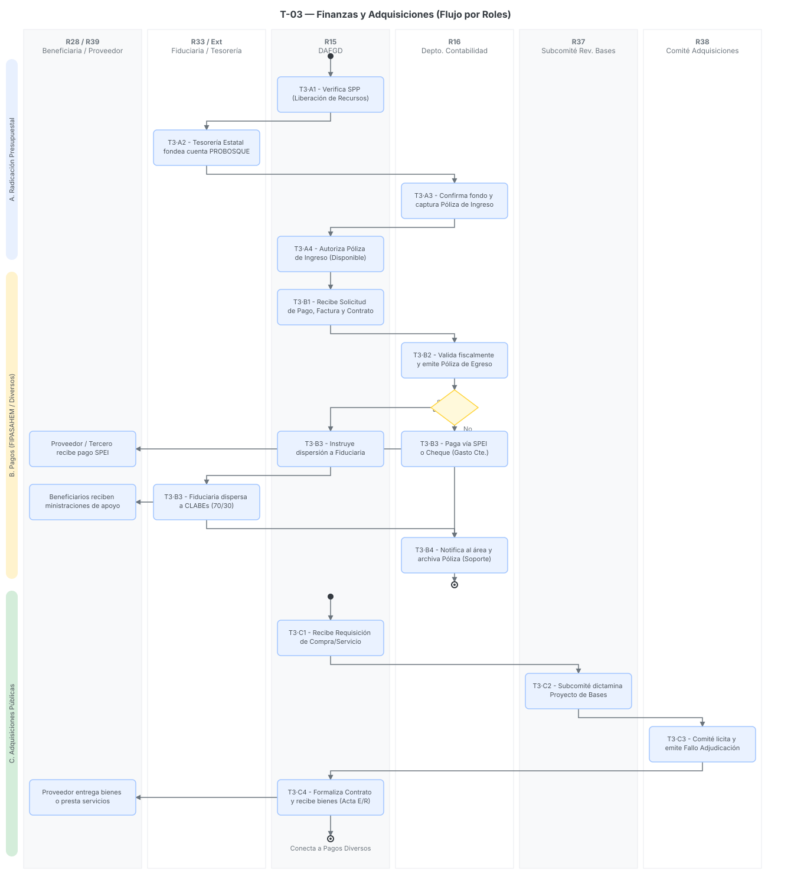

# T-03 · Finanzas y Adquisiciones (Transversal)

> Plantilla adaptada para el proceso transversal de Finanzas y Adquisiciones, delineando el flujo del dinero, los pagos a beneficiarios y la contratación institucional.
> Fecha de análisis: 23 de septiembre de 2026. Método: extracción de manuales contables, reglas de comités adquisitivos, y presupuestos de egresos/ingresos, conforme a los requerimientos de trazabilidad del SGD[cite: 30, 32].
> Citación externa de pasos: **T3·A2**, **T3·B3**, **T3·C2** (proceso·paso).

## 1. Objeto y alcance

**Incluye** el ciclo integral de la administración de los recursos financieros de PROBOSQUE: la radicación del presupuesto desde la Secretaría de Finanzas, la operación del Fideicomiso para el Pago por Servicios Ambientales Hidrológicos (FIPASAHEM) para la dispersión de apoyos (70/30), la gestión de pagos diversos mediante el Departamento de Contabilidad (vía SPEI o cheque), y el proceso de adquisiciones públicas (revisión de bases, licitaciones y adjudicaciones) a través de sus respectivos comités[cite: 33, 34, 37, 38].

**Fuera del alcance:** La ejecución técnica en campo de los programas de apoyo (PA-01 a PA-06), los cuales fungen como los detonadores que solicitan el pago a esta Dirección[cite: 30, 32].

## 2. Base documental (claves de cita)

| Clave | Archivo / ubicación | Qué aporta |
|---|---|---|
| [PEF26] | `FINANZAS_PresupuestoEgresos_2026.pdf` | Presupuesto de Egresos 2026. Asigna a PROBOSQUE \$712,519,247.00 MXN para el ejercicio fiscal[cite: 39]. |
| [CP24] | `FINANZAS_CuentaPublica_2024.pdf` | Cuenta Pública 2024. Evidencia el flujo real del FIPASAHEM operado a través de Banorte y el control de activos fijos/depreciación[cite: 41]. |
| [FIPA] | `FIPASAHEM.pdf` | Decreto de creación del FIPASAHEM, establece las fuentes de financiamiento (capital semilla + aportaciones) para los servicios ambientales[cite: 33]. |
| [CONT25] | `jul301b.pdf` | Manual de Procedimientos del Depto. de Contabilidad (Feb 2025). Detalla los flujos de "Liberación de Recursos" y "Pagos Diversos"[cite: 34]. |
| [COM-ADQ] | `MANUAL_Operacion_Comité_Adquisiciones_Servicios_PROBOSQUE.pdf` | Establece funciones del Comité para licitaciones, invitaciones restringidas y adjudicaciones directas[cite: 38]. |
| [SUB-BAS] | `MANUAL_Operacion_Subcomité_Revisión_Bases_Adquisiciones_PROBOSQUE.pdf` | Regula al Subcomité encargado de dictaminar técnica, jurídica y económicamente las bases antes de licitar[cite: 37]. |
| [HAB-DIA] | `mar061a.pdf` y `mar211d.pdf` (Fe de erratas) | Habilitación de días/horas inhábiles para que la DAFGD pueda contratar sin interrupciones por emergencias forestales[cite: 35, 36]. |

## 3. Glosario de siglas

*   **DAFGD**: Dirección de Administración, Finanzas y de Gestión Documental. Autoriza todas las erogaciones presupuestales de PROBOSQUE[cite: 34, 35].
*   **FIPASAHEM**: Fideicomiso Público para el Pago por Servicios Ambientales Hidrológicos del Estado de México (Fideicomiso F/663)[cite: 33, 41].
*   **SPP**: Sistema de Planeación y Presupuesto de la Secretaría de Finanzas[cite: 34].
*   **SPEI**: Sistema de Pagos Electrónicos Interbancarios, principal comprobante de liquidación de pagos[cite: 34].

## 4. Roles (personificados)

| ID | Rol | Puesto y unidad (fuente) | Tipo |
|---|---|---|---|
| R15 | DAFGD | Dirección de Administración, Finanzas y de Gestión Documental. Coordina las finanzas, preside el Comité de Adquisiciones y es Secretaria Técnica del FIPASAHEM[cite: 34, 38]. | Interno |
| R16 | Depto. Contabilidad | Registra pólizas, procesa el SPP, y ejecuta materialmente el SPEI o la emisión de cheques[cite: 34, 38]. | Interno |
| R33 | Fiduciaria (Banorte) | Institución financiera que custodia e invierte el patrimonio del FIPASAHEM y dispersa los pagos a beneficiarios[cite: 41]. | Externo |
| R37 | Subcomité de Revisión de Bases | Revisa técnica, legal y económicamente los proyectos de bases 3 días antes de las sesiones de adquisiciones[cite: 37]. | Colegiado |
| R38 | Comité de Adquisiciones y Servicios | Tramita licitaciones, invitaciones y adjudicaciones directas hasta dictar fallo[cite: 38]. | Colegiado |
| R28/R39 | Beneficiaria / Proveedor | Recibe las ministraciones (70/30) de los programas o el pago por bienes/servicios proveídos[cite: 34]. | Externo |

## 5. Funciones y actividades por rol

*   **R15 (DAFGD):** Gestiona la liberación de recursos ante Finanzas, autoriza el pago a proveedores y beneficiarios, preside las adquisiciones y ordena a la Fiduciaria los pagos del FIPASAHEM[cite: 34, 38].
*   **R16 (Contabilidad):** Recibe el "Contra Recibo" del SPP, genera la "Póliza de Ingresos" y "Póliza de Egresos", codifica cuentas, realiza transferencias bancarias y recaba firmas[cite: 34].
*   **R37 (Subcomité):** Analiza y dictamina las bases de contratación para asegurar las mejores condiciones para el Estado antes de publicarlas[cite: 37].
*   **R38 (Comité de Adquisiciones):** Aprueba adjudicaciones, emite fallos y sugiere sanciones a proveedores incumplidos[cite: 38].
*   **R33 (Fiduciaria):** Ejecuta la dispersión masiva de recursos hacia los beneficiarios de servicios ambientales por instrucción de PROBOSQUE[cite: 33, 41].

## 6. Reglas de negocio

*   **BR-1** Origen de Fondos: El presupuesto general proviene del Ejecutivo (PEF 2026: \$712.5 MDP)[cite: 39]. Para el FIPASAHEM, el patrimonio se constituye con capital semilla y aportaciones (como el 3.5% de mejora por servicios ambientales hidrológicos)[cite: 33].
*   **BR-2** Mecanismo de Pagos (Regla estricta): El pago a proveedores, terceros y beneficiarios de programas se realizará *sin excepción* mediante transferencia electrónica (SPEI) o cheque normativo[cite: 34].
*   **BR-3** Comprobación Documental: Todo pago requiere un soporte documental estricto: Solicitud de Pago, Factura original, Contrato, y Entrada de Almacén o Acta de Entrega-Recepción con Visto Bueno del área usuaria[cite: 34].
*   **BR-4** Adquisiciones (Días Inhábiles): Para no detener operativos críticos (incendios, viveros), la DAFGD tiene habilitados permanentemente días inhábiles para sustanciar adquisiciones urgentes[cite: 35, 36].
*   **BR-5** Revisión de Bases: Los proyectos de bases para licitar deben entregarse al Subcomité al menos 3 días hábiles antes de la sesión ordinaria para su validación transversal (técnica, jurídica, contable)[cite: 37].

## 7. Procedimiento

### Proceso A — Radicación de Recursos (Presupuesto)

*   **T3·A1** R15 (DAFGD) verifica en el Sistema de Planeación y Presupuesto (SPP) la liberación de transferencias emitida por la Secretaría de Finanzas[cite: 34].
*   **T3·A2** La Dirección General de Tesorería genera el "Contra Recibo" digital y fondea la cuenta de PROBOSQUE[cite: 34].
*   **T3·A3** R16 (Contabilidad) confirma el fondeo, imprime el SPEI bancario, codifica y captura la "Póliza de Ingresos"[cite: 34].
*   **T3·A4** R15 (DAFGD) autoriza la póliza para disponer del recurso en los programas operativos[cite: 34].

### Proceso B — Pagos Diversos y FIPASAHEM (Beneficiarios 70/30)

*   **T3·B1** El área operativa (ej. Restauración Forestal) consolida los expedientes de beneficiarios aprobados y envía el formato "Solicitud de Pago" junto con el Contrato de Adhesión a R15[cite: 34].
*   **T3·B2** R16 (Contabilidad) valida los requisitos fiscales, sella el formato, captura la operación y emite la "Póliza de Egresos"[cite: 34].
*   **T3·B3** *Bifurcación:*
    *   *Si es FIPASAHEM:* R15, como Secretaría Técnica del Comité, instruye a R33 (Fiduciaria Banorte) a dispersar el 70% o 30% a las CLABEs de los beneficiarios[cite: 33, 41].
    *   *Si es Presupuesto Directo:* R16 realiza la transferencia electrónica vía banca empresarial (SPEI)[cite: 34].
*   **T3·B4** R16 notifica al área operativa que el pago fue exitoso y archiva la Póliza con el SPEI adjunto[cite: 34].

### Proceso C — Adquisiciones y Contratación Pública

*   **T3·C1** El área usuaria remite la requisición a R15 con especificaciones técnicas y suficiencia presupuestal[cite: 38].
*   **T3·C2** R37 (Subcomité de Bases) recibe el proyecto de bases, sesiona, dictamina su viabilidad y elabora una minuta de aprobación[cite: 37].
*   **T3·C3** R38 (Comité de Adquisiciones) convoca a proveedores, realiza juntas de aclaraciones, evalúa propuestas y emite el Fallo de Adjudicación[cite: 38].
*   **T3·C4** R15 formaliza el Contrato/Pedido. A la entrega de los bienes/servicios, el ciclo conecta nuevamente con el Proceso B (Pagos Diversos) contra el Acta de Entrega-Recepción[cite: 34, 38].

## 8. Diagramas de actividad

> Cada nodo lleva su **ID de paso** (T3·#) mapeado a los 5 carriles principales de responsabilidad contable y adquisitiva.

## 9. Tabla de necesidades

Prioridad: **A** = obligatoria · **M** = media · **B** = deseable.

| ID | Rol | Necesidad | P | Paso | Origen |
|---|---|---|---|---|---|
| N-01 | R16 | Vinculación del **Folio de Expediente del Beneficiario** directamente con la Solicitud de Pago y la Póliza de Egresos para evitar recaptura | A | B2 | [CONT25 p. 30][cite: 34] |
| N-02 | R15 | Generación de layouts (archivos de texto estructurados) con CLABEs y montos exactos (70/30) para enviar a la Fiduciaria (FIPASAHEM) | A | B3 | [FIPA][cite: 33] |
| N-03 | R16 | Repositorio documental que exija anexar el XML/PDF de la factura, el contrato y el Acta de Recepción antes de permitir marcar una Póliza como "Pagada" | A | B1 | [CONT25 p. 29][cite: 34] |
| N-04 | R37 | Flujo de aprobación digital para el Subcomité de Bases, bloqueando la publicación de convocatorias hasta contar con los Vistos Buenos | A | C2 | [SUB-BAS p. 3][cite: 37] |
| N-05 | R15 | Alerta sistémica de seguimiento a contratos y proveedores objetados, vinculada al Registro de Empresas Objetadas del Estado | M | C3 | [COM-ADQ p. 7][cite: 38] |

## 10. Registros que el SGD debe gestionar (catálogo documental)

*   **Póliza de Ingresos y Póliza de Egresos** (Registro contable maestro)[cite: 34].
*   **Formato de Solicitud de Pago** (Área solicitante, importe, concepto, Vo.Bo., Autorización)[cite: 34].
*   **Contra Recibo y SPEI bancario** (Evidencias de transferencia)[cite: 34].
*   **Proyecto de Bases y Minutas del Subcomité** (Licitaciones)[cite: 37].
*   **Fallo de Adjudicación y Contratos a Proveedores**[cite: 38].
*   **Actas de Entrega-Recepción** (Soporte documental final)[cite: 34].

## 11. Vacíos y siguientes pasos

*   **V-01 Reintegros:** El manual de contabilidad no detalla el procedimiento a la inversa (cuando un beneficiario es sancionado y devuelve el recurso a la cuenta de PROBOSQUE). Se requiere mapear cómo se registra esa "Póliza de Ingreso por Reintegro".
*   **V-02 Interoperabilidad FIPASAHEM:** Se desconoce si la Fiduciaria actual (Banorte) cuenta con un portal API o si la dispersión de apoyos se gestiona mediante el envío de archivos de Excel firmados físicamente.
*   **Siguiente paso:** Configurar en el SGD el "Módulo de Finanzas" asegurando que el *estado* del expediente del beneficiario (en los programas PA-01 a PA-06) cambie automáticamente a "Ministración Entregada" en cuanto R16 adjunte el SPEI.

## 12. Tabla de entrada/salida por paso (Fiscalización y Trazabilidad)

| Paso | Actor | Documento / Dato de Entrada (Fuente) | Datos Capturados en Sistema | Documento de Salida (Formato) |
|---|---|---|---|---|
| **T3·A2** | Tesorería Estatal | Presupuesto Autorizado SPP[cite: 34] | Montos liberados, quincena correspondiente. | Contra Recibo Digital[cite: 34] |
| **T3·A3** | R16 (Contabilidad) | Contra Recibo y Fondeo bancario[cite: 34] | Clasificador por objeto de gasto, cuentas contables. | Póliza de Ingresos y SPEI adjunto[cite: 34] |
| **T3·B1** | Área Operativa | Contrato firmado, Acta de recepción[cite: 34] | Datos del proveedor/beneficiario, cuenta bancaria, importes. | Solicitud de Pago (Formato físico)[cite: 34] |
| **T3·B2** | R16 (Contabilidad) | Solicitud de Pago y Factura/Contrato[cite: 34] | Validación fiscal, codificación presupuestal (Cap. 4000). | Póliza de Egresos[cite: 34] |
| **T3·B3** | R15 / Fiduciaria | Póliza autorizada[cite: 33, 34] | Instrucción de dispersión electrónica a CLABEs. | Comprobante SPEI / Transferencia exitosa[cite: 34] |
| **T3·C1** | Área Usuaria | Necesidad institucional y techo financiero[cite: 38] | Especificaciones técnicas, cotizaciones de mercado. | Requisición de Compra[cite: 38] |
| **T3·C2** | R37 (Subcomité) | Proyecto de Bases[cite: 37] | Observaciones técnicas, jurídicas y financieras. | Minuta de aprobación de Bases[cite: 37] |
| **T3·C3** | R38 (Comité Adq.) | Propuestas de proveedores[cite: 38] | Evaluación técnica y económica, cuadro comparativo. | Fallo de Adjudicación[cite: 38] |
| **T3·C4** | R15 / Proveedor | Fallo y entrega física de bienes[cite: 34, 38] | Firmas de conformidad del área usuaria. | Acta de Entrega-Recepción y Contrato[cite: 34, 38] |