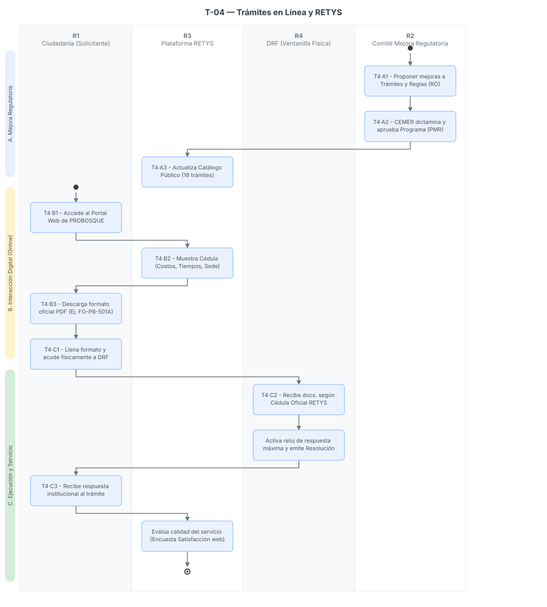

# T-04 · Trámites en línea y Mejora Regulatoria (Catálogo RETYS)

> Documento transversal para el Sistema de Gestión Documental PROBOSQUE.
> Fecha de análisis: 23 de septiembre de 2026. Método: extracción del ecosistema web institucional, cruce con leyes de mejora regulatoria y mapeo del portal de trámites del Estado de México (RETYS)[cite: 13].
> Citación externa de pasos: **T4·A2**, **T4·B3**, **T4·C1** (proceso·paso).

## 1. Objeto y alcance

**Incluye** el proceso transversal de cumplimiento regulatorio y transparencia gubernamental que obliga a PROBOSQUE a documentar, simplificar y publicar todos sus actos de autoridad e incentivos en el **Registro Estatal de Trámites y Servicios (RETYS)**. Abarca desde la dictaminación de programas por el Comité Interno de Mejora Regulatoria, la publicación de los formatos oficiales descargables (FO-PB), hasta la consulta ciudadana en la Ventanilla Electrónica[cite: 43, 44].

**Fuera del alcance:** La ejecución administrativa interna de los 18 trámites listados; este documento se enfoca en el "escaparate público" (cómo la ciudadanía se entera de los requisitos y baja los formatos antes de ir a ventanilla)[cite: 44, 45].

## 2. Base documental (claves de cita)

| Clave | Archivo / ubicación | Qué aporta |
|---|---|---|
| [WEB-TRAM] | `tramites_servicios.html` | Portal web de PROBOSQUE. Lista oficial de los 18 trámites y servicios forestales con sus enlaces directos al sistema RETYS[cite: 44]. |
| [WEB-MEJ] | `mejora-regulatoria.html` | Repositorio del Comité Interno de Mejora Regulatoria. Evidencia los Programas Anuales (PMR), dictámenes de exención de Análisis de Impacto Regulatorio (AIR) y actas de sesiones 2020-2026[cite: 43]. |
| [RETYS-51] | `tramite_PSAHEM_51.html` | Cédula capturada del Trámite ID 51 (PSAHEM). Muestra cómo RETYS estructura la información pública: costos, plazos, metodología de 10 pasos, y enlace al formato PDF descargable[cite: 45]. |

## 3. Glosario de siglas

*   **RETYS**: Registro Estatal de Trámites y Servicios. Base de datos pública y obligatoria del Gobierno del Estado de México[cite: 44, 45].
*   **CEMER**: Comisión Estatal de Mejora Regulatoria. Órgano rector estatal que dictamina y aprueba los cambios en los trámites[cite: 43].
*   **PMR**: Programa de Mejora Regulatoria (Anual). Instrumento que calendariza la simplificación de trámites y servicios de PROBOSQUE[cite: 43].
*   **FO-PB**: Formato Oficial PROBOSQUE (ej. FO-PB-501A, FO-PB-502). Documentos únicos estandarizados alojados en servidores gubernamentales[cite: 45].

## 4. Catálogo Oficial de Trámites en RETYS

De acuerdo con el portal institucional, PROBOSQUE opera **18 trámites públicos** registrados en la plataforma RETYS. A continuación, el listado con sus respectivos IDs oficiales[cite: 44]:

1.  **ID 19:** Manejo Forestal Sustentable.
2.  **ID 51:** Pago por Servicios Ambientales Hidrológicos (PSAHEM).
3.  **ID 239:** Plantaciones Sustentables.
4.  **ID 309:** Capturando Carbono.
5.  **ID 627:** Restauración Hidrológico-Forestal.
6.  **ID 629:** Registro de Plantación Forestal Comercial.
7.  **ID 873:** Combate de plagas y enfermedades forestales.
8.  **ID 876:** Expedición de notificación de saneamiento forestal.
9.  **ID 878:** Reporte sobre ocurrencia de incendios forestales.
10. **ID 881:** Asesoría para el establecimiento de plantaciones forestales comerciales.
11. **ID 1068:** Venta de Planta Forestal.
12. **ID 1141:** Autorización de Aprovechamiento Forestal Maderable.
13. **ID 1142:** Autorización de Aprovechamiento Forestal No Maderable.
14. **ID 1145:** Aviso de Aprovechamiento Forestal No Maderable.
15. **ID 1162:** Venta de Semilla Forestal.
16. **ID 1242:** Capacitación Forestal.
17. **ID 1797:** Solicitud de incorporación al Programa de Guardabosques.
18. **ID 2092:** Donación de planta.

## 5. Funciones y actividades por rol

| ID | Rol | Actividades clave |
|---|---|---|
| R1 | Ciudadanía (Solicitante) | Ingresa a RETYS, consulta la metodología, descarga el formato `FO-PB-XXX.pdf` y acude físicamente a la Delegación Regional[cite: 44, 45]. |
| R2 | Comité Interno de Mejora Regulatoria | Sesiona (4 veces al año) para aprobar reducciones de plazos y requisitos (PMR). Envía reportes trimestrales (RAPA) a CEMER[cite: 43]. |
| R3 | Plataforma RETYS (EdoMéx) | Aloja las cédulas y los PDFs oficiales; funge como la única fuente de verdad regulatoria oponible a terceros[cite: 45]. |
| R4 | DRF / Ventanilla Única | Opera el trámite de manera **Presencial** acatando estrictamente los plazos (ej. 6 meses 20 días en PSAHEM) y requisitos publicados en RETYS[cite: 45]. |

## 6. Reglas de negocio

*   **BR-1** Principio de Legalidad: Las DRF no pueden exigir a la ciudadanía un requisito, formato o plazo que no esté expresamente publicado en la cédula RETYS correspondiente[cite: 45].
*   **BR-2** Descarga Única: Los formatos oficiales (como el FO-PB-501A y 502) no se envían por correo informalmente; el ciudadano debe descargarlos del servidor `backretys.edomex.gob.mx` a través de la Cédula[cite: 45].
*   **BR-3** Limitación Digital: A pesar de contar con "Ventanilla Electrónica Única", las cédulas analizadas (ej. PSAHEM) especifican la modalidad como **Presencial**. No hay flujo de carga (*upload*) de expedientes ciudadanos directamente en el portal web[cite: 44, 45].
*   **BR-4** Transparencia Regulatoria: Todo programa de apoyo (PSAHEM, PROCARBONO, Plantaciones, etc.) debe contar con un Dictamen de Exención de Impacto Regulatorio autorizado por CEMER antes de publicar sus Reglas de Operación[cite: 43].

## 7. Procedimiento

### Proceso A — Aprobación y Publicación en RETYS (Institucional)

*   **T4·A1** Las áreas operativas proponen actualizaciones a las Reglas de Operación o Manuales de Procedimiento[cite: 43].
*   **T4·A2** R2 (Comité Interno de Mejora Regulatoria) sesiona, elabora el PMR y somete los cambios al escrutinio de CEMER[cite: 43].
*   **T4·A3** CEMER emite el Dictamen respectivo. PROBOSQUE actualiza el catálogo RETYS (R3), subiendo los nuevos PDFs de los formatos `FO-PB`[cite: 43, 45].

### Proceso B — Consulta y Descarga (Ciudadanía)

*   **T4·B1** R1 (Ciudadano) accede a `probosque.edomex.gob.mx/tramites_servicios` y hace clic en el enlace del trámite deseado[cite: 44].
*   **T4·B2** El sistema redirige a R3 (Plataforma RETYS), donde R1 consulta los costos, plazos, domicilios de las 9 DRF y la metodología paso a paso[cite: 45].
*   **T4·B3** R1 hace clic en "Descargar formato" y obtiene el PDF oficial (ej. `FO-PB-501 A-502.pdf`) para llenarlo e imprimirlo[cite: 45].

### Proceso C — Ejecución en Ventanilla

*   **T4·C1** R1 acude presencialmente a la Delegación Regional Forestal (R4) correspondiente a su municipio[cite: 45].
*   **T4·C2** R4 recibe la documentación cotejando que cumpla exactamente con la "Cédula de Información" del RETYS y detona el reloj de respuesta (ej. máximo 6 meses y 20 días hábiles para PSAHEM)[cite: 45].
*   **T4·C3** Al final del trámite, R1 puede llenar la "Encuesta de Satisfacción" disponible en la misma plataforma RETYS para retroalimentar la calidad del servicio[cite: 45].

## 8. Diagramas de actividad

> Cada nodo lleva su **ID de paso** (T4·#) mapeado a los 4 carriles de interacción digital y regulatoria.

## 9. Tabla de necesidades

Prioridad: **A** = obligatoria · **M** = media · **B** = deseable.

| ID | Rol | Necesidad | P | Paso | Origen |
|---|---|---|---|---|---|
| N-01 | R2 | Repositorio interno para mantener el histórico de Dictámenes CEMER, Actas del Comité Interno y Reportes Trimestrales (RAPA) | A | A2 | [WEB-MEJ][cite: 43] |
| N-02 | R1 | **Transformación Digital:** Que el SGD permita a la ciudadanía subir (upload) la documentación escaneada y el formato FO-PB directamente, eliminando el paso "Presencial" | A | B3, C1 | Derivada de la restricción observada en [RETYS-51][cite: 45] |
| N-03 | R4 | Visibilidad en tiempo real en la DRF de los "Tiempos de Respuesta Máximos" (ej. 6 meses, 20 días hábiles) para evitar caer en responsabilidades administrativas | A | C2 | [RETYS-51 sección Tiempos][cite: 45] |
| N-04 | R3 | API o Webhook que conecte las respuestas de la "Encuesta de Satisfacción" (Si me sirvió / No me sirvió) al SGD para evaluar el desempeño de cada DRF | M | C3 | [RETYS-51 final de página][cite: 45] |

## 10. Registros que el SGD debe gestionar (catálogo documental)

*   **Cédulas RETYS:** (Estructura de metadatos: ID, Dependencia, Requisitos, Tiempos, Costos)[cite: 45].
*   **Formatos Descargables (FO-PB):** PDFs maestros alojados en el backend[cite: 45].
*   **Actas del Comité Interno de Mejora Regulatoria** (Ordinarias y Extraordinarias)[cite: 43].
*   **Programa Anual de Mejora Regulatoria (PMR)** y Reportes de Avance Trimestral (RAPA)[cite: 43].
*   **Dictámenes (Análisis de Impacto Regulatorio):** Para programas y manuales[cite: 43].

## 11. Vacíos y siguientes pasos

*   **V-01 Brecha Digital:** La plataforma se promociona como "Ventanilla Electrónica Única de Trámites"[cite: 44], pero en la práctica actúa solo como un catálogo informativo (solo permite descargar el PDF en blanco, no realizar el trámite online)[cite: 45].
*   **V-02 Centralización de Formatos:** Los 18 trámites referencian URLs del dominio `backretys.edomex.gob.mx`. Si PROBOSQUE actualiza un formato internamente, depende de un tercero (Gobierno Estatal) para actualizar el PDF público. El SGD deberá notificar esta desincronización.
*   **Siguiente paso:** Habilitar un "Portal Ciudadano" en el SGD de PROBOSQUE que consuma los 18 IDs de RETYS y permita el llenado de los formularios web (*webforms*) para enviar los datos estructurados directamente a la bandeja de entrada de la DRF (R4).

## 12. Tabla de entrada/salida por paso

| Paso | Actor | Documento / Dato de Entrada (Fuente) | Datos Capturados en Sistema | Documento de Salida (Formato) |
|---|---|---|---|---|
| **T4·A2** | R2 (CEMER Interno) | Propuesta de simplificación de RO[cite: 43] | Metas de mejora regulatoria, trimestres de ejecución. | Acta de Comité / PMR Anual[cite: 43] |
| **T4·A3** | Plataforma RETYS | Dictamen aprobatorio de CEMER[cite: 43] | Parámetros del trámite (Homoclave, requisitos, plazos). | Cédula Pública RETYS actualizada[cite: 45] |
| **T4·B1** | R1 (Ciudadanía) | Portal PROBOSQUE (tramites_servicios.html)[cite: 44] | Selección de trámite por ID (ej. ID 51). | Redirección URL a RETYS[cite: 44] |
| **T4·B3** | R1 (Ciudadanía) | Cédula RETYS[cite: 45] | Solicitud de descarga de archivo. | Formato PDF en blanco (ej. FO-PB-501A)[cite: 45] |
| **T4·C1** | R1 (Ciudadanía) | Formato impreso y anexos (INE, CURP, etc.)[cite: 45] | Firma autógrafa del ciudadano. | Expediente Físico Integrado[cite: 45] |
| **T4·C2** | R4 (DRF Ventanilla) | Expediente Físico[cite: 45] | Fecha de inicio de trámite, activación de cronómetro de respuesta legal (6 meses). | Acuse de Recibo para el ciudadano[cite: 45] |
| **T4·C3** | R1 (Ciudadanía) | Resolución del trámite entregada en DRF[cite: 45] | Calificación del servicio (Sí me sirvió / No me sirvió). | Envío de Encuesta de Satisfacción Web[cite: 45] |