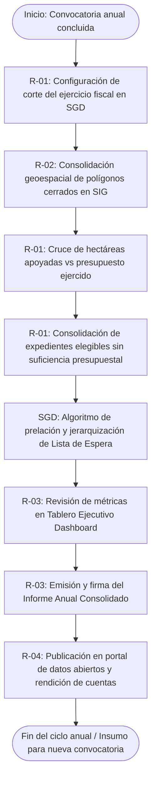

# E-03 — Consolidación de estadísticas de cobertura forestal y cierre de programas anuales

> Proyecto: Sistema de Gestión Documental PROBOSQUE (Módulo Masa Forestal / SIG).  
> **Este documento es el análisis técnico-funcional del entregable especial E-03 del catálogo `README.md`**[cite: 1].  
> Citación externa de pasos: **E03·P1**, **E03·P2**, etc.

---

## 1. Objeto y alcance

Consolidar los datos geoespaciales, técnicos y administrativos acumulados a lo largo del ejercicio fiscal en los procesos del Módulo de Masa Forestal (MF-01 a MF-07)[cite: 1], generando los tableros analíticos, reportes de rendición de cuentas, métricas de retención de biomasa y el padrón auditado de listas de espera para alimentar el cierre del ejercicio anual y la planeación de convocatorias subsecuentes de PROBOSQUE.

- **Dentro del alcance:** Extracción y agregación de métricas de polígonos validados (MF-01)[cite: 1], coberturas e índices espectrales (MF-02, MF-03)[cite: 1], convenios firmados (MF-05)[cite: 1], dispersión financiera (MF-06)[cite: 1] y porcentaje de sobrevivencia física e inspecciones (MF-07)[cite: 1] → consolidación de estadísticas por municipio, ecorregión y programa → generación del Padrón Histórico de Solicitudes en Lista de Espera con sus ponderaciones de elegibilidad → emisión del Informe Anual de Resultados de Masa Forestal en formatos abiertos y PDF institucional[cite: 1].
- **Fuera del alcance:** Operación individual de trámites predio por predio (MF-01 a MF-07)[cite: 1], auditorías contables externas de la Secretaría de Finanzas y redacción de las nuevas Reglas de Operación del siguiente año.

---
## 1.1 Entradas y Salidas del Proceso

> Retro-ajuste 2026-09-24: la tabla genérica que estaba aquí se rehízo como **§12** (una fila por paso del §6, con ruta real de archivo), conforme a la plantilla de 12 secciones. Ver al final del documento.

---

## 2. Base documental (origen de los requisitos)

| Clave | Documento (ruta en `Docs/Comun/`) | Uso — páginas verificadas |
|---|---|---|
| [RO-PSAH] | `Programas de apoyo/RO_2026_PagoServiciosAmbientales_Hidrológicos.pdf` | pp. 8–9 (Criterios de asignación de presupuesto, conformación y desahogo de la Lista de Espera); pp. 21–23 (Informes anuales, indicadores de cobertura boscosa y metas estatales)[cite: 1]. |
| [RO-CARB] | `Programas de apoyo/RO_2026_CapturandoCarbono.pdf` | pp. 11–13 (Métricas de captura de carbono acumulado por hectárea y reporte ejecutivo de impacto). |
| [INV-FOR] | `Sitio web/inventario_forestal.html` | Inventario Estatal Forestal y de Suelos 2022 (parámetros de control para contrastar metas logradas contra el universo vegetal del estado)[cite: 1]. |
| [MGO] | `Manual Jurídico/dic161d.pdf` — MGO 2025 | pp. 25–26 (Atribuciones de la Dirección de Restauración y Fomento Forestal en evaluación anual y estadísticas)[cite: 3]. |
| [LGDFS] | Ley General de Desarrollo Forestal Sustentable | Arts. 31, 35 (Suministro de estadísticas ambientales al Sistema Nacional de Información Forestal). |

---

## 2.1 Glosario

| Término | Significado | Fuente |
|---|---|---|
| Cierre Programático-Presupuestal | Corte administrativo anual donde se comparan las metas físicas alcanzadas (hectáreas) contra los recursos financieros efectivamente ejercidos. | [RO-PSAH p. 22][cite: 1] |
| Lista de Espera Depurada | Registro oficial consolidado de solicitudes elegibles que no obtuvieron financiamiento por saturación del techo presupuestal, clasificadas con prelación para el ejercicio venidero. | [RO-PSAH pp. 8–9][cite: 1] |
| Superficie Forestal Neta Incorporada | Suma total de hectáreas con dictamen técnico favorable y convenio formalizado sujetas a pago o protección en el ejercicio. | [RO-PSAH p. 4][cite: 1] |
| Tasa de Retención de Cobertura | Indicador porcentual de estabilidad o incremento de masa forestal verificado en los predios respecto al año basal. | [RO-CARB p. 12] |
| Tablero Ejecutivo (Dashboard) | Interfaz visual interactiva con gráficas de dispersión, mapas de calor y filtros por Delegación Regional Forestal. | Estándar SGD |

---

## 3. Roles (stakeholders)

| ID | Rol | Área institucional real | Tipo |
|---|---|---|---|
| R-01 | Analista de Planeación y Estadística | Departamento de Planeación / Dirección de Restauración[cite: 2, 3] | Interno |
| R-02 | Administrador de Base de Datos Espaciales / SIG | Departamento de SIG / Unidad de TI[cite: 1, 3] | Interno |
| R-03 | Director de Restauración y Fomento Forestal | Dirección facultada para emitir el informe ejecutivo anual[cite: 2, 3] | Interno |
| R-04 | Órganos Fiscalizadores / Dependencias Estatales | Secretaría del Medio Ambiente / OSFEM / CONAFOR | Externo |

---

## 4. Funciones y actividades por rol

| Rol | Función | Actividades clave (pasos §6) |
|---|---|---|
| R-01 (Analista Estadística) | Parametrizar agregaciones y métricas | E03·P1 (define variables de corte anual), E03·P3 (calcula metas de cierre e indicadores de cumplimiento)[cite: 1]. |
| R-02 (Admin SIG) | Consolidación geoespacial y mapas | E03·P2 (genera capas de calor y mosaicos de predios apoyados vs lista de espera)[cite: 1]. |
| R-03 (Director de Restauración) | Validar y oficializar resultados | E03·P4 (revisa tablero analítico), E03·P5 (emite y firma el Informe Anual de Masa Forestal)[cite: 1]. |
| R-04 (Fiscalizadores) | Consulta y rendición de cuentas | E03·P6 (accede a reportes abiertos y auditorías de padrones de beneficiarios). |

---

## 5. Reglas de negocio

- **BR-E03-01 (Criterio de Consolidación Definitiva):** El cierre estadístico solo procesará expedientes que cuenten con estatus terminal en el ejercicio: "Convenio Pagado y Verificado" o "Rechazado/Improcedente". Los trámites inconclusos o suspendidos en inspección (MF-07) se clasificarán como "En Auditoría/En Litigio"[cite: 1].
- **BR-E03-02 (Cálculo del Padrón de Lista de Espera):** El reporte debe desglosar forzosamente el total de hectáreas que quedaron en lista de espera, desglosando la demanda insatisfecha por Delegación Regional Forestal y preservando el orden de prelación para el ejercicio fiscal siguiente conforme a las Reglas de Operación[cite: 1].
- **BR-E03-03 (Disociación y Protección de Datos Personales):** Las capas cartográficas y estadísticas publicadas para libre descarga institucional o consulta externa (R-04) deben omitir nombres, CURP o datos sensibles de propietarios individuales, limitándose al folio, polígono territorial, régimen de tenencia agraria y hectáreas apoyadas.
- **BR-E03-04 (Homologación Ecosistémica con Inventario 2022):** El balance de hectáreas beneficiadas debe reportarse clasificado según las unidades fito-geográficas del Inventario Estatal Forestal y de Suelos 2022 (coníferas, latifoliadas, bosque mesófilo, etc.)[cite: 1].

---

## 6. Procedimiento narrado (anclas de trazabilidad)

- **E03·P1** R-01 programa en el SGD la fecha de corte del ejercicio fiscal y selecciona los programas forestales a auditar (PSAH, Capturando Carbono, Reforestación Comunitaria)[cite: 1].
- **E03·P2** R-02 ejecuta en el SIG la agregación geoespacial de polígonos con estatus cerrado, generando los mapas coropléticos y capas de densidad territorial de predios beneficiados contrastados con predios en lista de espera[cite: 1].
- **E03·P3** R-01 procesa el módulo analítico del SGD, cruzando hectáreas dictaminadas, montos ejercidos, porcentaje de retención vegetal promedio (NDVI) y porcentaje de supervivencia física verificado en campo (MF-07)[cite: 1, 2].
- **E03·P4** El SGD genera el **Padrón Depurado de Lista de Espera**, ordenado por el puntaje algorítmico de priorización (predios en ANP, núcleos agrarios de alta marginación y orden de ingreso) para la asignación de prelación en la convocatoria entrante[cite: 1].
- **E03·P5** R-03 revisa las métricas en el **Tablero Ejecutivo de Cierre Anual**; tras confirmar coherencia con los techos presupuestales autorizados, firma electrónicamente el informe oficial de resultados anuales[cite: 1].
- **E03·P6** El sistema publica el reporte ejecutivo en el repositorio central del SGD, exporta tablas resumen interoperables hacia las dependencias fiscalizadoras (R-04) y archiva el historial cartográfico definitivo en la base espacial institucional[cite: 1].

---

## 7. Diagrama de actividad

---

## 8. Tabla de necesidades (con ancla al paso)

| ID | Rol | Necesidad del SGD | Prior. | Paso | Origen documental verificado |
|---|---|---|---|---|---|
| N-E03-01 | R-01 | Módulo de configuración de periodos de corte y consolidación de ejercicios fiscales | A | E03·P1 | [RO-PSAH p. 22][cite: 1] |
| N-E03-02 | R-02 | Generador de capas agregadas (WMS/GeoJSON) para visualización territorial masiva | A | E03·P2 | Base [DEMIF]; [INV-FOR][cite: 1] |
| N-E03-03 | R-01 | Motor de cálculo analítico de indicadores (ha protegidas vs programadas, costo promedio/ha) | A | E03·P3 | [RO-PSAH pp. 8, 22][cite: 1] |
| N-E03-04 | R-01 | Módulo de gestión y ordenamiento algorítmico del Padrón Oficial de Lista de Espera | A | E03·P4 | [RO-PSAH pp. 8–9][cite: 1] |
| N-E03-05 | R-03 | Tablero interactivo (Dashboard) con filtros por municipio, DRF, tipo de tenencia y programa | M | E03·P5 | Estándar de inteligencia de negocios |
| N-E03-06 | R-03 / R-04 | Módulo de exportación masiva en formatos auditables (PDF oficial sellado, CSV, Excel) | A | E03·P6 | [LGDFS Art. 31; MGO p. 26][cite: 3] |

---

## 9. Registros que el SGD debe gestionar

| Registro | Genera (paso) | Campos clave requeridos | Retención sugerida |
|---|---|---|---|
| Acta de Corte del Ejercicio Fiscal | R-01 / R-03 (E03·P1–P5) | Ejercicio fiscal evaluado, fecha y hora de corte, monto presupuestal ejercido, total de convenios liquidados[cite: 1]. | Permanente |
| Capa Vectorial de Cierre Anual | R-02 (E03·P2) | Capa geográfica con polígonos apoyados (ha totales, estrato de vegetación, estatus de cumplimiento)[cite: 1]. | Permanente |
| Padrón Oficial de Lista de Espera Depurada | R-01 (E03·P4) | ID Predio, folio, solicitante, municipio, puntaje de priorización asignado, superficie solicitada elegible (ha)[cite: 1]. | 5 años |
| Informe Anual Consolidado de Masa Forestal | R-03 (E03·P5) | Estadísticas por DRF, metas físicas logradas vs programadas, estimación de biomasa protegida, firma del Director[cite: 1, 2]. | Permanente (Histórico institucional) |

---

## 10. Vacíos y siguientes pasos

1. **V-E03-01 (Transición automatizada de la Lista de Espera):** Las Reglas de Operación establecen que quienes quedaron en lista de espera tienen preferencia para el año entrante (pp. 8–9)[cite: 1], pero no detallan si el sistema debe reabrir automáticamente sus solicitudes con el mismo folio o si los promoventes deben comparecer de nuevo a ratificar interés.
2. **V-E03-02 (Métrica oficial de captura de carbono acumulada):** Se requieren ecuaciones alométricas estandarizadas por PROBOSQUE para traducir directamente las hectáreas arboladas en toneladas métricas de $CO_2$ equivalentes en los reportes anuales[cite: 1].
3. **V-E03-03 (Interoperabilidad con el SNIF federal):** El envío de estadísticas a la CONAFOR / SEMARNAT aún se efectúa mediante oficios e informes manuales; falta definir una API de interconexión directa con los sistemas federales.

---

## 11. Nota de mantenimiento

Documento técnico del entregable especial **E-03** dentro del Dominio 1 (Masa Forestal)[cite: 1]. Archivar en `Docs/Valeria/Masa_Forestal/E-03_ESTADISTICAS_CIERRE.md`[cite: 1]. Este reporte consolida y cierra el ciclo de los procesos **MF-01 a MF-07**, constituyendo el repositorio histórico de resultados institucionales de PROBOSQUE[cite: 1].

---

## 12. Insumos y productos por paso

Una fila por paso del §6 (retro-ajuste 2026-09-24, énfasis #1 del profesor). Toda celda sin archivo en las fuentes enlaza a su vacío `V-##`.

| Paso | Documento/dato de entrada | Datos que se capturan/procesan | Documento de salida |
|---|---|---|---|
| **E03·P1** | Expedientes MF-01..MF-07 con estatus terminal (BR-E03-01); techos presupuestales del ejercicio | Fecha de corte, programas a consolidar | Acta de Corte del Ejercicio Fiscal |
| **E03·P2** | Polígonos con estatus cerrado; padrón de lista de espera | Agregados espaciales por municipio y DRF | Capa Vectorial de Cierre Anual (mapas coropléticos) |
| **E03·P3** | Hectáreas dictaminadas y montos ejercidos del SGD (series 2020–2022 comparables en `Docs/Comun/Programas de apoyo/FICHAS_Programas_Sociales_2023.xlsx`); NDVI promedio (MF-03); % de sobrevivencia (MF-07) | Indicadores de cierre (ha apoyadas, costo/ha, % de retención); metas vs. logrado (**sin MIR en el acervo** → `X-02·V-01`) | Reporte analítico de cierre (tablas) |
| **E03·P4** | Expedientes elegibles sin suficiencia presupuestal | Puntaje de prelación (matriz pendiente → `V-MF01-02`), superficie elegible (ha) | Padrón Depurado de Lista de Espera |
| **E03·P5** | Tablero Ejecutivo de Cierre Anual; techos presupuestales | Coherencia de cifras | Informe Anual Consolidado de Masa Forestal (PDF firmado por R-03) |
| **E03·P6** | Informe firmado; regla de disociación de datos (BR-E03-03) | Exportación CSV/Excel/PDF sin datos personales | Publicación en portal de transparencia / datos abiertos (OSFEM, CONAFOR) + archivo cartográfico definitivo |
