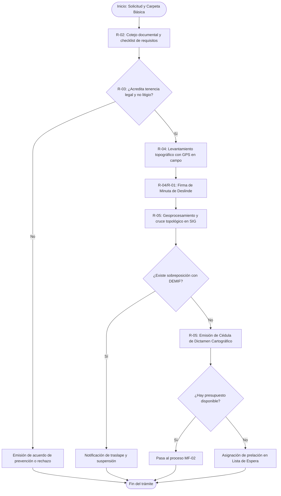

# MF-01 — Delimitación de polígono y tenencia de la tierra

> Proyecto: Sistema de Gestión Documental PROBOSQUE (Módulo Masa Forestal / SIG).  
> **Este documento es el análisis técnico-funcional del proceso MF-01 del catálogo `README.md`**.  
> Citación externa de pasos: **MF01·P1**, **MF01·P2**, etc.

---

## 1. Objeto y alcance

Validar la certeza jurídica de la propiedad o posesión de los predios con vocación forestal en el Estado de México y levantar perimetralmente sus polígonos cartográficos en campo y gabinete. El proceso garantiza que las superficies postuladas a programas de apoyo (PSAH, Capturando Carbono, Reforestación) cuenten con respaldo registral ante el Registro Agrario Nacional (RAN) o el Registro Público de la Propiedad (RPP), descartando litigios, invasiones o sobreposiciones territoriales de forma previa al dictamen técnico.

- **Dentro del alcance:** Recepción de solicitud y carpeta legal → compulsa de documentos agrarios/civiles ante el RAN/RPP → levantamiento topográfico de coordenadas perimetrales en campo con brigada técnica → procesamiento vectorial en el SIG institucional → validación de no sobreposición contra la base histórica DEMIF → emisión del dictamen de tenencia y asignación de prelación en lista de espera en caso de saturación presupuestal.
- **Fuera del alcance:** Análisis de capas satelitales multiespectrales (MF-02), cálculo matemático de índices de cobertura arbórea NDVI/SAVI (MF-03), aprobación de recursos en Comité Técnico (MF-04) y visitas de verificación e inspección física de compromisos (MF-07).

---

## 1.1 Entradas y Salidas del Proceso

> Retro-ajuste 2026-09-24: la tabla genérica que estaba aquí se rehízo como **§12** (una fila por paso del §6, con ruta real de archivo), conforme a la plantilla de 12 secciones. Ver al final del documento.

---

## 2. Base documental (origen de los requisitos)

| Clave | Documento (ruta en `Docs/Comun/`) | Uso — páginas verificadas |
|---|---|---|
| [RO-PSAH] | `Programas de apoyo/RO_2026_PagoServiciosAmbientales_Hidrológicos.pdf` | p. 4 (Glosario: Carpeta Básica, Predio Elegible, SIG); pp. 8, 19–22 (Mecánica operativa: acreditación de tenencia, levantamiento de poligonal en campo y dictámenes técnico/jurídico). |
| [RO-CARB] | `Programas de apoyo/RO_2026_CapturandoCarbono.pdf` | pp. 6–9 (Requisitos ejidales, comunales y particulares; causas de improcedencia por litigio agrario o sobreposición). |
| [FO-501A] | `Programas de apoyo/FORMATO_FO-PB-501A_SolicitudUnica_2026.docx` | Formato único de registro, datos de propiedad y coordenadas preliminares. |
| [FO-502] | `Programas de apoyo/FORMATO_FO-PB-502_RegInfo_Solicitante_Beneficiario_2026.docx` | Cédula de información detallada del solicitante y estatus de posesión. |
| [DEMIF] | `Masa forestal/AUTORIZACIONES_DEMIF_ago2023.xlsx` | Base de datos georreferenciada de polígonos autorizados y predios forestales históricos. |
| [LEY-AGR] | Ley Agraria (Marco supletorio federal) | Arts. 16, 22, 56 (Inscripción registral en el RAN, actas de asamblea de delimitación, asignación de tierras ejidales). |

---

## 2.1 Glosario

| Término | Significado | Fuente |
|---|---|---|
| Carpeta Básica | Conjunto de documentos agrarios primarios que acreditan la propiedad social (Resolución Presidencial dotatoria o sentencia del Tribunal Agrario, acta de posesión y deslinde, plano definitivo de dotación) debidamente inscritos en el RAN. | [RO-PSAH p. 4] |
| RAN | Registro Agrario Nacional: órgano desconcentrado federal encargado del control de la tenencia de la tierra ejidal y comunal. | Marco legal agrario |
| RPP | Registro Público de la Propiedad: institución registral que otorga certeza jurídica a los inmuebles de propiedad particular en el Estado de México. | Código Civil EdoMéx |
| Poligonal Envolvente | Geometría cerrada compuesta por una serie de pares de coordenadas (X, Y en UTM WGS84) que delimita el perímetro continuo del predio forestal. | [RO-PSAH p. 19] |
| Error de Cierre | Discrepancia lineal calculada al contrastar el punto inicial y final de un levantamiento perimetral; no debe superar la tolerancia topográfica institucional ($1:1,000$). | Estándar técnico SIG |
| Lista de Espera | Registro ordenado de solicitudes elegibles que cumplieron requisitos técnicos y jurídicos pero no alcanzaron suficiencia en la asignación presupuestal del ejercicio. | [RO-PSAH pp. 8–9] |

---

## 3. Roles (stakeholders)

| ID | Rol | Área o actor real | Tipo |
|---|---|---|---|
| R-01 | Promovente / Solicitante | Propietario particular, Comisariado Ejidal o de Bienes Comunales | Externo |
| R-02 | Ventanilla de Delegación Regional Forestal (DRF) | Servidor público receptor del trámite en alguna de las 9 DRF | Interno |
| R-03 | Analista Jurídico de Tenencia | Unidad Jurídica / Dirección de Restauración y Fomento Forestal | Interno |
| R-04 | Topógrafo / Técnico de Campo | Personal técnico operativo de brigada de la DRF / PROBOSQUE | Interno |
| R-05 | Especialista en Geomática y SIG | Administrador de la base espacial de la Dirección de Restauración | Interno |
| R-06 | Registro Agrario Nacional (RAN) | Sistema registral agrario federal | Externo (Interoperabilidad) |

---

## 4. Funciones y actividades por rol

| Rol | Función | Actividades clave (pasos §6) |
|---|---|---|
| R-01 (Solicitante) | Tramitar ingreso y acompañar deslinde | MF01·P1 (requisita formatos y anexa carpeta de tenencia), MF01·P4 (conduce a la brigada a los vértices del predio). |
| R-02 (Ventanilla DRF) | Recepción y compulsa de documentos | MF01·P2 (valida checklist de requisitos, genera folio en el SGD y acusa de recibido). |
| R-03 (Jurídico) | Análisis de certeza legal y no conflicto | MF01·P3 (consulta vigencia en el RAN/RPP, revisa litigios agrarios y valida representatividad). |
| R-04 (Topógrafo) | Levantamiento físico de coordenadas | MF01·P4 (captura vértices con equipo GPS submétrico y firma minuta de campo). |
| R-05 (Especialista SIG) | Geoprocesamiento y análisis de traslapes | MF01·P5 (convierte puntos a polígono, cruza contra DEMIF y genera capa vectorial), MF01·P6 (emite Dictamen Cartográfico). |

---

## 5. Reglas de negocio

- **BR-MF01-01 (Acreditación registral de la propiedad):** Tratándose de ejidos o comunidades, es obligatoria la presentación de la Carpeta Básica completa inscrita en el RAN y el Acta de Asamblea de elección de los integrantes del Comisariado vigente. En propiedades privadas, se exige escritura pública debidamente inscrita en el RPP libre de gravámenes que limiten el uso del suelo.
- **BR-MF01-02 (Descalificación por conflicto o litigio):** Quedan canceladas del procedimiento aquellas superficies que presenten sobreposición de linderos con comunidades vecinas, amparos en curso, juicios agrarios ante tribunales o constancias de posesión duplicadas.
- **BR-MF01-03 (Acompañamiento obligatorio en campo):** El levantamiento de la poligonal debe realizarse forzosamente en presencia física del solicitante o de la representación agraria formalmente acreditada, levantando minuta de recorrido firmada al calce por las partes.
- **BR-MF01-04 (Tolerancia topográfica y no invasión):** La poligonal procesada en el SIG debe tener un error de cierre lineal menor o igual a $1:1,000$. Cualquier invasión perimetral ($>0\%$) sobre predios previamente incorporados en la base DEMIF provocará la suspensión inmediata del trámite hasta el deslinde legal.
- **BR-MF01-05 (Criterios de prelación en lista de espera):** Cuando la demanda de hectáreas dictaminadas como elegibles sobrepase el techo financiero autorizado, el sistema ordenará las solicitudes en lista de espera bajo los siguientes criterios ponderados:
  1. Ubicación del polígono dentro de Áreas Naturales Protegidas (ANP) o zonas de recarga de acuíferos críticos.
  2. Nivel de marginación social de la localidad o núcleo agrario solicitante.
  3. Predios con historial previo de cumplimiento íntegro en programas PROBOSQUE.
  4. Orden cronológico de ingreso en el SGD (estricta marca de tiempo de la solicitud).

---

## 6. Procedimiento narrado (anclas de trazabilidad)

- **MF01·P1** R-01 requisita los formatos oficiales `FO-PB-501A` y `FO-PB-502`, adjuntando la documentación legal de propiedad (Carpeta Básica inscrita en el RAN para propiedad social, o escrituras públicas inscritas en el RPP para particulares) y croquis preliminar del predio.
- **MF01·P2** R-02 recibe el expediente en ventanilla de la DRF, coteja la lista documental contra el checklist oficial, genera el folio único consecutivo en el SGD, digitaliza los expedientes y sella acuse de recibo.
- **MF01·P3** R-03 examina los títulos legales y consulta los antecedentes registrales ante el RAN o RPP; si detecta inconsistencias documentales, emite prevención otorgando 5 días hábiles para solventar; si se identifica juicio o litigio agrario activo, emite acuerdo formal de improcedencia.
- **MF01·P4** Superada la revisión jurídica, R-04 agenda fecha con R-01 y efectúa el recorrido en campo para el **levantamiento topográfico**, recorriendo los vértices y mojoneras perimetrales con equipo GPS diferencial submétrico; al concluir, se suscribe una minuta circunstanciada de campo.
- **MF01·P5** R-05 recibe la nube de coordenadas, genera la geometría poligonal vectorial (`.shp` / GeoJSON) bajo datum WGS84 proyección UTM Zona 14N, y ejecuta el **análisis de cruce espacial** contra el histórico de predios registrados en el catálogo DEMIF para descartar traslapes o sobreposiciones territoriales.
- **MF01·P6** R-05 emite el **Dictamen Cartográfico de Delimitación** validando la superficie neta del predio; si hay presupuesto suficiente en el programa solicitado, la geometría se transfiere como elegible al módulo de cobertura vegetal (MF-02); si el presupuesto del ejercicio fiscal se encuentra comprometido, el SGD asigna automáticamente la posición en el Padrón Oficial de Lista de Espera conforme a las reglas de prelación.

---

## 7. Diagrama de actividad

## 8. Tabla de necesidades (con ancla al paso)

| ID | Rol | Necesidad del SGD | Prior. | Paso | Origen documental verificado |
|---|---|---|---|---|---|
| N-MF01-01 | R-01 | Módulo de pre-registro web para carga de formatos `FO-PB-501A`/`502` y expedientes digitalizados | A | MF01·P1 | [FO-501A]; [FO-502]; [RO-PSAH p. 19] |
| N-MF01-02 | R-02 | Checklist configurable de requisitos documentales por régimen de tenencia (Ejidal, Comunal, Privada) | A | MF01·P2 | [RO-PSAH p. 19]; [RO-CARB pp. 6–7] |
| N-MF01-03 | R-03 | Panel de dictaminación jurídica con capacidad de consulta de padrones y validación registral agraria | M | MF01·P3 | Mecánica operativa [RO-PSAH p. 19] |
| N-MF01-04 | R-04 | Interfaz móvil para captura de puntos GPS en campo, cálculo de error de cierre y firma digital de minuta | A | MF01·P4 | [RO-PSAH p. 19 Glosario "Dictamen Técnico"] |
| N-MF01-05 | R-05 | Motor de geoprocesamiento espacial PostGIS para validación topológica y descarte automático de traslapes | A | MF01·P5 | Base cartográfica [DEMIF]; [RO-PSAH p. 6] |
| N-MF01-06 | SGD | Algoritmo de priorización para el ordenamiento automatizado de folios en la Lista de Espera del programa | A | MF01·P6 | Criterios de dictaminación [RO-PSAH pp. 8–9] |

---

## 9. Registros que el SGD debe gestionar

| Registro | Genera (paso) | Campos clave requeridos | Retención sugerida |
|---|---|---|---|
| Solicitud Única de Registro | R-01 / R-02 (MF01·P1–P2) | Folio único, fecha/hora exacta, régimen de tenencia (ejido/comunidad/pequeña propiedad), nombre del titular o representante, CURP/RFC, superficie solicitada (ha). | 5 años |
| Cédula de Dictamen Jurídico Agrario | R-03 (MF01·P3) | Folio de trámite, número de inscripción registral (RAN/RPP), órgano emisor del título, resolución jurídica (Favorable / Improcedente / Prevenido). | 10 años / Histórico |
| Minuta de Levantamiento en Campo | R-04 (MF01·P4) | Folio, fecha, paraje, coordenadas de inicio/término, modelo de GPS utilizado, incidencias topográficas, firmas de los asistentes. | Permanente |
| Expediente Cartográfico del Polígono | R-05 (MF01·P5–P6) | ID Polígono, archivo vectorial (`.shp`, GeoJSON), tabla de coordenadas UTM, superficie calculada en SIG (ha), porcentaje de sobreposición ($0\%$). | Permanente |
| Padrón Oficial de Lista de Espera | SGD (MF01·P6) | Número de prelación, folio, fecha/hora de ingreso, puntaje ponderado de priorización, estatus de elegibilidad del predio. | Anual (por ejercicio) |

## 10. Vacíos y siguientes pasos

1. **V-MF01-01 (Conexión digital con el sistema del RAN):** Las Reglas de Operación obligan a comprobar la inscripción agraria, pero no existe interfaz de interoperabilidad digital directa entre PROBOSQUE y el RAN; el proceso depende enteramente de la inspección visual de los sellos en las copias de la Carpeta Básica.
2. **V-MF01-02 (Modelo matemático de prelación para lista de espera):** Las RO enumeran criterios cualitativos para dictaminar qué predios son preferentes (ubicación en ANP, nivel de marginación, cumplimiento previo)[cite: 1], pero no desglosan una tabla de puntos numéricos estandarizada. Debe concertarse con el área técnica la matriz de ponderación para programar el algoritmo del SGD.
3. **V-MF01-03 (Estandarización de la Minuta de Campo):** El manual y las reglas exigen la "minuta de verificación en campo firmada" (p. 7)[cite: 1], pero no adjuntan una plantilla oficial en los anexos documentales. Se debe definir el formato único para la brigada topográfica.

---

## 11. Nota de mantenimiento

Documento técnico-funcional del proceso **MF-01** dentro del Dominio 1 (Masa Forestal)[cite: 1]. Archivar en `Docs/<TuCarpeta>/Masa_Forestal/MF-01_DELIMITACION_POLIGONOS.md`[cite: 1]. El polígono validado y la superficie calculada en este expediente alimentan de forma inmediata a **MF-02 (Levantamiento de cobertura por SIG)**[cite: 1].

---

## 12. Insumos y productos por paso

Una fila por paso del §6 (retro-ajuste 2026-09-24, énfasis #1 del profesor). Toda celda sin archivo en las fuentes enlaza a su vacío `V-##`.

| Paso | Documento/dato de entrada | Datos que se capturan/procesan | Documento de salida |
|---|---|---|---|
| **MF01·P1** | `Docs/Comun/Programas de apoyo/FORMATO_FO-PB-501A_SolicitudUnica_2026.docx` y `FORMATO_FO-PB-502_RegInfo_Solicitante_Beneficiario_2026.docx` requisitados [FO-501A/502]; Carpeta Básica inscrita en el RAN o escritura RPP [RO-PSAH p. 4]; croquis preliminar del predio | Identidad y representación, régimen de tenencia, superficie solicitada, coordenadas preliminares | Solicitud firmada + expediente digitalizado (entra a P2) |
| **MF01·P2** | Expediente de P1; checklist de requisitos por régimen [RO-PSAH p. 19] | Folio único, resultado del cotejo, digitalización | Acuse de recibo sellado (**sin formato FO-PB** → `X-03·V-01`) |
| **MF01·P3** | Títulos (Carpeta Básica / escrituras); consulta RAN/RPP (sistemas externos; sin interoperabilidad → `V-MF01-01`) | Antecedentes registrales, litigios, representatividad | Cédula de Dictamen Jurídico (Prevención / Improcedencia / Favorable; **sin formato FO-PB** → `X-03·V-01`) |
| **MF01·P4** | Expediente con dictamen favorable; GPS diferencial submétrico; acompañamiento del solicitante (BR-MF01-03) | Vértices UTM WGS84 Z14N, error de cierre (≤ 1:1,000) | Minuta de levantamiento en campo firmada (**sin plantilla oficial** → `V-MF01-03`) |
| **MF01·P5** | Nube de coordenadas de P4; base histórica DEMIF `Docs/Comun/Masa forestal/AUTORIZACIONES_DEMIF_ago2023.xlsx` | Geometría `.shp`/GeoJSON, % de sobreposición | Capa poligonal vectorial validada (`.shp`/GeoJSON) |
| **MF01·P6** | Capa validada; disponibilidad presupuestal [RO-PSAH pp. 8–9] | Superficie neta (ha), resolución elegible / lista de espera, puntaje de prelación (matriz pendiente → `V-MF01-02`) | Dictamen Cartográfico de Delimitación (PDF) + Padrón de Lista de Espera |
