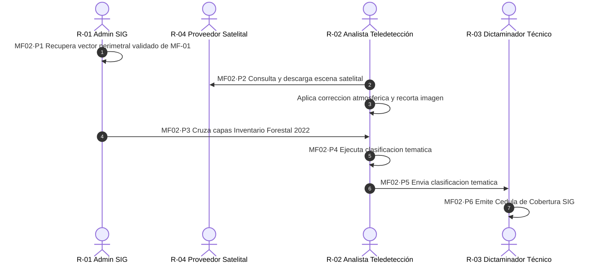

# MF-02 — Levantamiento de cobertura forestal mediante SIG e imágenes satelitales

> Proyecto: Sistema de Gestión Documental PROBOSQUE (Módulo Masa Forestal / SIG).  
> **Este documento es el análisis técnico-funcional del proceso MF-02 del catálogo `README.md`**.  
> Citación externa de pasos: **MF02·P1**, **MF02·P2**, etc.

---

## 1. Objeto y alcance

Determinar la cobertura vegetal y uso del suelo dentro del polígono delimitado del predio solicitante, mediante el procesamiento de capas cartográficas oficiales, imágenes satelitales multiespectrales y análisis espacial en el Sistema de Información Geográfica (SIG) de PROBOSQUE, con el fin de alimentar el dictamen técnico y clasificar los estratos boscosos.

- **Dentro del alcance:** Ingesta de la poligonal perimetral validada en MF-01 → adquisición/selección de escenas satelitales ópticas recientes con baja nubosidad → corrección atmosférica y recorte del área de estudio → sobreposición de capas temáticas del Inventario Estatal Forestal y de Suelos 2022 (conglomerados y parcelas) → clasificación supervisada de usos de suelo y estratos arbóreos → generación de la cartografía temática y reporte de superficie arbolada preliminar.
- **Fuera del alcance:** Validación jurídica y deslinde de tenencia agraria (MF-01), cálculo matemático de índices de vigor espectral NDVI/SAVI y umbrales de dictaminación (MF-03), inspección pericial en campo (MF-07) y consolidación analítica anual de metas (E-03).

---

## 2. Base documental (origen de los requisitos)

| Clave | Documento (ruta en `Docs/Comun/`) | Uso — páginas verificadas |
|---|---|---|
| [RO-PSAH] | `Programas de apoyo/RO_2026_PagoServiciosAmbientales_Hidrológicos.pdf` | p. 4 (Glosario: definición formal de "Dictamen Técnico" mediante SIG y verificación); p. 6 (definición operativa de "Sistema de Información Geográfica" institucional); pp. 8, 19–22 (mecanismo cartográfico para dictaminar apoyos hidrológicos). |
| [RO-CARB] | `Programas de apoyo/RO_2026_CapturandoCarbono.pdf` | pp. 4, 7–8 (criterios de elegibilidad por estrato forestal y superficie arbolada en predios de carbono). |
| [INV-FOR] | `Sitio web/inventario_forestal.html` | Inventario Estatal Forestal y de Suelos 2022 (cartografía base del Estado de México, distribución de biomas, sitios de muestreo, conglomerados y parcelas). |
| [LGDFS] | Ley General de Desarrollo Forestal Sustentable | Arts. 31, 35 y 36 (Sistema Nacional de Información Forestal, inventarios y cartografía de zonificación forestal). |
| [MGO] | `Manual Jurídico/dic161d.pdf` — MGO 2025 | pp. 21–22 (Unidad de Comunicación Social y TI / SIG); pp. 25–26 (Dirección de Restauración y Fomento Forestal). |

---

## 2.1 Glosario

| Término | Significado | Fuente |
|---|---|---|
| Capa Vectorial del Predio | Geometría poligonal georreferenciada en proyección UTM WGS84 que delimita la superficie bajo estudio. | [RO-PSAH p. 19] |
| Escena Satelital Multiespectral | Imagen capturada por sensores orbitales (Sentinel-2, Landsat) con bandas en el visible, infrarrojo cercano (NIR) e infrarrojo de onda corta (SWIR). | Cartografía SIG |
| Máscara de Nubosidad | Filtro algorítmico que aísla pixeles afectados por nubes o sombras proyectadas para evitar errores de clasificación espectral. | Estándar SIG |
| Inventario Forestal Estatal | Malla cartográfica y estadística oficial de las masas boscosas y suelos de la entidad, base para la clasificación de vegetación. | [INV-FOR] |
| Estratificación Forestal | Diferenciación temática del polígono en categorías: bosque templado (pino, encino, oyamel), selva baja caducifolia, zonas semiáridas, suelo perturbado o caminos. | [RO-PSAH pp. 8–9] |

---

## 3. Roles (stakeholders)

| ID | Rol | Área institucional real | Tipo |
|---|---|---|---|
| R-01 | Administrador de Base de Datos Espaciales / SIG | Departamento de SIG / Unidad de TI de PROBOSQUE | Interno |
| R-02 | Analista de Teledetección y Cartografía | Técnico analista de imágenes satelitales (DRFF) | Interno |
| R-03 | Dictaminador Técnico Forestal | Personal técnico de la Dirección de Restauración y Fomento Forestal | Interno |
| R-04 | Sistema Satelital / Proveedor de Datos Espectrales | Plataformas satelitales abiertas (Copernicus/USGS) o servidor raster institucional | Externo / Servicio |

---

## 4. Funciones y actividades por rol

| Rol | Función | Actividades clave (pasos §6) |
|---|---|---|
| R-01 (Admin SIG) | Administrar el repositorio espacial | MF02·P1 (recupera vector de MF-01), MF02·P3 (cruza capas base del Inventario Forestal 2022). |
| R-02 (Analista Teledetección) | Adquisición y procesamiento raster | MF02·P2 (descarga y preprocesa escenas satelitales), MF02·P4 (ejecuta clasificación supervisada y zonificación). |
| R-03 (Dictaminador Técnico) | Evaluar y validar resultados temáticos | MF02·P5 (revisa congruencia ecosistémica), MF02·P6 (emite Cédula de Cobertura SIG). |

---

## 5. Reglas de negocio

- **BR-MF02-01 (Criterio de Temporalidad y Cobertura Nubosa):** Las escenas satelitales empleadas para el levantamiento deben ser de los últimos 6 meses respecto a la fecha de ingreso de la solicitud y contar con un porcentaje de nubosidad sobre el predio menor o igual al 5%. Si la nubosidad es mayor, debe aplicarse mosaico multitemporal.
- **BR-MF02-02 (Alineación con el Inventario Estatal Forestal 2022):** La clasificación de los tipos de vegetación debe homologarse con las categorías fito-geográficas del Inventario Estatal Forestal y de Suelos 2022 de PROBOSQUE (Bosque templado de coníferas, latifoliadas, bosque mixto, selva baja caducifolia y matorral).
- **BR-MF02-03 (Resolución Espacial Mínima):** Para dictámenes en predios forestales, el tamaño de pixel del raster de análisis debe tener una resolución espacial mínima de 10 metros por pixel (equivalente a bandas Sentinel-2).
- **BR-MF02-04 (Descuento de Áreas No Forestales):** Caminos principales, construcciones, canteras o áreas agrícolas dentro del polígono deben digitalizarse como zonas de exclusión y descontarse de la superficie arbolada elegible.

---

## 6. Procedimiento narrado (anclas de trazabilidad)

- **MF02·P1** R-01 extrae de la base de datos geográfica del SGD el polígono perimetral vectorizado y validado en el proceso anterior (MF-01) con su respectivo ID de predio.
- **MF02·P2** R-02 consulta el catálogo satelital (R-04), adquiere la escena multiespectral de mayor resolución disponible, aplica filtros de corrección atmosférica y recorta el raster usando la delimitación perimetral del polígono.
- **MF02·P3** R-01 realiza el cruce espacial del polígono contra la cartografía base del **Inventario Estatal Forestal y de Suelos 2022**, identificando tipos de vegetación y conglomerados forestales oficiales.
- **MF02·P4** R-02 ejecuta la clasificación espectral temática, identificando estratos de bosque continuo, arbolado disperso, claros y áreas antrópicas, calculando el área neta en hectáreas de cada cobertura.
- **MF02·P5** R-03 revisa la clasificación temática generada; si detecta anomalías espectrales (ej. parcelas agrícolas clasificadas erróneamente como arbolado), instruye ajuste en las firmas espectrales.
- **MF02·P6** R-03 valida y emite la **Cédula de Levantamiento de Cobertura SIG**, anexando el plano temático y la tabla de distribución de superficies; el sistema transfiere los datos al proceso de cálculo espectral (MF-03).

---

## 7. Diagrama de actividad

---

## 8. Tabla de necesidades (con ancla al paso)

| ID | Rol | Necesidad del SGD | Prior. | Paso | Origen documental verificado |
|---|---|---|---|---|---|
| N-MF02-01 | R-01 | Módulo de importación automática de vectores desde el expediente del predio validado | A | MF02·P1 | [RO-PSAH p. 19][cite: 1] |
| N-MF02-02 | R-02 | Conector API o módulo de descarga automatizada de imágenes Sentinel-2 corregidas | M | MF02·P2 | Estándar operativo teledetección[cite: 1] |
| N-MF02-03 | R-01 | Repositorio de capas WMS/WFS del Inventario Estatal Forestal y de Suelos 2022 integrado al software | A | MF02·P3 | [INV-FOR]; [RO-PSAH p. 4][cite: 1] |
| N-MF02-04 | R-02 | Motor de procesamiento raster para clasificación de uso de suelo y vectorización de coberturas | A | MF02·P4 | [RO-PSAH p. 4 "Dictamen Técnico", p. 6 "SIG"][cite: 1] |
| N-MF02-05 | R-03 | Visor geográfico interactivo con comparativa multitemporal (antes vs después) | M | MF02·P5 | Práctica técnica forestal |
| N-MF02-06 | R-03 | Generación automatizada de la Cédula de Cobertura en PDF con firmas electrónicas y plano cartográfico | A | MF02·P6 | [RO-PSAH pp. 4, 19][cite: 1] |

---

## 9. Registros que el SGD debe gestionar

| Registro | Genera (paso) | Campos clave requeridos | Retención sugerida |
|---|---|---|---|
| Ficha de Adquisición de Escena Satelital | R-02 (MF02·P2) | Sensor de origen, ID de escena, fecha de adquisición, ángulo de incidencia, porcentaje de nubosidad en predio. | 5 años |
| Capa Vectorial de Uso de Suelo y Estratificación | R-02 (MF02·P4) | ID Polígono, código de estrato fito-geográfico (bosque templado, selva caducifolia, etc.), superficie por estrato (ha), porcentaje de cobertura[cite: 1]. | Permanente |
| Cédula de Levantamiento de Cobertura SIG | R-03 (MF02·P6) | Folio solicitud, ID predio, fecha de análisis, superficie total delimitada (ha), superficie neta arbolada (ha), superficie de exclusión (ha), nombre y firma del analista técnico[cite: 1]. | Permanente (Histórico de predio) |

---

## 10. Vacíos y siguientes pasos

1. **V-MF02-01 (Inexistencia de servidor de imágenes institucional):** Las Reglas de Operación mencionan el uso del "SIG de PROBOSQUE" (p. 4)[cite: 1], pero no formalizan la infraestructura de almacenamiento (si las imágenes de satélite se guardan localmente en discos de la DRFF o en un repositorio geoespacial en la nube de la Unidad de TI).
2. **V-MF02-02 (Estandarización de claves de vegetación):** Se debe conciliar si las categorías del Inventario Estatal 2022[cite: 1] son 100% compatibles con la terminología de la Carta de Uso de Suelo Serie VII del INEGI para evitar discrepancias semánticas en el software.
3. **V-MF02-03 (Protocolo ante nubosidad persistente):** En zonas de alta montaña durante temporada de lluvias (junio–septiembre), la nubosidad impide el uso de satélites ópticos. No está normado si el SGD aceptará imágenes de radar (SAR / Sentinel-1) o vuelos de dron como método alternativo de verificación.

---

## 11. Nota de mantenimiento

Documento técnico del proceso **MF-02** dentro del Dominio 1 (Masa Forestal)[cite: 1]. Archivar en `Docs/<TuCarpeta>/Masa_Forestal/MF-02_LEVANTAMIENTO_COBERTURA_SIG.md`[cite: 1]. La clasificación de estratos y la superficie forestal identificada en este procedimiento son los insumos directos para alimentar **MF-03 (Cálculo de índices de cobertura arbórea)**[cite: 1].
