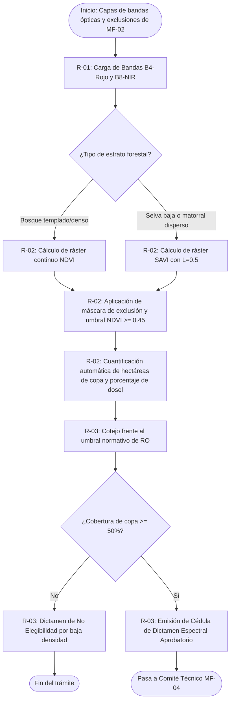

# MF-03 — Cálculo de índices de cobertura arbórea (NDVI / SAVI) y umbrales de dictaminación

> Proyecto: Sistema de Gestión Documental PROBOSQUE (Módulo Masa Forestal / SIG)[cite: 1].  
> **Este documento es el análisis técnico-funcional del proceso MF-03 del catálogo `README.md`**[cite: 1].  
> Citación externa de pasos: **MF03·P1**, **MF03·P2**, etc.

---

## 1. Objeto y alcance

Procesar matemáticamente las bandas espectrales de las imágenes satelitales obtenidas en MF-02 para calcular los índices de vigor vegetal y cobertura de copa (NDVI, SAVI), contrastando los valores obtenidos contra los umbrales de densidad y cobertura arbolada exigidos por las Reglas de Operación (RO PSAH y Capturando Carbono), determinando cuantitativamente si la superficie es elegible para el otorgamiento del apoyo[cite: 1].

- **Dentro del alcance:** Ingesta de las bandas calibradas y de la máscara de exclusión de MF-02[cite: 1] → cálculo raster de NDVI y SAVI píxel a píxel → segmentación de niveles de vigor vegetal y densidad arbórea → evaluación frente a umbrales normativos (cobertura arbolada >= 50% para PSAH)[cite: 1] → emisión de la Cédula de Dictamen Espectral Automatizado.
- **Fuera del alcance:** Delimitación legal y tenencia (MF-01)[cite: 1], clasificación de uso de suelo y corte de escenas (MF-02)[cite: 1], aprobación formal en sesión de Comité Técnico (MF-04)[cite: 1] y visitas de inspección física en campo (MF-07)[cite: 1].

---

## 1.1 Entradas y Salidas del Proceso

| Tipo | Elemento / Artefacto | Descripción y formato | Origen / Destino |
|---|---|---|---|
| **Entrada** | Bandas multiespectrales recortadas | Bandas B4 (Rojo) y B8 (NIR) ajustadas a la poligonal | Proceso MF-02 |
| **Entrada** | Máscara de exclusión de uso de suelo | Polígonos de zonas no forestales a omitir | Proceso MF-02 |
| **Salida** | Ráster continuo de Índices (NDVI/SAVI) | Capa GeoTIFF de 10 m de resolución con valores espectrales | Motor de cálculo geoespacial SGD |
| **Salida** | Dictamen Técnico de Cobertura Espectral | Cédula en PDF con validación del umbral normativo ($\ge 50\%$) | Expediente SGD -> Insumo para Comité MF-04 |

---

## 2. Base documental (origen de los requisitos)

| Clave | Documento (ruta en `Docs/Comun/`) | Uso — páginas verificadas |
|---|---|---|
| [RO-PSAH] | `Programas de apoyo/RO_2026_PagoServiciosAmbientales_Hidrológicos.pdf` | p. 4 (Glosario: definición de Dictamen Técnico y elegibilidad); pp. 7–8 (Criterios y requisitos: cobertura de copa y densidad mínima arbolada requerida >= 50%); pp. 19–22 (Procedimiento de dictaminación técnica en gabinete)[cite: 1]. |
| [RO-CARB] | `Programas de apoyo/RO_2026_CapturandoCarbono.pdf` | pp. 4, 7–9 (Criterios de biomasa, estratos forestales elegibles y densidad de dosel para captura de carbono). |
| [INV-FOR] | `Sitio web/inventario_forestal.html` | Inventario Estatal Forestal y de Suelos 2022 (parámetros de densidad y masa vegetal por ecorregión en el Estado de México)[cite: 1]. |
| [LGDFS] | Ley General de Desarrollo Forestal Sustentable | Art. 36 (Monitoreo satelital continuo de la masa forestal y degradación de suelos). |

---

## 2.1 Glosario

| Término | Significado | Fuente |
|---|---|---|
| NDVI | Índice de Vegetación de Diferencia Normalizada: ratio que cuantifica la biomasa fotosintéticamente activa mediante las bandas Rojo e Infrarrojo Cercano: $(NIR - Red) / (NIR + Red)$. | Teledetección / SIG |
| SAVI | Índice de Vegetación Ajustado al Suelo: compensa la reflectancia del suelo desnudo en zonas forestales con arbolado disperso o matorral: $((NIR - Red) / (NIR + Red + L)) * (1 + L)$. | Teledetección / SIG |
| Cobertura de Copa (Dosel) | Porcentaje de suelo cubierto por la proyección vertical de las copas de los árboles en el polígono. Exigencia mínima en RO: 50%. | [RO-PSAH p. 8][cite: 1] |
| Vigor Espectral | Estado de salud fotosintética del bosque estimado por el valor numérico del índice (NDVI entre 0.4 y 0.9 para bosques sanos). | Estándar teledetección |
| Umbral de Rechazo Automático | Límite inferior de cobertura arbolada compacta que descalifica el polígono de apoyo hidrológico si la cobertura efectiva resulta menor al 50%. | [RO-PSAH p. 8][cite: 1] |

---

## 3. Roles (stakeholders)

| ID | Rol | Área institucional real | Tipo |
|---|---|---|---|
| R-01 | Analista de Teledetección y Cartografía | Técnico analista de SIG / Teledetección (DRFF)[cite: 1, 3] | Interno |
| R-02 | Motor Raster / Algoritmo del SGD | Subsistema de cálculo matemático geoespacial del SGD | Sistema / Automático |
| R-03 | Dictaminador Técnico Forestal | Técnico forestal dictaminador de la DRFF[cite: 1, 2] | Interno |
| R-04 | Promovente / Beneficiario | Propietario o autoridad agraria del predio evaluado | Externo |

---

## 4. Funciones y actividades por rol

| Rol | Función | Actividades clave (pasos §6) |
|---|---|---|
| R-01 (Analista Teledetección) | Preparar capas y calibrar parámetros | MF03·P1 (recupera bandas multiespectrales de MF-02), MF03·P3 (selecciona factor de corrección de suelo $L$ si aplica)[cite: 1]. |
| R-02 (Motor Raster SGD) | Ejecutar álgebra de mapas y métricas | MF03·P2 (calcula raster NDVI/SAVI), MF03·P4 (calcula superficie arbolada y porcentaje de dosel)[cite: 1]. |
| R-03 (Dictaminador Técnico) | Validar umbrales y dictaminar | MF03·P5 (compara contra el 50% de RO), MF03·P6 (emite Dictamen de Cobertura y firma electrónica)[cite: 1]. |

---

## 5. Reglas de negocio

- **BR-MF03-01 (Umbral Mínimo de Cobertura PSAH):** Para ser elegible en el programa de Pago por Servicios Ambientales Hidrológicos, el predio debe registrar una cobertura arbórea compacta o semidensa igual o mayor al 50% de la superficie total solicitada[cite: 1].
- **BR-MF03-02 (Selección del Índice Espectral):** En bosques templados densos (coníferas y latifoliadas) se calculará obligatoriamente NDVI. En zonas de selva baja caducifolia o matorral con suelo descubierto, se calculará obligatoriamente SAVI con un factor de corrección $L = 0.5$.
- **BR-MF03-03 (Rango de Vigor Elegible):** Se considerará superficie arbolada con cobertura efectiva únicamente aquellos pixeles con un valor de NDVI >= 0.45. Valores inferiores a 0.30 serán clasificados como suelo desnudo o vegetación perturbada sin derecho a cálculo de apoyo.
- **BR-MF03-04 (Descuento de la Máscara de Exclusión):** Toda área marcada en MF-02 como camino, asentamiento o cuerpo de agua debe recibir un valor nulo (`NoData`) y quedar excluida del divisor en el porcentaje final de cobertura[cite: 1].

---

## 6. Procedimiento narrado (anclas de trazabilidad)

- **MF03·P1** R-01 recupera del SGD las bandas satelitales calibradas (Banda 4-Rojo y Banda 8-NIR de Sentinel-2) y la máscara de exclusión vectorial generada en MF-02[cite: 1].
- **MF03·P2** R-02 corre el cálculo de álgebra de mapas, generando la capa ráster continua de NDVI: $(B8 - B4) / (B8 + B4)$.
- **MF03·P3** Si el estrato del Inventario Forestal corresponde a matorral o zona degradada, R-01 instruye a R-02 ejecutar el modelo SAVI aplicando el factor $L = 0.5$ para neutralizar el brillo del sustrato rocoso o arenoso[cite: 1].
- **MF03·P4** R-02 aplica el umbral de corte (>= 0.45), reclasifica el ráster a formato binario (Bosque Elegible vs No Elegible) y calcula la superficie neta en hectáreas y el porcentaje global de cobertura de copa.
- **MF03·P5** R-03 evalúa el porcentaje obtenido frente a las Reglas de Operación: si la cobertura es >= 50%, se dictamina **Aprobatorio**; si es < 50%, se dictamina **Rechazado** por insuficiencia de densidad forestal[cite: 1].
- **MF03·P6** R-03 genera y firma digitalmente la **Cédula de Dictamen de Cobertura Espectral**, la cual se incorpora automáticamente al expediente para someterse a la aprobación del Comité Técnico en MF-04[cite: 1].

---

## 7. Diagrama de actividad

---

## 8. Tabla de necesidades (con ancla al paso)

| ID | Rol | Necesidad del SGD | Prior. | Paso | Origen documental verificado |
|---|---|---|---|---|---|
| N-MF03-01 | R-01 | Interfaz para seleccionar bandas raster del repositorio y definir máscara vectorial | A | MF03·P1 | Estándar de procesamiento SIG |
| N-MF03-02 | R-02 | Motor geoespacial (GDAL/PostGIS Raster) para cálculo automatizado de NDVI | A | MF03·P2 | [RO-PSAH p. 4 "Dictamen Técnico"][cite: 1] |
| N-MF03-03 | R-01 | Selector de algoritmos de índice espectral (NDVI / SAVI con parámetro L editable) | M | MF03·P3 | [INV-FOR]; Práctica teledetección[cite: 1] |
| N-MF03-04 | R-02 | Algoritmo de reclasificación automática por umbral de píxeles y suma de superficie | A | MF03·P4 | [RO-PSAH p. 8][cite: 1] |
| N-MF03-05 | R-03 | Módulo de validación de reglas de negocio con semáforo de elegibilidad (Aprobado/Rechazado) | A | MF03·P5 | [RO-PSAH pp. 7–8][cite: 1] |
| N-MF03-06 | R-03 | Generador de Cédula de Dictamen Espectral con histograma de frecuencias y mapa de vigor en GeoPDF | A | MF03·P6 | [RO-PSAH pp. 4, 19][cite: 1] |

---

## 9. Registros que el SGD debe gestionar

| Registro | Genera (paso) | Campos clave requeridos | Retención sugerida |
|---|---|---|---|
| Matriz Ráster de Índices Espectrales | R-02 (MF03·P2–P4) | ID Predio, tipo de índice (NDVI/SAVI), fecha de cálculo, resolución de pixel (10m), ruta de almacenamiento del ráster. | 5 años |
| Reporte Cuantitativo de Cobertura | R-02 (MF03·P4) | Superficie total (ha), superficie arbolada elegible (ha), superficie no forestal (ha), porcentaje efectivo de dosel (%)[cite: 1]. | Permanente |
| Cédula de Dictamen de Cobertura Espectral | R-03 (MF03·P6) | Folio de trámite, ID predio, resultado (Elegible / No Elegible), valor medio de NDVI, firma electrónica del técnico dictaminador[cite: 1]. | Permanente (Histórico de predio) |

---

## 10. Vacíos y siguientes pasos

1. **V-MF03-01 (Estacionalidad y fenología de la vegetación):** Las Reglas de Operación no especifican la época del año en que debe tomarse la imagen[cite: 1]. En bosques caducifolios durante estiaje (marzo-mayo), el NDVI cae por pérdida de follaje sin que signifique deforestación real. Debe definirse una ventana fenológica admisible en el sistema.
2. **V-MF03-02 (Tratamiento de zonas quemadas recientes):** Si un predio sufrió un incendio forestal meses antes de la postulación pero está bajo regeneración natural, el NDVI dará valores no elegibles. Se requiere definir si se permite una bandera de excepción con inspección de campo.
3. **V-MF03-03 (Calibración empírica del parámetro L en SAVI):** Se adoptó el estándar académico $L = 0.5$, pero no existe una directiva oficial de PROBOSQUE que regule el valor de ajuste de suelo para los distintos tipos de suelos del Estado de México.

---

## 11. Nota de mantenimiento

Documento técnico del proceso **MF-03** dentro del Dominio 1 (Masa Forestal)[cite: 1]. Archivar en `Docs/Valeria/Masa_Forestal/MF-03_INDICES_COBERTURA.md`[cite: 1]. La cédula aprobatoria de cobertura y el porcentaje de dosel calculados en este proceso son el insumo obligatorio para que el expediente pase a **MF-04 (Aprobación en Comité Técnico y Asignación de Recursos)**[cite: 1].
