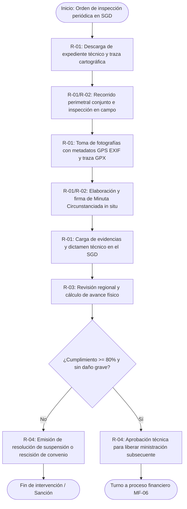

# MF-07 — Inspección, verificación y vigilancia en campo de compromisos asumidos

> Proyecto: Sistema de Gestión Documental PROBOSQUE (Módulo Masa Forestal / SIG).  
> **Este documento es el análisis técnico-funcional del proceso MF-07 del catálogo `README.md`**[cite: 1].  
> Citación externa de pasos: **MF07·P1**, **MF07·P2**, etc.

---

## 1. Objeto y alcance

Realizar las visitas periciales de inspección y auditoría técnica física en los predios beneficiados por los programas de apoyo de PROBOSQUE (PSAH, Capturando Carbono, Reforestación), verificando el cumplimiento de los compromisos adquiridos (conservación de arbolado, brechas cortafuego, cercado perimetral, obras de conservación de suelo y agua) para autorizar o suspender ministraciones económicas subsecuentes e imponer sanciones o rescisiones de convenio si procede[cite: 1, 2].

- **Dentro del alcance:** Selección de muestra aleatoria o dirigida de predios a auditar → emisión de orden de verificación e inspección → traslado de la brigada técnica y recorrido perimetral con beneficiarios[cite: 1, 2] → levantamiento de datos en campo (conteo de planta viva, medición de brechas, registro fotográfico georreferenciado) → suscripción de la Minuta Circunstanciada de Inspección[cite: 1, 2] → emisión de Dictamen Técnico de Inspección en el SGD → liberación de pago o inicio de rescisión de convenio.
- **Fuera del alcance:** Delimitación topográfica inicial de predios (MF-01)[cite: 1], cálculo de coberturas e índices por satélite (MF-02, MF-03)[cite: 1], convenios de concertación inicial (MF-05)[cite: 1], dispersión bancaria directa (MF-06)[cite: 1] y reportes ejecutivos consolidados de cierre anual (E-03)[cite: 1].

---
## 1.1 Entradas y Salidas del Proceso

> Retro-ajuste 2026-09-24: la tabla genérica que estaba aquí se rehízo como **§12** (una fila por paso del §6, con ruta real de archivo), conforme a la plantilla de 12 secciones. Ver al final del documento.

---

## 2. Base documental (origen de los requisitos)

| Clave | Documento (ruta en `Docs/Comun/`) | Uso — páginas verificadas |
|---|---|---|
| [RO-PSAH] | `Programas de apoyo/RO_2026_PagoServiciosAmbientales_Hidrológicos.pdf` | pp. 4–5 (Definiciones: Verificación en campo, Cédula de Inspección); pp. 19–22 (Mecánica operativa: visitas periódicas, levantamiento de minutas, causales de suspensión de ministraciones y sanciones)[cite: 1]. |
| [RO-CARB] | `Programas de apoyo/RO_2026_CapturandoCarbono.pdf` | pp. 9–11 (Obligaciones de los beneficiarios, cronograma de obras, auditoría física de reforestaciones y retención de carbono). |
| [MAN-PROC] | `Manual Jurídico/86_manualProcDirRestYFtoFtal.pdf` | pp. 27–32 (Procedimiento de inspección física, levantamiento de actas circunstanciadas, responsabilidades de las Delegaciones Regionales Forestales)[cite: 2]. |
| [FO-503] | `Programas de apoyo/FORMATO_FO-PB-503_ReporteAvance_2026.docx` | Formato oficial de reporte de actividades y metas físicas reportadas por el beneficiario. ⚠ **No localizado en `Docs/Comun/`** → `V-MF07-04`. |
| [LGDFS] | Ley General de Desarrollo Forestal Sustentable | Arts. 154, 156–158 (Atribuciones de inspección, vigilancia forestal y levantamiento de actas administrativas). |

---

## 2.1 Glosario

| Término | Significado | Fuente |
|---|---|---|
| Visita de Verificación / Inspección | Diligencia pericial de campo practicada por personal acreditado para cotejar metas físicas y estado del recurso forestal. | [RO-PSAH p. 5][cite: 1] |
| Minuta Circunstanciada de Campo | Acta administrativa levantada in situ que asienta fecha, hora, predio, asistentes, compromisos inspeccionados, porcentaje de avance y anomalías. | [RO-PSAH p. 20; MAN-PROC p. 28][cite: 1, 2] |
| Evidencia Georreferenciada | Fotografías y trazas GPS tomadas durante el recorrido que incorporan metadatos EXIF con coordenadas UTM, altitud, rumbo y marca de tiempo. | Estándar operativo |
| Incumplimiento Grave | Detección de cambio de uso de suelo no autorizado, tala clandestina provocada, pastoreo en áreas reforestadas o falsedad en reportes. | [RO-PSAH p. 21][cite: 1] |
| Ministración Subsecuente | Desembolso presupuestal condicionado a la aprobación de la verificación técnica física del ejercicio o periodo correspondiente. | [RO-PSAH p. 9][cite: 1] |

---

## 3. Roles (stakeholders)

| ID | Rol | Área institucional real | Tipo |
|---|---|---|---|
| R-01 | Auditor / Verificador Técnico de Campo | Personal técnico de la Delegación Regional Forestal (DRF)[cite: 2, 3] | Interno |
| R-02 | Beneficiario / Representante Legal | Comisariado Ejidal/Comunal o Propietario Particular titular del predio | Externo |
| R-03 | Jefe de Departamento / Coordinador DRF | Titular técnico regional de PROBOSQUE[cite: 2, 3] | Interno |
| R-04 | Dirección de Restauración y Fomento Forestal | Dirección facultada para emitir resoluciones de pago o rescisión[cite: 2, 3] | Interno |

---

## 4. Funciones y actividades por rol

| Rol | Función | Actividades clave (pasos §6) |
|---|---|---|
| R-01 (Auditor Técnico) | Realizar la diligencia en campo | MF07·P1 (descarga expediente y orden de visita), MF07·P2 (inspecciona predio y toma evidencia), MF07·P3 (levanta minuta de inspección), MF07·P4 (emite informe técnico en SGD)[cite: 1, 2]. |
| R-02 (Beneficiario) | Acompañar inspección y suscribir acta | MF07·P2 (atiende visita y muestra obras realizadas), MF07·P3 (firma minuta circunstanciada de campo)[cite: 1, 2]. |
| R-03 (Coordinador DRF) | Validar diligencia y expediente | MF07·P5 (revisa evidencias, dictamen de campo y avala recomendación)[cite: 2]. |
| R-04 (Dirección Restauración) | Resolver procedencia administrativa | MF07·P6 (autoriza liberación de siguiente ministración o turna rescisión y sanción)[cite: 1, 2]. |

---

## 5. Reglas de negocio

- **BR-MF07-01 (Notificación y Acompañamiento Obligatorio):** Ninguna inspección de verificación tendrá validez jurídica si no cuenta con citatorio previo o presencia del beneficiario acreditado o persona designada mediante carta poder; al término de la visita se levantará minuta firmada por duplicado[cite: 1, 2].
- **BR-MF07-02 (Validez de la Evidencia Fotográfica):** Toda fotografía de obras o estado del arbolado debe contener sellado digital con coordenadas UTM bajo datum WGS84, fecha y hora verificada por satélite. Fotos sin metadatos serán rechazadas automáticamente por el SGD.
- **BR-MF07-03 (Criterio de Aprobación de Ministración):** Para emitir dictamen favorable y liberar la siguiente anualidad/ministración, el beneficiario debe haber ejecutado como mínimo el 80% de las actividades programadas para el ciclo (brechas, vigilancia, obras de suelo) y conservar el arbolado sin afectaciones atribuibles a negligencia[cite: 1].
- **BR-MF07-04 (Tolerancia Cero a Afectaciones Graves):** Si se comprueba tala no autorizada, pastoreo extensivo dentro del polígono apoyado, o cambio de uso de suelo, se suspenderá de inmediato el trámite, ordenando la rescisión definitiva del convenio y el reintegro de fondos[cite: 1].

---

## 6. Procedimiento narrado (anclas de trazabilidad)

- **MF07·P1** R-01 recibe en el SGD la orden de verificación programada junto con el expediente del predio (polígono MF-01, dictamen MF-03 y cronograma de actividades comprometidas)[cite: 1].
- **MF07·P2** R-01 acude al predio y en conjunto con R-02 realiza el recorrido técnico de inspección física, verificando la condición del arbolado, estado de brechas cortafuego, obras de conservación de suelo y capturando fotografías georreferenciadas con dispositivo móvil[cite: 1, 2].
- **MF07·P3** Concluido el recorrido, R-01 redacta in situ la **Minuta Circunstanciada de Inspección**, asentando hallazgos cuantitativos, observaciones del beneficiario y firmas de conformidad de las partes[cite: 1, 2].
- **MF07·P4** R-01 sube al SGD la minuta escaneada, las trazas de recorrido y la evidencia fotográfica, emitiendo el **Informe de Verificación Técnica de Campo** con calificación porcentual de cumplimiento[cite: 1, 2].
- **MF07·P5** R-03 revisa la coherencia del expediente en el SGD; si el avance es igual o mayor al 80%, valida el dictamen con recomendación favorable; si es menor al 80% sin causa fortuita comprobada, instruye dictamen de suspensión temporal de pago[cite: 1, 2].
- **MF07·P6** R-04 aprueba en el sistema la resolución final: si es favorable, turna el folio al proceso financiero para liberar la ministración subsecuente; si existe incumplimiento grave, turna a la Unidad Jurídica para rescisión de convenio y aplicación de sanciones administrativas[cite: 1, 2].

---

## 7. Diagrama de actividad

---

## 8. Tabla de necesidades (con ancla al paso)

| ID | Rol | Necesidad del SGD | Prior. | Paso | Origen documental verificado |
|---|---|---|---|---|---|
| N-MF07-01 | R-01 | Generación de órdenes de verificación y descarga offline de expedientes y polígonos | A | MF07·P1 | [MAN-PROC pp. 27–28][cite: 2] |
| N-MF07-02 | R-01 | App móvil con validación de metadatos EXIF (coordenadas GPS, rumbo, fecha inviolable) | A | MF07·P2 | [RO-PSAH p. 20; Estándar SIG][cite: 1] |
| N-MF07-03 | R-01 / R-02 | Módulo de digitalización o firma digital de la Minuta Circunstanciada en tablet de campo | M | MF07·P3 | [RO-PSAH p. 20][cite: 1] |
| N-MF07-04 | R-01 | Calculadora de cumplimiento de metas físicas (porcentaje ponderado según RO) | A | MF07·P4 | [RO-PSAH pp. 8, 20][cite: 1] |
| N-MF07-05 | R-03 | Bandeja de validación técnica regional con semáforo de cumplimiento y panel de fotos | A | MF07·P5 | [MAN-PROC pp. 29–30][cite: 2] |
| N-MF07-06 | R-04 | Módulo de emisión de acuerdos administrativos de liberación presupuestal o rescisión | A | MF07·P6 | [RO-PSAH pp. 21–22][cite: 1] |

---

## 9. Registros que el SGD debe gestionar

| Registro | Genera (paso) | Campos clave requeridos | Retención sugerida |
|---|---|---|---|
| Orden de Verificación en Campo | SGD / R-03 (MF07·P1) | Folio de orden, fecha de emisión, auditor asignado, ID predio, beneficiario, periodo a inspeccionar[cite: 2]. | 5 años |
| Minuta Circunstanciada de Inspección | R-01 (MF07·P3) | Folio, fecha, hora inicio/cierre, coordenadas de parajes, asistentes, relación de obras verificadas, firmas[cite: 1, 2]. | Permanente |
| Expediente de Evidencias Georreferenciadas | R-01 (MF07·P4) | Galería de imágenes (JPEG con metadatos EXIF WGS84), archivo de traza GPX/KML del recorrido, checklist de campo[cite: 1]. | 10 años |
| Dictamen de Inspección Física y Seguimiento | R-01 / R-03 (MF07·P4–P5) | Porcentaje global de cumplimiento (%), resumen de compromisos atendidos, observaciones técnicas, sentido del dictamen[cite: 1, 2]. | Permanente |
| Resolución de Liberación / Rescisión | R-04 (MF07·P6) | Número de resolución, motivo legal, estatus de ministración (Liberada / Cancelada / Reintegro requerido)[cite: 1, 2]. | Permanente |

---

## 10. Vacíos y siguientes pasos

1. **V-MF07-01 (Operación fuera de línea / Offline):** Gran parte de los predios forestales del Estado de México carecen de señal celular. El sistema documental debe incorporar forzosamente sincronización asíncrona (captura sin red y subida automática al detectar conexión en la DRF).
2. **V-MF07-02 (Plantilla única de Minuta de Inspección):** Aunque el Manual de Procedimientos cita la obligatoriedad del acta circunstanciada (p. 28)[cite: 2], el catálogo no cuenta con un formato digital estandarizado específico para cada programa forestal (se usan machotes en Word o notas a mano).
3. **V-MF07-03 (Protocolo ante causas de fuerza mayor):** No está reglamentado en las RO qué porcentaje de tolerancia técnica se aplica si las obras forestales sufrieron daños por desastres naturales (incendios catastróficos o plagas sobrevenidas sin culpa del beneficiario) previo a la inspección[cite: 1].
4. **V-MF07-04 (Formato FO-PB-503 no localizado):** El análisis cita en §2 el formato `FORMATO_FO-PB-503_ReporteAvance_2026.docx` (reporte de actividades del beneficiario), pero **el archivo no existe en `Docs/Comun/Programas de apoyo/`** (solo están los FO-PB-501A, FO-PB-501B y FO-PB-502). Debe conseguirse el formato real o corregirse la referencia (cf. `X-03·V-01`). **Búsqueda web 2026-09-24:** 0 resultados públicos para FO-PB-503/509/520 y las cédulas RETYS de los 18 trámites solo publican los FO-PB-501/502 → confirmado como formato interno del SGC.

---

## 11. Nota de mantenimiento

Documento técnico del proceso **MF-07** dentro del Dominio 1 (Masa Forestal)[cite: 1]. Archivar en `Docs/Valeria/Masa_Forestal/MF-07_INSPECCION_VIGILANCIA.md`[cite: 1]. Los resultados físicos auditados en este proceso alimentan directamente el entregable **E-03 (Estadísticas y panel de cierre anual de programas)**[cite: 1].

---

## 12. Insumos y productos por paso

Una fila por paso del §6 (retro-ajuste 2026-09-24, énfasis #1 del profesor). Toda celda sin archivo en las fuentes enlaza a su vacío `V-##`.

| Paso | Documento/dato de entrada | Datos que se capturan/procesan | Documento de salida |
|---|---|---|---|
| **MF07·P1** | Expediente del predio (polígono MF-01, dictamen MF-03, cronograma de compromisos); programa de inspección | Auditor asignado, periodo a inspeccionar | Orden de Verificación en Campo |
| **MF07·P2** | Orden de P1; dispositivo móvil con GPS; beneficiario acreditado (BR-MF07-01) | Estado del arbolado, brechas cortafuego, obras de conservación de suelo; fotografías con metadatos EXIF | Evidencia georreferenciada (JPEG + EXIF WGS84, traza GPX/KML) |
| **MF07·P3** | Hallazgos del recorrido; plantilla de minuta (**sin formato oficial** → `V-MF07-02`) | % de avance, observaciones del beneficiario, firmas | Minuta Circunstanciada de Inspección (firmada por duplicado) |
| **MF07·P4** | Minuta + evidencias; reporte del beneficiario `FORMATO_FO-PB-503` (**citado en §2 pero sin archivo en `Docs/Comun/`** → `V-MF07-04`) | Calificación % de cumplimiento | Informe de Verificación Técnica de Campo |
| **MF07·P5** | Informe de P4; umbral 80% (BR-MF07-03); manual de procedimientos `Docs/Comun/germoplasma-archivo/Germoplasma/86_manualProcDirRestYFtoFtal.pdf` pp. 27–32 | Validación regional del avance | Dictamen de Inspección (favorable / suspensión temporal de pago) |
| **MF07·P6** | Dictamen de P5 | Resolución administrativa | Acuerdo de liberación de ministración (→ proceso financiero) o turnado a rescisión y reintegro (`Docs/Joni/Masa_Forestal/MF-13_RESCISION_REINTEGRO.md`) |
