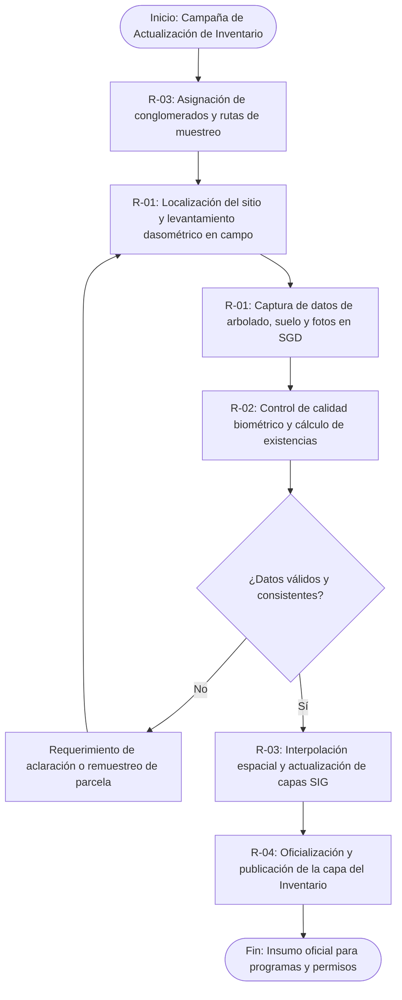

# MF-09 — Gestión y Actualización del Inventario Estatal Forestal y de Suelos

> Proyecto: Sistema de Gestión Documental PROBOSQUE (Módulo Masa Forestal / SIG)[cite: 1].  
> **Análisis técnico-funcional del proceso MF-09 del catálogo `README.md`**.  
> Citación externa de pasos: **MF09·P1**, **MF09·P2**, etc.

---

## 1. Objeto y alcance

Planificar, estructurar, capturar y procesar los datos dasométricos, de biodiversidad y de degradación de suelos obtenidos en la red estatal de sitios y conglomerados de muestreo, para mantener actualizada la base cartográfica y estadística oficial de los recursos forestales del Estado de México (Inventario Estatal Forestal y de Suelos)[cite: 5.2], la cual constituye la línea base para todos los programas de conservación y aprovechamiento[cite: 5.2].

---

## 1.1 Entradas y Salidas del Proceso

> Retro-ajuste 2026-09-24: la tabla genérica que estaba aquí se rehízo como **§12** (una fila por paso del §5, con ruta real de archivo), conforme a la plantilla de 12 secciones. Ver al final del documento.

---

## 2. Base documental

| Clave | Documento | Uso — páginas |
|---|---|---|
| [INV-FOR] | `Sitio web/inventario_forestal.html` | Metodología del Inventario Estatal Forestal y de Suelos 2022 (conglomerados, parcelas y muestreo)[cite: 5.2]. |
| [LGDFS] | Ley General de Desarrollo Forestal Sustentable | Arts. 31, 35 (Estructuración obligatoria del inventario estatal e interconexión con el SNIF). |
| [MGO] | `Manual Jurídico/dic161d.pdf` — MGO 2025 | pp. 25–26 (Atribuciones de la Dirección de Restauración y Fomento Forestal en materia de inventarios)[cite: 3]. |

---

## 3. Roles

- **R-01 Jefe de Brigada de Inventario:** Responsable del levantamiento dasométrico en las parcelas de muestreo.
- **R-02 Analista Biométrico / Forestal:** Realiza el control de calidad de datos, cálculo de existencias reales y volumetría.
- **R-03 Especialista SIG:** Incorpora los datos procesados a las capas cartográficas institucionales.
- **R-04 Dirección de Restauración:** Valida y publica oficialmente la actualización del Inventario Estatal[cite: 2, 3].

---

## 4. Reglas de negocio

- **BR-MF09-01 (Estructura de Conglomerados):** Cada conglomerado debe apegarse a la metodología nacional, integrando cuatro sitios de muestreo de $400\text{ m}^2$ cada uno, dispuestos en forma de "Y" invertida respecto al sitio central.
- **BR-MF09-02 (Validación de Especies Forestales):** Todo registro botánico ingresado al SGD debe validarse contra el catálogo taxonómico oficial de flora nativa del Estado de México (*Pinus*, *Abies*, *Quercus*, etc.)[cite: 5.2].
- **BR-MF09-03 (Periodicidad de Actualización):** La base cartográfica del inventario debe someterse a revisión bienal y actualización integral cada 5 años conforme a la legislación forestal.

---

## 5. Procedimiento narrado

- **MF09·P1** R-03 extrae la malla de conglomerados asignados para la campaña de muestreo anual y genera las guías de navegación satelital.
- **MF09·P2** R-01 acude al sitio en campo, localiza el centro del conglomerado y levanta las variables dasométricas de arbolado adulto, renuevo, cobertura de copa y muestras de suelo.
- **MF09·P3** R-01 digitaliza las cédulas de campo en el módulo de inventarios del SGD, asociando la evidencia fotográfica y marcas GPS.
- **MF09·P4** R-02 ejecuta algoritmos de consistencia lógica para descartar registros incongruentes (ej. alturas imposibles respecto al diámetro) y calcula el volumen de madera y carbono por hectárea.
- **MF09·P5** R-03 genera los modelos espaciales de interpolación geoestadística, actualizando las capas del Inventario Estatal Forestal.
- **MF09·P6** R-04 aprueba la nueva versión cartográfica y la publica como capa oficial de referencia en el SIG institucional.

---

## 6. Diagrama de proceso

---

## 7. Tabla de necesidades

| ID | Rol | Necesidad del SGD | Prior. | Paso | Origen documental |
|---|---|---|---|---|---|
| N-MF09-01 | R-03 | Módulo de diseño muestral y asignación de conglomerados espaciales | M | MF09·P1 | [INV-FOR]; Metodología Inventario[cite: 5.2] |
| N-MF09-02 | R-01 | Interfaz móvil con formularios validados para captura de mediciones dasométricas | A | MF09·P2 | [INV-FOR pp. 12–15] |
| N-MF09-03 | R-02 | Algoritmo biométrico de cálculo automático de volumen de madera y biomasa | A | MF09·P4 | Estándar de Biometría Forestal |
| N-MF09-04 | R-03 | Publicador de servicios geográficos WMS/WFS de la capa oficial de vegetación | A | MF09·P5 | [MGO pp. 21–22][cite: 3] |
| N-MF09-05 | R-04 | Repositorio de versiones históricas del Inventario Estatal para análisis multitemporal | M | MF09·P6 | Art. 35 LGDFS |

---

## 8. Registros gestionados

| Registro | Campos clave | Retención |
|---|---|---|
| Cédula de Conglomerado de Campo | ID Conglomerado, coordenadas UTM, fecha, brigadista, altitud, pendiente del terreno. | Permanente |
| Ficha Dasométrica de Sitio | Número de árbol, especie botánica, DAP (cm), altura total (m), estado fitosanitario. | Permanente |
| Capa Oficial del Inventario Forestal | Versión del año, unidades fito-geográficas, volumen estimado ($m^3/ha$), superficie estatal (ha)[cite: 5.2]. | Histórico permanente |

---

## 9. Vacíos y siguientes pasos

1. **V-MF09-01 (Muestreo en zonas de conflicto social):** Ciertos municipios de la entidad presentan restricciones de acceso por seguridad comunitaria, lo que genera huecos en la malla de muestreo. Se debe normar un procedimiento de estimación por percepción remota para estas áreas.
2. **V-MF09-02 (Conexión directa con la base nacional de CONAFOR):** Actualmente los datos se exportan manualmente mediante hojas de cálculo para entregarse a nivel federal; debe implementarse un esquema de interoperabilidad directa.
3. **V-MF09-03 (Formatos de brigada del inventario):** Las cédulas de conglomerado y fichas dasométricas de campo usadas en P2–P3 no están en `Docs/Comun/` (solo está la ficha web del Inventario 2022); deben recabarse los formatos reales de la brigada (cf. `X-03·V-01`). **Avance 2026-09-24:** descargados a `Docs/Comun/Masa forestal/` la metodología nacional del INFyS con los módulos de captura (`CONAFOR_INFyS_Anexo_Procedimientos_Muestreo_2019.pdf`, 312 p., con «Módulo 0. Información del conglomerado» y llenado campo por campo) e `INFyS_2017_Procedimientos_de_muestreo.pdf`; falta la plantilla en blanco que use PROBOSQUE.

---

## 12. Insumos y productos por paso

Una fila por paso del §5 (retro-ajuste 2026-09-24, énfasis #1 del profesor; equivalente a §12 de la plantilla — en esta versión compacta las secciones 10–11 no aplican). Toda celda sin archivo en las fuentes enlaza a su vacío `V-##`.

| Paso | Documento/dato de entrada | Datos que se capturan/procesan | Documento de salida |
|---|---|---|---|
| **MF09·P1** | Malla estatal de conglomerados / marco muestral CONAFOR-PROBOSQUE (**sin archivo en el acervo** → `V-MF09-03`) | Asignación de sitios de muestreo, rutas | Guías de navegación satelital |
| **MF09·P2** | Guías de P1; instrumentos de campo (GPS, cinta métrica, clinómetro) | DAP, altura total, renuevo, cobertura de copa, muestras de suelo | Cédula de Conglomerado de Campo (**formato de brigada sin archivo** → `V-MF09-03`) |
| **MF09·P3** | Cédulas de campo; cámara; GPS | Captura digital, fotografías, marcas GPS | Ficha Dasométrica de Sitio (registro en el módulo de inventarios) |
| **MF09·P4** | Fichas capturadas | Consistencia lógica (alturas vs. diámetros); volumen de madera y carbono/ha | Base de Datos Dasométrica Homologada |
| **MF09·P5** | Base homologada; metodología del Inventario 2022 (`Docs/Comun/Sitio web/inventario_forestal.html`) | Interpolación geoestadística | Capa actualizada del Inventario (GeoTIFF/vectorial) |
| **MF09·P6** | Capa de P5; validación de la DRFF ([MGO] `Docs/Comun/Manual Jurídico/dic161d.pdf` pp. 25–26) | Versión oficial del año | Capa Oficial del Inventario Forestal publicada → insumo de MF-02, MF-03 y MF-12 |
