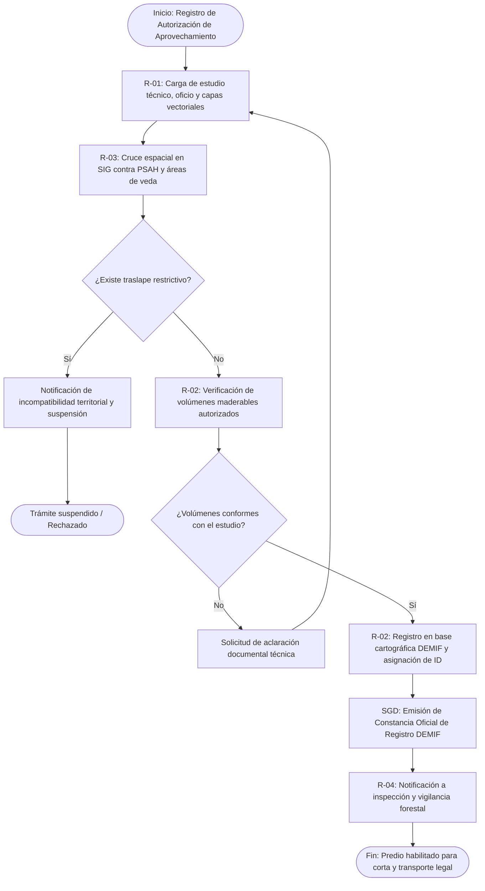

# MF-12 — Gestión y Registro de Autorizaciones de Aprovechamiento Forestal (DEMIF y Concesiones)

> Proyecto: Sistema de Gestión Documental PROBOSQUE (Módulo Masa Forestal / SIG)[cite: 1].  
> **Análisis técnico-funcional del proceso MF-12 del catálogo `README.md`**.  
> Citación externa de pasos: **MF12·P1**, **MF12·P2**, etc.

---

## 1. Objeto y alcance

Registrar, validar, georreferenciar y dar seguimiento a las autorizaciones y permisos de aprovechamiento forestal maderable y no maderable emitidos en el Estado de México, contrastando los polígonos de corta y los volúmenes autorizados contra la base cartográfica DEMIF (Departamento de Manejo e Inventarios Forestales)[cite: 1] y los programas de manejo forestal sustentable, para evitar la sobreexplotación y garantizar la trazabilidad legal de la madera extraída[cite: 5.2].

---

## 1.1 Entradas y Salidas del Proceso

| Tipo | Elemento | Descripción | Origen / Destino |
|---|---|---|---|
| **Entrada** | Oficio de Autorización de SEMARNAT/PROBOSQUE | Resolución oficial con volumen autorizado por especie | Promovente / Autoridad ambiental federal |
| **Entrada** | Programa de Manejo Forestal (PMF) | Estudio técnico con ciclo de corta y parcelas de intervención | Prestador de Servicios Técnicos Forestales |
| **Entrada** | Polígono perimetral y rodales de corta | Capa vectorial georreferenciada de las áreas de corta | Promovente / Técnico forestal |
| **Salida** | Registro Único en la Base Cartográfica DEMIF | Integración del polígono con vigencia y volumen permitido | Base espacial PROBOSQUE / SIG |
| **Salida** | Constancia de Registro y Trazabilidad Forestal | Documento oficial con código QR y código único de registro | Titular del predio / Módulo de inspección |

---

## 2. Base documental

| Clave | Documento | Uso — páginas |
|---|---|---|
| [LGDFS] | Ley General de Desarrollo Forestal Sustentable | Arts. 73–82 (Autorizaciones de aprovechamiento maderable y programas de manejo). |
| [MGO] | `Manual Jurídico/dic161d.pdf` — MGO 2025 | pp. 25–26 (Atribuciones de la DRFF en control de aprovechamientos y base DEMIF)[cite: 3]. |
| [RO-PSAH] | `Programas de apoyo/RO_2026_PagoServiciosAmbientales_Hidrológicos.pdf` | p. 8 (Exclusión o compatibilidad de predios con permiso de aprovechamiento activo respecto a subsidios de conservación)[cite: 1]. |

---

## 3. Roles

- **R-01 Titular de la Autorización / Prestador Técnico:** Ingresa el oficio de resolución, el estudio técnico y los archivos vectoriales de corta.
- **R-02 Analista de Manejo Forestal (DEMIF):** Dictamina la viabilidad técnica del programa de manejo y verifica los volúmenes de extracción solicitados.
- **R-03 Especialista SIG:** Valida espacialmente que los rodales de corta no invadan áreas naturales protegidas de estricta conservación ni predios con convenios de PSAH vigentes[cite: 1].
- **R-04 Coordinador de Vigilancia e Inspección:** Utiliza los registros autorizados para programar retenes y visitas de campo para inspeccionar remisiones forestales.

---

## 4. Reglas de negocio

- **BR-MF12-01 (Incompatibilidad con Áreas de PSAH Estricto):** Ningún polígono de corta maderable podrá sobreponerse con superficies activas del Programa de Pago por Servicios Ambientales Hidrológicos destinadas a conservación estricta (traslape $0\%$)[cite: 1].
- **BR-MF12-02 (Registro Obligatorio en Base DEMIF):** Ningún aprovechamiento podrá ejecutarse en el Estado de México sin que su polígono perimetral y rodales anuales de corta estén debidamente integrados en la base geoespacial DEMIF de PROBOSQUE[cite: 1].
- **BR-MF12-03 (Control de Volumen de Extracción Anual):** El sistema debe alertar si la suma de volúmenes asignados en las anualidades supera la tasa de regeneración natural estimada en el Inventario Forestal 2022 para esa ecorregión[cite: 5.2].

---

## 5. Procedimiento narrado

- **MF12·P1** R-01 somete a registro en el SGD la resolución de autorización de aprovechamiento forestal, el estudio del Programa de Manejo Forestal y los vectores de los rodales de corta.
- **MF12·P2** R-03 procesa los polígonos vectoriales en el SIG y descarta sobreposiciones espaciales contra áreas protegidas, convenios de PSAH o predios en litigio[cite: 1].
- **MF12·P3** R-02 coteja los volúmenes de corta aprobados (metros cúbicos de madera en rollo por especie: pino, encino, oyamel) contra las densidades de la base DEMIF[cite: 1, 5.2].
- **MF12·P4** R-02 valida y aprueba la integración del aprovechamiento; el SGD asigna el ID Único de Registro DEMIF e incorpora la capa a la base territorial institucional[cite: 1].
- **MF12·P5** El sistema genera la **Constancia de Registro DEMIF** con código de barras y códigos QR que amparan la legal procedencia del predio y las anualidades de intervención autorizadas[cite: 1].
- **MF12·P6** Los datos son puestos a disposición inmediata de R-04 para alimentar los operativos de inspección en carreteras y verificación de frentes de corta en campo.

---

## 6. Diagrama de proceso

---

## 7. Tabla de necesidades

| ID | Rol | Necesidad del SGD | Prior. | Paso | Origen documental |
|---|---|---|---|---|---|
| N-MF12-01 | R-01 | Módulo de registro web de autorizaciones forestales con carga vectorial de rodales | A | MF12·P1 | Arts. 73–75 LGDFS |
| N-MF12-02 | R-03 | Motor de validación topológica para impedir sobreposición con subsidios de conservación | A | MF12·P2 | [RO-PSAH p. 8; Base DEMIF][cite: 1] |
| N-MF12-03 | R-02 | Matriz de control volumétrico por especie maderable y balance de saldo de corta | A | MF12·P3 | [MGO 2025 pp. 25–26][cite: 3] |
| N-MF12-04 | R-02 | Generador de Constancia Oficial de Registro DEMIF con código QR de verificación rápida | A | MF12·P5 | Estándar de Trazabilidad Forestal |
| N-MF12-05 | R-04 | Servicio de consulta móvil para inspectores de campo y verificación de remisiones | M | MF12·P6 | Art. 154 LGDFS |

---

## 8. Registros gestionados

| Registro | Campos clave | Retención |
|---|---|---|
| Expediente de Registro DEMIF | Número de registro, promotor, vigencia del permiso, municipios, paraje, superficie de corta (ha)[cite: 1]. | Permanente |
| Desglose Volumétrico Autorizado | Especie botánica (*Pinus*, etc.), volumen de corta ($m^3$ rollo total árbol), saldo disponible[cite: 5.2]. | 10 años |
| Constancia de Registro y Trazabilidad | ID DEMIF, folio de autorización SEMARNAT, código QR seguro, fecha de expedición[cite: 1]. | Permanente |

---

## 9. Vacíos y siguientes pasos

1. **V-MF12-01 (Desconexión entre SEMARNAT y PROBOSQUE):** La autoridad facultada para expedir autorizaciones es la federación (SEMARNAT), mientras que la vigilancia y el control territorial estatal lo hace PROBOSQUE. Actualmente no existe una plataforma unificada en tiempo real, lo que propicia el uso de remisiones apócrifas.
2. **V-MF12-02 (Seguimiento satelital de la intensidad de corta):** Se debe incorporar en el SGD una rutina de teledetección que compare la pérdida real de dosel en el rodal intervenido contra el volumen reportado extraído en el informe anual del técnico.
