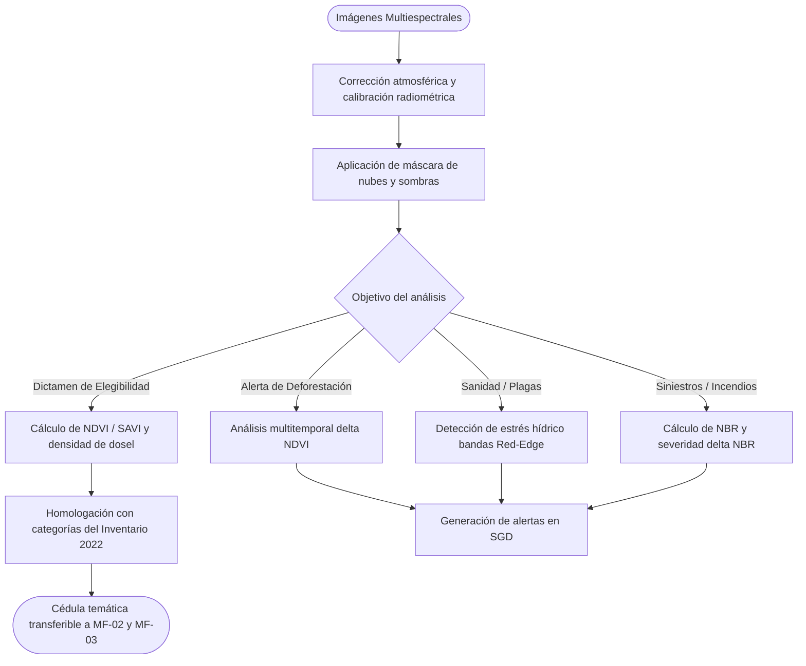

# X-01 — Criterios y Especificaciones de Clasificación Satelital para la Masa Forestal

> Proyecto: Sistema de Gestión Documental PROBOSQUE (Módulo Masa Forestal / SIG)[cite: 1].  
> **Documento técnico normativo de referencia para los procesos MF-02 y MF-03**.

---

## 1. Objeto y alcance

Estandarizar los criterios técnicos, bandas espectrales, firmas radiométricas, categorías de vegetación y umbrales de densidad de dosel que el SGD y el SIG de PROBOSQUE deben utilizar para procesar imágenes satelitales ópticas y de radar, permitiendo identificar cambios en la masa forestal: pérdida de cobertura, incendios, plagas forestales, biomasa y aptitud para proyectos de carbono[cite: 5.2].

---

## 1.1 Entradas y Salidas del Módulo Técnico

| Tipo | Elemento | Formato / Sensor | Fuente / Destino |
|---|---|---|---|
| **Entrada** | Mosaicos satelitales | Sentinel-2 (MSI), Landsat 8/9 (OLI), Planet | Servidores espaciales / Copernicus / USGS |
| **Entrada** | Capa base de zonificación forestal | Vectorial UTM WGS84 del Inventario 2022 | SIG PROBOSQUE |
| **Salida** | Matriz de firmas espectrales calibradas | Tablas de reflectancia por categoría fito-geográfica | SGD / Módulo de Teledetección |
| **Salida** | Capas ráster de alertas y detección temática | GeoTIFF (NDVI, NBR, dNBR, SAVI) | Módulos de dictaminación e inspección |

---

## 2. Categorías de Cobertura Vegetal y Uso de Suelo

Conforme al Inventario Estatal Forestal y de Suelos 2022 de PROBOSQUE, el SGD categorizará el territorio en las siguientes clases fito-geográficas[cite: 5.2]:

| Código | Categoría | Especies representativas | Rango NDVI esperado | Umbral de dosel |
|---|---|---|---|---|
| **C-01** | Bosque Templado de Coníferas | *Pinus*, *Abies religiosa* (oyamel), *Cupressus* | $0.65 - 0.88$ | $\ge 60\%$ (Denso) |
| **C-02** | Bosque de Latifoliadas | *Quercus* (encino), *Alnus* (aile) | $0.60 - 0.82$ | $\ge 50\%$ (Semidenso) |
| **C-03** | Bosque Mixto | Pino-Encino / Encino-Pino | $0.55 - 0.80$ | $\ge 50\%$ |
| **C-04** | Bosque Mesófilo de Montaña | Bosque de niebla, alta humedad | $0.70 - 0.90$ | $\ge 70\%$ |
| **C-05** | Selva Baja Caducifolia | Zonas cálidas del sur del Estado de México[cite: 5.2] | $0.35 - 0.70$ (estacional) | $\ge 30\%$ |
| **C-06** | Matorral y Vegetación Semiárida | Matorral xerófilo, nopaleras | $0.25 - 0.45$ | $\ge 20\%$ |
| **C-07** | Áreas Antrópicas y Exclusiones | Agrícola, asentamientos humanos, vías de comunicación | $< 0.25$ | $0\%$ (Excluido) |

---

## 3. Umbrales de Densidad de Dosel (Cobertura de Copa)

Para la dictaminación de programas de apoyo (PSAH y Capturando Carbono), se establecen los siguientes estratos de densidad:
- **Bosque Denso o Compacto:** Cobertura de dosel $\ge 60\%$. Elegible con calificación máxima.
- **Bosque Semidenso:** Cobertura de dosel entre $40\%$ y $59\%$. Elegible para PSAH condicionado a compromiso de enriquecimiento forestal[cite: 1].
- **Bosque Fragmentado o Abierto:** Cobertura de dosel entre $20\%$ y $39\%$. No elegible para conservación directa; canalizable a programas de reforestación o restauración hidrológica.
- **Área No Forestal:** Cobertura de dosel $< 20\%$. Rechazo automático en programas de protección de masa forestal[cite: 1].

---

## 4. Detección Temática Específica en Imágenes Satelitales

### 4.1 Pérdida de Cobertura y Deforestación
- **Índice base:** Diferencia temporal de NDVI ($\Delta NDVI = NDVI_{t2} - NDVI_{t1}$).
- **Criterio de alerta:** Una caída en $\Delta NDVI < -0.20$ entre dos periodos en un mismo predio activa una bandera roja en el SGD, bloqueando ministraciones y detonando una orden de inspección urgente en MF-07.

### 4.2 Incendios Forestales y Severidad de Daño
- **Índice base:** Índice de Calcinación Normalizado (NBR): $(NIR - SWIR) / (NIR + SWIR)$.
- **Severidad del incendio:** Calculada mediante el $\Delta NBR$ (diferencia de NBR pre y post-fuego):
  - $\Delta NBR < 0.10$: Sin daño o rebrote.
  - $0.10 \le \Delta NBR < 0.44$: Severidad baja a moderada.
  - $\Delta NBR \ge 0.44$: Severidad alta (combustión total de dosel).

### 4.3 Detección de Plagas y Descortezadores
- **Firma espectral:** Pérdida de reflectancia en el infrarrojo cercano (estrés hídrico y pérdida de clorofila) combinada con incremento en la banda roja (*red-edge* en Sentinel-2).
- **Alerta de sanidad forestal:** Agrupaciones continuas de más de $0.5\text{ ha}$ con decoloración del follaje en bosque de coníferas generan un punto de verificación fitosanitaria para el Comité Técnico.

### 4.4 Estimación de Biomasa y Captura de Carbono
- Cruce de la densidad de dosel y el índice de área foliar (LAI) con tablas de biomasa aérea del Inventario Estatal Forestal 2022 para calcular toneladas métricas de carbono equivalente ($t CO_2 eq/ha$)[cite: 5.2].

---

## 5. Diagrama del Proceso de Clasificación Espectral

